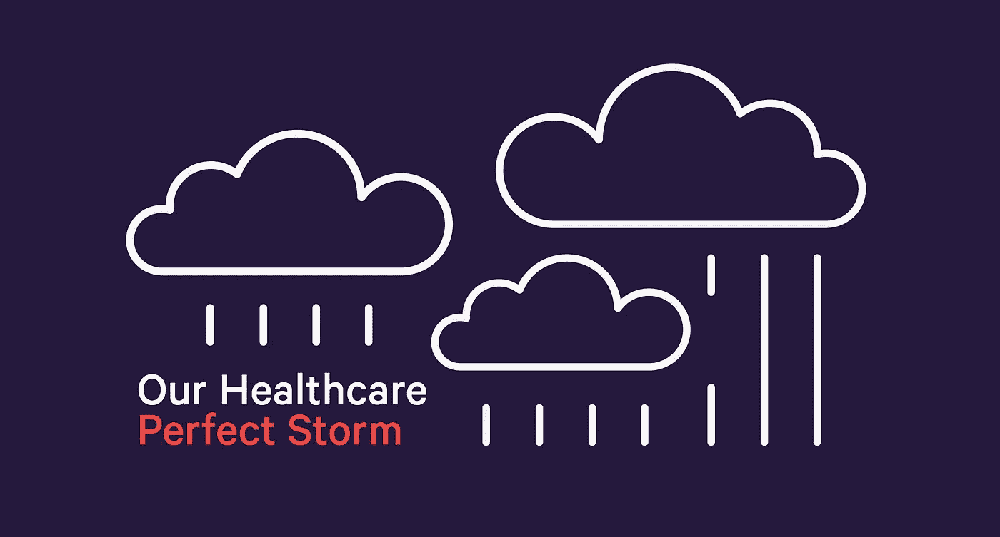
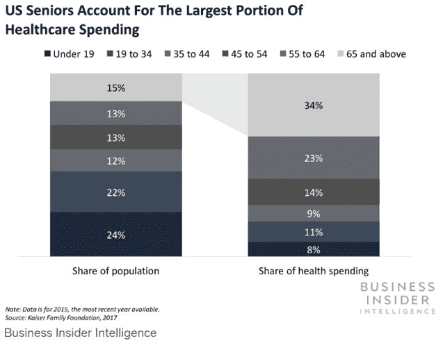
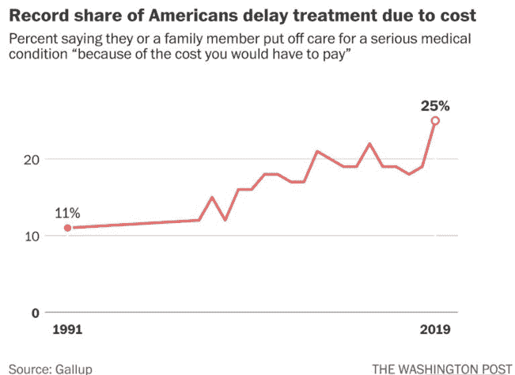
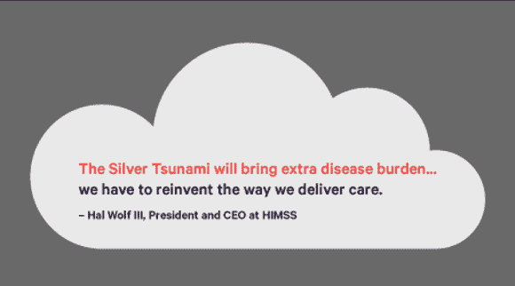
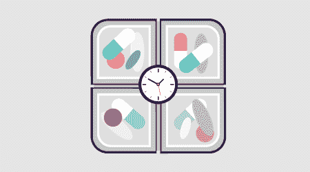

# 恶化我们医疗保健系统的五大趋势

> 原文：<https://medium.datadriveninvestor.com/five-trends-aggravating-our-healthcare-system-16a9cba9b61e?source=collection_archive---------13----------------------->

让我们来看看加剧美国医疗保健状况的各种因素，这些因素催生了创新和变革的完美风暴。

# 趋势 1:老龄化的美国对系统征税

这个国家的人口正在大量老龄化，其健康需求日益复杂。尽管 2018 年有 346，000 名新卫生工作者加入劳动大军(比 2017 年的 284，000 人增加了 62，000 人)，但具有丰富经验的一代熟练护士、药剂师和药学技术人员正处于或接近退休年龄。这一现实在美国公众的健康需求和拥有关键专业知识的有经验的专业人士之间留下了令人担忧的差距。

当前的就业市场有利于卫生专业，这进一步增加了总体供需状况的紧张程度，因为那些拥有预计将在未来十年达到峰值的几种工作中任何一种工作的人的议价能力都在增强。对护士和住院医务社会工作者等角色的需求不断增长，他们在医院登记时与患者配对，以提供有价值的前线病例管理服务。

 [## 大笔资金和尖端技术:人工智能/人工智能投资将如何革新医疗保健…

### 在过去几年人工智能(AI)和机器学习(ML)的显著发展中…

www.datadriveninvestor.com](https://www.datadriveninvestor.com/2018/03/22/big-money-and-cutting-edge-technology-how-investment-in-ai-ml-will-revolutionize-the-healthcare-industry/) 

来自医疗保健就业市场的这些和其他有利信号可能代表了向以结果为导向、以价值为基础的医疗保健模式缓慢转变的一部分，因为改革影响了医疗保健的提供和支付方式，特别是医疗保险覆盖的人。随着 2019 年超过[6400 万美国人享受医疗保险](https://www.kff.org/medicare/issue-brief/an-overview-of-medicare/)，联邦医疗保健政策的变化对传统医院运营框架产生了巨大的影响。

[商业内幕，2019 年 7 月](https://www.businessinsider.com/aging-population-healthcare)

*为什么这很重要——在过去几十年里，美国没有做好准备来适应预期寿命的增加(从 1968 年的 9 岁增加到 2016 年的 79 岁)和人口激增(从 1968 年的 2 亿增加到 2016 年的 1.23 亿)的结合。这些变化增加了社会保障的压力，从今年开始，社会保障的支出将超过收入。2018 年全国卫生总支出* [*增长 4.6%，至 3.6 万亿美元*](https://www.cms.gov/Research-Statistics-Data-and-Systems/Statistics-Trends-and-Reports/NationalHealthExpendData/NHE-Fact-Sheet)*；根据现行法律，从 2018 年到 2027 年，支出将平均每年增长 5.5%，到 2027 年达到 6.0 万亿美元。技术创新将在降低成本和促进健康方面发挥重要作用，从“门房”级别的处方履行和教育，到通过医疗可穿戴设备远程监控某些慢性疾病。*

# 趋势 2:权衡护理成本

传统的付费医疗保健模式在很大程度上侧重于对抗疾病，即人们根据自己特定的健康状况做出反应。拥有资源(医疗保险、可负担的共付额、获得护理、舒适的药物治疗和可用的支持网络)的人可能会选择治疗。那些没有这些资源(经济、认知或家庭)的人可能会推迟或逃避治疗。

[盖洛普](https://www.washingtonpost.com/business/2019/12/10/stunning-indictment-us-health-care-system-one-chart/)在 2019 年 12 月发布的数据显示，由于费用问题，他们或一名家庭成员推迟了对严重疾病的治疗。该研究进一步显示，另有 8%的人对不太严重的疾病做出了相同的选择，这意味着“……共有 33%的受访者将财务考虑置于健康之上。”

[盖洛普，2019 年 10 月 12 日](https://news.gallup.com/poll/269138/americans-delaying-medical-treatment-due-cost.aspx)

正在发生转变，以促进健康作为管理健康和福祉的积极方法。责任医疗模式寻求简化通常耗时且混乱的流程，并投入资源和工具来监控医疗支出。这种转变可以提高质量，增加医疗服务的可及性和可负担性。

传统的按服务收费的医疗系统根据接受治疗的患者数量奖励提供者，而可问责的医疗系统利用对提供者的支付承诺来激励其他目标。这些措施包括减少浪费、改善医疗服务的可及性、使医疗服务更加个性化、提高医疗服务质量以符合支付者的期望，从而提升价值。

这种灵活的、以绩效为中心的结构可能有助于提供者照顾慢性病数量较多的人群，而药剂师和护士等护理人员可能会捉襟见肘。

劳工统计局预计，到 2028 年，制药技术人员的就业机会将增长 7%，这一估计可以部分解释为强大的[银色海啸](https://www.healthcareitnews.com/news/silver-tsunami-coming-healthcare-time-prepare)浪潮推动了对药物治疗的需求增加，通常用于治疗多种慢性疾病。

*为什么这很重要——随着越来越多的人对困难重重的医疗系统提出越来越复杂的要求，医院再入院率和患者满意度得分会影响医院报销率，医疗行业的领导者和高管必须密切关注战略薄弱环节、运营浪费或财务机会，以推动转型变革。*

# 趋势三:用药疯狂

疾病控制中心发现，在 2013 年至 2016 年期间， [12.6%的被调查者报告在之前的 30 年期间服用了 5 种或更多药物](https://www.cdc.gov/nchs/fastats/drug-use-therapeutic.htm)。[根据 2019 年 8 月发布的凯泽家庭基金会健康跟踪民意调查，近十分之九(89%)的 65 岁及以上成年人报告服用处方药](https://www.kff.org/health-reform/issue-brief/data-note-prescription-drugs-and-older-adults/)，其中超过一半的人报告服用四种或更多。

这两个资源，代表不同的研究方法和研究时期，是许多建议多种药物，或多种药物的同时使用，值得更多的审查。我们需要更好地理解多元药物在不良事件、药物相互作用、处方级联和更高处方成本方面的含义。

*为什么这很重要——如果没有一个咨询、整体的方法来了解整个患者，当护理领域重叠或冲突(或存在缺口)时，患者将继续孤立地甚至以交易的方式治疗他们的慢性疾病。这可能会导致对患者健康采取支离破碎的方法。碎片化会导致错误信息、误解，甚至让患者感到恐惧，让他们独自面对复杂的药物治疗，这可能会导致依从性问题。*

# 趋势 4:老年人口的高再入院率

总人口增长是使卫生系统不堪重负的几个因素之一。引用 25%的预期增长率，美国人口普查局[预计 2017 年至 2060 年间将新增 7800 万](https://www.census.gov/content/dam/Census/newsroom/press-kits/2018/jsm/jsm-presentation-pop-projections.pdf)人口。到 2035 年，老年人的数量将首次超过儿童，这将改变抚养比率。

这种增长在几个方面影响了我们的卫生系统，包括住院时间(LOS)和再入院率。

《美国老年医学会杂志》在 2015 年 8 月发表的一项研究显示，年龄是手术并发症的独立风险因素，该研究对来自 400 多家社区和学术医院的 53，667 名患者进行了研究。

在 30 天的时间里，[与 65 岁以下的患者相比，在考虑医疗敏锐度因素后，老年人再次入院的可能性高出 54%](https://www.reliasmedia.com/articles/136491-growing-number-of-elderly-brings-issues-with-los-readmissions)。“这不一定是因为他们病得更重，”医学博士、该研究的主要作者吉尔达西奥·德·奥利维拉说。“更确切地说，他们年龄较大，理解出院说明和药物剂量有困难，这些往往没有得到清楚的解释。”奥利维拉是费恩伯格医学院西北大学医疗保健研究中心的助理教授。他也是芝加哥西北纪念医院的医生。"改善老年人护理过渡的干预措施是必要的."

选择性门诊手术也被认为是 LOS 和再入院的一个渠道。身体虚弱的病人正在接受更多的日间手术。临床医生已经看到，这些患者患谵妄的人数增加，导致住院。由 Sharon K. Inouye，MD，MPH 撰写的一项研究发表在 *JAMA Surgery* 上，该研究发现，在 70 岁或以上接受择期手术的患者中，包括谵妄在内的主要并发症与住院时间有关，谵妄是所有不良结果的主要原因。

年龄较大的患者可能也不太了解药物剂量。根据西北大学 2015 年 8 月进行的一项研究，44%的老年人健康素养低下。用药错误和对术后护理的困惑导致昂贵的再次住院。"任何新的药物都应该在手术后详细检查，包括它们的副作用和潜在的相互作用."

*为什么这很重要——当医院患者无法理解药物剂量说明以及每个处方在其整体康复或健康维护中的作用时，他们知识的缺乏可能会导致错过剂量，甚至对预期的药物治疗方案产生误解。如果出院时没有仔细、彻底的咨询和药物调节，住院患者可能不会承诺在当地零售药店完成他们的处方。使用颠覆性技术来增强患者理解、简化保险提交和推动便利因素的医院可以在患者服药依从性方面取得更大的成功，从而降低再入院率。*

# 趋势 5:复杂的药物疗法导致混乱

几乎 20%的 65 岁或以上的人服用 10 种或更多的药物。虽然有些人的病情需要不同类别的多种药物，但对许多人来说，多重药物治疗是不必要的。多种药物的使用给依从性带来了挑战。每天服药一次的患者的平均依从性约为 80%，而每天服药 4 次的患者的依从性降至 50%。

在患者出现不良事件(AE)之前，老年人的不依从性问题可能无法识别。《药房时代》杂志 2011 年的一篇文章引用了*《新英格兰医学杂志》* (2005 年)提出“……[缺乏有意义的沟通是一个主要问题”](https://www.pharmacytimes.com/publications/issue/2011/january2011/specialty-0111)，“临床医生必须学会询问药物治疗的依从性，并使用非判断性的、开放式的问题来证明同理心。”

富有成效的对话，有助于早期发现药物、维生素、补充剂和其他顺势疗法制剂的潜在问题，在零售药店可能已经司空见惯。但是社区药剂师也感到刺痛。旨在提高利润的“大盒子”级别的整合和以前只在医生办公室提供的服务(如免疫接种甚至体检)的扩展只是影响人们历史上与当地药剂师关系的两种趋势。

为了确保病人的健康和安全，口腔咨询在病人护理的整个过程中是必不可少的。在当今充满挑战的运营环境和医疗改革状态下，如果要避免成本高昂的再次住院，住院患者出院时的病史和咨询尤为重要。

*这一切意味着什么？*随着越来越多的美国人年龄偏大，患有慢性疾病或共病，具有情境机构知识的经验丰富的工作人员数量减少，以及职业选择的现成可用性，当前的医疗保健系统面临着不确定的未来。甚至在我们考虑不断上涨的药物成本、昂贵而复杂的医疗和处方计划，以及让我们在每个接触点都回答相同问题的数据互操作性限制之前。

我们还应该考虑到健康消费者对便捷、集成和直观体验的期望，从移动银行和应用程序中获得启示，取代繁琐和耗时的任务，如提交汽车保险索赔。此外，还要考虑医院员工流动导致的持续招聘、入职和人才培训的财务、态度和破坏性影响。

# 暴风雨后的平静

所有这些因素，加上支付者对报销的规定、政策和法律的上升，以及向人口健康管理的缓慢转变，难怪医院高管严重关注医疗保健服务的状况。

症状是已知的。是时候专注于可持续的治疗方法来帮助我们的国家度过这场完美的风暴了。

++++++++++++++

*你认为哪些趋势会影响我们的医疗保健系统？请发表评论加入对话。喜欢你在这里读到的吗？我希望你能和你的网络分享这篇文章。*

*请关注本系列的第二篇文章，了解更多信息。*