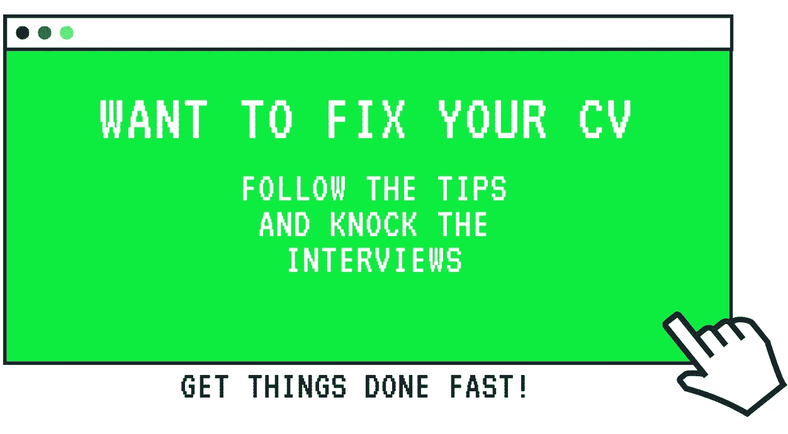
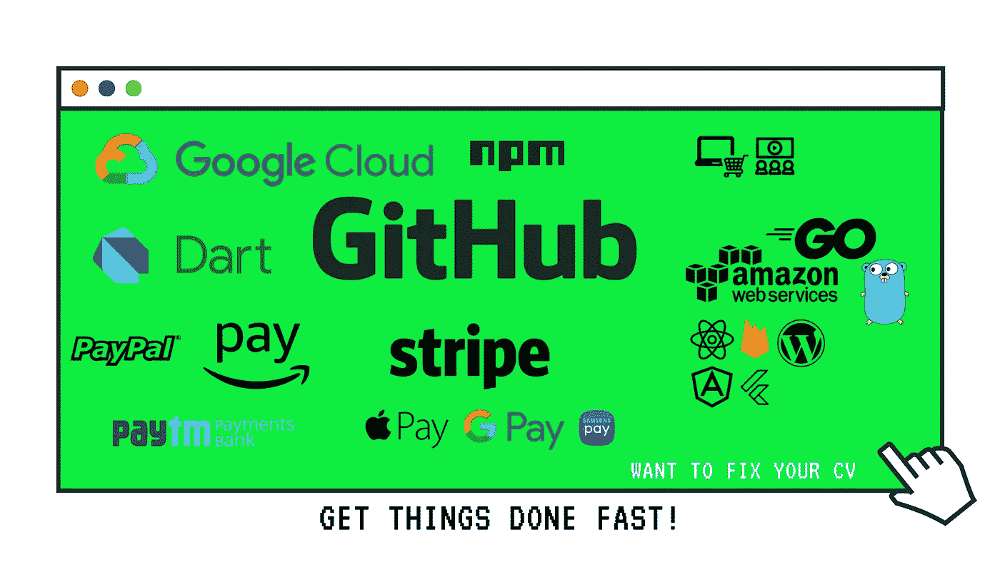

# 快速指南:摇滚面试-2020 年 DIY 版。

> 原文：<https://medium.datadriveninvestor.com/fix-up-your-cv-2020-knockout-interviews-right-away-265f083bba90?source=collection_archive---------22----------------------->

这并不意味着基于你的背景/资历、大学学历、你到底是谁，面试就很难。它是关于你能做什么和不能做什么的。除非你需要收紧事情，如果你被采访的首席执行官，创始人，或任何与权力有关的人。还有给你们的糖果。这些东西也可以成为找到自由职业者工作的优势。**#自由职业者#upwork #fiverr**

我是一名网络开发人员，所以我可以留下一些可能对你结束面试有用的东西。所以确保做这些事情，因为 2020 年可以被宣布为疫情，作为一个软件开发人员生存。

对于一个新生来说，找工作是很难的。大多数创业公司需要网络开发人员、社会营销人员等。

让我们把注意力放在糖果上，而不是你简历上的私人物品。

Technologies for information purposes.

网络开发人员需要在市场上获得大量的资格才能胜任一份好的工作。最好用各种栈的标准开发应用至少 4 个。尤其是一定要接触到像 **Stripe** 、 **Paypal** 、 **Paytm** 、 **Google Pay API** 等 API。至少有一个**电商应用**在高端栈上像 MERN、Go CLI、Flutter app &也做触控云平台像 [**G-Cloud**](http://cloud.google.com) 、 [**AWS**](https://aws.amazon.com/) 。 **Flutter** 产生了巨大的影响，因为它简化了大部分工作，并且它是 iOS 和 Android 应用程序开发的结合。许多公司都在行动起来。所以巨大的需求提前打电话给巴迪(甜)。

也要建立一个文件夹，展示你所做的工作。为每个项目维护一个 **Git 库**,这样如果有人给你发了一个展示工作样本的短信，它会很有用。还有，尽量用各种技术把东西捆绑起来。在 **StackOverflow** 中编写解决方案，也在在线编码平台如 **Codecademy** 、 **Algo.io** 中编写代码，通过将你的关系与你的日常工作联系起来，在 [**、LinkedIn**](https://www.linkedin.com/) 中创建内容。

应用程序的组合，如聊天应用程序、小型电子商务应用程序、为您提供推送通知的 web 应用程序、从著名新闻博客中删除的新闻、类似不和谐的社区应用程序，以及您所在学院/大学中关于技术/技术开发人员的俱乐部。此外，通过分享内容来轻松学习，帮助其他开发人员轻松获取知识。张开你的双手，这可能会让你获得团队合作的经验。

 [## 在 180 秒内颤动。

### 颤振入门。关于这个话题的一条快速线索。一篇可以给你颤振观点的文章。不…

medium.com](https://medium.com/flutter-community/flutter-in-180-seconds-b747920fc8d2) 

继续关注这个帖子，我会尽可能快地为其他职业抢一些果汁。敬请关注。

# 感谢您阅读这篇文章。随时欢迎反馈。如果你喜欢它，请点击拍手按钮，并分享这篇文章。

你可以在[Github](https://github.com/tejamaddimsetty)&[LinkedIn](http://www.linkedin.com/in/tejmaddimsetty)上联系我

[Tej Maddimsetty](https://medium.com/@tejmaddimsetty)