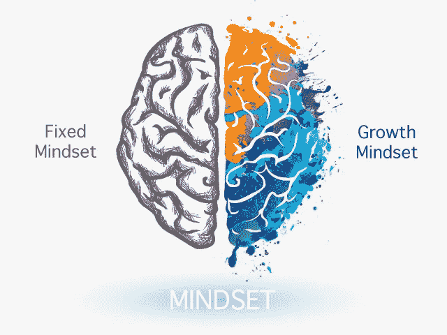

# 固定和增长的心态

> 原文：<https://medium.datadriveninvestor.com/fixed-and-growth-mindset-db0d8de3c4ca?source=collection_archive---------35----------------------->

生活是一个不断学习、改进和调整的旅程。

tofasakademi.com

*“孩子是人之父”*威廉·华兹华斯说。

这句谚语基本上表达了我们在童年时养成的**性格****会伴随我们**直到我们老了。

我们在土耳其也有这样的说法:

“不管你是 7 岁还是 70 岁，你就是你！”

这塑造了我十几岁时的信念，直到我快 30 岁的时候；我真的照字面理解了。在我的社会环境中，这是我经常听到的。尤其是当人们谈论其他**人的不良行为、性格特征和习惯**时。他们会说他们相信山会移动，但是性格/习惯永远不会改变。

嗯，我 34(人生中途；))，而我这三年变化这么大，我绝对可以说**我已经不是小时候或者少年时的我了**！

所以，在多年阅读关于抑郁症、自我发展、个人成长等方面的书籍后。我想我知道我的社交网络的问题是什么，最终，我的问题是:固定的思维模式。

固定心态是一种信念，认为你不能改变自己的任何事情，你的性格和习惯是固定的。这是一种信念，一旦你到了一定的年龄，你就完了！

## 一种固定的思维模式是这样说的:

*   我不能改变。
*   我不会。
*   我很害怕。
*   我一文不值。
*   我不够好。
*   我已经习惯了。
*   我完蛋了。
*   我的背景/过去不好。
*   我没有机会。

## 用这种低劣的自言自语，一个人怎么能改变任何事情呢？！

我总是对这种生活方式产生疑问。当我经历我短暂生命中最黑暗的日子时，我拼命寻找我的问题的答案。

我感激不尽的是，我在三个伟大的**伙伴** : **书、笔记本和笔**中找到了我的治疗方法。

我开始痴迷于学习、写日记和写作。学习曾经是我的治疗方法！

慢慢地，但肯定地，我意识到我在改变。我像疯子一样获取知识，并不知不觉地形成了我现在知道的成长心态。

成长心态是一种信念，即你可以永远不断地学习/忘记任何东西。你甚至可以**改变你的大脑** ( *神经可塑性*)，这有多疯狂？！

## 成长心态是这样说的:

*   我能学会/忘记任何事情。
*   我可以不断改变。
*   命运偏爱勇敢的人。
*   我可以完成任何事情。
*   我是无限的。
*   我能比其他人做得更好。
*   我够了。
*   我很勇敢。
*   我是值得的。
*   我的背景/过去并不能定义我。

## 最终想法:

我从未想过心态是我可以改变的东西。哇，我大错特错了，是吗？！

亨利·福特一针见血地指出:

*“不管你认为你能，还是你认为你不能——你都是对的。”*

## 你决定你想相信什么！

感谢阅读。

哈蒂斯

**访问专家视图—** [**订阅 DDI 英特尔**](https://datadriveninvestor.com/ddi-intel)