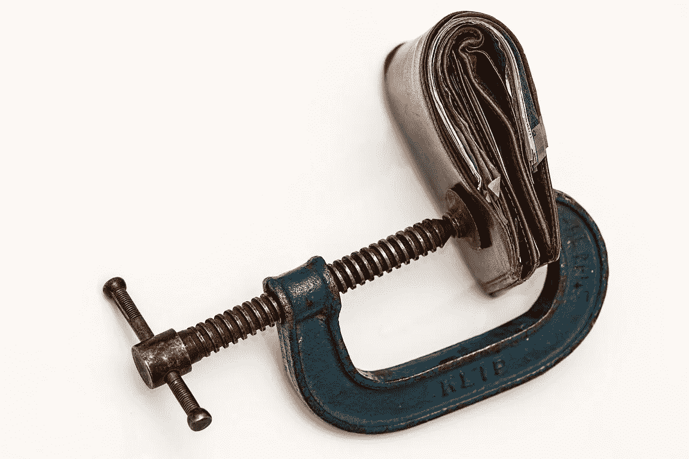
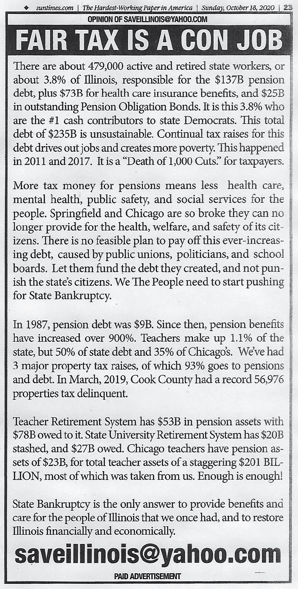

# 解决美国的问题可能很容易

> 原文：<https://medium.datadriveninvestor.com/fixing-american-problems-could-be-easy-9dfb9048a70?source=collection_archive---------9----------------------->

Image by [Bronisław Dróżka](https://pixabay.com/users/uroburos-325152/) from [Pixabay](https://pixabay.com/photos/chicago-beans-chicago-illinois-city-401393/)

美国人在选举中出现了比以前更大的分歧。民主党和共和党都声称对方没有正确的计划。他们俩可能都是对的。

在当选总统后的第一次演讲中，乔·拜登承诺寻求与政治对手达成妥协。但是，当我们迄今为止的经验表明，双方都不认为[能够经受住对方的批评](https://medium.com/datadriveninvestor/can-we-replace-fighting-with-work-and-reason-377d6ee5236d)时，任何妥协能有多好呢？许多美国人似乎对情况会变好失去了希望。政治作家经常提到“反乌托邦”这个词；我[和其中一个写了一篇论战](https://medium.com/datadriveninvestor/is-inequality-unequal-d16b3311f133)。在 Medium 上，声称它很糟糕并且会变得更糟的文章有很高的排名。绝望从读者的评论中散发出来。在经历了几十年的政治僵局后，我怎么能说解决美国的问题会很容易呢？

Image by [350543](https://pixabay.com/users/350543-350543/) from [Pixabay](https://pixabay.com/photos/chicago-sears-tower-willis-tower-796121/)

# 以伊利诺伊州为例

伊利诺伊州陷入了严重的金融危机。前共和党州长布鲁斯·劳纳寻求政治改革，但未能获得足够的支持。他的方法是降低所得税会刺激商业，给国家带来更多的收入。在 2018 年的选举中，他输给了现任州长 J.B. Pritzker ，这位民主党人的竞选纲领是，由于百万富翁和亿万富翁贡献了他们的“公平份额”，州收入应该增加——用简单的语言来说，就是支付更高的所得税。

伊利诺伊州宪法规定所有居民以相同的税率缴纳所得税。州议员批准了州宪法修正案草案，但最终决定需要全民公决。那是在 11 月 3 日的选举投票上。尽管 55%的伊利诺伊州选民支持民主党总统候选人，但其中约有 50 万人不支持他们的民主党州长，投票反对拟议的宪法修正案，该修正案被否决，仅获得约 45%的“赞成”票。

大约一年前，民意调查预测压倒性的选民支持所谓的公平税收修正案。但是反对者开始表达他们的观点，主要是在互联网上。为保险起见，2019 年 12 月，普利兹克州长创建了一个名为“[为公平](https://www.voteyesforfairness.com/)投赞成票”的委员会，并以个人名义向其捐赠了[500 万美元](https://www.elections.il.gov/CampaignDisclosure/ContributionSearchByCommittees.aspx?txtCmteName=L6c%2bo7%2bbY%2bSMFJkj5B2IK0Bmd%2bJXJ3Qe&ddlCmteNameSearchType=dsDz1BrrdS0KMaA9ooYJLDmWVIQUUuXK&ddlVendorState=eq%2b40F2niRk%3d&ddlContributionType=iG1zQyIEBt0XkpgeROHFScGbnDGMlP4E&ddlState=eq%2b40F2niRk%3d&ddlFiledDateTime=eq%2b40F2niRk%3d&ddlFiledDateTimeThru=eq%2b40F2niRk%3d&txtLastOnlyName=5FSUlDv3cPbgzPMvFJB5oFO1b7q2%2flkP&ddlLastOnlyNameSearchType=p8rSfMveEDAVoNI7ZxFrz07hj9aUFJxR&T=637347979965948136)。随着选举的临近，他在 2020 年 6 月又增加了 5000 万美元，并在选举前一周又增加了 150 万美元。看到事情越来越严重，2020 年 7 月，税收修正案的挑战者组成了“[联盟，以阻止拟议的增税修正案](https://notaxhikeamendment.com/)他们从几个商人那里筹集了几十万美元，开始时很谦虚。到八月底，他们从伊利诺伊州最富有的人[肯·格里芬](https://en.wikipedia.org/wiki/Kenneth_C._Griffin)那里得到[2000 万美元](https://www.elections.il.gov/CampaignDisclosure/ContributionSearchByCommittees.aspx?txtCmteName=zrClGu30OzVwTiBRXsv%2ftXEymseyaDdmjy7Vt%2bQuMHMl0Xxyft0REdxwjf7AR5WTa1Fjj03k11swuDIHMDeQI3bZw2pbAeCz7V3VUKVMD0TRjb6hy56%2bpRQGKEndQfD%2fQUF66wUwCuk%3d&ddlCmteNameSearchType=dsDz1BrrdS0KMaA9ooYJLDmWVIQUUuXK&ddlVendorState=eq%2b40F2niRk%3d&ddlContributionType=iG1zQyIEBt0XkpgeROHFScGbnDGMlP4E&ddlState=eq%2b40F2niRk%3d&ddlFiledDateTime=eq%2b40F2niRk%3d&ddlFiledDateTimeThru=eq%2b40F2niRk%3d&T=637405154927203127)，他[公开挑战](https://www.chicagotribune.com/opinion/commentary/ct-opinion-graduated-income-tax-ken-griffin-20200904-lauhnk4t3fcbtczf7i6sxjghya-story.html)州长普利兹克。一个月后，格里芬增加了 2675 万美元，并在投票前几天增加了 700 万美元。他的 5375 万美元总额仍然低于普利兹克在这场壮观的亿万富翁决斗中捐赠的 5650 万美元。

修正案的支持者认为通过增加所有居民的税收来解决州赤字是不公平的；最富有的人应该付出更多。反对者赢得了胜利，他们指出，宪法修正案将为立法者提供一个合法的场所，以不同的税率对不同的居民群体征收所得税，而不仅仅是最初目标中收入超过 25 万美元的人。反对者认为，富人有资源搬出本州；因此，期望税收增加 30 亿美元可能是不现实的。即使它是现实的，它也不太可能对估计为 1370 亿美元的无资金准备的州养老金债务产生多大影响。足够多的选民同意了。

Image by [Steve Buissinne](https://pixabay.com/users/stevepb-282134/) from [Pixabay](https://pixabay.com/photos/purse-money-credit-squeeze-wallet-522622/)

因此，伊利诺伊州的财政状况比以前更加糟糕。赤字越来越大，如何解决赤字的分歧也越来越大。这种绝望的局面完美地反映了我们在重大国家政治问题上的僵局，如医疗保健、移民、不平等、联邦债务等。

下面，我将介绍一种可以解决这些挑战的方法。

# 老教师的建议

让我们采用以下三步走的方法:

1.  一切都可以做得比以前更好。
2.  每种疾病都可以通过明确定义其本质来纠正。
3.  识别问题是解决问题的一半。

我没有发明这种方法。这是我在波兰的高中文学老师一直挂在嘴边的一句话。她是一位 70 多岁的老太太，只兼职教一个班。这三个原则对我们来说似乎是显而易见的。我们对老师的痴迷半信半疑。尽管如此，随着岁月的流逝，我开始注意到，在我的生活、商业决策和有说服力的写作中，我下意识地使用这三条规则。我可以把我所有的成功归功于坚持这些规则；我可以把我所有的失败归因于我忽视了它们。有几次，我注意到美国知名的商业和生活导师逐字逐句地提供了我的老师半个多世纪前向我们灌输的建议。

# 它如何适用于伊利诺伊州？

无力改变的感觉从当地媒体和互联网上的评论中散发出来。即使是理解问题并对我们能做什么有现实概念的政治分析家，听起来也像希望通过买彩票成为百万富翁的人一样令人信服。压倒性的政治制度麻痹了人们的想象力。似乎没有人希望伊利诺伊州能比现在做得更好。

看着我以前老师的规则，我发现伊利诺伊州在第一条上失败了。它不相信事情可以做得更好。为什么没有改善的希望？因为到目前为止，不管尝试了什么，都没有成功。为什么会失败？它失败了，因为伊利诺伊州忽略了我以前的老师的方法的第二条规则；这个问题没有明确的定义。每个人都同意，没有资金准备的养老金义务正在拖垮国家财政，但外行人很难理解。这在某种程度上意味着，为了恢复国家的偿付能力，我们需要削减对退休政府雇员的支付，这听起来并不正确。

伊利诺伊州许多聪明而敬业的人投入了大量的时间和金钱来找出金融混乱的本质。马克·格伦农是 [*Wirepoints*](https://wirepoints.org/about-us-2/) 的创始人，至少在我看来，他最透彻地了解伊利诺伊州的财政状况，并对如何解决这些问题有着现实而合理的想法。公平税收修正案被否决后，格伦农先生在[专栏](https://wirepoints.org/reforms-instead-of-taxes-heres-a-list-for-illinois-to-start-with-wirepoints/)写道，伊利诺伊州需要的是改革而不是税收。我向那些想全面了解伊利诺伊州问题的读者推荐这本书。对于其他所有人来说，格伦农列举了伊利诺伊州需要的 16 项重大改革，并提到还有更多的改革，这违反了我的老老师的第二条规则。参照古语，格伦农先生看到了 16 棵大树，并提到了较小的树，但他没有告诉我们，我们有一个森林。他没有说出它的名字。

在芝加哥第二份报纸《太阳时报》的一则广告中，一个名为森林的私人定义了伊利诺伊州问题的本质。广告称，约 3.8%的州居民负债 1370 亿美元。据我所知，太阳时报的广告背后的人是一个小企业主，为了继续做生意，他本能地遵循我老师的规则。他将这些规则应用于他在*电线点*等地方发现的信息。那个人花了 4500 美元来做这个广告三次。

广告简明扼要地总结了格伦农先生的上述专栏。在伊利诺伊州，我们有一个特权阶层的居民。他们是我们当中被我们聘为公务员的人，但他们滥用权力修改法律，以保证自己的收入比我们大多数人在私营部门获得的收入高得多。他们的最低工资约为每年 10 万美元或每小时 50 美元，但他们也是预示着我们其他人每小时 15 美元最低工资的巨大进步的人。财政透明度倡导者[OpenTheBooks.com](https://www.openthebooks.com/)的工作中有大量关于伊利诺伊州特权阶层[过高收入的数据。](https://www.forbes.com/sites/adamandrzejewski/2020/04/27/why-illinois-is-in-trouble--109881-public-employees-with-100000-paychecks-cost-taxpayers-14b/?sh=660b80fa7ee9)

从格伦农先生的专栏中，我们可以得出结论，特权阶层的人数比《太阳时报》广告中提到的要多。我们应该加上接受政府合同的私营企业。根据法律，履行这些合同的人会得到丰厚的(普遍的)工资。

总而言之，人们可以同意现有的制度是不公平的，不是因为伊利诺伊州的 18 名亿万富翁和约 35 万名百万富翁没有缴纳足够的税款。顺便说一句，这些百万富翁中大约有三分之一是公务员养老金领取者，根据官方保证，他们不会被包括在增税提案中。该系统是不公平的，因为至少有 50 万伊利诺伊州居民，目前在公共部门工作或退休，收入过高。他们用自己的收入来支持腐败的政治体系，让他们获得不成比例的高薪和养老金。这是伊利诺伊州问题的本质。当这一信息清楚地传达给伊利诺伊州的居民时，我们就成功了一半。

值得一提的是，在亿万富翁的决斗中花费的约 1.2 亿美元中，甚至没有一分钱用于确定问题的本质。甚至没有一分钱用于向选民解释真正的麻烦是什么。或者至少这个或那个人认为它是什么。

我们可以预见，在每一次即将到来的选举中，同样的问题还会有另一种变化。除非，有人会从公众的角度审视伊利诺伊州的问题，而不是砸钱缓解症状，这样选民就会对相互竞争的诊断有一个更清晰的认识。然后选民会做出相应的决定。

*原载于 2020 年 11 月 19 日*[*【https://www.datadriveninvestor.com】*](https://www.datadriveninvestor.com/2020/11/19/fixing-american-problems-could-be-easy/)*。*