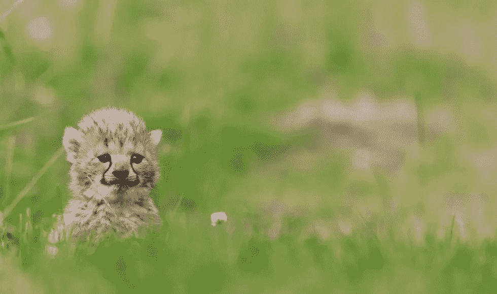
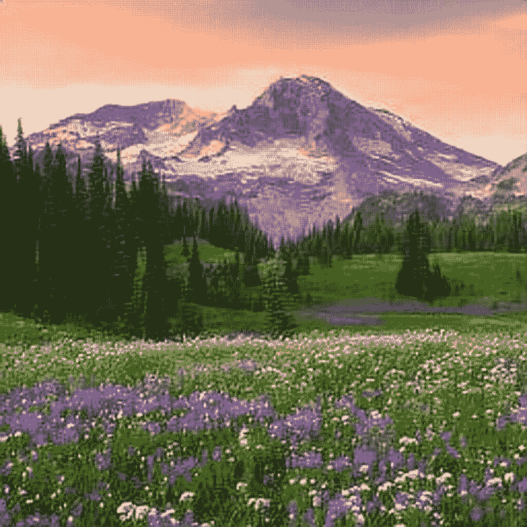

# 用深度学习固定小照片

> 原文：<https://medium.datadriveninvestor.com/fixing-small-photos-with-deep-learning-eeae87172a1b?source=collection_archive---------7----------------------->

你使用社交媒体吗？你有没有给别人发了一张照片，当你后来看的时候，你发现这张照片的质量很差？如果你能逆转这一切呢？



[Link to image](https://www.prima.co.uk/leisure/news/a39405/anxious-cheetah-cubs-puppy-playdates/)

# 如果

主要目的是->获取一幅图像，并将其向上采样 3 倍(这意味着如果图像最初是 100×100，到最后我们会得到 300×300 的图像)，而不会丢失任何信息。现在，如果我们决定让图像为 100x100，我们可以调整它的大小，但分辨率会比以前高得多。

我们将看看如何将这作为一个深度学习问题，深入研究代码，并以一篇关于该主题的论文中的一些观点作为结束。

# 我们还能做什么

假设你不想为此使用深度学习。那你会怎么做？你有几个选择。(这些我都不推荐)

1.  成为一名 Photoshop 高手(尽管现在连这个都使用深度学习)
2.  回到过去，确保你拍了更好的照片
3.  处理它
4.  (推荐)阅读这篇文章

# 我们能在哪里使用这个？

*   游戏！想象一下 1080 年的马里奥
*   Whatsapp 垃圾
*   或许更好的视频通话？我们可以不压缩和发送视频，而是拍摄一个潜在的低分辨率视频，并让它以相当高的质量出现
*   有一些你想升级的旧照片吗？运行它！

# 技术方面

既然我们已经解决了这个问题。让我们进一步定义这个问题。我们将尝试从一篇[论文](https://www.cv-foundation.org/openaccess/content_cvpr_2016/papers/Shi_Real-Time_Single_Image_CVPR_2016_paper.pdf)中探究。石，，等，“利用高效的亚像素卷积神经网络实现单幅图像和视频的实时超分辨率”IEEE 计算机视觉和模式识别会议录。2016.

目标的技术版本是这样的。假设我们有两个“空间”。一个具有高分辨率，另一个具有低分辨率。我们的网络应该学习如何将像素从低分辨率空间转换到另一个空间。高效地。

要做到这一点，我们需要遵循标准的深度学习训练程序，并进行一些修改。(注意，总代码太长，无法在这里发布，所以你可以在我的[回购](https://github.com/SubhadityaMukherjee/pytorchTutorialRepo/tree/master/SuperRes)上找到所有代码)

# 获取数据。

第一步通常是获取数据。出于我们的目的，我们可以使用 [BSDS300 数据集](http://www2.eecs.berkeley.edu/Research/Projects/CS/vision/bsds/BSDS300-images.tgz)。只要得到它并提取它。

现在我们需要能够加载数据。为此，我们需要一些东西。

*   我们需要检查图像是否是一个文件并加载它。我们需要执行转换。我们需要加载数据。
*   因为大部分只是标准代码，所以让我们只看新的东西
*   居中裁剪。要裁剪图像，我们需要确定一个有效的裁剪尺寸。

```
def calculate_valid_crop_size(crop_size, upscale_factor):
    return crop_size - (crop_size % upscale_factor)
```

我们可以在转换管道中使用 CenterCrop(crop_size)来调用它。

*   主数据加载器。这将使我们能够读取数据集并根据需要使用它。注意，我们实际上有**两幅**图像。一个是输入图像，另一个是我们需要将其转换到的目标。我们基本上加载它们，执行所需的转换，并将它们作为一个**元组**返回。这是重要的部分。和分类的主要区别。我们在主数据加载器中返回的不是一个，而是两个东西。
*   现在我们有一对图像，一个在低分辨率空间，另一个在高分辨率空间。

```
class DatasetFromFolder(data.Dataset):
    def __init__(self, image_dir, input_transform = None, target_transform =
                 None):
        super(DatasetFromFolder, self).__init__()

        self.image_filenames = [join(image_dir, x) for x in listdir(image_dir)
                               if is_image_file(x)]
        self.input_transform = input_transform
        self.target_transform = target_transform

    def __getitem__(self, index):
        input = load_img(self.image_filenames[index])
        target = input.copy()
        if self.input_transform:
            input = self.input_transform(input)
        if self.target_transform:
            target = self.target_transform(target)

        return input, target

    def __len__(self):
        return len(self.image_filenames)
```

# 图片 1

这是我们想要提升的形象。这是全尺寸的图像。如你所见，它非常小。


Small mountain

# 创建网络

欢迎来到深水区。我们的网络实际上很简单，因为我们使用 PyTorch。我们有 4 个 conv 层，4 个 ReLUs 和一个叫做 PixelShuffle 的特殊层。

PixelShuffle 是什么？这是我们正在考虑的论文的决定性时刻。所以定义事实上 PyTorch 实际上已经内置了它。简单来说，这一层就是洗牌机。它取形状 H(高)x W(宽)x C(通道)的张量。r(活化数),给我们一个形状为 rH×rW×rC 的张量。“混洗”又名子像素卷积层。这很有用，因为现在一切都是并行的。

[](https://www.datadriveninvestor.com/2020/06/24/disclosure-and-resolution-program-wont-prevent-physicians-from-practicing-defensive-medicine/) [## 人工智能、深度学习和医疗实践|数据驱动的投资者

### 人工智能和深度神经学习的效用看起来可能是合法和有前途的，特别是…

www.datadriveninvestor.com](https://www.datadriveninvestor.com/2020/06/24/disclosure-and-resolution-program-wont-prevent-physicians-from-practicing-defensive-medicine/) 

我们还需要初始化我们的权重。这样做是为了确保我们的网络有一个良好的开端。这里我们使用正交初始化。

```
import torch
import torch.nn as nn
import torch.nn.functional as F
import torch.nn.init as init

# Main network
class Net(nn.Module):
    def __init__(self, upscale_factor):
        super(Net, self).__init__()
        self.relu = nn.ReLU()
        self.conv1 = nn.Conv2d(1, 64, (5,5), (1,1), (2,2))
        self.conv2 = nn.Conv2d(64, 64, (3,3), (1,1), (1,1))
        self.conv3 = nn.Conv2d(64, 32, (3,3), (1,1), (1,1))
        self.conv4 = nn.Conv2d(32, upscale_factor**2, (3,3), (1,1), (1,1))
        self.pixel_shuffle = nn.PixelShuffle(upscale_factor)

        self._initialize_weights()

    def forward(self, x):
        x = self.relu(self.conv1(x))
        x = self.relu(self.conv2(x))
        x = self.relu(self.conv3(x))
        x = self.pixel_shuffle(self.conv4(x))
        return x

    def _initialize_weights(self):
        init.orthogonal_(self.conv1.weight, init.calculate_gain('relu'))
        init.orthogonal_(self.conv2.weight,init.calculate_gain('relu'))
        init.orthogonal_(self.conv3.weight,init.calculate_gain('relu'))
        init.orthogonal_(self.conv4.weight)
```

# 火车！

哇，我们差不多完成一半了。现在进行主要训练。我们首先加载我们需要的所有东西，用一个升级因子导入我们的网络(也就是我们需要升级多少个 x)。然后我们初始化我们的优化器。我们将在这里使用亚当，因为它的效果最好。我们还需要一个损失函数。

好吧，如果你想一想，既然我们试图找到一个像素方面的差异，为什么不使用它呢..MSELoss。

我们遵循简单的策略:批处理->推到 GPU ->零优化器梯度->计算损失->反推->逐步优化器。(注:如果这里有你不明白的地方，看看我的[博客](https://www.subhadityamukherjee.me/deconstructingdl.html)

```
def train(args, device, train_loader,model,  epoch, optimizer, criterion):
    epoch_loss = 0
    device = torch.device("cuda") # Sending to GPU
    for batch_idx, batch in tqdm(enumerate(train_loader, 1)):
        input, target = batch[0].to(device), batch[1].to(device)
        optimizer.zero_grad() # zero gradients
        loss = criterion(model(input), target) # calc loss
        epoch_loss += loss.item()
        loss.backward() #backprop
        optimizer.step()

        print(f"Iteration: {batch_idx}, Loss: {loss} ")
    print(f"Avg epoch_loss: {epoch/len(train_loader)}")
```

测试循环与这里的非常相似，所以不需要专门讨论它。我们在模型完成训练后保存它。

# 运行它！

现在我们有了一个很酷的模型。把它投入使用怎么样？

为了做到这一点，让我们采取一个图像，预处理，将其转换为张量。之后，我们可以加载模型，并将此图像发送到 GPU。

```
img = Image.open(opt.input_image).convert('YCbCr')
y, cb, cr = img.split()

model = torch.load(opt.model)
img_to_tensor = ToTensor()
input = img_to_tensor(y).view(1, -1, y.size[1], y.size[0])

if opt.cuda:
        model = model.cuda()
        input = input.cuda()
```

然后我们把它通过我们的模型。我们现在得到一个奇怪的输出。为了解决这个问题，我们把它变成一个 numpy 数组，并执行一些操作，使我们的图像变成一个合适的图像。基本上，我们改变这些值，以便我们有一个 RGB 值范围内的范围。这将允许我们绘制它或做我们想做的任何事情。

```
out = model(input)
out = out.cpu()
out_img_y = out[0].detach().numpy()
out_img_y *= 255.0
out_img_y = out_img_y.clip(0, 255)
out_img_y = Image.fromarray(np.uint8(out_img_y[0]), mode='L')
```

我们现在可以调整大小，并保存图像到任何我们想要的地方。

```
out_img_cb = cb.resize(out_img_y.size, Image.BICUBIC)
out_img_cr = cr.resize(out_img_y.size, Image.BICUBIC)
out_img = Image.merge('YCbCr', [out_img_y, out_img_cb,
                            out_img_cr]).convert('RGB')

out_img.save(opt.output_filename)
print('output image saved to ', opt.output_filename)
```

我们完了。

# 输出

这是我们运行这个模型一段时间后得到的结果。你可能会说，嘿，质量没那么好。但是想想看，这是原来的 3 倍，它仍然很棒。

现在，如果我们把这个和我们的原始图像一样大，我们会注意到一个巨大的变化…也称为..超分辨率！！！！



# 奖金

我还转换了脚本来处理视频。:)去看看[回购](https://github.com/SubhadityaMukherjee/pytorchTutorialRepo/tree/master/SuperRes)

# 论文引发的一些思考

*   超级分辨率用于医学图像、人脸识别、卫星图像
*   我们的目标是学习数据中隐含的冗余
*   学习的滤波器是比单个滤波器更好的上采样表示
*   使用从 0.01 到 0.0001 的可变学习率效果很好
*   原始图像中的每个像素仅表示一次，以保持网络的效率

# 后续步骤

谢谢你读到这里！希望你喜欢这篇文章，它能帮助你更好地理解这个话题。我真诚地建议你阅读这份报纸。这是一本容易阅读的书。超分辨率是我很久以来一直感兴趣的东西，就在今天，我发现了一个[甚至更好的网络](https://github.com/jixiaozhong/RealSR)来完成这项任务。

如果你喜欢这篇文章或者对以后的文章有任何反馈，请联系我们。希望你有一个伟大的一天！

## 访问专家视图— [订阅 DDI 英特尔](https://datadriveninvestor.com/ddi-intel)