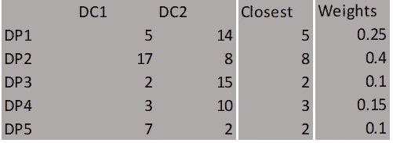
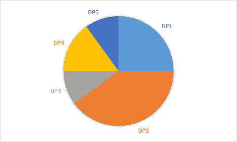
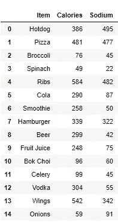
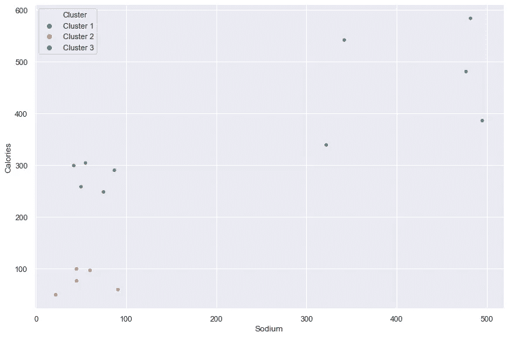
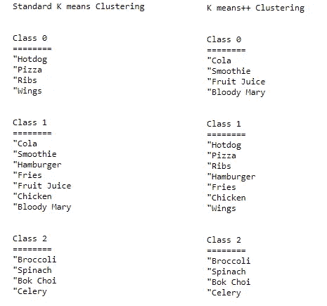

# 修复 K 均值聚类的最大问题

> 原文：<https://medium.datadriveninvestor.com/fixing-the-biggest-problem-of-k-means-clustering-ee2b2a646b60?source=collection_archive---------0----------------------->

## 聪明地启动集群，而不是一开始就随意挑选

Source: [Pexels](https://www.pexels.com/photo/photo-of-supernova-in-galaxy-3805983/)

对于这个领域的初学者，我想首先说明 K 意味着聚类是一种非常有用的技术，用于无监督的机器学习，你一定要掌握它。

## k 表示聚类

聚类可以帮助我们探索数据集，并将病例分成代表相似性状或特征的组。每一组都可能是一个班级的潜在候选人。大多数人在使用 K 均值聚类算法时遇到的主要问题似乎是选择聚类数 K。但是有一个很少讨论的初始化问题。我们如何初始化质心？

> k-means 的一个主要缺点是在第一步中，它随机选取 k 个数据点作为初始质心。

## K 均值的随机性

标准 K 均值算法的初始化过程是完全随机的。因为它是随机的，有时初始质心是一个很好的选择，并导致接近最优的聚类。其他时候，初始质心是一个合理的选择，并导致良好的聚类。但是有时——同样，因为它们是随机选取的——有时初始质心很差，导致非最佳聚类。

 [## 数据驱动的投资者|微软比 Chrome 有“优势”

### 简史我从来不是浏览器的粉丝，确切地说，我只是一个浏览器的粉丝，Chrome。这是我的…

www.datadriveninvestor.com](https://www.datadriveninvestor.com/2020/03/29/microsoft-having-an-edge-over-chrome/) 

不难猜到这会产生问题，尤其是在更大更复杂的数据集中，它运行的时间太长，可能达不到完美的聚类。这就是 k 意味着++的用武之地。k-means++算法通过改变我们选择初始质心的方式来修复这个缺陷。关于 k-means 的其他一切都保持不变。

## k means ++如何解决这个问题？

k means ++的步骤如下:

1.  为质心创建一个空列表。
2.  像以前一样随机选择第一个质心。
3.  直到 K 个初始质心被选中，做:

*   计算每个点与其最近质心之间的距离。
*   在与距离成比例的概率中，随机选择一个点作为新的质心，并将其添加到质心集中。
*   重复直到结束。

在这里，最重要的部分是“与距离成正比的概率”。这到底是什么意思？假设算法正在运行，我们已经有了两个质心。现在还剩 5 个质心。下表显示了这些数据点到每个聚类的距离。将选择每个距离中最近的一个，并计算它们的权重，从中进行随机选择。

让我们想象一下。DC:到集群的距离，DP:数据点。

Figure: Weight assigning process

新的聚类将从权重表中选取，权重越大，被选中的机会就越大，就像从馅饼中切下一大块一样。

Figure: Pie of probabilities

## 代码

标准 K 均值算法使用以下代码来初始化质心(随机模型):

Code: Standard K means centroid initialization

K 意味着++算法，我们需要用下面的代码替换它:

Code:K means++ centroid initialization

## 在真实数据上实现算法

让我们来看看我们的示例性数据集。

Figure: Our Dataset

我们的数据由 15 种食物组成，它们将被分为三组。你有高钠高热量的快餐，高热量低钠的饮料和低热量低钠的蔬菜。我们可以想象一下，自己去看:

Figure: Dataset Visualized

我们可以看到有 3 个集群。我们来看看两个算法做的怎么样。

Figure: Clustering Results based on standard and ++ method

K means++算法正确地聚类了每个项目，而标准的 K means 算法将一些快餐项目与饮料混合在一起。

# 结论

在我们的例子中，标准的 K 均值导致不完美的聚类。

在真实数据集上，k-means 和 k-means++之间的差异是相当大的。更深入的测试证明，k-means++始终优于 k-means，不仅实现了更低的潜在价值，而且完成得更快。

这里用的例子很简单，我们知道汉堡是快餐，西兰花是蔬菜。但是不要让那愚弄你。无监督聚类算法在现实生活问题中具有不可思议的能力，从遗传工程到客户细分。即使在一个小例子中，K means ++算法也显示了它的优越性。这是标准 K 均值算法的改进版本，我希望你在下一个任务中使用它。

有什么问题吗？查看完整代码[这里](https://github.com/mertcan79/Kmeanspp/blob/master/Kmeansplusplus.ipynb)联系我 [Linkedin](https://www.linkedin.com/in/mertcan-coskun-08b383124/) ！