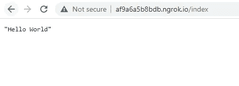

# 在 Google Colab 上运行 Flask 和 FastAPI

> 原文：<https://medium.datadriveninvestor.com/flask-on-colab-825d2099d9d8?source=collection_archive---------1----------------------->

在本教程中，我们将快速演示如何在 google colab 上运行一个基本的 flask 服务器和一个基于 FastAPI 的服务器。

## 烧瓶是什么？

Flask 是一个用 Python 编写的微型 web 框架。它被归类为微框架，因为它不需要特殊的工具或库。它没有数据库抽象层、表单验证或任何其他组件，而现有的第三方库提供了通用功能。如果您是 Python web 开发的新手。Flask 是一个很好的起点。

## 什么是 FastAPI？

FastAPI 是一个现代、快速(高性能)的 web 框架，用于基于标准 Python 类型提示用 Python 3.6+构建 API。

主要特点是:

*   **快**:非常高的性能，与 **NodeJS** 和 **Go** 不相上下(感谢 Starlette 和 Pydantic)。[目前最快的 Python 框架之一](https://fastapi.tiangolo.com/#performance)。
*   **快速编码**:将开发特性的速度提高 200%到 300%左右。
*   **更少的 bug**:减少约 40%的人为(开发人员)导致的错误。
*   **直观**:强大的编辑器支持。无处不在的完成。调试时间更少。
*   **简单**:设计为简单易学。减少阅读文件的时间。
*   **简短**:尽量减少代码重复。每个参数声明中的多个特性。更少的错误。
*   **健壮**:获得生产就绪代码。自动交互式文档。
*   基于标准的:基于(并完全兼容)API 开放标准

## Google Colab 是什么？

Google colaboratory，简称“Colab ”,允许您在浏览器中编写和执行 Python，使用

*   不需要配置
*   免费访问 GPU
*   轻松分享

无论你是学生、数据科学家还是人工智能研究人员，Colab 都可以让你的工作变得更简单。Google Colab 的结构几乎和 Jupyter 笔记本类似。

我们将从安装所需的包开始本教程。要在 google colab 上安装软件包，请使用！如果您在本地机器上运行演示程序，您可以在命令提示符下编写以下 pip 命令并删除感叹号。此外，确保 *pip* 是 CLI(命令提示符)上的环境变量。

```
!pip install flask
!pip install flask-ngrok
```

## 为什么我们安装了 flask-ngrok？

原因是 flask server 创建了一个服务器，它作为 localhost 在 google colab 上分配的运行时上本地运行。为了向外部流量公开服务器，或者使服务器可以在运行时之外通过 HTTP 全局访问，使用了 ngrok。因为我们正在使用 flask，所以最好使用 python 的 *flask-ngrok* 模块。下图给出了一个基本的想法。


Basic idea of Ngrok : End user is actually a ngrok client who wants to access our app

```
from flask import *
from flask_ngrok import run_with_ngrokapp = Flask(__name__)@app.route('/index')
def home():
  return 'Hello World'
```

这是我们创建的一条简单路线。*@ app . route('/index ')*decorator 用于增强 *home()* 函数的功能性。每当我们调用位于[http://hostname:port number/index](http://hostname:portnumber/index)的服务器时，也会调用 *home()* 函数。主机名是“localhost ”,如果您想要访问本地运行的服务器，它会映射到 127.0.0.1 作为相应的 IP 地址。这只是作为参考。在这个演示中，我们不会太在意它。

```
run_with_ngrok(app)
app.run()
```

*run_with_ngrok()* 函数接受 *Flask* 类的对象，在这里它存储在一个名为 *app* 的变量中。它将 ngrok 附加到 flask 应用程序，这样当我们运行该应用程序时，可以生成一个在运行时之外可以访问的 URL。

```
 * Serving Flask app "__main__" (lazy loading)
 * Environment: production [31m   WARNING: This is a development      server. Do not use it in a production deployment.[0m [2m   Use a production WSGI server instead.[0m 
 * Debug mode: off
 * Running on http://127.0.0.1:5000/ (Press CTRL+C to quit)
 * Running on http://57b01f4a6baf.ngrok.io
 * Traffic stats available on http://127.0.0.1:4040
```

现在，在执行 *app.run()* 函数时，我们的服务器就设置好了。可以使用生成的 URL 从外部访问它，即*http://57 b 01 F4 a6 BAF . ngrok . io*，但是我们只为 */index* 创建了路由，因此我们应该使用*http://57b01f4a6baf.ngrok.io/index*检查它，如下所示。


Accessing the endpoint

使用 flask 很容易创建具有充分灵活性的简单 API，我们现在也可以挖掘 Google Colab 的能力，并尝试使用它创建 ML 服务。

现在让我们快速跳转到 FastAPI，这是一个非常有前途的 Python 库，因为它基于 ASGI 并异步处理请求，与使用不支持异步调用的 WSGI 的 Flask 相比，它提高了吞吐量和性能。FastAPI 也有很好的文档。为了在 Google Colab 上运行 FastAPI，我们需要首先安装它以及以下软件包:

*   这提出了一个实际问题:当在一个环境中，事件循环已经在运行时，不可能运行任务并等待结果。试图这样做将给出错误“RuntimeError:这个事件循环已经在运行”。这个问题会在各种环境中出现，比如 web 服务器、GUI 应用程序和 Jupyter 笔记本。此模块修补了 asyncio，以允许嵌套使用 asyncio.run 和 loop.run_until_complete。
*   这是一个 ngrok 的 Python 包装器，它管理自己的二进制文件，并把它放在您的路径上，使得 ngrok 可以从命令行上的任何地方通过一个方便的 Python API 获得。通过 pyngrok 与原生 Python 集成，ngrok 变得更加强大。
*   *uvicon*:这包括一个 Gunicorn 工人类，允许你运行 ASGI 应用程序，拥有 uvicon 所有的性能优势，同时也给你 Gunicorn 全功能的进程管理。

```
!pip install fastapi nest-asyncio pyngrok uvicorn
```

接下来，我们从 *fastapi* 模块导入 *FastAPI* 类，并创建它的对象，我们称之为 *app* 。我们还使用*@ app . route('/index ')*decorator 创建了一个路由，它与 *home()* 方法相链接。 *async* 作为一个修饰符，使函数异步执行。本地 FastAPI 服务器在端口号 *8000* 上运行，并且 *ngrok* 创建一个隧道，这样外部网络也可以访问它，如前面 flask 服务器实现中所述。由于 FastAPI 支持异步调用，我们需要一个 ASGI 服务器，即*uvicon*在本地端口号 *8000* 运行应用程序。

```
from fastapi import FastAPI
import nest_asyncio
from pyngrok import ngrok
import uvicorn

app = FastAPI()

@app.get('/index')
async def home():
  return "Hello World"

ngrok_tunnel = ngrok.connect(8000)
print('Public URL:', ngrok_tunnel.public_url)
nest_asyncio.apply()
uvicorn.run(app, port=8000)
```

在执行这个代码片段时，我们在控制台上得到以下消息。

```
Public URL: http://af9a6a5b8bdb.ngrok.io

INFO:     Started server process [63]
INFO:     Waiting for application startup.
INFO:     Application startup complete.
INFO:     Uvicorn running on http://127.0.0.1:8000 (Press CTRL+C to quit)
```

我们的 FastAPI 服务器已经启动并正在运行，让我们在浏览器上键入 *{Public_URL}/index* 来访问我们的端点，因为我们只创建了一条路由，即 */index* 。



Calling FastAPI endpoint hosted on Google Colab

至此，本教程到此结束。你可以在这里找到这个演示[的代码。我希望这篇博客简洁而全面。如果你想获得更多我这边的更新，别忘了喜欢并关注我。编码快乐！！！](https://github.com/SAH-UJA/Flask_on_colab)