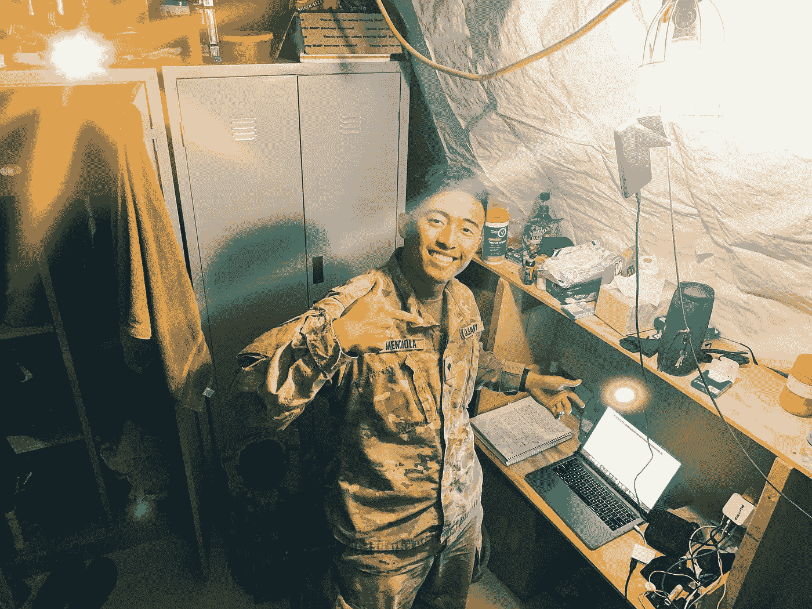

# 达到心流状态会让你自由

> 原文：<https://medium.datadriveninvestor.com/flow-why-having-a-workflow-is-essential-in-life-7738d9c8b5a6?source=collection_archive---------28----------------------->

## 这不仅仅是一种节奏，这是一种不可战胜的感觉。

Me grinding away in my military tent on deployment (Jan 29th, 2020)

你是否曾经开始一项任务而忘记了时间？你对自己工作的时间感到震惊吗？如果是，那么你大概经历过“心流”。“流动”这个词的定义是指连续而平稳地进行。你工作流程的顺畅可以让你处于一种非常和谐的状态，一切都很顺利，问题都在现场得到解决。

# **我们为什么要有心流？**

实现心流应该是一个目标的原因是因为这是一个你将在其中运作的巅峰状态。分心是不可能的，生产力也几乎达到了极限。电影院的大多数人都想安静地观看，没有婴儿的哭声，也没有激光笔照射在屏幕上。每次他们的流动被一个小干扰打断，电影逃避现实的一面就消失了。被打断的人将不得不重新聚焦，回到自己的状态。基本上，任何阻碍一个人进步的事情都会令人沮丧，这就是为什么让自己为成功而努力比强迫自己更重要。

# **我们怎样才能实现心流？**

我们可以通过为自己选择合适的环境来达到心流状态。每个人在进入一个节奏的时候都有不同的需求。就我个人而言，我更喜欢在我的房间里编辑我的视频，但我更喜欢在公共场合打文章。对于某些任务，我需要平静和安宁，而对于其他任务，我更喜欢一个更活跃的环境。一旦你找到最适合你的设置，坚持下去，尽量减少潜在的干扰。你可以关闭你的通知，使用噪音消除耳机，并准备好零食和水。

**个人心流体验**

*   编辑了超过 40 个 YouTube 视频
*   当目标只有 5 英里时跑了 10 英里
*   在一天内读完一整本书(即使我不看书)
*   《现代战争 3》发行的第一天(我有时是个书呆子)
*   一天打了 30 场激光枪战
*   一天之内完成了两季的办公室

我的一些成就是值得注意的，而另一些是娱乐性的成就；在一天结束时，只要你的目标和你每天做的事情一致，一切都会顺其自然！

> *“保持积极的心态，让生活顺其自然”*