# 颤振 vs 反应原生 2023-我该挑什么？深入的比较分析

> 原文：<https://medium.datadriveninvestor.com/flutter-vs-react-native-2020-what-should-i-pick-in-depth-comparative-analysis-4f45cb539a15?source=collection_archive---------3----------------------->


Flutter vs React Native 2023 | In-depth comparative analysis

作为一名经验丰富的 flutter 和 React Native app 开发者，我将在本文中通过环境、实现原理、编程开发、插件开发、编译运行、性能稳定性、未来发展等七个方面，对当前的 Native 和 Flutter 进行全面的分析和比较，希望能给大家更多有价值的参考。

# 为什么选择跨平台框架？

跨平台框架的优势不在于性能或者学习成本，即使是平台适配也会比较费时，但它最终可以让代码逻辑(尤其是业务逻辑)，在各种平台上无缝复用，减少重复代码的维护成本，保证平台之间的统一性，如果这个时候还能保证一定的性能，那就更完美了。

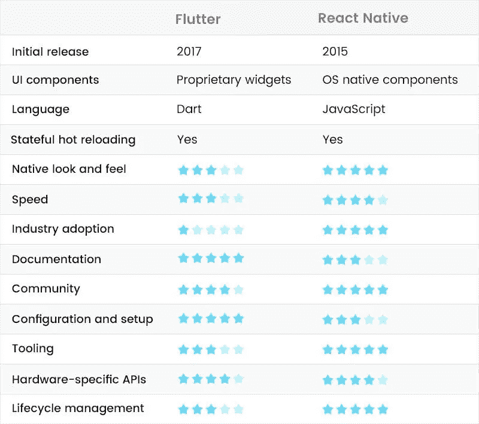

# 第一，环境建设

React Native 和 Flutter 都需要针对 *Android* 和 *IOS、*即 *JDK、Android SDK、Xcode、*等的开发环境，区别在于:

*   本机 React 需要配置，如、等。`npmnodereact-native-cli`
*   Flutter 需要 *Android* Studio/VSCode 上的 Dart 和 Flutter 插件。`flutter sdk`

在配置环境方面，Flutter Native 的环境相对简单，而 React Native 的环境配置相对复杂，并且在个人接触的情况下，第一次配置运行成功率高于 React Change Native，而 Flutter 失败的原因很大程度上是因为网络。`node_module`

> *同时开发跨平台的首选 MAC，没有理由。*

# 二、实施原则

在 *Android* 和 *IOS 上，*Flutter 和 React Native 都默认需要原生平台的 Activity/ViewController 支持，都属于原生级别的“单页 app”，两者最大的区别其实是 UI 搭建:

*   **反应原生**:

Native React 是一组 UI 框架，默认情况下 React Native 加载 JS 文件，然后运行来解析*包*文件布局，产生一系列要呈现的原生控件。`ActivityJavaScriptCore`

简单来说就是通过编写 JS 代码来配置页面布局，然后 React Native 最终会将渲染解析为原生控件，比如标签对应，标签对应，标签对应等等。`<View>ViewGroup/UIView<ScrollView>ScrollView/UIScrollView<Image>ImageView/UIImageView`

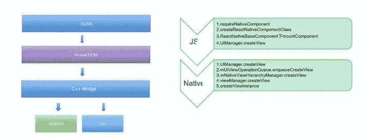

因此，与类似的框架相比，React Native 进一步提升了页面的性能。`Ionic`

*   **颤振:**

*如果 React Native 对开发者来说是平台兼容的，那更像是对开发者屏蔽平台的概念。*

> *在 Flutter 中只需要一个平台，其余的 Flutter 说，*“你可以躺下，我们会自己移动。”`*SurfaceCanvas*`

Flutter 绝大多数是平台无关的，开发者基于开发 app 并运行在上面，以适配和跨平台支持为支撑。这种跨平台的支持过程实际上是将`the widgets`中的【数据】通过`The Engine.`上的`Skia`直接绘制到屏幕上

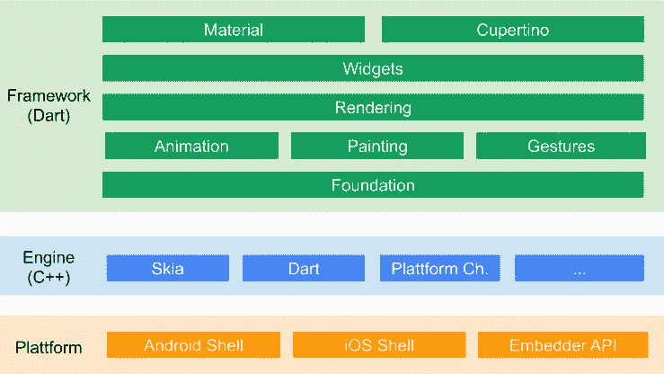

Flutter engine Architecture

所以你可以从上面看到:React Native 的*学一次，随地写*的思路是，只要你能 *react，*你就能写 *React* 然后开发出一个性能不错的 app，而 Flutter 就是只要你忘掉平台，专注于 Flutter UI。

*   Dom:

补充一下，React 的虚拟 *DOM* 的概念相信大家都知道，这也是 React 的性能保证之一，而 Flutter 其实也有类似的虚拟 *DOM* 概念。

> *正如我在 Flutter 系列中看到的，我们在 Flutter 中写的并不是真正的渲染控件，它类似于 React 中的标签，更像是一个概要文件，由它组成的树并不是真正的渲染树。* `*WidgetWidgetWidget*`

`The widget`在渲染时通过`Element`变化，最终转化为`RenderObject`进行绘制，最终组成的`renderTree`是“真正的渲染 Dom”，每一次树触发的变化并不一定导致树的完整更新。`WidgetRenderObject`

所以 React 和 Native 在实现原理上是完全不同的思路，而且虽然有类似的“虚拟 *DOM* 概念”，React Native 的平台亲和力很强，而 Flutter UI 的平台关联性很弱。

# 第三，编程开发

Native React 使用的 JavaScript 对这位 24 岁的年轻人来说并不陌生，这些年来，React Native 的移动浪潮已经给了前端 JS 开发人员在脸书的 React 开始流行后进行扩展的技能。

选择的 *Dart* 语言诞生于 2011 年，并于 2018 年发布 2.0，这是一种最初发布用于对抗 *JavaScript、* *但*直到 17 年后，flutter 才成为一种关注，并在继续尝试 Web 后重返 Web 世界。

编程开发涉及的点比较多，下面从`development language,` `interface development,` `state management,` `native controls.`进行比较介绍

> *至于最吐槽的一点就是为什么 Flutter 团队没有选择* JS，*要么是因为* Dart *团队就在 Flutter 团队隔壁，要么是因为 Google 不想在甲骨文的某些事情上走边。同时，React Native 已经更新了近 4 年，版本号依然没有破 1.0。*

# 3.1、语言

因为最初是由*网组成，* *镖*和 *JS* 有些笼统。

如下面的代码所示，它们都支持定义变量，支持语法糖，支持()等链异步处理，甚至/语法糖也差不多(虽然这个比较不准确)，但是你可以看到它们确实是作为“近亲”存在的。`varasync/awaitPromiseFuture*yield`

```
/// JS
```

```
 var a = 1
```

```
 async function doSomeThing() {
        var result = await xxxx()
        doAsync().then((res) => {
            console.log("ffff")
        })
    }
    function* _loadUserInfo () {
        console.log("**********************");
        yield put(UpdateUserAction(res.data));
    } 
```

```
/// Dart
```

```
 var a = 1;
```

```
 void doSomeThing() async {
    var result = await xxxx();
    doAsync().then((res) {
      print('ffff');
    });
  }
  _loadUserInfo() async* {
    print("**********************");
    yield UpdateUserAction(res.data);
  }
```

但它们也有很大的区别，最大的区别是 JS 是动态语言，Dart 是伪动态语言的强类型语言。

在下面的代码中，类型可以直接在中声明，而类型可以通过语法 sugar 声明，但类型在赋值时实际上是自派生的，声明的是真正的动态变量，它在运行时检测类型。`DartnameStringotherNamevardynamic`

```
// Dart
```

```
String name = 'dart'; 
var otherName = 'Dart';
dynamic dynamicName = 'dynamic Dart';
```

在下面的示例中，下面的图形代码最好地反映了这种差异:

*   `var i`当一个类型没有被全局声明时，它被指定为，这样在方法中编译时就不会判断该类型，这与 JS 内部的现象一致。`dymanicinit()`
*   如果在方法中定义，这已经是强类型了，那么编译器会报错，但这是用 jS 动态语言写的，默认编译时间不会错。`var i = "";init()iStringi++`

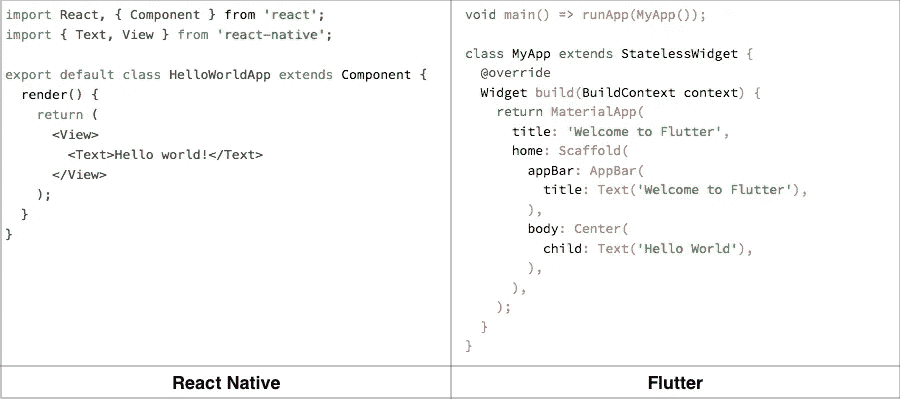

动态和非动态语言都有各种优缺点，比如 JS 的开发便利性明显高于 Dart，而且 Dart 在类型安全和重构代码方面比 JS 更健壮。

# 3.2 界面开发

Native React 在接口开发上延续了*React 的开发*风格，支持 scss/sass，风格代码分离，从 0.59 版本的 *Hook React* 函数式编程开始，等等，而 *react* 则是标签名的替换，由于平台兼容性，削减了风格和属性支持。

如下图所示，它是一个普通 React 原生组件的常见实现，继承`Component`类，通过`props,`传递参数，然后在`render`方法中返回所需的布局，对布局中的每个控件进行样式化等等，这对于前端开发人员来说基本上不需要太多的学习成本。

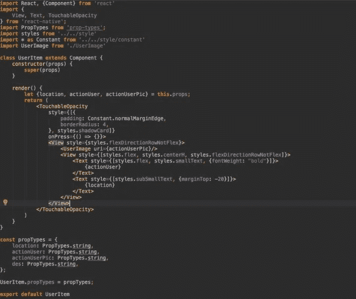

如下所示，如果你在*中加入 React 钩子，函数式开发无疑会使整个代码结构更加简洁。*

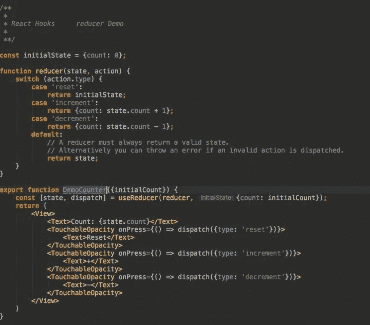

Flutter 最大的特点是，Flutter 是一个独立于平台的 UI 框架，它创造了 Flutter 宇宙中的一切。

如下图所示，Flutter 的开发一般是通过继承无状态的`Stateless widget`控件或者无状态的`Statefulwidget`控件来实现页面，然后在相应的`widget Build (BuildContext context)`方法内实现布局，利用不同的`widgets` / `children`的子控件做嵌套，通过控件的构造方法传递参数，最后对布局中的每个控件进行样式化，等等。

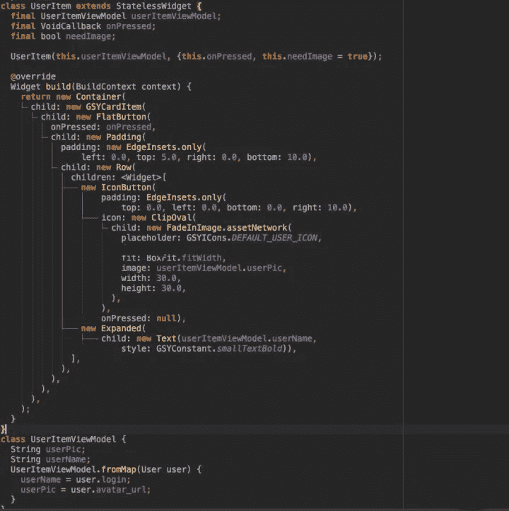

而对于颤振控件的开发，目前最槽的就是控件嵌套和样式代码没有分离，样式代码分离这个问题我不做评价，这个真的要实际开发要多点经验，关于嵌套这里可以做一些“粉饰”:

“在 Flutter 中这一切都非常彻底，所以小部件的粒度非常精细，例如，它是一个单独的，甚至状态共享都是通过`Inherited widget`共享`widget,`完成的，这就是为什么 slot 的代码嵌套样式很难看。”`WidgetPaddingCenterWidget`

其实就是因为颗粒感，你可以通过不同的`widgets,`自由组合多种业务模板比如在 Flutter 中常用的那个，就是官方帮你组合的模板之一，而容器内部其实是由`Align,` `ConstrainedBox,` `DecoratedBox,` `Padding,`等控件组合而成的，所以嵌套深度等问题完全是人为控制的，甚至在帧率和绘制上更加细致入微。`Container`

当然官方也在改善优化编写和可视化的体验，而且如下图所示，从目前官方发布来看，未来会进一步改善问题。


最后，抛开上面的开发风格，React Native 在 UI 开发中最大的特点是平台相关，而 Flutter 是平台无关的，比如下拉刷新，在 React Native 中，平台的不同下拉刷新效果，而在 Flutter 中，如果需要不同的平台下拉刷新效果，那么就需要使用 Refresh `And` `Cupertino Sliver Refresh Control`做显示，否则多面会有一致的效果。

# 3.3、状态管理

如前所述，Flutter 在很多方面借鉴了 React Native，所以在状态管理上也是很有“视觉感”的，比如调用`setState`进行更新，操作并不是马上生效的，当然它们是不一样的，如下面的代码所示:

*   通常 React Native 需要在中初始化一个变量，然后通过。`Componentthis.statethis.state.name`
*   Flutter 通过变量继承然后直接访问和触发其对象内的更新。`StatefulWidgetStatesetState`

```
/// JS
```

```
 this.state = {
       name: ""
    };
```

```
 ···
```

```
 this.setState({
        name: "loading"
    });
```

```
 ···
```

```
 <Text>this.state.name</Text> 
```

```
/// Dart
```

```
 var name = "";
```

```
 setState(() {
       name =  "loading";
    });
```

```
 ···
```

```
 Text(name)
```

当然，它们的内部实现也有显著的区别，比如 React Native，受 React diff 影响，以及 Flutter，哪个`isRepaintBoundary,` `Mark NeedsBuild,`等等。

在第三方状态管理中，两者有非常高的相似度，比如早期在前端状态管理框架中如:flutter_redux、fish_redux、dva_flutter、flutter_mobx 等等，他们的设计思路*非常*独特。

同时，Flutter 官员还提供 scoped_model、provider 和其他 Flutter 的状态管理特性。

所以 React 和 Native 在状态管理上非常接近，甚至在 React 之后。

# 3.4，本机控件

在跨平台开发中，就不得不谈到对原平台支持的访问，比如对 *Android 平台上 x5 浏览器的访问，对视频播放框架的访问，对 Lottie 动画框架的访问等等。*

这种需求得到了 React Native 的支持，甚至在社区中它也提供了类似 lottie-react-native 的项目。由于 React Native 的整个渲染过程都是在原生层完成的，所以访问原生平台控件并不困难，而且由于多年来的发展，虽然各种第三方库质量不一，但数量优势坐大。

而旋舞显然是弱势的，甚至官方在一开始，甚至没有支持，这实际上涉及到 Sis 的实施问题。`WebView`

由于 Flutter 的整体渲染是在原生平面之外，直接与 GPU 交互，导致原生控件无法直接插入其中，而在视频播放实现上，Flutter 提供了外部纹理的设计来实现，但这个过程所需的数据转换显然限制了它的通用性，所以在后续版本中 Flutter 提供了`platformView`模式进行集成。

> *以* Android *为例，一级层上的一级层 Ofsi 原理，通过二级屏幕显示，利用 android* 控制*在内存中绘制到该层的方式。绘制的 textureId，然后通知给* Dart *层，其中* Dart *层利用定义的并带来 textureId，引擎将与 textureId 对应的数据渲染到内存中。* `*PresentationVirtualDisplaySurfaceVirtualDisplaySurfaceAndroidViewWidgetAndroidView*`

`PlatformView`设计一定导致了性能上的瑕疵，其中最大的表现就是内存使用量的增加，同时也导致了键盘无法弹出和黑屏等问题，甚至在 *Android* 上性能可能还不如外面质感好。

到目前为止，对 Flutter 原生控件的访问仍然不如 React 原生控件稳定。

# 四、插件开发

Native Native React 和 Flutter 都支持插件开发，不像 React Native 开发的 [Npm](https://link.zhihu.com/?target=https%3A//www.npmjs.com/) 插件，Flutter 开发的 pub 插件。

使用*NPM*插件的好处在于，它使用了丰富的 *npm* 插件生态系统，同时降低了前端开发人员的学习成本。

但是*使用 npm* 的问题是太容易躺枪了，因为 *npm* 包的复杂程度和深度视情况而定，以至于你很可能不知道 *npm* 是什么，抛开安全问题，这里最直观的感受就是:*“为什么有人跑起来我跑不起来？”*同时，每个项目都是一个独立的 node_module，这对于硬盘空间较少的 Mac 用户来说有点辛酸。

Flutter 的 *pub* 插件在*pub 上默认统一管理，*类似于 *npm* 支持 *git* link 安装，而文件一般存储在电脑上的统一位置，多个项目引用同一个插件。`flutter packages get`

*   Win 一般在 C: users 下，' xxxxxx？appData-漫游-发布-缓存路径
*   mac 目录位于..发布缓存

如果找不到插件目录，也可以通过查看文件打开插件目录，或者按如下方式打开。`.flutter-plugins`

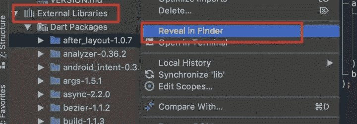

最后，谈谈 Flutter 和原生插件，它们对原生代码有不同的处理:

*   在安装了带有本机代码的插件后，Native React 需要执行脚本来引入支持，比如 Android，egotised in，以及在哪里进行侵入式修改以达到引用。`react-native linksetting.gradlebuild.gradleMainApplication.java`
*   Flutter 的文本是通过文件的，文件保存了插件 *key-value* 路径和原生代码，Flutter 的脚本通过读取动态引入原生代码，最后通过生成这个 ignore 文件来完成导入，这个过程开发者很大程度上是通过生成 ignore 文件来完成的。`.flutter-pluginsGeneratedPluginRegistrant.java`

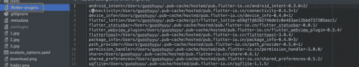

所以在这一块插件中，体验比 React Native 略胜一筹。

# 动词 （verb 的缩写）汇编和产品

Native React 编译的文件主要是文件，在 *Android、*和 *IOS 中。* `bundleindex.android.bunldemain.jsbundle`

Flutter 在 *Android* 上编译的产品主要是:—应用指令段—应用段—虚拟机数据段—虚拟机指令段等。`isolate_snapshot_instrisolate_snapshot_datavm_snapshot_datavm_snapshot_instr`

> *⚠️注意到，在 1.7.8 之后，Android 下的 flutter 已经被编译为纯 so 文件。*

在 IOS 中主要是 App.framework，里面也包含、和四个部分。`kDartVmSnapshotDatakDartVmSnapshotInstructionskDartIsolateSnapshotDatakDartIsolateSnapshotInstructions`

然后看看完整的结果，如下图所示，是 React Native 和 Flutter 在空项目和 GSY 实际项目下的发布包插槽大小的比较。

你可以看到在和 React Native 相同的条件下 Android 比 IOS 大很多是因为 *IOS* 自带 JSCore， *Android* 需要各种动态 so 内置支持，而这里 *Android 的*动态库 so 是大小过滤的，否则会更大。`ndk`

旋舞和 React Native 则相反，因为 *Android* 自带 skia，所以比没有 skia 的 *IOS* 小很多。

上述特性与 GSY 项目中的发布包相同。

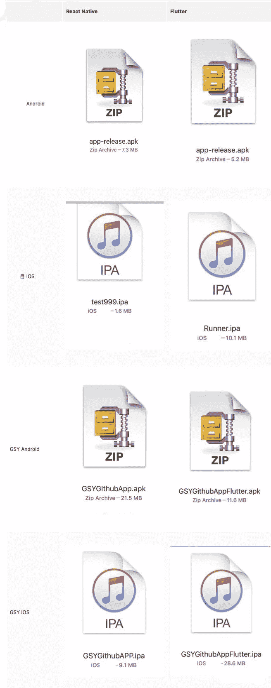

值得注意的是，Google Play 最近发布了 64 bit，也表示将停止 *Android Studio* 32 位维护，而格式支持，React Native 需要 0.59 以后才支持。`arm64-v8a`

至于颤振，包装时说明。`flutter build apk --release --target-platform android-arm64`

# 六、性能

说到性能，这是一个大家都关心的概念，但是有一点要注意，因为性能和代码质量与复杂度有关，所以把性能放在一边显然不合适。

首先，Flutter 的设计理论性能强于 React Native，这是框架设计理念的结果，在没有 OEM widgets 的情况下，直接与 CPU / GPU 交互的特性，决定了其固有的能量优势。

> *重要的是不要用模拟器测试性能，尤其是 IOS 模拟器，因为在 IOS 模拟器中 Flutter 是纯 CPU，实际设备是 GPU 硬件加速的同时只比较 Release 下的性能。*

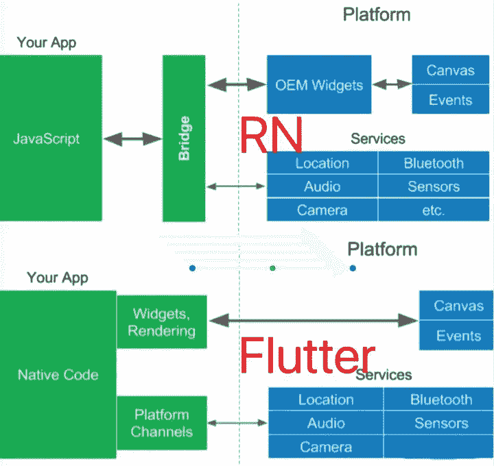

> *不同的代码实现方式也会导致性能损失，比如 Flutter 中的 skia 绘制时，是比较性能密集型的，比如*透明合成、clipRRect、*等等，可能需要调用，会清空 GPU 绘制的缓存，导致性能损失，导致开发时丢帧严重。*

# 未来的发展

在早前的一篇文章《Airbnb 为什么放弃了 React？，让很多不知名的吃瓜人认为 React Native 土著已经被抛弃，然后官方“脸书正在重建 React Native，改写了很多底层”的宣传，再次稳定了军心。

与此同时，React Native 在 0.59 版本中开始支持 *React Hook* 等功能，并将原来的平台功能控件从 React Native 内部剥离到社区中，使得单独升级控件更加容易，模糊了 React 和 Native 之间的界限。

Flutter UI 平台的不相关功能让 Flutter 可以更快地跨平台扩展，虽然 React Native 也有第三方扩展支持如 *Web* 和 *Pc，*由于平台相关性强，多年来发展缓慢，Flutter 在短时间内宣布了 *web* 支持，甚至扩展到*Pc*和嵌入式设备。

这是对于 Flutter Web 来说最关心的话题，如下图所示，在 Flutter 的设计逻辑中，你甚至感觉不到你在开发一个 Web app。

Flutter Web 保留了许多现有的移动逻辑，只是在引擎层与 dart2Js 的功能进行区分，但在现阶段，Flutter Web 仍处于技术预览阶段，不建议在生产环境中使用。


由此可见，无论是 Flutter 还是 React Native 都不会试图将自己扩展到更多的平台，同时进一步简化自己领域的开发。