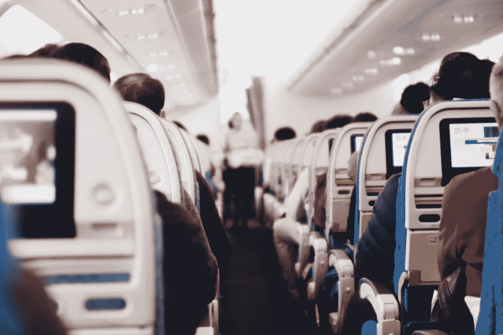

# 在疫情高峰期飞行并不像预期的那样。

> 原文：<https://medium.datadriveninvestor.com/flying-during-the-peak-of-the-pandemic-was-not-as-expected-36055d641dac?source=collection_archive---------24----------------------->

Image by [Suhyeon Choi](https://unsplash.com/@by_syeoni) on Unsplash.com

世界范围的恐慌，必需品短缺，人们互相攻击，负面媒体爆发，大规模歇斯底里，病人，垂死的人，医院不堪重负，呼救声，世界停滞不前。看着这一切在我们眼前展开。这是我们为自己创造的世界的*现实*。

所有这些*不可否认的*情况，不可逃避的事实是我必须从伦敦飞回挪威的家。一想到所有可能出错的事情，我就紧张，脑子里植入了很多担心。毕竟，对我们大多数人来说，这是第一次世界范围的关机经历。

这一切最后怎么会好起来呢？

尝试预订航班很有趣，因为许多航班都做了广告，但很快成为整个体验中最困难的部分。我预订的三个航班在一两天内被取消了。直到我第四次订票时，事情才如我所愿，航班才起飞。除了头疼之外，去机场还轻松得可笑。开车送我去机场的优步司机超级友好，他戴着全套高科技口罩。一路聊到那里。他告诉我，他已经一个多月没有在机场放下任何人了。这并没有让我震惊。

我中午 9 点整到达约翰·列侬机场，两个小时的飞行让我松了一口气。走过前门时，我在社交上与我碰巧遇到的两位出色的女士保持距离。环顾四周，机场几乎空无一人。他们告诉我，机场只在一个小时后开放，但是有一个关闭的星巴克，那里有桌子和椅子，我可以在等待机场开放时坐在那里。我焦急地坐下来，等待我的航班今天将要起飞的信号。

随着时间的推移，人们陆陆续续地进来了。最后，是时候完成行李托运了，比我预期的要顺利。我预计安全和检查会非常严格，包括体温、症状、我去过的地方、我想去的地方、我周围的人是否被感染。然而，相反的事情发生了。很顺利，没有人着急。所有的人都有一种冷静。我没想到每个人都这么放松。我们排成一行，在大约 25 个登记柜台中唯一可用的柜台前等候。在它后面站着一位先前的女士。她告诉我们，行李托运后，我们需要随身携带。她还说我们是当天唯一一架离开约翰·列侬机场的航班。

等待飞行有一种怪异的感觉。即使约翰·列侬的机场不是世界上最大的机场，但安静的聊天声却充满了回声。不知何故，这个小机场感觉很大，因为它缺少许多人在平常日子里带来的气氛。我们总共大约有 40 名乘客。

登机时间到了，我们不得不去一个“私人”区域，那里通常是豪华飞机和贵宾起飞的地方。作为少数人的一部分，能够在这个不确定和非凡的时代飞翔，这是一种超现实的体验。

护照检查和往常一样，除了它已经不在主机场了。然后走一小段路到一架非常小、非常时髦的飞机。走上登机的小台阶，一位戴着厚口罩的空姐迎接了我，我很容易就找到了座位，因为我是最后一批登机的。没有两个人坐在一起。整个飞机都是空的，每个人旁边都有一个空位。

每个人都很平静。这是如此令人耳目一新，来自一个当你走近他们的两米气泡时人们会超级担心的地方。我坐在座位上，知道终于到了翱翔天空的时候，这让我卸下了一大块重担。

整个经历让我大开眼界，因为许多人担心了太多不该担心的事情。在全球疫情期间，我认为将是我一生中压力最大的一天，结果却是最轻松和最放松的一天。我什么都不担心。所有的压力和焦虑都在我脑子里形成了。这些都没有实现。我这么担心有帮助吗？不要！

研究表明，你担心的事情有 85%不会实现。我发现这是真的。不只是那天，而是我的一生。为什么要为一次都不会发生的事情担心两次呢？

因此，每天都要学习，一切都会好的，尤其是如果我们相信一切都会好的话。不需要担心无法控制的事情，只要尽我们最大的努力，保持积极的心态。

这就是为什么我知道最后一切都会好的。