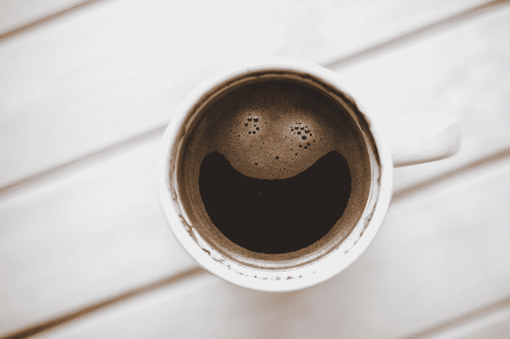

# 用咖啡因集中注意力

> 原文：<https://medium.datadriveninvestor.com/focus-fix-with-caffeine-7adca62626a5?source=collection_archive---------22----------------------->

*喝酒让自己集中注意力*

我深受注意力分散之苦，不仅仅是我，假设大多数人都有这种感觉。不管我什么时候想做什么，即使我的手机被锁在我看不见的地方。我的注意力被瓦解了，我痛苦地把它们重新组合成一个整体。

即使是我有时获得的生产力工具也不能让我的一天过得很好。我通常面临的问题是，首先从某件事开始，不管它可能是什么。

我很难拖延，最终，它影响了我的信心和成长。从那以后，我开始练习，上网寻找解决问题的可能方法。令人惊讶的是，除了一堆方法之外，没有一种方法可以克服这个问题。

但你知道，每个人都不适合呆在同一个洞里，至少我不适合。事情并没有以任何方式帮助我，但我喜欢看或阅读所有那些互联网的东西。

我对咖啡因及其作用有所了解。我们靠腺苷分子的**开车睡觉，这使我们有时更想睡觉。**

 [## 医疗保健太便宜，无法计量|数据驱动的投资者

### "当世界末日来临时，每个人都将独自购买医疗保健."戴夫“ePatient”德布朗卡特掉了这个…

www.datadriveninvestor.com](https://www.datadriveninvestor.com/2020/11/02/healthcare-too-cheap-to-meter/) 

我回过神来，分析我的问题是由于疲劳。为了克服这种疲劳，我坚持拖延，让自己开始行动。

腺苷分子结构和咖啡因分子结构相差一个分子，这就是为什么咖啡因可以滑入受体部位并阻断腺苷分子，从而使我们回到清醒状态。

在开始做任何事情之前，我确保身边有一个装满**黑咖啡的杯子，**这对新手来说很难吃，但随着时间的推移事情会好起来的。

我注意到在喝了几口咖啡后，我的情况是没有牛奶，只是更多的咖啡因刺激了我体内的聚焦血管来采取行动。说到我的疲惫，从现在开始，它无处不在。

黑咖啡让我开始的过程变得轻松，有时让我更深入这个过程本身。我的注意力比以往任何时候都恢复得更好，如果你幸运的话，可能会偶尔发现新的想法。

如果你还不是咖啡迷，我很欣赏你的做法，看看它如何能帮助你加快进步。

焦点问题？一杯咖啡可以为你创造奇迹！

## 访问专家视图— [订阅 DDI 英特尔](https://datadriveninvestor.com/ddi-intel)