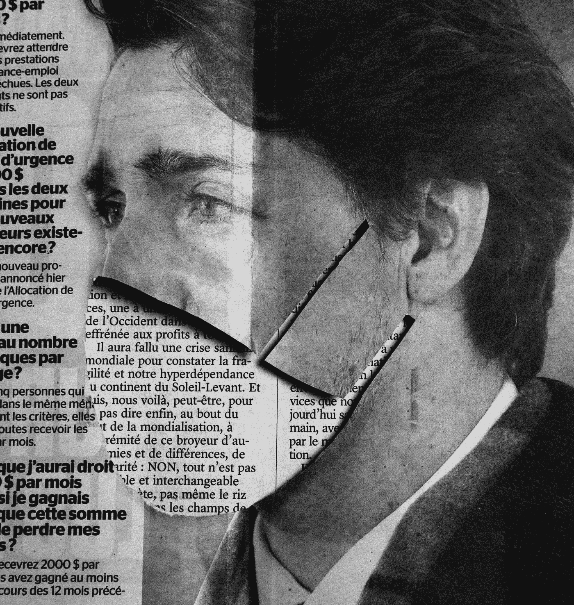
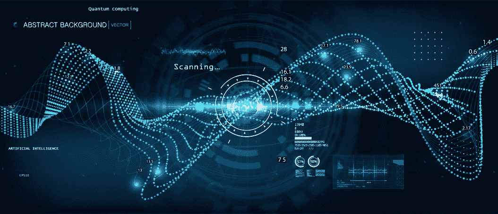
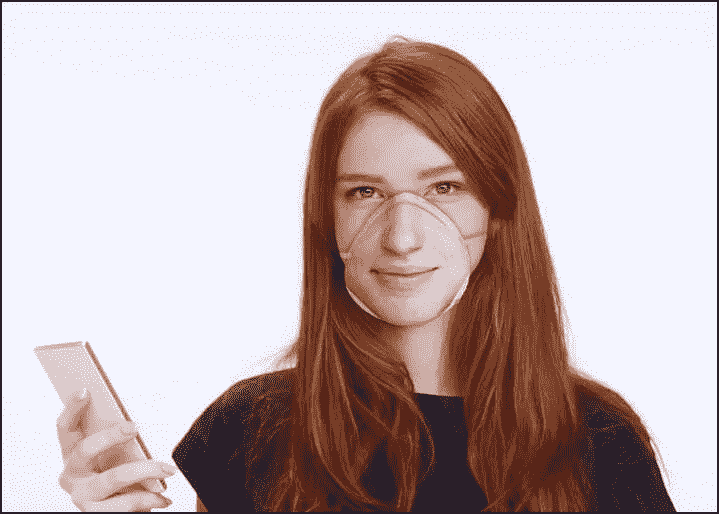
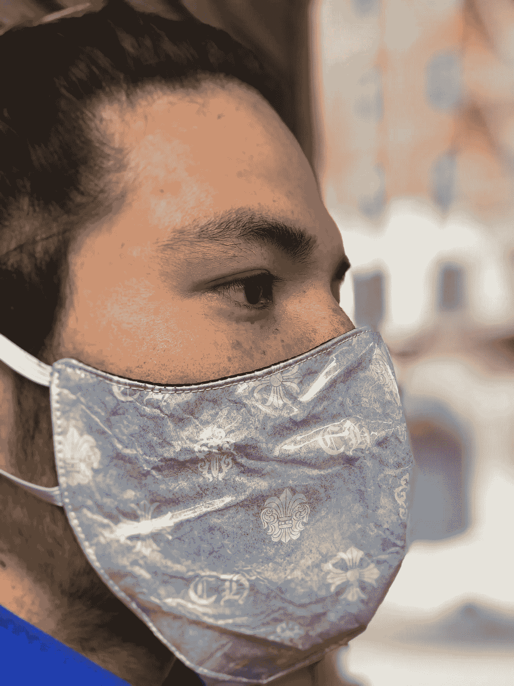
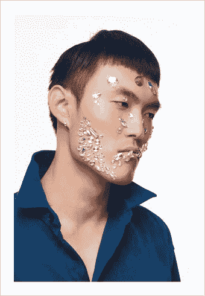

# 挫败面部识别人工智能:新冠肺炎打乱了这个苹果车

> 原文：<https://medium.datadriveninvestor.com/foiling-facial-recognition-ai-covid-19-has-upset-the-applecart-on-this-4945385f026e?source=collection_archive---------15----------------------->

Photo by [Charles Deluvio](https://unsplash.com/@charlesdeluvio?utm_source=unsplash&utm_medium=referral&utm_content=creditCopyText) on [Unsplash](https://unsplash.com/s/photos/covid-19-facemasks?utm_source=unsplash&utm_medium=referral&utm_content=creditCopyText)

面部识别人工智能被认为是人工智能对许多形式的黑客攻击的回答。[视网膜和虹膜识别](https://www.bayometric.com/retinal-vs-iris-recognition/)并不是在所有领域都可行，但是通过适当的算法处理的全脸图像将会做得非常出色。在这个过程中，它将节省时间，而时间就是金钱，所以公司和政府觉得他们找到了金羊毛。

> 当然，这些算法有其固有的偏见，也无法正确识别有色人种。麻省理工学院媒体实验室的 Joy Buolamwini 在[的一次采访](https://www.marketplace.org/2018/02/13/tech/why-algorithms-may-have-trouble-recognizing-your-face/)中概述了几个缺点。

"*如果您查看现有的基准测试，您会发现即使是这些基准测试也有严重的偏差。这一点之所以重要，是因为当 2014 年面部识别的突破被记录下来时，他们能够说他们取得了进展的方式是说他们在这个数据集上实现了 97.35%的准确率。但是数据显示 77%是男性，83%是白人。是的，训练数据中可能存在偏差，但基准数据集也可能存在偏差，基准数据集用于验证某些东西是否准备就绪*。

Copyright: [Sergey Kovalkov](https://www.123rf.com/profile_sergeybitos)

新冠肺炎加入了这一行列

我们需要口罩来抵御新冠肺炎病毒的事实可能意味着面部识别不再有用。必须考虑这种可能性。

当你看不到面部参数，也看不到大部分面部轮廓时，你如何定位算法所利用的面部参数？尽管戴着面具也能做到吗？一家公司认为可以。在将他们自己的照片上传到公司的服务器后，人工智能就会用这张照片创建一个定制的面具。

[*这款名为*](https://www.moneycontrol.com/news/technology/face-id-masks-for-covid-19-to-allow-facial-recognition-on-smartphones-4961631.html) *的口罩被称为静息风险口罩，被称为一种解决方案，不仅可以保护人们免受病毒侵害，还允许用户在佩戴口罩的同时解锁他们的 iPhones 和其他类似 Face ID 的兼容设备*

Faceidmasks sample of the Resting Risk mask

如今，该产品尚未发布。有兴趣的人需要先交 40 美元的订金才能得到通知。这里有什么问题？

我认为，如果你放错了面具，有人可能会用它来完美地模仿你，并带走面部识别人工智能保护的任何东西。这可不是什么好照片。

如果你有一些珍贵的东西，你使用面部识别来获取它，难道不会有人能够从你的照片中 3D 打印出一个面具吗？如今，3D 打印机并不罕见。

还有，N95 口罩什么时候需要消毒呢？面部图像是否会以某种方式起皱或扭曲，使其无法使用？你能根据需要打印多少个口罩，费用是多少？现在一切都很模糊，但这是人工智能和面罩的一种方式。

考虑到 N95 口罩的稀缺性，这家公司从哪里获得渠道来印刷他们希望被要求的所有口罩？但它确实做出了一个可能是真的假设；在未来很长一段时间里，我们都需要这些面具。新冠肺炎病毒不会很快消失。

Photo by [Utopia By Cho](https://unsplash.com/@chomoda?utm_source=unsplash&utm_medium=referral&utm_content=creditCopyText) on Unsplash

普通的非印花口罩会让你有隐藏身份的能力吗？似乎不是这样。“… [*Luxand 在市场上带来了可以透过面罩看到东西的相机*](https://www.martinvrijland.nl/en/news-analyzes/the-company-luxand-markets-cameras-that-can-see-through-face-masks/comment-page-XNUMX/)*……他们制作热记录，然后在 FaceSDK 数据库中在线检查。FaceSDK 是面部识别的全球平台(数据库)*。

他们是怎么得到你所有的侧面像的？嗯，你可以从脸书(Instagram、Snapchat 和 WhatsApp 的所有者)和谷歌这样的大数据收集者那里，或者从任何其他在市场上有你允许打开相机的应用程序的公司那里，实时购买这些数据

想要热脸检测软件或想要更多的信息吗？这是他们的网站:[https://get.luxand.com/thermal-face-detection/](https://get.luxand.com/thermal-face-detection/)

> 你是那个允许任何拥有正确的数据库访问权限和你的照片的人找到你的人——即使是在面具后面。但是每个人的照片都在这些数据库里吗？正如他们所说，这是一个 64K 美元的问题。

但是，如果你曾经使用过你的相机或者分享过一张照片，你就在一个被卖给世界上某个地方的某个人的数据库中。有了新兴的打印程序，在面具上打印自己的脸应该不会太难吧？

Photo ©Cha Hyun Seok

最后一项措施，化妆

面部珠宝或化妆品如何来衬托现在被使用的监视努力？这可能行得通，一些公司正在考虑生产这种产品。

南安普顿大学专门研究计算机视觉的讲师 Sasan Mahmoodi 解释说:“**反监控化妆品通过使用各种颜色在脸上添加人工物体来欺骗监控系统。”“面部监视系统非常依赖面部边缘。这些边缘是由嘴唇、鼻子和眉毛等面部特征形成的。如果你在脸上添加人造物体，比如化妆品，以在脸上产生更多的边缘，那么这可能会给监控系统带来问题，显然识别率可能会受到负面和显著的影响。”**

*当我们面对快速变异的病毒或病毒群时，面部保护无疑是必要的。对这些产品的需求也将创造出额外的市场来规避身份保护，如果身份保护是你想要的。*