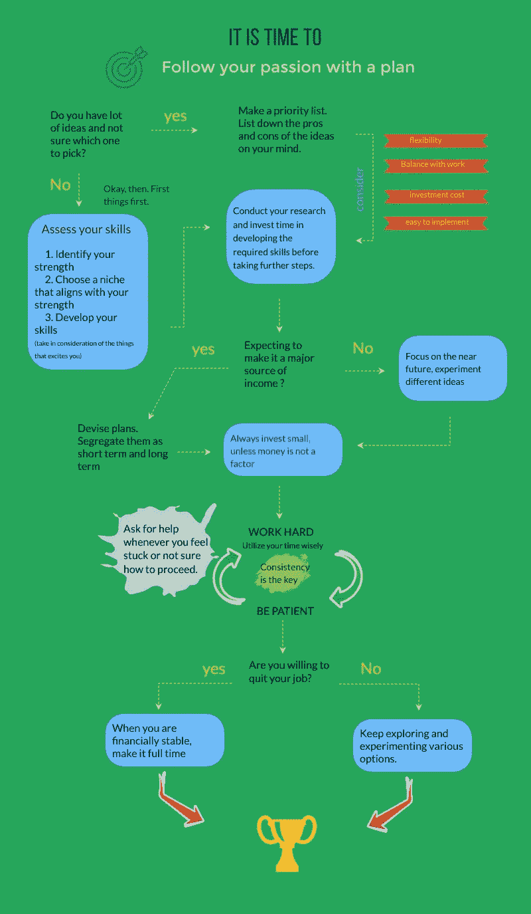

# 追随你的激情与不追随你的激情

> 原文：<https://medium.datadriveninvestor.com/follow-your-passion-vs-dont-follow-your-passion-ea5b7d7afeea?source=collection_archive---------6----------------------->

终于想通了。

Photo by [Marl Clevenger](https://unsplash.com/@marlclevenger?utm_source=unsplash&utm_medium=referral&utm_content=creditCopyText) on [Unsplash](https://unsplash.com/s/photos/opposites?utm_source=unsplash&utm_medium=referral&utm_content=creditCopyText)

我们大多数人都不满意我们的日常工作，每天去上班是一场真正的斗争。有时候，我们意识到我们的生活很平淡，并问自己这是不是我们想要在余生中做的事情。

我们希望做自己喜欢的事情。思维徘徊着，希望找到摆脱这种恶性循环并扭转局面的方法。

做你喜欢的事和做有回报的事之间的良心之战。

我们总是听到人们说:“追随你的激情”。我们想突破舒适区的藩篱，辞掉工作，做一些自己热爱的事情。似乎是对的，有道理，做自己热爱的事会让我们快乐。但是，在不确定结果的情况下，将事情置于危险之中，拿我们现在拥有的东西冒险，是非常危险的。

 [## 成功人生的 25 种自我提升方式|数据驱动的投资者

### “我活得越久，学到的就越多。学的越多，体会的越多，知道的越少。”―米切尔·莱格兰德时间到…

www.datadriveninvestor.com](https://www.datadriveninvestor.com/2019/03/12/25-self-improvement-ways-for-a-successful-life/) 

# 追随你的激情

做一些我们热爱并充满激情的事情是很棒的。

## 真正的麻烦是——找到你的激情

有些人确切地知道他们想做什么，他们渴望成为什么样的人。不是所有人都有这样的福气，也不是所有人都清楚自己想要什么。有时候我们甚至会把爱好误认为是激情。有些人喜欢一心多用。

如果你是那种博览群书、摄影、喜欢赶时髦、紧跟时尚的人。很难弄清楚你对哪个更有激情。

如果你是一个足球/板球爱好者，你对这项运动充满热情，并定期观看所有比赛，这是否意味着你应该把板球/足球作为你的职业？

如果你知道你的激情，

你准备好付出努力、时间和努力了吗？甚至会出现你完全破产的情况。你准备好面对精神和身体的压力了吗？

如果你真的准备好了全力以赴，你有耐心保持专注吗，不管这需要多长时间？

如果事情不像预期的那样发展，你有能力变得坚强和有自知之明吗？

# 没有追随你的激情

有一份稳定的工作，不用每天都有压力，保险一点有时是最好的决定。总比孤注一掷失去一切好。

也许这不是我们想要的，至少它支付账单，帮助我们过上体面的生活。

## 遗憾

但是不追随我们的激情，不去尝试，将会困扰我们一辈子。

虽然我们可能会说服自己所有的逻辑推理，但在内心深处，我们知道我们害怕和焦虑。很难克服它。我们太满足于我们所拥有的，我们没有准备好去给予我们内心所要求的。

迷失的感觉，没有实现我们的目标会是毁灭性的。我们可能开始认为自己是个失败者，每天醒来都渴望改变。浪费我们潜能的罪恶感会压垮我们。我们最终可能会重温我们做出的选择，后悔错过的每一个时刻和机会。

# 另一边的草总是更绿

两者都有各自的好处和缺陷。成功的诀窍在于为了我们的方便把两者结合起来。

对某件事充满热情和把它变成一种职业是完全不同的。白手起家，追逐金钱的激情会变得不温不火。

大多数情况下，我们讨厌自己的工作，因为我们不擅长。我们需要提高我们的技能，完善我们的优势。在某件事情上做得好和做得最好总是令人愉快的，没有人想放弃他们擅长的事情。

> 没有什么有意义的事情是容易得到的。它需要计划、执行和耐心。最重要的是，不断适应、改变、成长的能力。

我们没有所有的答案，这很好。我们所要关注的是过程而不是结果。让每一步都有价值，聪明地玩游戏。

# 用一个“计划”来追随你的激情

这里有一个小例子，告诉你如何用一个计划来追随你的激情。

[https://medium.com/@hindusreeni97](https://medium.com/@hindusreeni97)

## 想办法

随着时间的推移，我们不断进化和成长，从而提升我们的爱好、兴趣和激情。基于短暂的狂热做出人生决定可能会产生极端的影响。制定一个详细的计划，将你的热情转化为职业机会。即使失去兴趣，也要勇于尝试新事物。在小范围内不断尝试新事物，当你有把握的时候，继续前进。

## 优先安排时间

一次做多件事可能会让人不知所措，但只要有适当的计划和决心，这是有可能的。不要浪费时间拖延，设定小目标并努力实现。提前计划你的一周，创建一个清晰的画面，最大限度地利用你的时间。

## 投资自己

与其在物质上大量投资，不如发展你的技能，在你想从事的领域获得培训。尝试结合两个或更多你熟悉的领域，而不是花时间去精通一个。

## 不要绝望

想要更多没关系，但是永远不要忘记感激你所付出的努力。当你失败或你的努力无人注意时，不要绝望，要有耐心和毅力。不要让失败吓倒你。

## 求助

每当你感到困难时，不要害怕寻求帮助。试着和有相似兴趣的人成为伙伴，与人交往会让你保持专注，并提供理解不同观点的机会。

如果你真的想要什么，并为之努力，没有人能阻止你。拿破仑·希尔在 [*中解释过思考致富*](http://www.amazon.com/Think-Grow-Rich-Napoleon-Hill/dp/149617545X)**欲望是一切成就的起点，不是希望，不是愿望，而是超越一切的敏锐脉动的欲望。*”*