# 不含家禽的食物:没有蛋的蛋(来自鸡)

> 原文：<https://medium.datadriveninvestor.com/food-w-o-fowl-the-egg-thats-still-egg-without-egg-from-a-chicken-3184a7ae4f77?source=collection_archive---------14----------------------->

先有鸡还是先有蛋？

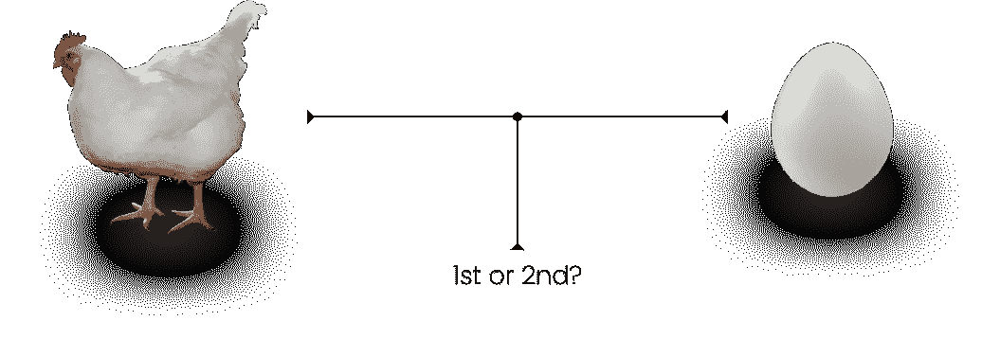

所以这是一个非常有趣的问题，一个通常被认为是“陷阱问题”或“存在问题”或“无法解决”的问题。但是，如果我们看看生物学，我们可以*实际上*找到一个相当全面的答案:

> 两只鸡前辈交配，基因混合，下了一个蛋，它孵出了一只鸡。

所以，彩蛋很可能已经先来了。蛋是生命的基本标志。近 3.4 亿年前，发现了第一个**羊膜蛋**——水生动物与爬行动物在陆地上工作的适应产蛋形式——在那之后的 3.39 亿年，第一只鸡出现了。

时间快进到 4 万多年后，我们都在吃鸡蛋。

但那还是一万年前的事了。

这意味着我们饲养家禽并食用它们的蛋已经有近一千年的历史了。

然而，有趣的是，吃鸡蛋的问题仅仅在/₁₀₀₀时间的 1/4 内出现并达到顶峰。

## 为什么我们需要停止养鸡

每年生产超过 1 万亿个鸡蛋，仅在美国，人均年鸡蛋消费量已经上升到每人 280 多个鸡蛋。

那太多了👇🏾

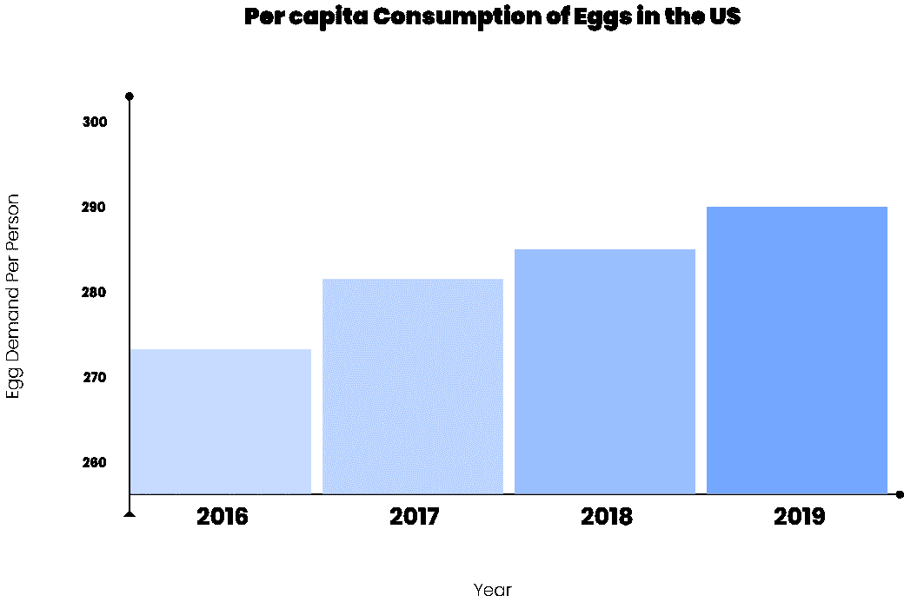

如你所见，平均每人每年对鸡蛋的需求都在增加！

问题是我们让鸡(鸡蛋的制造者)接受这个:

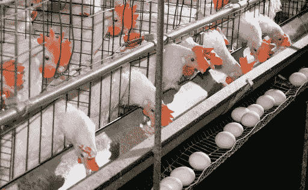

这是不道德的。

鸡被关在笼子里，挤在笼子里，然后被挤干，实际上是被挤干。近年来，这些做法已经开始占所有农业和食品类温室气体排放的 14%以上，请注意，这是气候变化的 25%。

然后，鸡也被屠杀。不要把它们作为感恩节的配菜或鸡肉晚餐，而不是火鸡，想想它们的鸡蛋吧。

在 T4 每年宰杀的 90 亿只鸡中，有 4 . 5 亿只被鸡蛋毒死。鸡所处的不卫生和限制性条件也会在我们吃它们的蛋时遗传给我们。即使不考虑鸡被注射了抗生素，激素等。只要看看禽流感是如何开始的，我们就会发现产卵是问题所在。

> 来自养殖鸡蛋的食物不安全👇🏾。

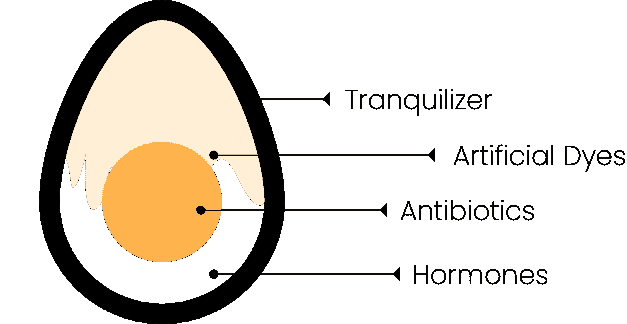

禽流感会影响家禽，甚至会导致产生 A 型病毒的交配。这意味着我们可能会因为鸡蛋而生病，因为鸟儿生病了。

因此，鸡*和蛋*都是有问题的(当然还有人类，他们造成了这种混乱，但也可以修复它)。

每个鸡蛋重约 100 克，热量约为 170 卡路里。

这些热量分为 13.6%的蛋白质，14.6%的脂肪(其中 1.3%是更健康的不饱和脂肪)，其余是水。它们的成分很简单，尽管目前很多鸡蛋过度补充了脂肪。

然而，鸡蛋富含维生素 A、B 和 D，这使它们成为非常受欢迎的食物。但是*是因为*鸡蛋需求如此之高的事实是这些有问题的生产系统首先被创造出来。

你可以使用的一个心智模式是永远向前看。

> “50-60 年后，我们会认为什么是过时的？”

鸡蛋就是其中之一。

鸡蛋，尤其是它们的蛋白(称为**蛋白**)极其重要。

它们几乎影响到我们所有人。

蛋清不仅被用作膳食、蛋白质补充剂或烘焙食品，在世界各地的快餐中也被使用。

每天有超过 6800 万人吃来自*麦当劳的快餐。显然，那很可怕，但更可怕的是用了多少蛋清。这是几十万磅的蛋白，如果不是更多的话。*

我们必须开始考虑创造新的系统。我们不仅仅要养活 70 多亿人，而且我们将在 29 年后养活超过 110 亿人。

那看起来像什么？

现在，看起来每吃一个鸡蛋会产生 2.2 公斤的二氧化碳。

每吃一个鸡蛋会产生 0-0.01 千克的二氧化碳。它应该看起来不像杀鸡、下蛋或注射来下蛋的鸡。It *应该*吃素。

因此，有两个真正长期的解决方案:植物鸡蛋(评论即将推出)，或者我们今天要谈论的**培养鸡蛋/蛋白**。

# 鸡蛋制作

培养鸡蛋，或基于细胞的蛋白是一种我们可以让鸡和母鸡退休的方法，并把它们从笼子里解放出来。它模拟了鸡蛋在鸡体内形成的过程，并模拟了鸡蛋的特性，而没有涉及到动物。

就像魔法一样！但是同样神奇的是，现在的鸡是怎么下蛋的，我们的资源还没有完全耗尽。

鸡实际上非常不擅长下蛋😮。

> 我们喂给动物的食物中，实际上只有 20%(通常少得多)是蛋。

它们是这样做的:鸡的细胞具有正确的 DNA 序列，允许它们随后产生 RNA，这些 RNA 产生构成蛋清的必要蛋白质，如伴清蛋白、卵粘蛋白和球蛋白，仅举几个例子(匹配)。但是就像我之前提到的，这并不高效，因为我们喂给它们的营养中只有 3%在这个过程中变成了蛋白质👇🏾。

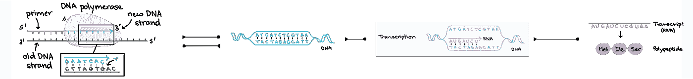

## 1.DNA 复制

第一步是 DNA 复制，另一条 DNA 链产生了。

为此，我们必须拉开 DNA 的拉链！幸运的是，我们有**解旋酶**为我们做这件事。解旋酶将 DNA 从中间分开，从 DNA 的双螺旋中形成两个独立的螺旋。

这两个独立的螺旋分别被称为**领先股**和**落后股**。这两条链是反向平行的，这意味着它们是平行的，但方向相反。

这两个方向被称为 3 '到 5 '和 5 '到 3 '。前导链从 3’向右移动到 5’，而滞后链则相反。

> *注意，方向是基于碳的顺序。*

这是极其重要的，因为酶对任何东西都是超级特异的，所以 DNA 螺旋需要以正确的方式运动！复制发生在两条链上。

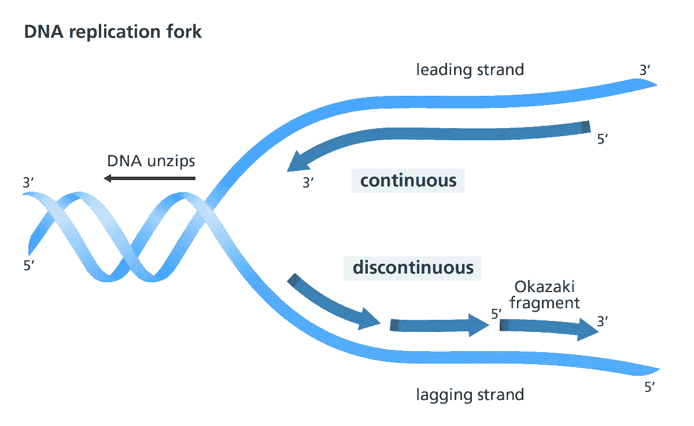

在前导链中，**引物酶**是一种酶，它产生一条连续的 RNA 链，称为**引物**，它作为一种标记，在 **DNA 聚合酶**的帮助下结合到前导链的末端。这是 DNA 复制的起点。一旦所有的碱基都匹配上了(A 和 T，C 和 G)，一种叫做核酸外切酶的酶就会剥离引物。然后，引物所在的缺口被更多的互补核苷酸填补。然后聚合酶沿着主链漫步，在缺失的地方添加必要的核苷酸碱基(A-T 和 C-G)。这被称为**连续**，因为它是完全渐进的，并且它在 5 '到 3 '方向上工作。

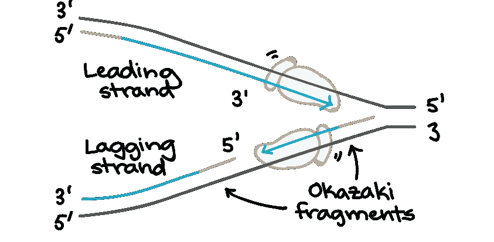

至于落后的链，RNA 引物再次产生，它结合在 DNA 链的多个点上。结果是一堆被称为**冈崎片段**的 DNA 块，它们被附加到滞后链的 5’到 3’端。这种**不连续的**复制需要冈崎片段随后被酶结合以产生连续的链。

在 DNA 聚合酶完成它的任务并配对了合适的碱基后，**核酸外切酶**去掉引物，然后用合适的 As、Ts、Cs 和 Gs 填充空间。然后像测试一样再次检查 DNA，以确保一切都在正确的位置(一些错误会被纠正，但当然不是全部)。

然后用 **DNA 连接酶**酶关闭 DNA 序列，生成一个 DNA。有了所有的四条链，你得到了两个新的 DNA 分子，因为你已经创造了一半新的和一半旧的核碱基。这意味着这个过程是半保守的，因为只有它是新的。

在你得到 DNA 后，你进入转录过程！

## 2.抄本

RNA 就是这样合成的！

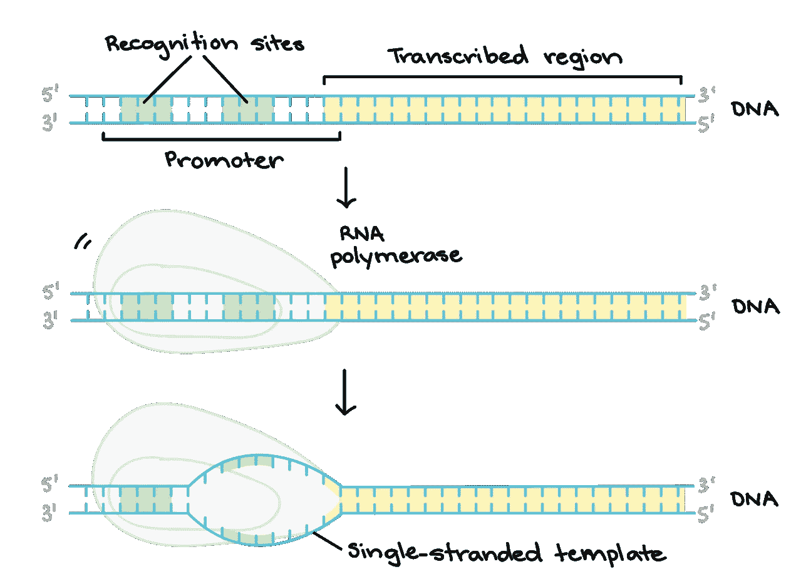

转录的第一步是起始过程。这是 RNA 聚合酶(DNA 聚合酶的 RNA 版本)与被称为 T2 启动子的 DNA 部分结合的地方。由于几乎在基因的开始，每个基因都有自己的启动子。然后，RNA 聚合酶通过分离 DNA 链创建一个模板，作为其余过程的基础。

转录过程的步骤是通过拉长来制备链。

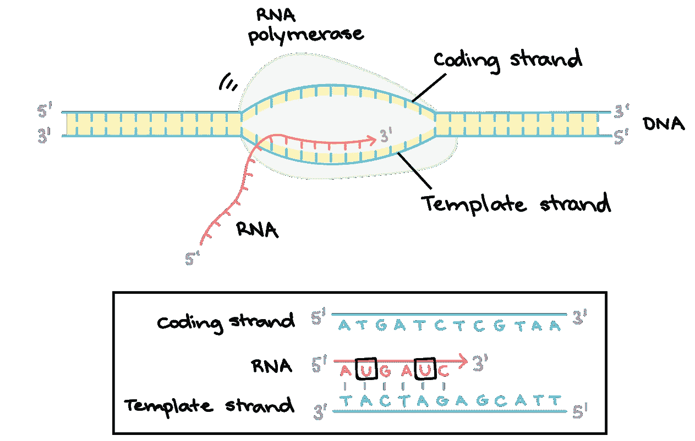

生成的 DNA**模板链**就是 RNA 聚合酶模板。基本上就像一本书高潮前的章节(除了单词每个都只是 A，T，C，G)。RNA 聚合酶读取它，并开始从正确的碱基构建 RNA。这条链从 5’延伸到 3’。然而，胸腺嘧啶(T)被尿嘧啶(U)取代。

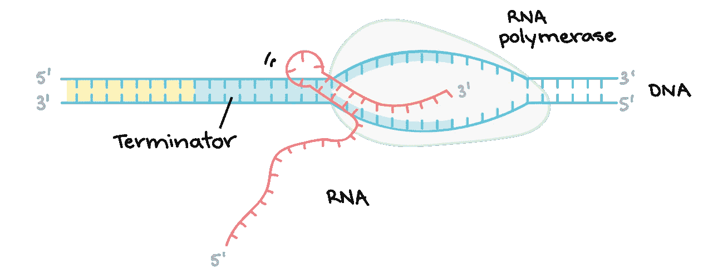

为了最终停止，有一个被称为**终止子**的基因序列发出信号，指示已经转录完成的 RNA。终止子导致 RNA 聚合酶释放 RNA。

最后我们使用

## 3.翻译

来制造蛋白质。

首先，一种叫做**核糖体**(它产生蛋白质)的粗糙粒子围绕着信使 RNA (mRNA)和转移 RNA (tRNA)被读出。这些 RNA 中每一种都有特定的功能，这取决于它们的前缀。这个方位被称为**初始复合体。**

为了扩展氨基酸**多肽链**(只是一串将氨基酸结合在一起的肽键)，延伸的过程发生了。mRNA 由它们的**密码子**读出。这些是由三个核苷酸组成的遗传密码序列。由于 mRNA 是由每个密码子读取的，所以每次都会添加对应于该密码子的氨基酸(氨基酸也是由三个字符串组成的，如天冬酰胺= UUG)。

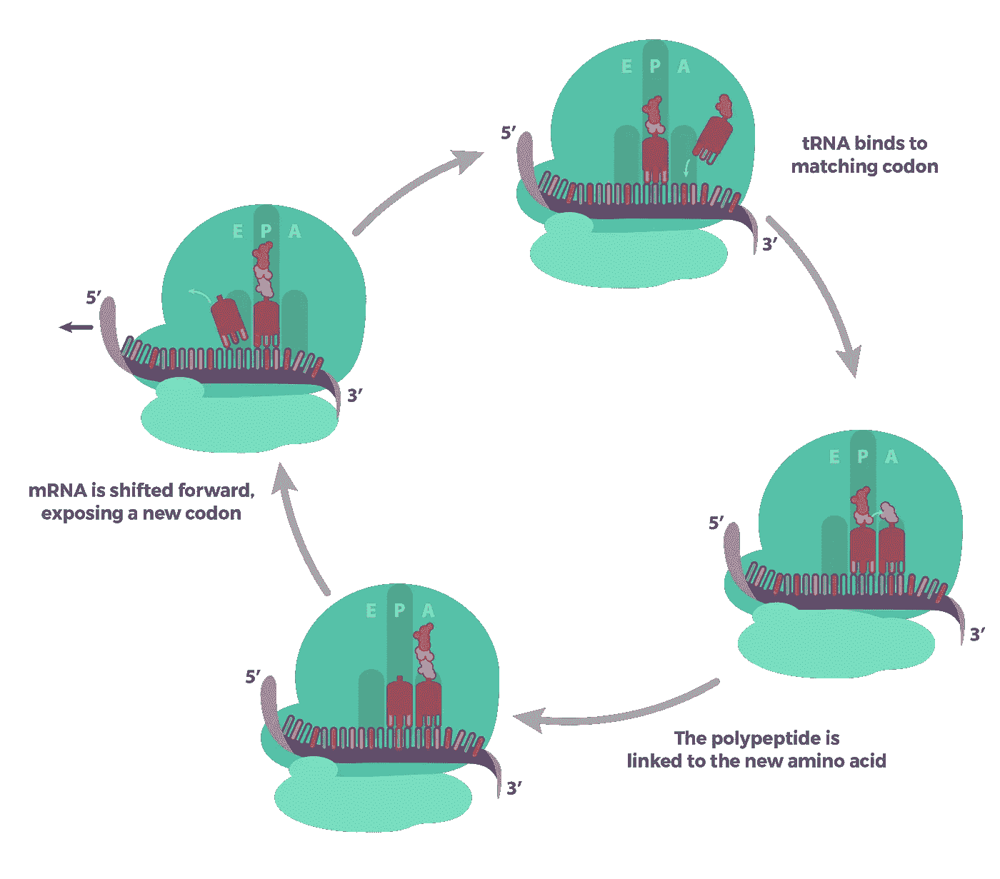

对于每一个新的密码子阅读，tRNA 与它结合，氨基酸多肽进入 tRNA 氨基酸，mRNA 在核糖体中移动一个密码子，暴露另一个密码子以重复这个过程。

最后，在延伸过程中，tRNA 移动通过称为 A、P 和 E(氨酰基、肽基和出口)**位点**的核糖体部分，不断重复。

最后，为了终止，**终止密码子**(代码为 UAG、UGA 或 UAA)进入核糖体，然后链能够与 tRNA 分离，有效地将其从核糖体释放。

因为氨基酸是蛋白质的组成部分，释放的多肽给了我们所需的任何蛋白质(在这种情况下是鸡蛋)。然而，这一过程会出现一些畸形，多肽可能需要在核糖体外进行再加工，如固定其 3D 形状，或与其他类似的蛋白质结合，形成功能性蛋白质。

如你所见，制造蛋白质有很多方法。有这么多的步骤，导致放进去的食物在这个复杂的组织中丢失。

然而，按照细胞农业的说法，除了肉类，我们可以通过基因编辑酵母来制造必要的蛋白质。如此便捷的技术🤩！

# 鸡蛋，但不是鸡肉——养殖鸡蛋

这项技术实际上是被称为**非细胞农业**的细胞农业的一个子集。这听起来很令人困惑，但这只是用细胞生产非细胞产品，比如卵子！

我们从**基因改造酵母**开始，这样当它**发酵**时，它就会产生我们想要的蛋白质。

## 制造转基因酵母

所以我们要做的是给酵母适当的基因，这样它就可以像大多数母鸡/小鸡一样开始生产鸡蛋蛋白。这些蛋白质反映了鸡蛋的特征，比如它的颜色，什么使它好吃，它的营养价值。基本上，在确定了牛体内制造蛋白质的基因后，我们(无害地)得到它并将其引入酵母的 DNA。然后我们让质粒(回想一下:环状 DNA 束)不断复制。这个过程有时被称为克隆。它的功能基本上是这样的:

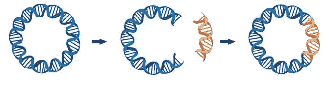

因为质粒从不停止复制，所以它是插入例如 TENP 基因的位点，该基因是鸡和母鸡中卵球蛋白 G2 的蛋白质生产的最重要的基因之一。顺便说一下，基因编辑后的质粒叫做**重组**。质粒本质上是新的基因 DNA 工厂。

基本上，我们切割想要替换的基因，然后插入新的基因！然后，质粒被放回酵母中，这样质粒就可以告诉染色体发生了什么，这样染色体(DNA 的主要位置)也就假定了那个基因。这叫转化。

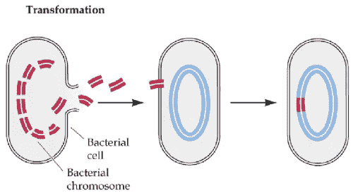

然后当酵母分裂时，它产生卵蛋白，像卵清蛋白！

## 发酵

有两种主要类型的发酵:乳酸和胆酸/乙醇。

发酵从糖酵解开始，除了这次我们制造丙酮酸，没有 ETC，或 Kreb 循环，或氧化，或任何类似的东西。相反，它通过不同的途径系统，最终在糖酵解中从 NADH 产生 NAD+，这种再生允许糖酵解重新进行。

所以，我们先从乳酸发酵说起。

在做任何运动时，比如跑步，你的肌肉有过灼烧感吗？由于乳酸发酵，你会有这种感觉，因为乳酸在你的肌肉中积累。随着呼吸越来越重，你摄入的氧气越来越少，这意味着你的身体必须依靠发酵来继续糖酵解！

侧注:不要把这和疲劳或肌肉酸痛混淆。影响你的乳酸积累通常发生在你剧烈运动的时候，然后你的肌细胞得不到足够的氧气。

这就是乳酸发酵(LAF)的样子:

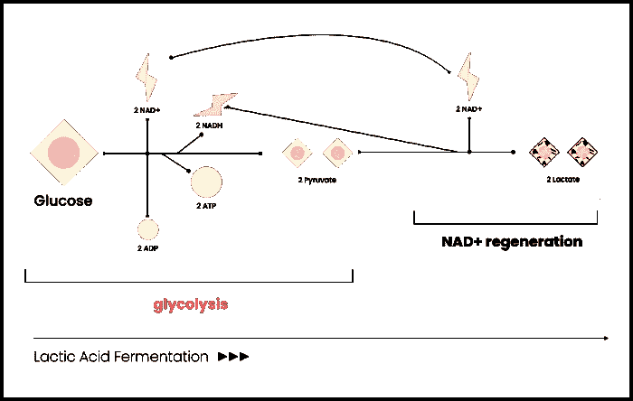

基本上，糖酵解像正常情况一样发生，其中 2 个 NAD+被放入，产生 2 个 NADH 和 2 个来自分解的葡萄糖的丙酮酸。然而，丙酮酸盐不是像我们之前看到的那样移动 ETC，而是转化为 2 个乳酸分子，然后电离形成乳酸盐！同时，2 NADH 被氧化成 2 NAD+，这使得糖酵解再次发生。

那么，酒精发酵呢🍾🍷(***另一个*** AF)。

看起来是这样的:

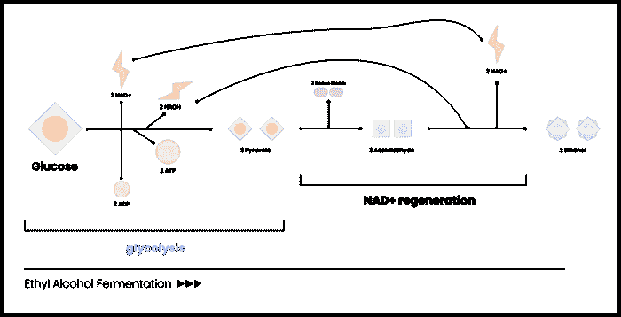

同乳酸，除了生产乙醇代替！所以我们通过糖酵解，然后我们用 2 丙酮酸生成 2 乙醛(一种化合物)，这释放出二氧化碳。然后，这两种乙醛通过 NADH 转化为两种乙醇化合物，然后氧化 NADH 并将其转化为 NAD+，用于再次为糖酵解提供动力。现在，让我们把这个应用到乳制品上。

酵母经过基因编辑酒精发酵过程，实际上产生了所需的鸡蛋蛋白质，特别是主要蛋白质**卵清蛋白**(54%)，以及**卵转铁蛋白** (12%)和**卵类粘蛋白** (11%)。

让我们回顾并完成这一过程:

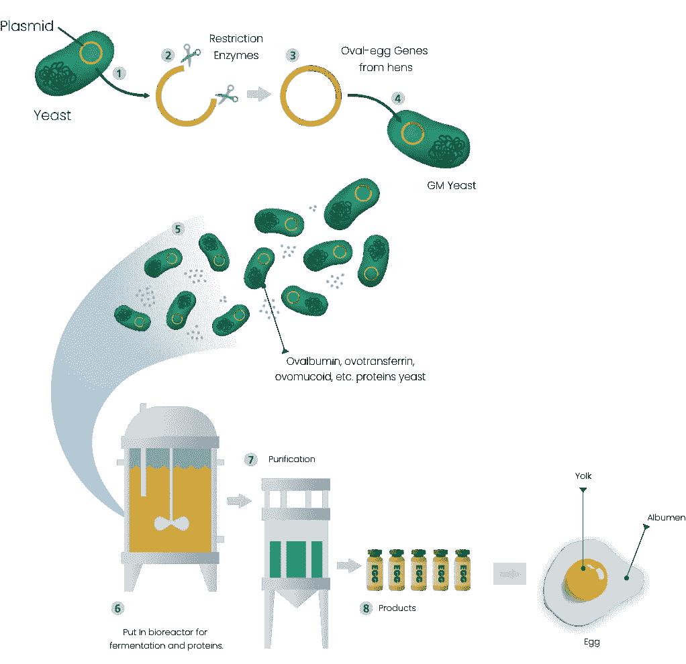

我们将转基因酵母放入名为**生物反应器**的发酵容器中，生物反应器过滤掉废物并保持酵母处于适当的状态。这些容器有点像酿酒厂，酵母在那里发酵并为我们提供蛋白质。

虽然我们有蛋白质，并且已经使用发酵来生产更多的蛋白质，但是我们需要提纯产品来提取蛋白质。从那里，我们得到蛋白质，我们可以通过加水把它压成各种产品，像粉末或液体；它们可以用油炸来生产鸡蛋。

更酷的是，我们可以*定制*彩蛋。例如，如果我们想要像云一样的鸡蛋，我们可以插入一些基因，可以增强鸡蛋的上升和一致性，使其更加豪华。我们可以利用基因工程使鸡蛋更容易做成三明治。

我们可以使用基因编辑来定制鸡蛋，以适应这种场合(这种场合有很多)。

虽然现在，似乎没有很多公司已经在这个领域工作并销售养殖鸡蛋，硅谷的研究正在转向这项技术。

这不仅仅是一门很酷的科学，也是一个应该向前推进的大问题的解决方案。

把鸡从他们的(一个)工作岗位上炒掉，我超级兴奋。

而且我超级*蛋*引来看看会发生什么！

在你走之前…

> 我的名字是 Okezue Bell，我是一名 14 岁的创新者/企业家，我将时间投入到超级有趣的生物技术和生物能源领域的研究和发展中！一定要多联系我:
> 
> *领英:*[*https://www.linkedin.com/in/okezue-a-...*](https://www.linkedin.com/in/okezue-a-bell-80a6b81a0/)
> 
> *个人网站:*[*https://www.okezuebell.com*](http://okezuebell.com/)
> 
> *推特:*[*https://twitter.com/okezuebell*](https://twitter.com/okezuebell)
> 
> *还有，我推荐调到我的* [*每月简讯*](https://www.subscribepage.com/x5b9x8)*[*非科学博客(在网站上)*](https://www.okezuebell.com/blog.html)*[*信件(在简讯网站)*](https://www.subscribepage.com/x5b9x8) *！我至少每个月都会在那里发布新的更新！***

**会有更多的…😉**

**感谢阅读！**

**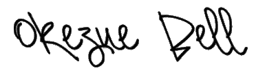**