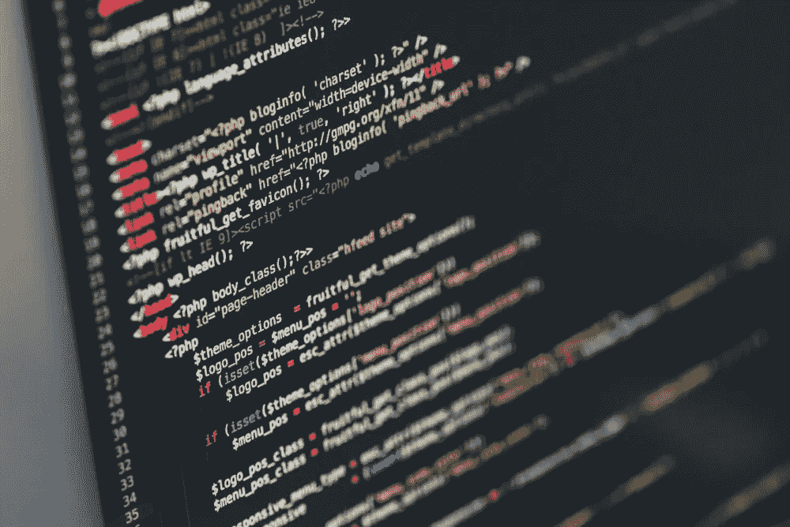

# 对于初学者:我应该学习 Java 还是 Python？

> 原文：<https://medium.datadriveninvestor.com/for-a-beginner-should-i-learn-c-or-python-186f200723b5?source=collection_archive---------10----------------------->

首先，记住，所有的语言在某些方面都是一样的，所有的语言都可以做同样的事情。当谈到选择一种语言时，它不是关于它是难还是容易；而是你如何理解代码。就我个人而言，我喜欢编码，所以我不会介意我学哪种语言，反之亦然。然而，选择一门不太自然的语言(对初学者来说)会让你讨厌编码，因为你不会理解编程的基础。

你现在来 Java 和 Python，应该先学哪个？在我看来，这完全取决于语言的语法和你对编程的理解。例如，在 Python 中，打印“hello world”的方式比在 Java 中要简单得多。

下面是它在 Java 中的样子:

这是它在 Python 中的样子:

与 Java 的 print 语句相比，Python 的 print 语句对于初学者来说更容易理解和遵循，而 Java 的 print 语句对于初学者来说更具挑战性。Python 主要用于 Web 开发/应用和数据可视化。由于其 web 开发和数据可视化能力，这种语言在现实世界的应用程序中被大量使用。另一方面，Java 比 Python 拥有更多的技能，Python 稍后会介绍。下面我分享了这两种编程语言的优缺点，以帮助你决定学习哪一种。

 [## 软件开发过程:如何选择正确的过程？数据驱动的投资者

### 软件是任何企业组织成功的生命线。没有软件的帮助，一个…

www.datadriveninvestor.com](https://www.datadriveninvestor.com/2020/01/16/software-development-process-how-to-pick-the-right-process/) 

# Java 的优势

1.  Java 的一个显著优势是该语言的面向对象编程方面。它允许你在许多项目中重用你的代码。
2.  Java 是一种结构良好、易于阅读的语言。尤其是在现实世界的应用中，允许编码者在他们的代码中有流程。
3.  Java 有各种各样的库和框架来增加更多的功能。如叶片、硒等。

# Java 的缺点

1.  与其他本地语言(如 C 或 C++)相比，Java 要慢得多，而且更消耗内存。这样做的结果将会影响大型项目，这些项目需要更少的内存分配和执行程序的速度。
2.  这个缺点可能不会影响初学者，但会影响开发人员和高级程序员。Java 在应用程序中的默认 GUI 外观是一个可悲的特性，因为它不允许你在上面做很多事情，除非你用一些第三方插件升级 GUI。
3.  与其他编程语言相比，Java 程序通常有一个样板代码。例如，Java 要求你编写执行程序所必需的代码段，而你的应用程序不需要这些代码段，只有编译器才需要。

# Python 的优势

1.  非常容易理解和简单的语法。
2.  Python 主要用于机器学习/人工智能、Web 开发和数据可视化，来自 Django、Tensorflow 等模块。
3.  非常模块化的语言，因为所有的模块都存在。向程序中添加模块可以增加功能。

# Python 的缺点

1.  很难理解 Python 编程的核心概念和基础，而从 Java 转移到 Python 更好，因为这样，您可以遵循核心基础，然后进入 Python 编程的更符合逻辑的方面。
2.  另一个缺点是运行时错误，因为语言是动态类型的；它需要更多的调试，并且只有在运行时才会出现错误。
3.  Python 是一种解释型语言，所以在运行程序的时候，会对代码进行多次分析，才会给出一个输出，所以比 C 或 C++之类的编译型语言要慢很多。

# 判决

所以我们研究了这两种编程语言的优缺点。现在真正的问题是，我应该先学哪个。在我看来，这完全取决于你。作为一名高中生，我已经完成了四年的学习，并在现实世界的应用中积累了一些经验。如果你只是想尝试代码，那么学习 Python 吧，因为它的语法简单易懂。如果你想从事计算机科学或工程方面的职业，那么先学习 Java，以获得编程的核心概念和基础，因为在你的头脑中有这些基础在这个特定领域是至关重要的。另外，我建议像你这样的初学者或任何人应该先学 Java，然后学 Python，这是编程的基础。此外，手头有优秀的、可信赖的资源对于初学者学习编程非常有用，尤其是在我刚开始学习如何编码的时候。这些资源将正确地教导你，并为你在未来的职业生涯中取得成功做好准备。

祝你好运。