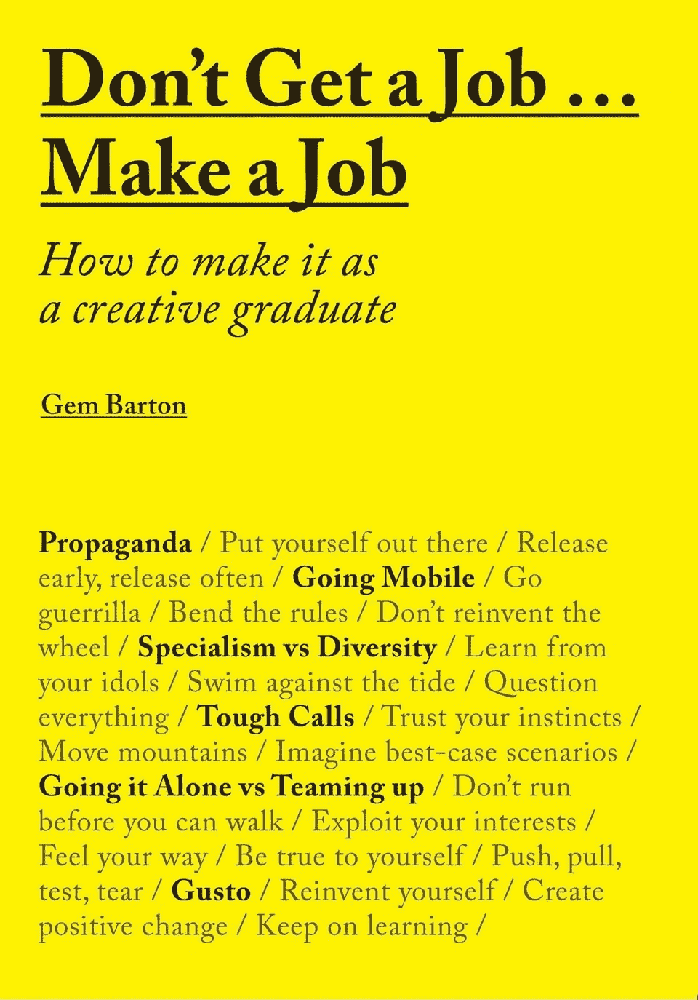

# 对于理想的工作，照照镜子吧

> 原文：<https://medium.datadriveninvestor.com/for-the-ideal-job-look-in-the-mirror-46c4a02918fd?source=collection_archive---------15----------------------->

找到一份好工作总是很难的。在像现在这样的危机中，想要得到一个就更难了。对一些人来说，这种挑战意味着他们将放弃任何获得梦想角色的想法。

那是一个错误。永远不要放弃那些古怪的目标。坚持尝试足够长的时间，你可能会成功。

# 不要在平常的地方找

但首先，你需要停止在平常的地方寻找。如果这样的理想工作曾经存在于一家公司内部，那么它们几乎肯定不会出现在展示广告中，也不会张贴在招聘公告栏上。

那么你应该怎么做呢？你应该在哪里寻找理想角色？

试试镜子。没错！看看你自己。

这是英国一位大学教授的看法。她写了一本关于毕业生如何塑造自己理想角色的书。杰姆·巴顿的《不要找工作……创造一份工作:如何成为一名有创造力的毕业生》于 3 月出版。

 [## 为您的职业生涯提供机器人保护|数据驱动型投资者

### 随着生产率的提高和巨大的利润，企业转向自动化来简化他们的…

www.datadriveninvestor.com](https://www.datadriveninvestor.com/2018/11/20/robot-proofing-your-career/) 

这个标题是不言自明的，但是不要错误地认为如果你不在或者没有进入一个所谓的创造性领域，就没有什么可以学习的。这里有很多东西可供每个人学习。正如你所期待的，这本书主要面向设计和创意专业人士，布局非常漂亮。

# 走自己的路

巴顿的书包含了一系列人物简介，以及同一批人写的文章，他们冒险按自己的方式做事。他们创造了自己的工作和公司。值得一提的是，每个人的侧写方式是不同的。正如他们在电视上说的，没有人在黄金时间开始；因此，记录在案的一些初步措施是适度的。

但是这些人真的做到了。他们走出去，让事情发生。

以下是我发现的一些鼓舞人心的评论。

> *为未来的自己写几份“假”简历——精心制作，让你的雄心壮志尽情发挥，设计一些未来………你会清楚地知道自己想做什么，不想做什么。—希门尼斯·莱*
> 
> *成功在于实现你自己的期望，而不损害你的价值观。—威建筑智库*
> 
> 我认为如果你要做某事，你应该把它做好。有足够多的人只想蒙混过关。—汤姆·塞西尔
> 
> *互联网让我可以做一些古怪、复杂、困难的工作，这些工作仍然有观众，而不需要为了“市场”而降低任何东西的质量—阿丹·纳撒尼尔·弗曼*

如果脱离公司的想法太可怕，那么除了阅读这本书，也许也是时候记住我的前同事、作者兼企业家詹姆斯·阿尔图彻多次指出的:事实是，工作只会给人安全感的错觉。

这是一个故事的编辑版本，首次发表于 2016 年 4 月 4 日的《Forbes.com》。