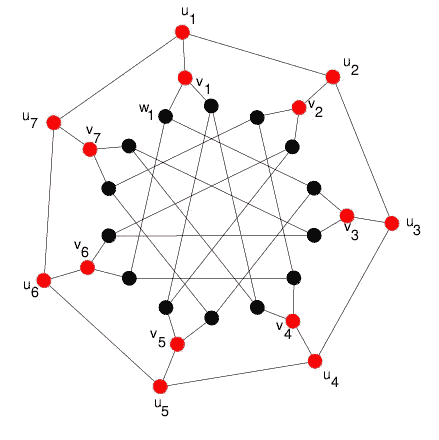

# 为什么算法比数据科学更重要

> 原文：<https://medium.datadriveninvestor.com/for-the-love-of-algorithms-c799065ae572?source=collection_archive---------16----------------------->

## 有时候我会想，为什么算法没有数据科学出名？

## 什么是算法？

算法是计算机科学最古老的分支之一，已经存在了几十年。它是对解谜以及你能多快解出谜题的研究。这些问题通常来自现实生活中的问题，从生物和地理领域到数据科学和区块链。

Source: ResearchGate

起初这听起来可能不太重要，但想象一下，你有 5 家医院的预算，你必须在一个城市的 5 个战略位置建立这些医院，这样每家每户都在至少 3 家医院的 5 公里半径内。你会如何安置他们？

现在这需要一些挠头。现在想象同样的问题扩展到一万家医院和五千个城市。问题很快变得无法控制。对于小尺寸，这对于个人或计算机来说通常是容易解决的，但是对于个人来说是不可能的，并且当输入变大时，计算机需要很长时间来解决。

## 真正聪明的人会这么做

算法需要勇气和一些疯狂的聪明。一些真正聪明的人投入他们的时间和精力去解决这样的问题。解决一个这样的问题通常需要几天、几个月甚至几年的时间。人们需要想出从二进制转换到线性代数到问题简化(内核化)的怪异想法来想出解决方案，而这种解决方案的结果简直是不可思议。

> 我遇到过一个这样的问题，计算机花了一天多的时间来解决它所需要的东西。在应用缩短算法(将一个问题简化为仅复杂的部分)后，计算机在 24 秒内解决了它。

## 算法可以很棒

我想这给了你一个好算法是多么不可思议的想法。蛋白质折叠的问题以及为什么我们仍然找不到治愈癌症的方法在于算法的缺陷。我们仍然找不到足够快的算法来解决这个问题。

 [## 算法诱人的商业逻辑

### 某些机器行为总是让我感到惊讶。我对他们从自己的成就中学习的能力感到惊讶…

www.datadriveninvestor.com](https://www.datadriveninvestor.com/2019/03/22/the-seductive-business-logic-of-algorithms/) 

计算机科学中最大的问题之一，“证明 P=NP”仍然是一个公开的问题，解决它的人将获得 100 万美元的奖金。你可以在这里找到更多关于它的信息——https://www.youtube.com/watch?v=YX40hbAHx3s

## 结论

这就是算法有多不可思议，它能给世界带来什么不同。算法带来了难题，有些甚至超过了数据科学。如果你觉得自己特别聪明，试着解决这些问题。如果你成功了，你将取得突破，并在世界范围内受到追捧。来，试试你的运气！

*如果你想了解我更多或者联系我，请在* [*推特*](https://twitter.com/SatyakiMallick) *上联系我。在* [*上关注我 Youtube*](https://www.youtube.com/channel/UCX4hIUW5RpGdnb2YUtSS5kw) *了解我教育历程中的点点滴滴，以及其他我不时发现有用的东西。还有，如果你想了解更多关于算法的内容，可以去看看我的* [*网站*](http://satyakimallick.com) *。*