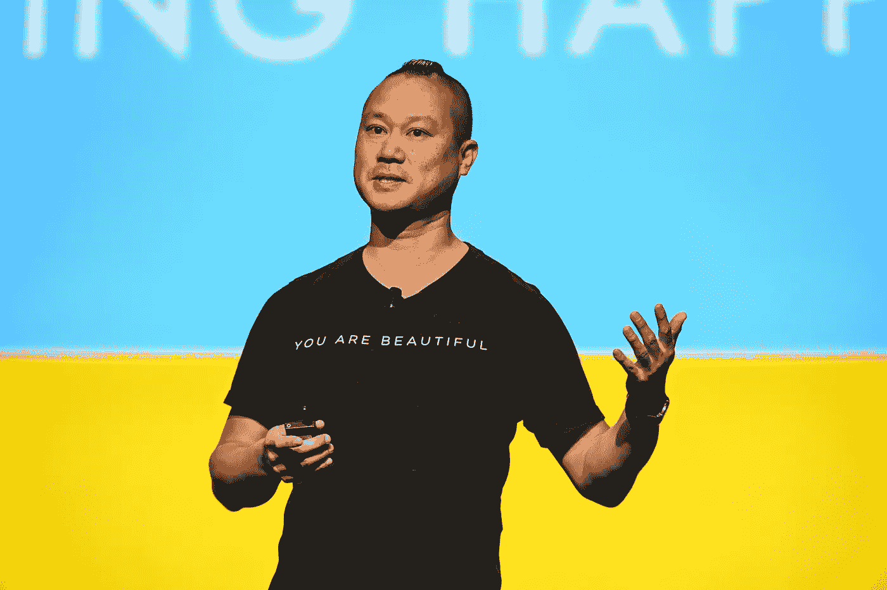

# 剖析——福布斯的谢家华的美国悲剧故事是一个讽刺

> 原文：<https://medium.datadriveninvestor.com/forbes-is-the-american-tragedy-not-tony-hsieh-9877bbd3333c?source=collection_archive---------2----------------------->

## 看一看《福布斯》对谢家华生平的公开剖析，以及为什么新闻媒体选择快速获取，然后正确报道。

Attribution: [National Electrical Contractors Association](https://www.flickr.com/photos/necanet/), Flickr, [Some rights reserved](https://creativecommons.org/licenses/by-nc-nd/2.0/)

到了的时候你读到了[***【福布斯】的故事，***](https://www.forbes.com/sites/angelauyeung/2020/12/04/tony-hsiehs-american-tragedy-the-self-destructive-last-months-of-the-zappos-visionary/?sh=2f2164994f22) 它已经变得病毒式传播。为什么不会，一个技术亿万富翁死于火灾，没有遗嘱，人们想知道他的钱会去哪里，或者我们想知道？

对于福布斯、其作者、编辑和公司股东来说，这是一个物有所值的故事。这个故事目前已经有 865089 次阅读。

> 当他的父母还沉浸在悲痛中时，福布斯发表了一篇评论。

自从《福布斯》的故事之后，它催生了许多模仿者。其他人也纷纷效仿《福布斯》的做法。我们需要越挖越深，直到到达地狱的深渊，因为公众有权知道。

# 福布斯——从致敬到打倒

> 几天前，我目睹了一个家庭如何在疫情年埋葬他们的死者。一个朋友的侄子死于癌症。一个 17 岁的年轻人，因为疫情，这对家庭和我们来说伤害更大，我们看到他成长为一个充满梦想和潜力的年轻人。
> 
> 这是一个会让你流泪的景象，这是福布斯的作者和编辑在发表他们对谢家华的评论之前应该考虑的。

像许多人一样，当我第一次读到谢家华去世的消息时，我感到震惊。这让我很难过，即使我只知道托尼是技术摇滚巨星，捷步达康背后的家伙，那个传递快乐的人。

 [## 庆祝谢家华

### 如你所知，我们的联合创始人谢家华于 2020 年 11 月 27 日安详辞世，身边陪伴着他挚爱的……

www.deliveringhappiness.com](https://www.deliveringhappiness.com/celebrating-tony-hsieh) 

> 每一个死亡都是令人悲伤的，但今年，死亡像小偷一样在夜里降临，让每个人都震惊不已。

我只能想象谢家华的家人的痛苦，他的父母最明显，因为他们悲痛他的死亡，失去了一个儿子。福布斯迫不及待地向世界分享他们认为对公众来说至关重要的事情，他们在谢家华去世七天后对他的生活进行了公开解剖。

## 福布斯的美国悲剧——正确的死亡

如果你读过《福布斯》的故事，他们的勘误表包括他们是如何混淆了兄弟和父亲的。这只能说明[作家、](https://twitter.com/AngelAuYeung)编辑和出版商是多么的鲁莽。他们想不惜一切代价成为第一，他们做到了第一，这不是因为新闻业或诚信，而是因为福布斯降到了小报报道的 ***地狱般的境地。***

## 《福布斯》——谢家华生平剖析

> [**谁做尸检？**](https://www.hopkinsmedicine.org/health/treatment-tests-and-therapies/autopsy#:~:text=Autopsies%20ordered%20by%20the%20state,always%20done%20by%20a%20pathologist.) 做尸检的法医是医生，通常是病理学家。临床尸检总是由病理学家完成。

当一个人阅读尸检报告时，它是基于事实和科学的。尸检报告包括死因、死亡时间、标本性质，以及必要时移交给警方的物品。

大多数情况下，验尸或尸检报告是为了结束，排除任何疑问，对家属来说，这是他们需要跨越悲伤过程的另一个痛苦的步骤。

公开解剖一个人的生命，这是缺乏科学依据的。这完全是一种猜测，为某个名人做公开尸检的人根据人们讲述的关于死者的真相和谎言精心挑选，形成了一种叙事。

即使一个故事是基于采访，它也不会讲述一个完整的故事。我不会说这是编造的，但谈话是观点。对某人对事件的观点和回忆的描述，当一个人试图回忆过去的事情时，大脑会耍花招。这是一个 ***的叙事谬误。***

## 福布斯哪里搞错了——真正的朋友，不要和媒体说。

对《福布斯》来说，谢家华正在进行数字戒毒，他们能够获得朋友之间一封私人信件的副本。他们得到珠宝公司的许可了吗？在这篇报道中，朱厄尔拒绝对“发表任何进一步的评论。没有事后隐私，没有当 ***新闻媒体想深挖的时候。***

## 守望宝石的美丽[为谢家华挽歌；](https://www.youtube.com/watch?v=GxqeOwVl0IQ)

摘自— [***谢家华的美国悲剧:Zappos 远见者的自我毁灭的最后几个月***](https://www.forbes.com/sites/angelauyeung/2020/12/04/tony-hsiehs-american-tragedy-the-self-destructive-last-months-of-the-zappos-visionary/?sh=2f2164994f22)

> 自那以后的日子里，自十年前史蒂夫·乔布斯(Steve Jobs)去世以来，人们对一位商业领袖倾注的悲痛是前所未有的。从比尔·克林顿到伊万卡·特朗普，再到杰夫·贝索斯，成千上万的人参与分享这位广受爱戴的人的记忆、照片和视频，保留了这位科技企业家的遗产，他不仅影响了他的同行，还影响了他的员工，甚至是完全陌生的人，每个人都讲述了异常慷慨、人性和愿景的故事。

# 福布斯的美国悲剧始于他们对谢家华的贬低。

*   谢霆锋私下处理精神健康和上瘾的问题。《福布斯》只需要采访 20 位“朋友”和同事，就可以认定谢家华有精神问题。我不知道福布斯有临床心理学执照。
*   一向嗜酒如命的谢霆锋开始频繁使用毒品，尤其是氧化亚氮。什么构成了有人被称为酗酒者，有没有什么关于谢家华“酗酒”的故事会佐证这种说法？频繁吸毒也一样，有多频繁就是多频繁。在一项研究中，**被用于治疗神经性疼痛。**
*   **朋友们还提到了精神健康的问题，因为谢霆锋经常与睡眠和孤独的感觉作斗争。
    哦，福布斯，有一个词专门用来形容与睡眠抗争的人——失眠症患者，或者经历失眠的人。然而，睡眠障碍是一个严重的医学问题。这个星球上的每个人都会经历孤独，但我不会像福布斯那样进行诊断，因为我不是心理学家。**
*   **到了 8 月，有消息称他已经从自己一手打造的公司“退休”。
    对我使用双引号的法术恶毒。谢家华于 8 月份从 Zappos 退休，除非是直接引用消息来源或更多关于退休的故事。你可以谷歌更多关于美联社标点符号指南的信息。**
*   *****谢朓性格有瘾，20 多岁就沉迷于思想。*** “成瘾人格不是真正的精神病学诊断，”休斯顿德克萨斯大学健康科学中心成瘾神经行为研究中心医学主任[迈克尔·韦弗医学博士](http://“Addictive personality is not an actual psychiatric diagnosis,” says Michael Weaver, MD, medical director of the Center for Neurobehavioral Research on Addiction at the University of Texas Health Science Center at Houston. “Personalities are very complex, and while there’s not one specific type that’s more prone to addiction than others, there are several factors that can combine to make you more likely to become addicted.”)说。“性格非常复杂，虽然没有一种特定类型比其他类型更容易上瘾，但有几个因素结合在一起会使你更有可能上瘾。”—此处阅读全文[。](http://“Addictive personality is not an actual psychiatric diagnosis,” says Michael Weaver, MD, medical director of the Center for Neurobehavioral Research on Addiction at the University of Texas Health Science Center at Houston. “Personalities are very complex, and while there’s not one specific type that’s more prone to addiction than others, there are several factors that can combine to make you more likely to become addicted.”)
    沉迷于想法有什么错，创业公司的创始人就是这样通过他们的想法创新的？**
*   *****他试验了一种革命性的——有人会说是无政府主义的——版本的一种“***[***holacracy***](https://en.wikipedia.org/wiki/Holacracy#:~:text=Holacracy%20is%20a%20method%20of,vested%20in%20a%20management%20hierarchy.)***”管理哲学，在 Zappos 没有任何人向任何人汇报，也没有任何头衔。(这并没有奏效:七分之一的员工接受了买断。)*** 在他活着的时候，谢家华的管理哲学是[天才的火花，](https://twitter.com/profgalloway/status/1332564295234752512?s=20)Zappos 的成功也是无可争辩的。称之为无政府主义，又一次是企图败坏托尼的名声。**
*   **但是他的创意似乎也有黑暗的一面。在 2013 年和 2014 年的 18 个月中，三名与市中心项目相关的初创公司创始人自杀身亡。一些人认为死亡与倡议的压力有关。
    作者与这些人交谈过？再说一遍，尽管三位创始人确实死于自杀是事实，但这一点***‘暗示’***是一个谢家华无法再争辩的结论。当我们谈论 ***心理健康和自杀时，我们都应该小心。*****
*   *****“即使我们在 TED 看到他，他也会跳过演讲，主持深夜节目。而我们会在 9:30 上床睡觉。”这太容易了，所以我们都需要在九点半之前上床睡觉。否则，当我们死了，这就成了一个问题。*****
*   **他们对幸福的定义已经改变——谢霆锋的几个朋友也有同感，他们说他们已经结婚成家，而谢霆锋仍然是一个极其富有的彼得潘。
    [比莉·埃利什](https://www.billboard.com/articles/news/9465132/billie-eilish-racy-photo-cryptic-message)在她的 [Instagram 帖子、](https://www.instagram.com/p/CGTqSWvFXCG/?hl=en) ***“你真的想回到过去吗？”*** 除非我们时光倒流，否则朋友或者任何一个正派的人都不会说出以上任何一句话。*谢家华当时 46 岁，从未结过婚。***

**[尼克·斯温穆恩](https://medium.com/u/c0e66efdaed5?source=post_page-----9877bbd3333c--------------------------------)在《福布斯》的故事中被引用， ***“他告诉我，他的朋友们越来越年轻。他似乎对此很兴奋。”*** 然而，当你读到尼克·斯温默恩写给谢家华的颂词时，那是在一个个人故事的背景下。然而，通过精心挑选那句台词，它创造了 ***谢家华扮演彼得潘的典故。*****

** [## 撕裂托尼

### 我第一次见到托尼是在我与潜在 A 轮投资者会面的最后一站。到那时为止的会议已经…

nickswinmurn.medium.com](https://nickswinmurn.medium.com/rip-tony-6e99695ae3de) 

*   谢霆锋转变为捷步达康的创意人尼克·斯温穆恩(Nick Swinmurn)说，他已经和谢霆锋失去了联系，从去年开始就没和他说过话。
    今年对我们所有人来说都是一个挑战，也许对福布斯的人来说不是，对我们的家人和朋友来说也是。考虑到 2020 年对我们所有人来说都是充满挑战的一年，以这样一种方式表达出来，他们已经有一年没有联系了。

 [## 离岸？创业的 5 个关键原则|数据驱动的投资者

### 在 Tau Ventures，我们投资了完全在美国的初创公司，首席执行官在美国，其余的在美国

www.datadriveninvestor.com](https://www.datadriveninvestor.com/2020/11/22/offshoring-5-key-principles-for-startups/) 

## 《福布斯》做对了一件事:

> 谢家华，一个用他对生活的热情激励了数百万人的人，似乎没有任何死亡的打算。验尸官已经宣布他是意外死亡。

## 此外，《福布斯》刊登的家庭声明是由他的父亲谢伟邦发表的，而不是最先报道的谢家华的兄弟。

> “我们非常感谢托尼去世后人们流露出来的爱和尊重，没有人不爱上托尼的人性，这就是为什么这么多人心碎。”——理查德·谢，谢家华的父亲，在给福布斯的一份声明中。

## 福布斯发布勘误表；

> 更正:谢霆锋是谢家华的父亲，而不是之前所说的他的兄弟。此外，这个故事已经更新为声明谢家华将汽车经销商的一部分变成了创业孵化器，而不是整个财产。

他对谢家华生平的公开解剖是福布斯的耻辱。
这就是我们现在生活的世界的问题，令人担忧，尤其是我们如何讲述新闻，如何消费新闻。我们现在就想要它，即使我们还没有掌握所有的事实。我们奖励最先理解的人，而不是理解正确的人。

谢家华的死很快就会成为旧闻，新闻媒体知道他们必须尽快行动，否则就会错过，甚至不惜牺牲真相。

将谢家华之死视为美国悲剧是一个标题，这个标题让这个故事迅速传播开来。

> ***《福布斯》公布了一封来自*** [***阿尔弗雷德·林的信，他的大学同学，也是 LinkExchange、Venture Frogs 和 Zappos 的前同事。***](https://www.forbes.com/sites/alexkonrad/2020/12/01/my-final-letter-to-tony-hsieh-by-alfred-lin/?sh=2574570f239b) ***它只获得了 4 万的浏览量，相比之下，福布斯的 takedown story 却有超过 80 万的浏览量。***

 [## 我给谢家华的最后一封信

### 畅销书作家、电子商务先驱 Zappos.com 前首席执行官谢家华去世，享年 46 岁

www.forbes.com](https://www.forbes.com/sites/alexkonrad/2020/12/01/my-final-letter-to-tony-hsieh-by-alfred-lin/?sh=2574570f239b) 

但这是一个了解谢家华的人的美丽的致敬。在那封信中，他提到 ***【美女*** 曾是托尼最喜欢的电影。

M 在充满不确定性的一年里，我们每个人都遭受了痛苦；我们许多人仍然困惑。对一些人来说，未来看起来很黯淡。幸运的是我们还在这里。

2020 年的某一天将成为人们记忆中数百万人死于冠状病毒的一年，这种病毒导致了新冠肺炎，这种疾病仍在世界范围内蔓延。今年从我们身上带走了太多。

他们所要求的只是哀悼的时间，然而福布斯和其他新闻媒体却听不进去，他们很清楚一个悲伤的家庭没有力量去争论新闻上的内容。

对福布斯来说，谢家华是一个故事。他的死意味着观点，眼球，喜欢，分享。如果他们现在不发表这个故事，托尼下周就会被遗忘，新闻媒体不会罢休，直到他们发表一个耸人听闻的故事。

虽然《福布斯》将托尼的死描述为疫情的又一个牺牲品，但这对他的家庭来说是真实的损失。

谢家华[死于意外吸入烟雾的并发症](https://www.channelnewsasia.com/news/world/zappos-tony-hsieh-smoke-inhalation-complications-cause-of-death-13673848#:~:text=NEW%20LONDON%2C%20Connecticut%3A%20Tony%20Hsieh,46%2C%20was%20ruled%20an%20accident.)。他的死亡被裁定为意外，故事应该结束了，他的家人被给予了悲伤的隐私。

他的过去应该被遗忘；他不再是一家可能需要审查的公司的一部分。上市公司亚马逊拥有 Zappos。

在他的死亡中，谢家华是一个 46 岁的男人，他意外死亡，一个悲惨的死亡，但他的生活远非福布斯所描绘的美国悲剧。

> 死就是死，悲就是悲。

他去世几天后，世界各地的悼念应该在某种程度上减轻了他家人的痛苦，因为他的朋友、同事，甚至陌生人都记得谢家华。

> [**谢家华**](https://www.inc.com/bill-murphy-jr/tony-hsieh-had-a-2-word-employment-policy-at-zappos-it-was-absolute-genius.html) 是一位领袖和作家，一位[极具远见的](https://edition.cnn.com/2020/11/28/us/tony-hsieh-zappos-dies/index.html) — [CNN](https://medium.com/u/374a801b3eb2?source=post_page-----489091573fa5--------------------------------)

 [## 快乐大师、畅销书《传递快乐》的作者谢家华去世，享年 46 岁

### 任何从谢家华 Zappos 买鞋的人都是它的前任 CEO 他把它从零发展成为一个十亿美元的公司，当…

medium.com](https://medium.com/geekd/tony-hsieh-happiness-guru-author-of-the-bestselling-delivering-happiness-dies-at-46-489091573fa5) 

## 来自亚马逊的 J[eff be zos](https://www.instagram.com/jeffbezos/)；

> 这个世界太快失去了你[@唐顿托尼](https://www.instagram.com/downtowntony/)。你的好奇心、远见和对客户的不懈关注会留下不可磨灭的印记。很多人会想念你的，托尼。安息吧。

人类的尊严要求社会在情绪高涨的今年更加尊重死者。这位作家在推特上推文，“ ***安息吧，托尼，”*** 但他的灵魂怎么可能安息，他的家人，怎么可能从福布斯故事的所有痛苦中安息呢？

> 托尼，在天堂安息吧

我们的生活由选择和决定组成。从我们的选择，我们的生活采取不同的颜色和色调；美好的生活并不意味着没有错误和错误决定的生活。

在他的人性中，谢家华尽他最大的努力去过有意义的生活，并且他成功了。在他的一生中，他被视为一个疯子，而在另一个天才史蒂夫·乔布斯的眼中，谢家华是 [*疯狂到足以*](https://www.youtube.com/watch?v=GEPhLqwKo6g&feature=emb_logo) 认为他可以改变世界，而谢家华做到了。

## 苹果的与众不同——[史蒂夫·乔布斯](https://www.youtube.com/watch?v=GEPhLqwKo6g&feature=emb_logo)

> 为疯狂的人干杯。不合群的人。叛军。麻烦制造者。方孔里的圆钉。那些看待事物不同的人。他们不喜欢规则。他们不尊重现状。你可以引用他们，不同意他们，赞美或诋毁他们。你唯一不能做的就是忽略它们。因为他们改变了一切。他们推动人类前进。虽然有些人认为他们是疯子，但我们认为他们是天才。因为那些疯狂到认为自己可以改变世界的人，才是真正改变世界的人。

## 访问专家视图— [订阅 DDI 英特尔](https://datadriveninvestor.com/ddi-intel)**