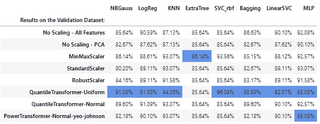
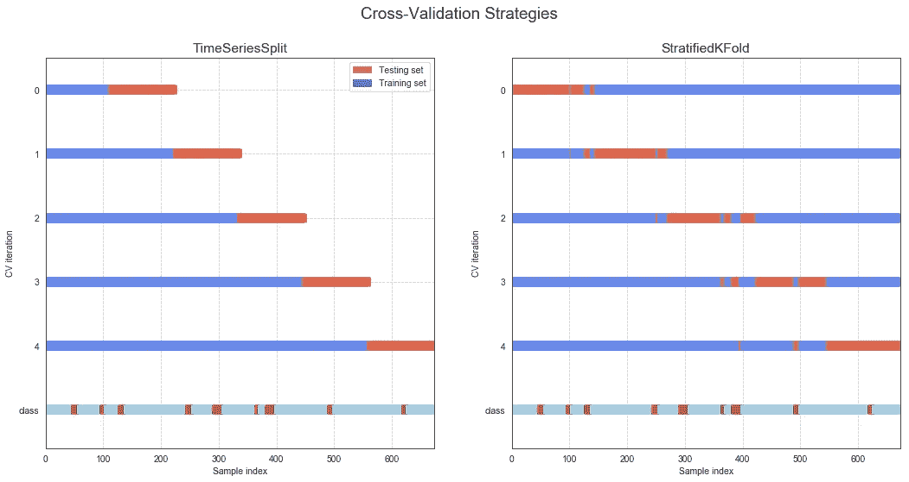
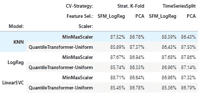
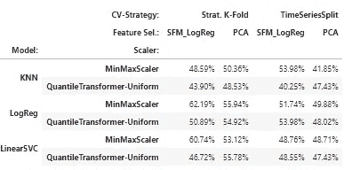
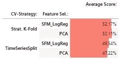
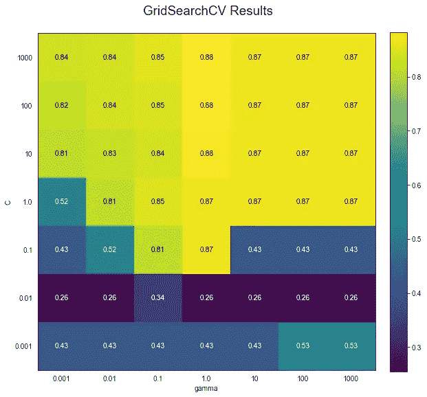
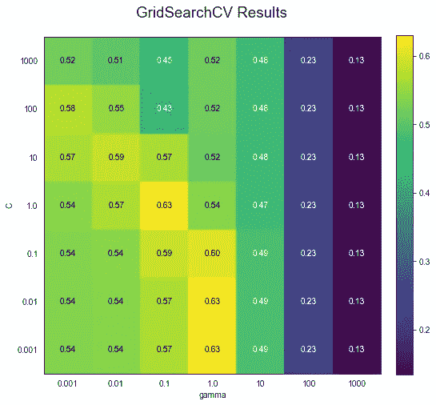

# 预测美国的经济衰退

> 原文：<https://medium.datadriveninvestor.com/forecasting-a-recession-in-the-usa-13daf54725f5?source=collection_archive---------13----------------------->

Photo by [Ryan Wallace](https://unsplash.com/@accrualbowtie?utm_source=unsplash&utm_medium=referral&utm_content=creditCopyText) on [Unsplash](https://unsplash.com/s/photos/road?utm_source=unsplash&utm_medium=referral&utm_content=creditCopyText)

# 第五章:

# 交叉验证。

## 故事到此为止

在这项研究的第一部分，我分析了为什么衰退是重要的，以及它们如何影响股票市场的回报(S&P500)。第二章的重点是数据集及其 EDA 的创建。在第三部分中，我处理了降维问题，列出了两种策略(SelectFromModel with logistic regression 和 PCA ),稍后将在 ML 管道的构建中使用。在第四章中，我探讨了数据缩放策略，在分析的最后，我选择了一组用于分析的缩放器(分位数转换器和最小最大缩放器)。现在，在这一章中，我将列出在这项研究中使用的最佳交叉验证策略，概述隐藏在这一步骤中的问题和挑战。交叉验证策略是最基本的，因为它是微调模型过程中的一个关键组成部分，也是了解它们如何很好地概括数据的关键。

## 索引:

5.1 交叉验证——问题；
5.2 交叉验证—解决方案；
5.3 交叉验证——策略测试；
5.4 交叉验证和超参数；
5.5 结论。

# 5.1 交叉验证——问题

在前一章的最后，我分析了一些模型在验证数据集上的泛化性能。我为数不多的几个读者中的一些人可能会看到非常高的验证分数(在表 1 中再次提出)而跳起来，开始建立一个依靠这些模型预测衰退的宏观对冲基金。没那么快。如果我只是运气好(或者运气不好，也许结果最终会更好)呢？

Tab.1: Stellar Results… let’s trade! … no, wait…

当我在训练集和验证集之间拆分数据集时，即使它是随机的，结果也可能是非常容易分类的验证集。或者，更糟糕的是，由于我正在处理一个不平衡的数据集(只有 14%的数据是衰退)，如果验证集没有或只有很少的衰退观察值，该怎么办？如果我的评估集根本没有衰退，我如何评估模型发现衰退的能力？

此外，对于数据库中数据的性质也有一些考虑:时间序列。对于时间序列数据，在分割数据时必须特别小心，以防止数据泄漏。例如，如果 60 年代的数据被保留用于验证目的，而我使用 50 年代和 70 年代的数据来拟合模型，我本质上是在泄露“过去”的信息。70 年代的数据可能包含 60 年代没有的功能交互信息。一个合适的时间序列交叉验证框架应该考虑现实世界的预测条件，其中数据科学家站在现在，未来是未知的。那么预测者必须保留所有关于未来按时间顺序发生的事件的数据来拟合模型。

总而言之，对于这项研究，在交叉验证策略中，必须考虑两个主要问题:

1.  *不平衡数据集*:可能我们的验证集只有很少或没有属于少数类的观察值；和
2.  *信息泄露*:来自未来观测的信息不能传递给过去的验证集。

**目标**:在这一章，我的目标是找出评估机器学习算法的最佳交叉验证策略。

# 5.2 交叉验证—解决方案

为了解决上面提到的两个问题，采用的第一个交叉验证策略是 SCiKit-Learn 提供的 **TimeSeriesSplit** 。这是一个特定的交叉验证器，适用于时间序列。假设执行了 N 重交叉验证，那么交叉验证迭代将看起来像下面的路径:

*   折叠 1:培训[1]，测试[2]
*   折叠 2:训练[1，2]，测试[3]
*   折叠 3:训练[1，2，3]，测试[4]
*   折叠 4:训练[1，2，3，4]，测试[5]
*   …………
*   fold N: training [1，2，3，4，5，… N-1]，test [N]

应用在我正在使用的数据集上，这个过程可以表示为左边的图 1。前五个条形(0-4)代表 CV 倍数，而底部的条形是目标变量(衰退时期用棕色标记)。这种方法完全解决了“信息泄露”问题。在每次 CV 迭代中，所有的训练数据集都在验证集之前。不幸的是，第一个问题只得到部分解决。褶皱 0、3 和 4 在它们的验证集中有很少的衰退期。例如，第三个验证集只捕捉了 90 年代早期特别温和短暂的衰退。即使将折叠次数从 5 次减少到 3 次也没有多大帮助。最后一个折叠验证样本将只涵盖 2001 年的衰退。

Pic.1 — Comparison of Cross-Validation strategies.

可以考虑的另一种方法是**分层交叉验证**。它类似于基本的 CV 方法，但它确保每个验证集具有与整个样本相同的少数类(衰退)频率。这种方法的图示如右图 1 所示。这样，任何估值集都会有大约 14%的样本处于衰退期。遗憾的是，这里的信息泄露问题完全被忽略了。

为了理解这两种策略之间的权衡，将使用训练数据集在一些模型上测试这两种 CV 方法。特别是，我将尝试评估“信息泄露”问题的影响。

 [## 机器学习和人工智能如何改变电子商务的面貌？|数据驱动…

### 电子商务开发公司，现在，整合先进的客户体验到一个新的水平…

www.datadriveninvestor.com](https://www.datadriveninvestor.com/2020/11/19/how-machine-learning-and-artificial-intelligence-changing-the-face-of-ecommerce/) 

# 5.3 交叉验证—策略测试

为了分析这两个 CV 策略，现在有必要将这些步骤组合到一个管道中。这将简化代码。因此，交叉验证将应用于以下序列:

*   *数据缩放* —最小最大缩放器和量化转换器-统一
*   *特征选择* —用随机森林和 PCA 从模型中选择。
*   *测试车型* : KNN、物流回归和线性回归。

如前所述，测试了两种 CV 策略:

*   *时间序列分段交叉验证*；和
*   *分层交叉验证*。

## 测试客户价值策略

下面，我用 Python 重现了测试两个 CV 策略的主要步骤和相关代码。

*   首先创建用于数据缩放、特征选择、测试模型和交叉验证策略的字典:
*   生成存储结果的多索引数据帧:
*   现在测试交叉验证策略。结果在创建时存储在数据帧中:

结果在表 2 中报告:根据准确度得分，所用策略之间似乎没有显著差异。如果我根据这些数据得出结论，我会倾向于推断从未来数据中泄露的数据是不相关的。然而，考虑到下一章的主题，当处理受不平衡类影响的数据集时(扩展数超过衰退数，比例为 8:1)，准确性可能会完全误导人。

Tab.2 Results using accuracy: no sign of information leaking…

为了了解在我们的案例中有多少准确性会产生误导，现在使用平均精度度量来评估模型的性能，从而实现了两个 CV 策略。结果报告在下表中:

Tab.2 Results using Average Precision: information leaking gotcha!

Tab.3 — Average Results

如表所示，平均精度度量讲述了一个完全不同的故事:来自未来观测的信息泄漏确实存在！当考虑平均数据时，见表 3，无论采用何种特征选择模型，使用分层 K 倍的模型都优于使用时间序列分割方法的相同模型。当使用逻辑回归模型选择特征时，总体影响是平均精度度量提高约 3%,当使用 PCA 时，总体影响是平均精度度量提高 5%。

# 5.4 交叉验证和超参数

交叉验证对于评估模型概括数据的能力非常有用。下一步是通过调整超参数来提高模型的泛化性能。这里，再次使用单个验证集来实现这个目标，这将使流程暴露于该子集的特定风险性质。以与上述相同的方式使用交叉验证提供了一个合理的框架来微调模型。因此，当我继续微调一个模型时，将使用 SciKit-Learn 库提供的 **GridSearchCV** 函数。GridSearchCV 函数在交叉验证过程中，根据各种参数组合为算法计算评分指标。最后，它返回最佳的超参数集，这些超参数集概括了验证集的预测。我将在这里探索一个超参数微调的简化示例。使用的管道由以下步骤组成:

*   缩放器:量化转换器—统一
*   特征选择:PCA — 16 个特征；
*   模型:带 RBF 核的 SVC 和
*   评分标准:准确性。

我将尝试使用两个超参数来调整模型:

1.  **C** =正则化参数；和
2.  **Gamma** :内核参数。

交叉验证方法:

*   策略:时间系列
*   拆分次数:5 次。

实现分析的代码如下:

分析表明，当参数设置为:

*   **C** = 100
*   **伽玛** = 1.0

因为我只处理两个参数，所以我也可以用一个矩阵来表示结果(图 2)。它显示了参数网格中的所有交叉验证结果:

Pic.2 GridSerachCV results using accuracy

GridSearchCV 的另一个重要特性是可以定义用户希望最大化的分数。默认情况下，函数使用精度。然而，这种度量对于所有类型的问题都不理想，不同的度量可以产生不同的结果。我将在下一章彻底探讨评估指标问题。尽管如此，在这一章中，我将展示 GridSearchCV 的结果是如何受到不同评估指标的影响的。例如，通过将得分函数更改为平均精度，我获得了以下结果:

*   **C** = 0.001
*   **伽玛** = 1.0

变化真大！正则化参数从 100 更改为 0.001。同样，我提供了一个图形表示:

Pic.3 GridSerachCV results using Average Precision.

# 5.5 结论

未来数据中的信息泄漏是一个可能导致分析无效的主要问题。此外，关于由数据集的不平衡性质引起的问题，尽管各褶皱间少数类观测值的数量不均匀，但当使用 TimeSeriesSplit-CV 时，每个褶皱都有一些少数类样本。基于这两点考虑， **TimeSeriesSplit-CV** 是用于 ML 算法评估目的的最佳策略。为了这项研究的目的，我的分析已经表明**分层 K-Fold** 存在致命的信息泄漏缺陷，并且倾向于高估模型的泛化特性。

该系列的其他文章:

 [## 预测美国经济衰退

### 第一章——导言

medium.com](https://medium.com/datadriveninvestor/forecasting-a-recession-the-usa-d6306adc9540)  [## 预测美国的经济衰退

### 第二章—数据集、特征工程和解释性数据分析(EDA)

medium.com](https://medium.com/datadriveninvestor/forecasting-a-recession-in-the-usa-82988caa556e)  [## 预测美国的经济衰退

### 第三章:

medium.com](https://medium.com/datadriveninvestor/forecasting-a-recession-in-the-usa-62e383c8c5bf)  [## 预测美国的经济衰退

### 第四章:

medium.com](https://medium.com/datadriveninvestor/forecasting-a-recession-in-the-usa-b7cf8de5bcda) 

## 访问专家视图— [订阅 DDI 英特尔](https://datadriveninvestor.com/ddi-intel)