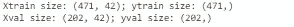
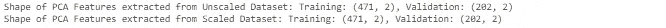
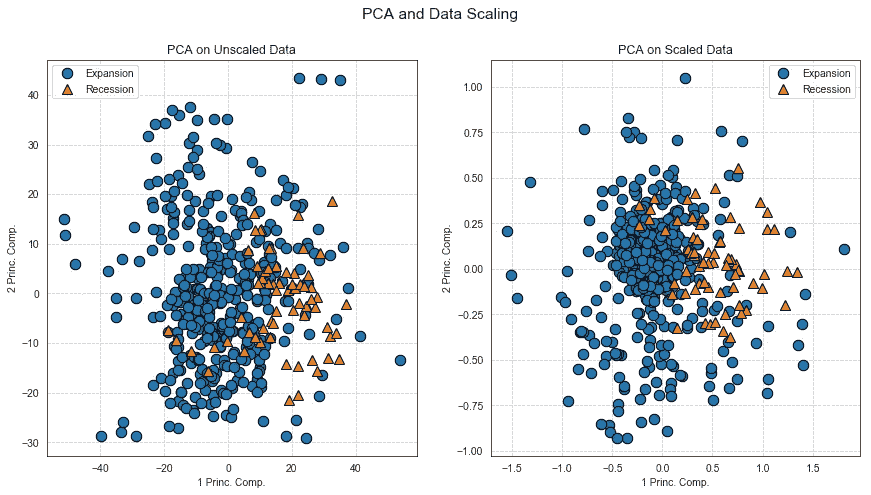
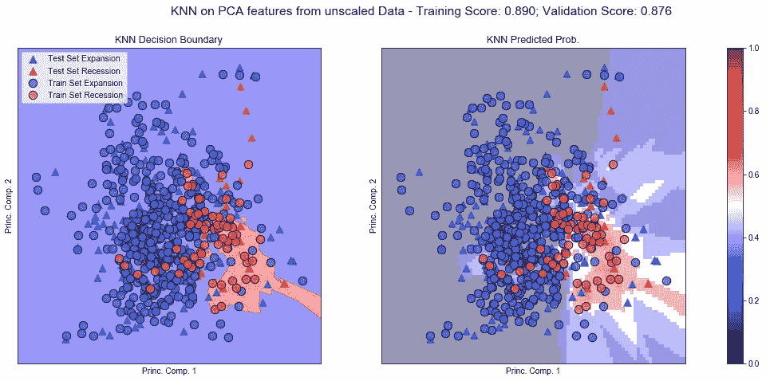
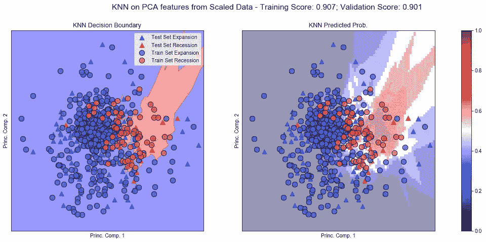
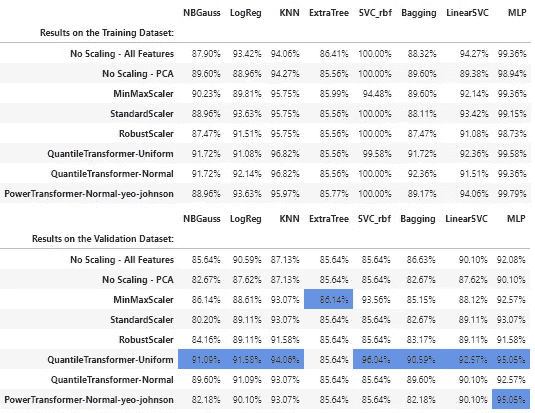

# 预测美国的经济衰退

> 原文：<https://medium.datadriveninvestor.com/forecasting-a-recession-in-the-usa-b7cf8de5bcda?source=collection_archive---------14----------------------->

# 第四章:

# 数据扩展策略。

## 故事到此为止

在这项研究的第一部分，我分析了为什么衰退是重要的，以及它们如何影响股票市场的回报(S&P500)。第二章的重点是数据集及其 EDA 的创建。在第三部分中，我处理了降维的问题，列出了两个策略来实现这个目标(SelectFromModel with logistic regression 和 PCA ),稍后将在 ML-pipeline 的构建中使用。在这一章中，我将探索数据缩放策略。

## 索引:

4.1 数据缩放——概述和目标；
4.2 数据缩放——两个特征的例子；
4.3 数据缩放——测试备选方案；
4.4 结论。

# 4.1 数据扩展—概述和目标

最大似然算法的性能会受到它们所输入的数据量的影响。如果一个特征的级别远远高于其他特征的级别，那么这个特定的特征可以支配所有其他特征。大多数情况下，数据集将包含在量级、单位和范围上变化很大的要素。但是由于大多数机器学习算法在计算中使用两个数据点之间的欧几里德距离，这是一个问题。如果不加处理，这些算法自然会“加重”较大幅度的特征，忽略较小的特征。例如，在数据集中，ISM-PMI 的平均值高于 50，大部分时间得分值在 40 到 60 之间，而所有以百分比计算的特征平均值接近于零，很少超过+/-5%。在距离计算中，幅值较高的要素比幅值较低的要素权重更大。为了抑制这种效应，我需要将所有的特征放在相同的量级上。这可以通过缩放来实现。为了克服这些缺点，测试了 SciKit-Learn 中提供的不同数据缩放方法:

*   标准定标器；
*   量化转换器-统一；
*   量化转换器-正常；
*   PowerTransformer
*   MinMaxScaler 和
*   鲁棒定标器。

作为一般的提醒，一个不详尽的(！)其性能受数据缩放影响的一些 ML 模型的列表如下:

*   线性和逻辑回归；
*   最近的邻居；
*   神经网络；
*   具有径向偏置核函数的支持向量机:和
*   主成分分析。

特别是，由于 PCA 是我在这个项目中选择应用的降维工具之一，因此对数据进行适当的缩放是一个必要的步骤。

**目标**:本章的主要目的是了解在美国经济衰退/扩张期分类中，不同的标度过程对模型泛化性能的影响。这个想法是列出一组策略，在分析的后期嵌入到管道中。

# 4.2 数据缩放—两个特征的例子

为了理解缩放如何提高模型的性能，我首先通过使用 PCA 从原始数据集中仅提取两个特征来实现一个示例。

我实施以下步骤:

*   在导入了本章将要用到的所有库和训练数据集之后，我在训练和验证子集之间拆分了数据(提醒一下，我已经在训练和测试集之间拆分了数据，后者将只在最后用于评估所选模型的泛化属性)。验证集等于整个训练数据集的 30%。

Out.1: Code Output

*   我通过在训练子集上拟合和变换最小最大缩放器来创建新特征的数据框架。然后，使用 PCA 从未缩放的数据集中提取两个新特征，并从未缩放的数据集中提取两个新特征。

Out.2 Code Output

*   关于缩放如何影响分析的第一印象来自于从缩放和未缩放数据中提取的两组特征的散点图的纯粹可视化。就衰退和扩张观察的规模和相对位置而言，这两组特征大相径庭。现在，我通过在两组数据上训练 KNN 分类器，将分析向前推进了一步。

Pic.1 — PCA with 2 features on Unscaled and Scaled Data

*   首先，我训练一个 KNN 分类器，该分类器具有来自未缩放数据集的两个特征的 6 个邻居。然后，将相同的模型拟合到从缩放数据中提取的 PCA 特征上。结果记录在下面的两个图表中。如分数所示，对缩放数据的处理将模型的验证分数提高了 2.5%，从 87.6%提高到 90.1%。尽管相关性较低，但在训练数据集上的性能也略有提高，提高了 1.7%。

Pic.2 — KNN Performance and Graphic Representation when fitted on Un-Scaled date.

Pic.3 — KNN Performance and Graphic Representation when fitted on scaled data.

# 4.3 数据缩放—测试备选方案

下一步是通过在 16 个 PCA 特征上应用更广泛的定标器来概括这种分析。我将在几个 ML 算法上测试缩放器，以尽可能地概括结果，而不是过度依赖特定的模型。

如前所述，将要测试的定标器集合如下:

1.  标准定标器；
2.  分位数-变压器-统一；
3.  分位数-转换器-正常；
4.  PowerTransformer
5.  MinMaxScaler 和
6.  鲁棒定标器。

当这些 ML 算法被用作测试器时:

*   GaussianNaiveBayes
*   物流回收；
*   KNeighborsClassifier
*   树外分级机；
*   SVC，kernel = ' rbf
*   LinearSVC
*   用 GaussianNB 装袋；和
*   MLP 分类器。

首先对这些模型中的每一个进行训练，并在整个未缩放的数据集上测试其性能(表中的**“无缩放-所有特征”**行)。然后，我尝试使用 PCA 从未缩放的数据集中提取 16 个特征，并在其上训练和测试模型(**“无缩放-PCA”**)。这一行应提供对未缩放数据使用 PCA 的负面影响的洞察，以及列表中模型的进一步比较。然后，根据上面列举的六个度量来缩放训练和验证数据集。对它们中的每一个进行 PCA 分析，并提取 16 个特征。然后，在验证集(表中的所有其他行)上对每个模型进行定型和测试。结果在两个表中报告:一个报告训练数据集的分数，另一个最重要的是验证数据的分数。最好的分数用浅蓝色标出。

生成结果的代码如下:

下面是结果表:

Table.1 — Analysis Results

# 4.4 结论

在某些情况下，使用适当的缩放策略可以显著提高验证数据的模型性能。对于具有 RBF 核模型的 SVC，提升超过 10%,对于 KNN 分类器，提升大约 7%。从技术角度来看，与在整个数据集上实现的性能相比，使用从未缩放数据中提取的特征的模型性能更差，但有两种情况。对输出使用均匀边际分布的分位数-转换定标器似乎表现得特别好，而最小最大定标器表现第二好。在所有情况下，最好的分数是在缩放的数据中实现的。分位数转换器性能良好的一个特殊原因可能与我在 EDA 中强调的数据集的一个特征有关:离群值的广泛存在。分位数转换器对于异常值是稳健的，因此它们是缩放数据集的可靠选择。作为一种替代的度量标准，可以考虑使用 MinMaxScaler。

最后，根据分析，为了扩展数据集，我将考虑以下两个步骤:

*   **分位数转换器，对转换后的数据进行均匀的边际分布**；和
*   **最小最大缩放器**。

本章的代码和结果可以在我的 Github 库[这里](https://github.com/fabriziobasso/Data-Scaling-Strategies/blob/master/DataScaling.ipynb)找到。

*感谢阅读！*

— — — — — — — — — — — —

前面的文章:

[第一章:引言](https://medium.com/@fabrbasso/forecasting-a-recession-the-usa-d6306adc9540)

[第二章:数据集、特征工程和解释性数据分析](https://medium.com/@fabrbasso/forecasting-a-recession-in-the-usa-82988caa556e)

第三章:降维:特征选择和特征提取。