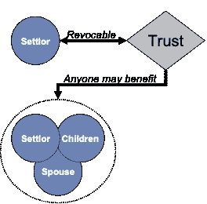
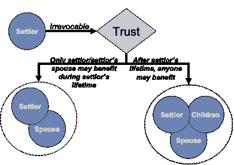

# 外国授权人信托(FGT)和外国非授权人信托(FNGT)——入门

> 原文：<https://medium.datadriveninvestor.com/foreign-grantor-trust-fgt-foreign-nongrantor-trust-fngt-a-primer-3b69434cac51?source=collection_archive---------1----------------------->

当非美国税收居民希望通过信托使美国税收居民受益时，通常会使用 FGT。例如，一名新加坡居民希望创建一个信托基金，以惠及身为美国居民的孙辈。具有 FGT 身份的信托最终必须成为 FNGT，因为在大多数情况下，FGT 的衡量人是财产授予人。

这本初级读本解释了 FGT 规划的特点，FGT 在托管人在世时的税收优势，以及托管人去世后 FGT 的缺陷。从事跨境信托规划时，不仅要考虑美国受益人的美国税收方面，还要考虑托管人和其他非美国受益人管辖区的税法，这一点很重要。FGT 计划可能对 FGT 的美国受益人极具吸引力，但对 FGT 的托管人或其他非美国受益人来说可能是一场税务灾难，*例如*，英国居民建立 FGT 可能会引发高达 20%的英国税费。鉴于考虑 FGT 托管人、受益人和受托人的税务后果的复杂性，考虑信托规划的跨辖区方面并咨询合格的国内税务顾问是至关重要的。

***什么是“外国授予人信托”？***

术语“外国授权人信托”是一个美国术语，意思是信托符合美国税法规定的特定纳税地位。“外国”(即非美国)是指该信托不被视为美国国内信托，因此该信托或其受托人都无需向美国纳税。“授予人”(美国术语“托管人”)指出于美国税收目的资助信托的非美国居民个人。

***FGT 有什么优点？***

利用 FGT 计划的理想情况是，非美国居民在建立信托时考虑到美国居民受益人。典型的优点如下:

托管人/FGT:托管人将只对美国来源收入的某些定义类别缴纳美国税，如美国来源股息(*如*，苹果、亚马逊)。其他类别的美国来源收入，如投资组合利息收入、美国来源的资本收益(不包括美国不动产收益)，通常免于美国税收。如果 FGT 不投资于任何美国资产，那么 FGT/托管人将不会遭受美国税收。简而言之，如果没有托管任何美国来源的资产，FGT/托管人将不承担任何美国税收。

美国受益人:当 FGT 向美国受益人分配资产(现金/财产)时，美国受益人无需缴纳美国税。此外，美国受益人对该结构中的“利润”不负有责任，因此即使 FGT 在托管人的生命周期内增值，也不会归属于美国受益人。美国受益人必须向美国国税局(IRS)报告从 FGT 收到的任何分配，并向 IRS 提供大量有关 FGT 的信息。注意，在某些情况下，FGT 可能向托管人进行分配，然后托管人向美国受益人进行转赠。在这种情况下，美国国税局的申报要简单得多，并且只有当礼物超过每个日历年 100，000 美元时才需要申报。

***如何打造 FGT？***

信托可以是可撤销信托(选项 1)或不可撤销信托(选项 2 ),以符合 FGT 的资格。根据选项 1 或 2，任何适当起草的信托都有资格成为 FGT。希望建立 FGT 的非美国税收居民必须选择:

**选项 1(可撤销信托)**:非常灵活，因为受益人类别中的任何人都可能受益。托管人有权撤销资金，这在某些情况下给托管人带来了更大的安慰。然而，在许多司法管辖区，托管人可能会受到其居住地的当地税收法规的鼓励，进行完整的赠与而非可撤销的赠与(*即*，不可撤销信托，选项 2)。因此，在某些情况下，由于其居住国的规定，托管人可能无法使用备选方案 1 创建 FGT。

**选项 2(不可撤销信托)**:要成为该选项下的 FGT，信托必须是不可撤销的，并且只有托管人或托管人的配偶可以在托管人的有生之年从 FGT 中受益。由于这种限制，选项 2 经常使家庭感到困惑，但是，美国税务方面允许 FGT 首先向托管人进行分配，然后让托管人向美国受益人赠送礼物。然而，与选项 1 类似，必须考虑托管人进行赠与和/或创建不可撤销信托的当地税务后果。

***FGT 的缺点是什么？***

不幸的是，FGT 的优势不会永远持续下去:当 FGT 的托管人去世时，理想的美国税收待遇也就结束了。去世后，FGT 成为外国非赠与人信托(“FNGT”)。为信托的 FNGT 阶段做计划也很重要。家庭往往只考虑 FGT 期(*即*，税收优惠期)，而没有考虑 FNGT 对美国受益人的美国税收后果。因此，我们必须考虑 FGT 和 FNGT 时期的计划。

对我们这些 FNGT 的受益者来说，有哪些问题？

托管人去世后，需要仔细规划，以确保美国受益人在受益于 FNGT 时不会遭受大量美国税收。美国对 FNGTs 征税的基础并不难。有两种级别的美国税收可以适用。

1.  累积分配规则(又名追溯税)。不管 FNGT 是否有美国的受益者，美国对 FNGT 都适用自己的一套规则。当信托成为 FNGT 时，美国税法要求受托人计算当前利润(即任何收入或已实现收益减去 FNGT 的托管费和投资费)。如果当期利润在当年分配出去，则成为累计利润。这一美国税收概念自 FNGT 成立以来一直适用，因此，如果在信托成为 FNGT 后的 15 年内增加了美国受益人，则有 15 年的潜在累积利润。因此，如果美国受益人收到包含大量累计利润的 FNGT 分配，美国税率最高可达 100%。有许多解决方案可以减轻或消除这种追溯税。

 [## 减税和税收收入有关联吗？数据驱动的投资者

### 前几天在脸书的一个帖子里，我徒劳地试图向一群最近退休的飞行员说明…

www.datadriveninvestor.com](https://www.datadriveninvestor.com/2020/10/20/is-there-a-correlation-between-tax-cuts-and-tax-revenues/) 

2.归因规则。这些规则是不公平的，因为它们将 FNGT 持有的某些资产归属于美国受益人，即使最终没有分配给美国受益人——这是一种影子税。例如，如果 FNGT 持有 Luxembourg SICAV，而 FNGT 从 SICAV 获得股息，美国归属规则可能会在某些情况下将股息归属于美国受益人。这是一个事实依赖的税，我们不会在这里进一步讨论。

为了减轻或消除美国 FNGT 受益人的追溯税，我们在下面列出了一些常见的策略。*注意，决定战略的最关键因素是确保 FNGT 当前利润和累计利润的准确美国税务会计。*

*策略 1* : FNGT 不对美国受益人进行**分配。追溯税仅适用于美国受益人从 FNGT 领取福利的情况。然而，在这种策略下，累积利润继续增加，如果美国受益人收到累积利润的分配，最终将导致 100%的税收。**

*策略 2* : FNGT 向当前利润的美国受益人进行分配。通过剥离当前利润，FNGT 确保它不会创造新的累计利润。然而，这种策略并没有解决 FNGT 积累了大量利润的问题。FNGT 必须

*策略 3* : FNGT 可以建立一个美国居民信托(就美国税收而言，它将被视为美国税收居民)，并向新成立的美国居民信托每年分配当期利润。当 FNGT 每年产生可观的当期利润时，这种策略是最佳的，而支付策略 2 会在美国受益人的整体遗产中投入过多。这种策略不能解决 FNGT 有大量累积利润的情况。

*策略四* : FNGT 可能会考虑重新驯化 FNGT，使其不再是“外国”信托，而成为美国居民信托。因此，没有必要进行年度分配。这里需要仔细规划，因为 FNGT 成为美国非捐赠信托将会引发美国的巨额税收。

*策略 5* :要么使用经典人寿保险，要么使用私募人寿保险(PPLI)。如果 FNGT 有重大的累积利润问题，典型的人寿保险计划可以解决长期的累积利润问题，特别是如果 FNGT 完全由累积利润组成。PPLI 策略不能解决累积利润的问题，但确实提供了一个阻止进一步累积利润的解决方案。**这种策略需要准确的当前和累计利润核算。**

*策略 6* : FNGT 将所有资产指定给居住在最佳税收管辖区的非美国税收居民(例如，英国居民非定居居民、摩纳哥居民、瑞士福费特财政居民)。这可以通过将资产分配给个人或授予个人重大权力来实现。她需要小心避免美国税法中的反滥用条款。**该策略要求准确的当前和累计利润核算。**

*策略 7* : FNGT 可以将累积利润支付给非美国居民、慈善机构或其他不涉及美国受益人的信托/基金会。这解决了 FNGT 具有大量累计利润的问题，但是，**这种策略需要准确的当前和累计利润会计。**

**

## 访问专家视图— [订阅 DDI 英特尔](https://datadriveninvestor.com/ddi-intel)