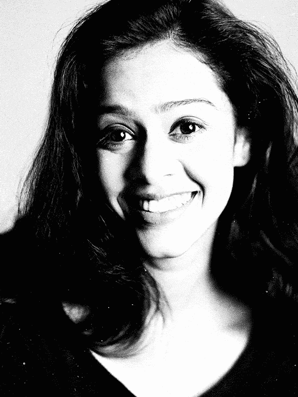
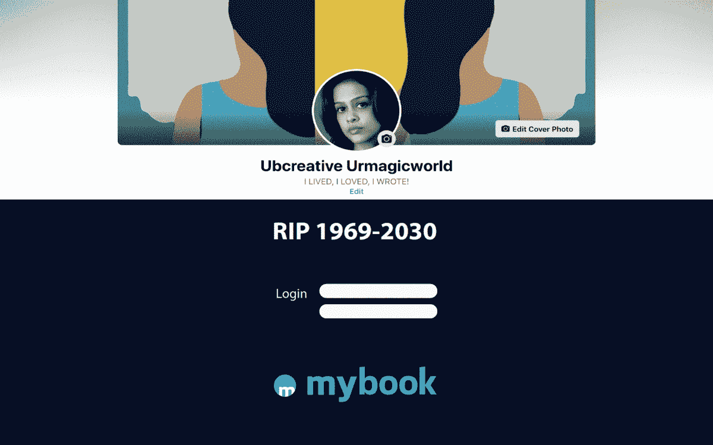
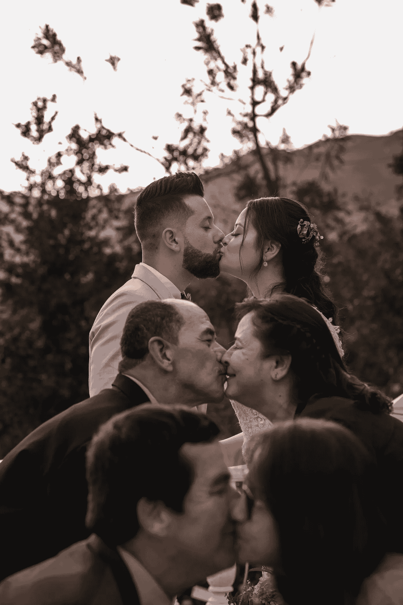
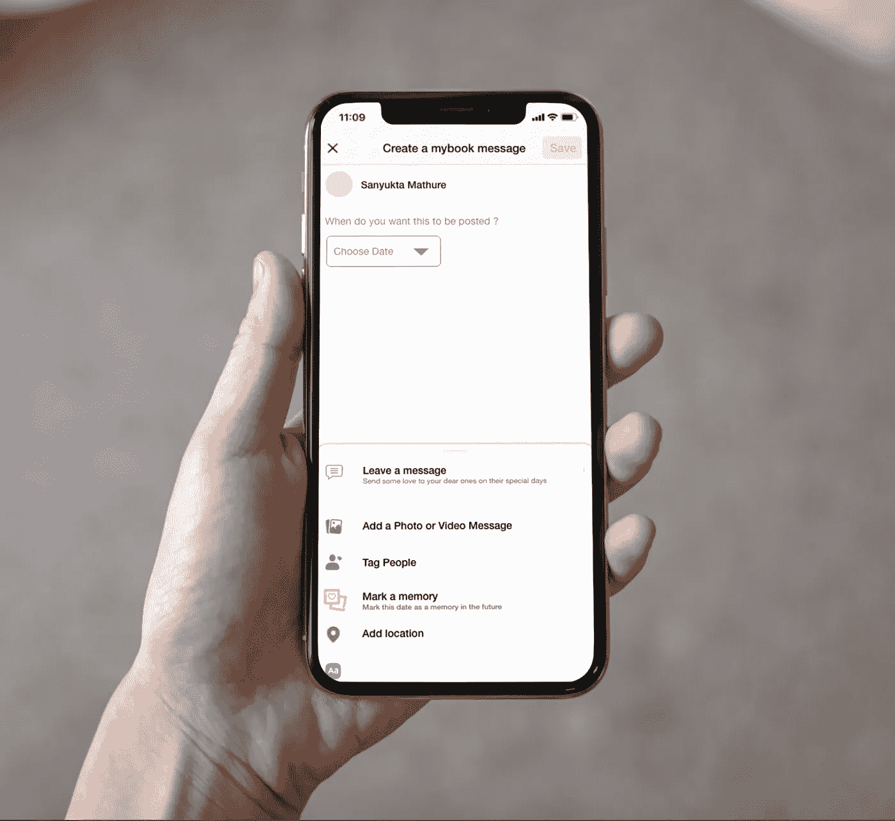
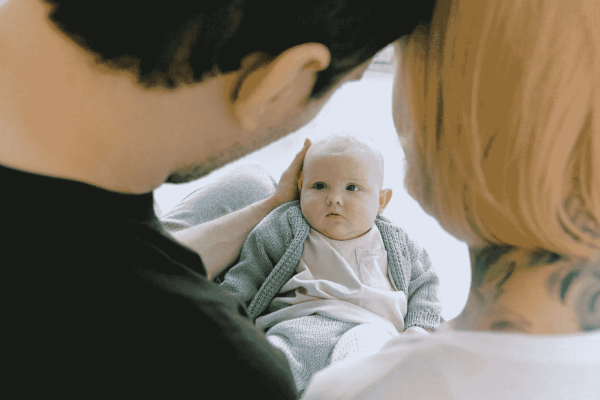

# 永远年轻

> 原文：<https://medium.datadriveninvestor.com/forever-young-b0c61ce0c055?source=collection_archive---------16----------------------->

*永远年轻，我想永远年轻……*



Author Utkarsha M- Picture Credit – Faroukh Chotia

*永远年轻，我想永远年轻……你真的想长生不老吗？永远永远，永远年轻…抱最好的希望，做最坏的打算…坐在沙坑里，人生是一次短暂的旅行…* [*我想永远年轻…你真的想长生不老吗？永远，永远年轻…*](https://www.youtube.com/watch?v=rmfmdKOLzVI)

当我在这个标志性的十年中思考我的死亡时，我不禁面对不可避免的事情……当我在时间的沙滩上留下我的脚印时……我真的希望在我所爱的人的回忆中永远年轻。随着我又长大了一岁，导致我死亡的可能性似乎比以往任何时候都更真实。20 岁是微风，30 岁是摇滚，40 岁是在那里做的…50 岁是为了规划来世！

如果说有什么让我们意识到一件事的话，那就是我们整个人类所面临的危机……在大多数不确定的时期，有一件事是确定的……那就是死亡。

## [人工智能已经为我们的数字来世带来了一些惊人的可能性。](https://death.io/planning-ai-afterlife/)

*通讯设计师* **Riddhi Vyas，Siddhi Vyas and Mihir Gotadki***——图册 Skilltech 大学在一门名为* ***AIML |一个全新的世界*** 经过深思熟虑推测出一个平台灵感来自于 [***复制品理论***](http://world-faiths.com/school-resources/as-a2-philosophy-ethics/a2-philosophy-ethics/a2-life-after-death/a2-resurrection/replica-theory/)*其中*连接着一代人***’***Meta 的重点是将元宇宙带入生活，帮助人们联系、寻找社区和发展业务。


Introducing Meta: A Social Technology Company — 2021



**MYBOOK’**- **Connecting People in life and after-life!** [*Economists have noted that Facebook offers many non-rivalrous services that benefit as many users as are interested without forcing users to compete. By contrast, most goods are available to a limited number of users. Three areas add the most economic impact: platform competition, the marketplace and user* ***behaviour data.***](https://en.wikipedia.org/wiki/Facebook#Revenue)

新常态是“在不确定性中发展”。疫情不仅重塑了世界的基础，还加速了技术和数字转型的趋势。



Picture Credit:pexels-cleyder-duque-3816383

**AI 或者说人工智能是我们所来到的最接近于** [**卡西记载的**](https://en.wikipedia.org/wiki/Akashic_records) **上的人类境界。它将使我们能够对无尽的数据进行编码，这些数据可以被我们身后的人访问。** *在神智学和人智学中，* [***阿卡西记录***](https://en.wikipedia.org/wiki/Akashic_records) *是所有宇宙事件、思想、语言、情感和意图的概要，曾经发生在过去、现在或未来的所有实体和生命形式，不仅仅是人类。见神论者认为它们被编码在一个被称为精神层面的非物质存在层面中。* ***一切思想、言语、意图等。产生他们自己独特的“频率或振动”,储存在阿卡西记录中。***

[阿卡西记录](https://www.edgarcayce.org/the-readings/akashic-records/)，也被称为“生命之书”或“上帝的记忆之书”，可以等同于宇宙的超级计算机系统——或者也许今天会被称为云计算。它们是曾经在地球上生活过的每个人的所有信息的中心仓库。这些记录包含了我们的每一个想法、行为、言语、感觉和意图。它们对我们的日常生活、我们的人际关系、我们的感觉、我们的信仰体系以及我们所面对的潜在现实有着巨大的影响。



Picture Credit: Mockup-concept — Sanyukta Mathure

> 柏拉图认为身体属于物质世界，总有一天会化为尘土。然而，灵魂属于一个更高的领域，在那里永恒的真理，如正义，爱和善良将永远存在。

# **副本应用程序设计概念 USP :**

# 让你的帖子、视频和内容在你死后的几年内都可以使用。

**注册您的声音以启用您的** [**聊天机器人**](https://www.guru99.com/best-ai-chatbots.html) **。通过利用机器学习和自然语言处理，人工智能聊天机器人可以理解你话语背后的意图。**

在虚拟现实的帮助下，与你不在人世的亲人交谈。通过面部掩蔽来访问视频和消息。

**对不同家庭成员单独进行访问，获取提前多年录制的内容。**

即使你不在，也可以定时发送的帖子。*(比如在你孙子毕业那天给他们的一条信息)*

危机的性质总是会变化的；我们将永远惊讶于人类的创造力和适应力。如果几年后我们回头看，我们可以期待人们会欣赏这一次让我们重新思考生命和死亡中最重要的事情的可能性范围。

> 人类的思维实际上是未被探索的。我们不知道意识是如何工作的。但大脑仍然是一台机器，所以在我们解决它之前，需要对它进行修补。”


Picture credit: pexels-andy-barbour-5500963

随着我们考虑和思考、选择和理解事件和感受，技术的飞跃将使信息在未来变得更加容易获取。正如我们努力应对从看似 [**黑镜、**](https://www.virtualreality.news/2018-01-24-black-mirror-style-digital-afterlife-could-become-real-much-sooner-than-you-expect-experts-warn.html) 中复制的场景一样，这不完全是我们的想象，而是对新现实的暗示。

[](https://www.datadriveninvestor.com/2020/11/19/how-machine-learning-and-artificial-intelligence-changing-the-face-of-ecommerce/) [## 机器学习和人工智能如何改变电子商务的面貌？|数据驱动…

### 电子商务开发公司，现在，整合先进的客户体验到一个新的水平…

www.datadriveninvestor.com](https://www.datadriveninvestor.com/2020/11/19/how-machine-learning-and-artificial-intelligence-changing-the-face-of-ecommerce/) 

虽然用目前的技术可能无法创造一个完全工作和自我意识的数字版本的你，但你很可能——在不知不觉中——仅仅通过使用你的各种数字设备就为它制造了所有必要的成分。**除非你很少或根本无法使用手机、电脑和互联网，否则你所有的短信、电子邮件、照片和状态更新很有可能被拼凑在一起，从而创造出一个与你的个性相近的东西，这对于一个看似有知觉的** [**数字化身来说可能足够好了**](https://www.virtualreality.news/2018-01-24-black-mirror-style-digital-afterlife-could-become-real-much-sooner-than-you-expect-experts-warn.html)



Picture credit: pexels-anna-shvets-3845341 — Time consciousness **can now be transferred from its biological host into a digital one.**

从机器人和人工智能领域的许多专家的工作来看，很明显，黑镜的数字来世不仅仅是一种选择，而是全世界的规范，这只是一个时间问题。这给了你两个选择:你是继续像现在这样生活，而不考虑你的数字作品可能会发生什么，还是通过尽可能多地在网上发布你自己的点点滴滴来更好地为你的死亡做准备——以照片、信息和其他信息的形式——[？](https://virtualreality.news/)


**‘mybook’** on metaverse a glimpse into the past to create future

**追溯放大我们现实倾向的紧张对话中的步骤，我们可能会失去视线，但最终会在智力层面上理解我们生活中发生的事情，然后理解我们的灵魂。**

当我们以扩展和乐观的方式思考时，我们对世界开放，跟随灵感，以新的视角理解和展现我们的好奇心和永生的愿望……为我们亲近的人实时铭刻。当我们计划我们的生活时…我们将很快 [**计划我们的死亡**](https://death.io/planning-ai-afterlife/) **用电子记忆中的数字印记一个新时代版本的阿卡西记录。** *基于人工智能的解决方案渗透到我们生活和做生意的方式中，关于道德、隐私和安全的问题也将出现。学生们对未来进行了各种推测和预测。*

元宇宙将感觉像是当今在线社交体验的混合体，有时会扩展到三维空间或投射到现实世界。它可以让你和其他人分享身临其境的体验，即使你们不能在一起，也可以一起做在现实世界中不能做的事情。

> **免责声明:所有创意均为假设的课堂项目。** ***版权所有—*** [***图册 SKILLTECH UNIVERSITY***](https://atlasuniversity.edu.in/)***—2022***
> 
> *创意导师:* [***乌特卡沙·马尔卡尔教授***](https://www.linkedin.com/in/utkarsha20/)

```
**UTKARSHA M. |** Author | Design Thinker | Creator  - A desire to understand the world and to improve it always remains at the core. Design is a managed process and my quest for knowledge is subject to an inquiry of the apparent, the imagined and the recalled. As I speculate and design, my liberty of self-expression is in direct correlation to my existence and knowledge. [**https://www.utkarshaofficial.com/**](https://www.utkarshaofficial.com/https://www.utkarshaofficial.com/)
```

**进入专家视角—** [**订阅 DDI 英特尔**](https://datadriveninvestor.com/ddi-intel)