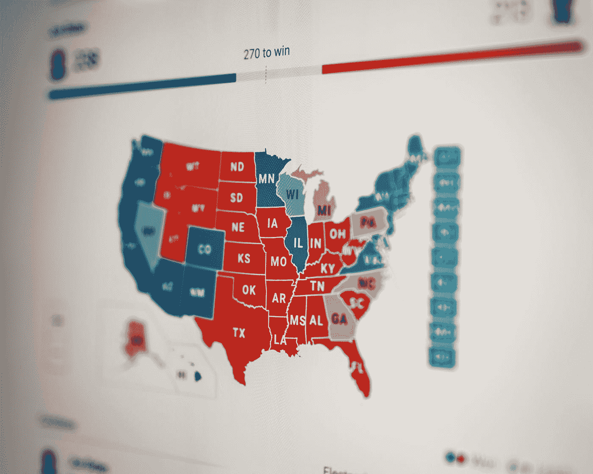

# 忘记新冠肺炎吧。这是拜登最大的挑战。

> 原文：<https://medium.datadriveninvestor.com/forget-covid-19-this-is-bidens-biggest-challenge-80387e4b1f6f?source=collection_archive---------9----------------------->

Photo by [Clay Banks](https://unsplash.com/@claybanks?utm_source=medium&utm_medium=referral) on [Unsplash](https://unsplash.com?utm_source=medium&utm_medium=referral)

## 没有心理治疗的疫苗

乔·拜登将成为美国第 46 任总统。在撰写本文时，他在选举团投票中领先，并且在所有剩余的关键州中领先，这是确保胜利所必需的。然而，没有任何网络——广播或有线，主流或另类——宣布选举。在任何一个选举年，在这种领先的情况下，在剩下的票数如此之少的情况下，选举就会被称为*。但是在这个选举年，在新闻机构这种罕见的情况下，没有人想成为第一。没人想为特朗普-unleashed 负责。

*除此之外:“宣布”，意味着确信预测模型反映了最终的结果，注意即使在媒体宣布选举之后，所有的选票仍然被计算和认证。打电话是一个明显的风险。

在选举悬念最终结束之前的几天里，白宫出奇的安静。特朗普没有夸夸其谈的说法——注意，推特和脸书终于开始屏蔽他的公然谎言——并不令人惊讶，因为没有其他人登上讲台。他的内阁成员和官方发言人都没有对此事发表任何言论。冠状病毒并没有消失，事实上，它已经飙升到美国有史以来的最高水平，每天都有新的病例和死亡人数打破记录。人们的经济和刺激需求仍在继续，没有任何解决的迹象。所以，问题是，有人治理吗？有人吗？布勒？

> 特朗普给这个国家带来了精神疾病

甚至在选举结果公布之前，拜登竞选团队已经表示，他们已经开始实施过渡计划，准备承担治理国家的责任。我怀疑，一旦唐纳德·特朗普(Donald Trump)说服自己这一切终于结束(这可能需要一段时间)，他将实际上停止履行任何总统职责。据报道，鉴于他在总统任期内每天看电视的时间，他直接执政的时间可能不会有太大变化。他的执政效果也不会有太大影响——对最需要关注的事情影响如此之差，比如疫情、大流行后的经济、与中国的贸易问题、外国情报干涉，以及美国总统有责任承担的几乎所有事情。不，唐纳德·特朗普(Donald Trump)将从聚光灯下退去，抵制任何需要为国家利益做出的决定，并可能拒绝欢迎即将上任的当选总统和行政团队，这是选举和就职之间几周的惯例。

那么，拜登总统将如何执政？他说，他将首先解决新冠肺炎疫情。接下来可能是经济。然后继续其他议程项目，比如气候变化。然而，该国仍然存在严重的分歧。虽然人们普遍预测的内乱尚未发生，而且希望永远不会发生，但仍有错误信息的幽灵指出，在一个团结的美国，有超过 7000 万特朗普选民需要被说服。你看，特朗普把他的精神疾病强加给了这个国家。自恋型人格障碍的迹象和症状现在深深植根于一些主流平面和电视媒体，这些媒体继续描绘特朗普的幻想世界。然而，在后特朗普时代，他们可能不会传播他对 gradeur 的错觉，而是贬低和贬低新政府的另一个自恋特征。可悲的是，这 7000 万选民中有超过一半的人会吃这一套。他们将继续有权利感，参与恐吓和欺凌行为，并做肮脏的工作来满足自恋者的需求。自恋者唯一了解的是他们自己的需求，特朗普创造了多达 7000 万自恋者追随者。

 [## 自恋者的回归

### 理解我们与特朗普关系中最危险的部分

medium.com](https://medium.com/@jmacdonald66/the-return-of-the-narcissist-8348d6d8f7b2) 

七千万戴着玫瑰色眼镜四年或更久的人，为特朗普的行为找借口，满足他对赞美和钦佩的渴望。全力支持自恋者的努力没有留下时间或精力或意愿来同情，寻找共同点，妥协——所有这些都是为真正的大问题，如困扰美国的财富差距和种族不公正，确定和提供最佳解决方案所需的东西。

> 拜登必须帮助一半的美国人重新获得自我价值，找到自己的信心，并确定自己在实现美国梦的过程中的角色

一半的美国人已经成为自恋者幻想的受害者。特朗普创造的梦想的魅力和信心，同时他也在动摇那些追随者的自尊:“我们将重新开放煤矿，”读着:你不能学会做其他任何事情。“我们正在让你丈夫回来工作，”里德:因为你们女人依赖他们。七千万美国人饱受特朗普自恋的折磨，他们都需要某种程度的帮助来重获自我价值，找到自己的自信，并确定自己在实现美国梦的参与中的角色。这是拜登最大的挑战。

美国的发展既不会通过对一个声称荣耀的人的赞扬来实现，也不会依靠对宏伟的承诺来实现。不，美国的成长是通过经常对着镜子问一些尖锐的问题，通过依靠自己积极参与让美国再次伟大起来实现的。

达琳·兰瑟的这篇文章很好地概述了自恋。

 [## 4 种自恋者共有的核心特质

### 尽管症状各异，但两个研究小组发现了所有自恋类型的一个核心特征。了解类型和标志…

medium.com](https://medium.com/narcissism-and-abusive-relationships/the-core-trait-4types-of-narcissists-share-b26632a5a549)