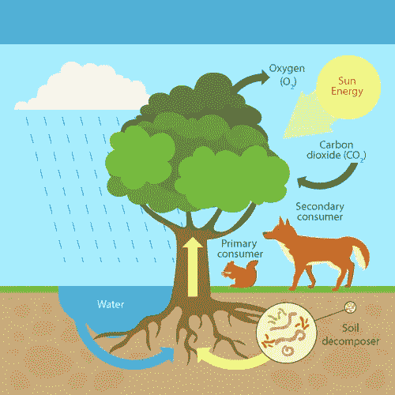
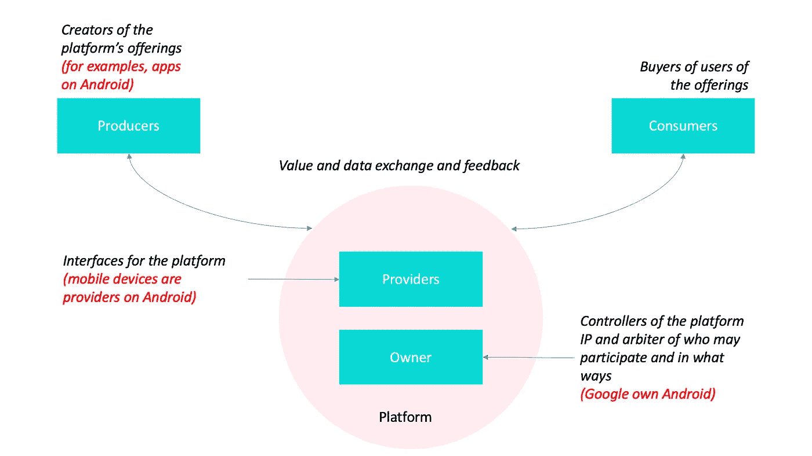

# 忘记项目，忘记产品，忘记平台。构建生态系统

> 原文：<https://medium.datadriveninvestor.com/forget-projects-forget-products-forget-platforms-build-ecosystems-49cfc65c63ee?source=collection_archive---------2----------------------->

## 项目->产品->平台->生态系统

an example of natural ecosystems

*更新时间:2021–06–01*

我在世界各地的 IT 行业工作了 15 年以上。我在我的领域里发现了许多经验和知识。一个新兴的商业模式家族在过去十年里获得了快速发展。从项目到生态系统是一个漫长的工作年。

# 什么是软件项目？

我们国家的人一般都是在自由职业者上拿软件项目来挣钱。它可能是一个开发项目或维护项目。

软件开发项目是根据客户需求进行软件设计，并将其实现到源代码中。然后对源代码进行测试，以确保它没有缺陷，这样最终用户就可以使用软件系统，而不会遇到很多问题。

 [## 跑步摆脱疯狂:锻炼如何提高你的生产力|数据驱动的投资者

### 没有比锻炼更好的方式来开始一天的工作了。我试着一周至少做四天，在…

www.datadriveninvestor.com](https://www.datadriveninvestor.com/2018/10/23/running-to-get-rid-of-the-crazy-how-working-out-increases-your-productivity/) 

在软件维护项目中，修改已经存在的软件产品以添加新功能、移植到其他操作系统、删除缺陷等。

软件开发和软件维护项目统称为软件项目。他们有一个暂时的努力，有一个清晰的定义，什么需要交付，什么时候交付。项目的成功由范围、时间和预算来衡量，这被称为铁三角形式。项目团队关注交付(输出)。

# 软件作为一种产品

一些 IT 公司制造产品，推出产品，然后卖给客户。他们关注结果。他们本质上不关注时间表和日期，而是关注交付具有最高质量和用户体验的产品。它们是关于发现客户真正想要的和需要的，然后应用长期投资策略，该策略倾向于测试和随着时间的推移逐渐提高质量。

产品的成功主要由客户满意度、利润、市场份额(以业务为中心的指标)来衡量。

历史上，软件作为产品的一个例子是 Microsoft Office。1988 年 8 月 1 日，比尔·盖茨在拉斯维加斯的 COMDEX 上首次宣布了这一消息。当前的内部部署桌面版 Office 是 2018 年 9 月 24 日发布的 Office 2019。

# 什么是平台？

有一个众所周知的故事。20 世纪 80 年代，IBM 与魔鬼签署了一项协议。他们计划推出一款商用个人电脑，并希望微软提供操作系统。比尔·盖茨——首席执行官，他向 IBM 收取了 20 万美元的开发费和高达 50 万美元的额外工程费。但是有一个魔鬼协议。盖茨允许 IBM 使用该操作系统，只要微软没有额外的费用或版税，只有他们可以将软件授权给其他制造商。

比尔·盖茨在想什么？如果 IBM 个人电脑流行起来，那么个人电脑可能会出现一个新的大众市场。如果只有他有权将操作系统授权给那些想生产兼容机的公司，那么微软将成为一个全新产业的中心。然后是一个平台。

过去十年中，优步和 AirBnB 等一些发展最快的企业利用了平台商业模式。对于优步来说，运输是其业务的核心平台功能。通过 Airbnb，他们专注于一个市场平台，在这个平台上，主人和客人可以用房子换钱。

> 微软在考虑平台。IBM 和苹果在考虑产品。

a platform ecosystem

平台扮演两个角色:

*   它们为生产者和消费者提供了一个开放的、参与性的、即插即用的基础设施，使他们能够相互连接和交互。
*   他们策划平台上的参与者，并管理随之而来的社会和经济互动。

如今，微软的操作系统已经发生了革命性的变化，成为一个巨大的生态系统，吸引了成千上万的软件和硬件公司，生产了数十亿的软件应用程序和硬件设备，如打印机、游戏控制器、键盘等等。

# 忘了所有，为什么要建立生态系统？

组织应该关注生态系统，而不是平台。关于产品生态系统的理论是帮助理解系统内产品之间存在的价值网络的最新方法。它代表了一种全新的经济。如果你问自己，为什么像微软、谷歌、亚马逊和苹果这样的公司如此成功，那是因为他们最先理解生态系统战略以及如何最好地实施它们。Grab 最近从一个乘车共享平台转型为一个金融科技生态系统。

“生态系统”是一个使用不一致的术语。生态系统与平台有许多相似之处，但也有一些不同之处，例如生态系统平台需要不断融入新功能，以保持相关性并避免商品化

> 请记住，没有人可以拥有一个生态系统

如何自己建立一个生态系统？这是一个具有挑战性的问题。更多的变化和新技术将会到来。生态系统的业务使一切都成为服务。将来，它会改善这个世界。

# 参考

[1]马塞尔·布朗(1980 年)。IBM 与魔鬼签订协议。[*https://thisdayintechhistory . com/11/06/IBM-signs-a-deal-with-the-devil/*](https://thisdayintechhistory.com/11/06/ibm-signs-a-deal-with-the-devil/)

[2] Sangeet Paul Choudary (2015 年)。平台规模:新兴商业模式如何帮助初创公司以最小的投资建立大帝国。

[3]迈克尔·a·库苏马诺&安娜贝尔·加维尔&大卫·b·约菲(2019)。平台的商业:数字竞争、创新和权力时代的战略。