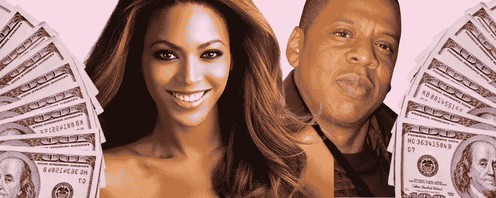

# 净资产公式:如何计算和增加你的净资产

> 原文：<https://medium.datadriveninvestor.com/formula-for-net-worth-how-to-calculate-and-grow-your-net-worth-90ca8774c439?source=collection_archive---------25----------------------->

## 根据 Jay Z 和碧昂斯的建议

还记得在《绿野仙踪》中，当多萝西发现伟大而强大的奥兹只是一个藏在精心展示后的普通人吗？这就是在众多“有钱人”奢侈生活的帷幕后面窥视的感觉。只要看一眼他们的净资产，就会发现其中相当一部分是骗子。

一个人的净资产是判断他是真富还是假富的重要指标。在当今世界，我们的生活在社交媒体上传播得如此之多，我们已经被假富人的流行所困扰。他们看起来拥有一切，但实际上，他们的净资产是负的，他们用信用卡购买一切。

名人也不能幸免于假富现象。在她的怪兽之旅中， [Lady Gaga 发现自己负债 300 万美元](https://www.cnbc.com/2019/05/24/lady-gaga-and-other-rich-celebs-who-were-broke-at-one-point.html#:~:text=Lady%20Gaga%20was%20%243%20million%20in%20debt%20after%20her%20Monster%20Ball%20tour&text=%22I%20actually%20went%20bankrupt%20after,ran%20from%202009%20to%202011.&text='%20And%20they%20said%2C%20'Well,re%20%243%20million%20in%20debt.)，[据报道，迈克尔杰克逊去世时负债 4 亿美元](https://www.debt.com/news/celebrities-youd-never-guess-were-in-debt/)，唐纳德川普已经宣布破产多达 6 次。

两个名人用他们的钱保持了 100 英镑，但绝对是真正的富人。碧昂斯和 Jay Z，他们的净资产加起来估计有 14 亿美元！为了帮助你变得像卡特夫妇那样真正富有，我将从 Jay Z 和 Beyonce 身上学到如何计算你的净资产以及如何增加净资产。

# 如何计算你的净资产

你的净资产是你在还清所有债务后所拥有的一切的总价值。更正式的说法是，它是你所有资产的价值减去你所有未偿债务。

如果你的资产超过你的负债，你的净值是正数。如果你的负债超过了你的资产，你的净资产就是负数。负净值意味着即使你卖掉了所有的资产，你仍然不能还清所有的债务。这是个问题。

假富人的净值为负，他们利用不断增加的债务购买炫酷的汽车和时尚的服装等奢侈资产。问题是，你积累的债务越多，你的财务就越不安全。如果你的整个生活都是通过债务融资的，不管你看起来有多富有，你都是假富人之一。

为了确保你变得真正富有，而不是假装富有，你应该定期计算你的净资产。如果你的净资产在增加，你就在积累财富，而且方向正确。

下面是计算你净资产的公式。

**净值=资产—负债**

## 什么是资产？

资产是你拥有的有价值的财产。基本上，如果你能把它挂牌出售，有人会买，它就是一种资产。就这么简单。

资产的一些例子

*   商业
*   住宅/房地产/土地
*   汽车
*   投资账户
*   现金/储蓄

要计算你的资产，列出你拥有的所有大件物品及其当前价值。像衣服和家具这样的小件物品也是资产，但对大多数人来说，这些东西通常不太值钱。如果你有价值不菲的名牌服装、古董或收藏品，也把它们列出来。尽可能准确地反映你的物品的公平市场价值。

一旦你列出了你所有的资产，把它们的市场价值加起来就得到你资产的总价值。

## 什么是负债？

负债是你欠的东西。你的债务。它们是你必须支付给另一个人或实体的财务义务。

这些包括

*   抵押
*   汽车贷款
*   学生贷款
*   信用卡债务
*   个人贷款
*   应付账款余额

为了计算你的负债，列出你所有未偿还的贷款和它们的当前余额。然后，把它们加起来，得到你负债的总价值。

## 净值公式

一旦你计算出你的总资产和总负债，把这些数字代入下面的公式，就可以算出你的净资产。

**净值=资产—负债**

# 如何增加你的净资产

既然你已经知道了自己目前的净资产，这里有一些关于如何增加净资产的建议。

## 购买升值的资产

买能让你赚钱的资产，而不是让你看起来有钱的资产。

要致富，你需要用你拥有的钱去赚更多的钱。这适用于现金购买和债务融资购买。与普遍的看法相反，[并不是所有的债务都是坏的](https://richbitchfinance.com/2020/07/31/how-to-use-debt-the-right-way/)，它可以成为一个伟大的财富积累工具。不管你是用债务还是现金来购买，如果你想积累财富，你都需要购买升值的资产。

[升值资产](https://richbitchfinance.com/2020/01/28/maximizing-your-ass-ets/)是赚钱的资产。他们这样做是因为他们的价值随着时间的推移而增加。两种最受欢迎的升值资产是房地产和股票。从历史上看，这两者的长期回报都非常好。对于新手投资者来说，这些是开启你财富积累之旅的绝佳资产。

碧昂斯最赚钱的一次金钱交易是，她要求优步为她在优步的演出支付 600 万美元的股票，而不是接受现金。四年后，她的 600 万美元变成了 3 亿美元！将你的钱投资到像股票和房地产这样的财富积累资产中，可能意味着你现在手头没有多余的现金，但这也意味着你以后会有更多的财富。

其他升值资产包括商业、艺术、商品和收藏品。Jay Z 在他的歌曲《OJ 的故事》中谈到通过投资艺术来积累财富。他说，“两年后，我花了 100 万买了一些艺术品，几年后，那些东西价值 200 万，那些东西价值 800 万。”

周杰伦的歌词清楚地展示了通过购买升值的资产来增加财富的能力。在他的例子中，仅仅通过购买那一件艺术品，他的净资产就增加了 700 万美元。这只是他投资的很小一部分。通过投资多种升值资产，他可以大幅加速财富积累。你也一样。

## 利用你的才能

Jay Z 创办 Rocawear 是为了给自己赚钱，而不是给其他品牌赚钱。他注意到，每当他穿上一个品牌或者在一首歌中说唱一个品牌，这个品牌的销量就会飙升。他意识到，如果他创建了自己的服装品牌，穿上它，并谈论它，他可以有所有的钱流向他，而不是另一个品牌。于是，Rocawear 诞生了。

虽然你可能没有 Jay Z 级别的影响力，但这并不意味着你不能将你的才华货币化。显然，做到这一点的第一步是发现你的才能。一个很好的方法是想想朋友、家人和同事向你寻求什么建议。是服装建议，健康和健身，食谱，还是金钱？不管是什么，如果其他人向你征求意见，他们希望受到你的影响。很可能其他人也会。

一旦你知道了你的影响力，你就可以将它货币化。有很多不同的方法可以做到这一点。你可以开一个博客或 YouTube 频道，创建一个在线课程，在社交媒体上建立一个追随者，开一个 Etsy 商店，开一家商店或餐馆，这个清单是无穷无尽的。

但是，如果你不想为你的新工作投入大量的时间、精力甚至金钱，这种方法是行不通的。创建企业和培养追随者可能需要数年时间。如果你不愿意在新的努力中投入大量的鲜血、汗水和泪水，那就不要去做。你最终会浪费钱。相反，正如我们之前讨论的那样，投资于低维护的升值资产。

增加你净资产的公式很简单。多买升值资产，少用坏账。难的是避免成为假富豪的诱惑。假富在持续的时候很有趣，但它的代价是不断处于财务破产的边缘。总有一天，门面会裂开，真相会暴露。为了避免从假富变成真穷，你应该投资资产升值，利用你的才能。这样做会增加你的财富，让你像杰伊和贝伊一样真正富有。

想要更多投资建议？获取我的[免费理财指南](https://richbitchfinance.com/product/free-3-step-guid%E2%80%A6ng-your-finances/)，[与我建立咨询电话](https://richbitchfinance.com/product/private-consulting-call/)，或者报名参加我的[让自己成为百万富翁计划](https://richbitchfinance.com/product/get-a-grip-on-your-finances/)。

*原载于 2021 年 2 月 19 日 https://richbitchfinance.com**[*。*](https://richbitchfinance.com/2021/02/19/formula-for-net-worth/)*