# 交易者和投资者论坛社区。

> 原文：<https://medium.datadriveninvestor.com/forum-communities-for-traders-and-investors-bfc796f3d61d?source=collection_archive---------15----------------------->

每一个初学交易者，在一个好的课程或书籍之后，在一些好的软件工具之后，在一些心理训练之后，他或她需要一个非常好的社区。交易作为一种职业，很少甚至不需要人的参与。起初，这对内向的人来说可能很棒，但过一段时间后，他们也会开始寻找一个可以分享激情的地方。这就是为什么论坛对游戏中最高级的交易者来说都很棒。

在这篇文章中，我将与你分享一个伟大的交易和投资者论坛列表。不是每个人都适合每一个人，但是每个人都有自己的位置。请随意给我更多的建议，我会把它们列入清单。

Photo by [Emile Guillemot](https://unsplash.com/@emilegt?utm_source=unsplash&utm_medium=referral&utm_content=creditCopyText) on [Unsplash](https://unsplash.com/?utm_source=unsplash&utm_medium=referral&utm_content=creditCopyText)

# 一般主题

## 1.Trade2Win 社区论坛

我能说什么呢？我可以从哪里开始描述这个论坛呢？这个网站是个金矿。围绕所有资产的话题和大量的会员使得这个论坛成为每个交易者和投资者的必去之地。

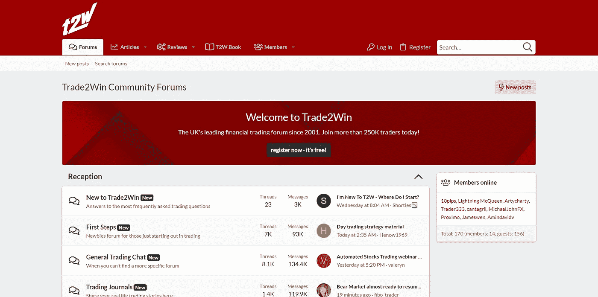

链接:[https://www.trade2win.com/](https://www.trade2win.com/)

## 2.EliteTrader.com

如果 Trade2Win 是座金矿，那么 EliteTrader.com 无疑将是座银矿或者钻石矿。对于那些能够处理大量信息的人来说，这也是必须的。

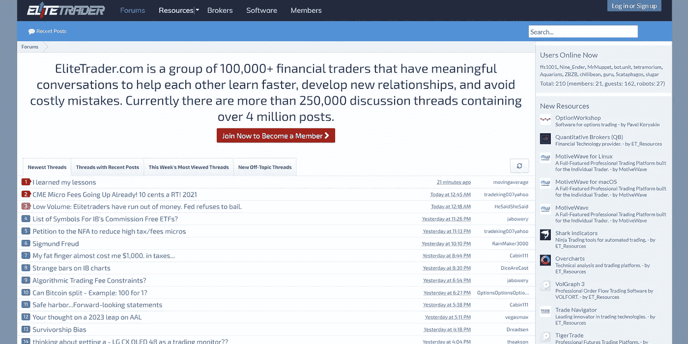

链接:【https://www.elitetrader.com/et/ 

# 外汇

## 1.婴儿用品

这个网站是为那些比其他资产类别更喜欢外汇交易的人而设的。Babypips 拥有大量的会员，出色的设计，以及各种各样的工具，如经济日历，甚至他们自己的“学校”，是外汇交易者的完美去处。

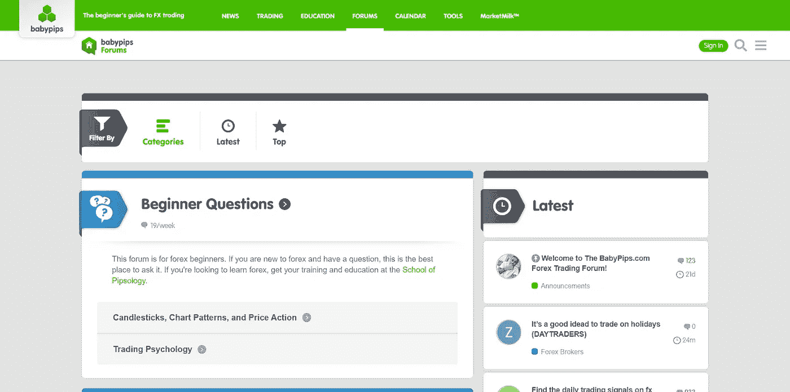

链接:【https://forums.babypips.com/ 

## 2.外汇工厂

这个论坛是我个人最喜欢的外汇类论坛。它们与上面提到的 Babypips 论坛非常相似。我觉得这个设计对我更有吸引力，但这只是个人喜好的问题。

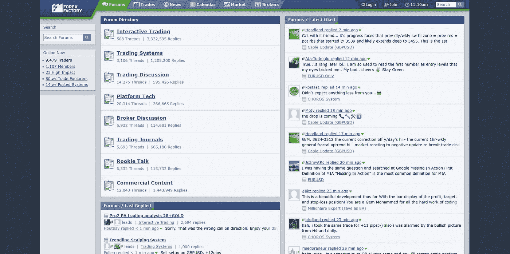

链接:[https://www.forexfactory.com/forums](https://www.forexfactory.com/forums)

## 3.外汇和平军

另一个伟大的外汇交易资源。我没有像上面的其他论坛那样经常使用它，但是无论何时我使用它，它都是一个很好的资源。

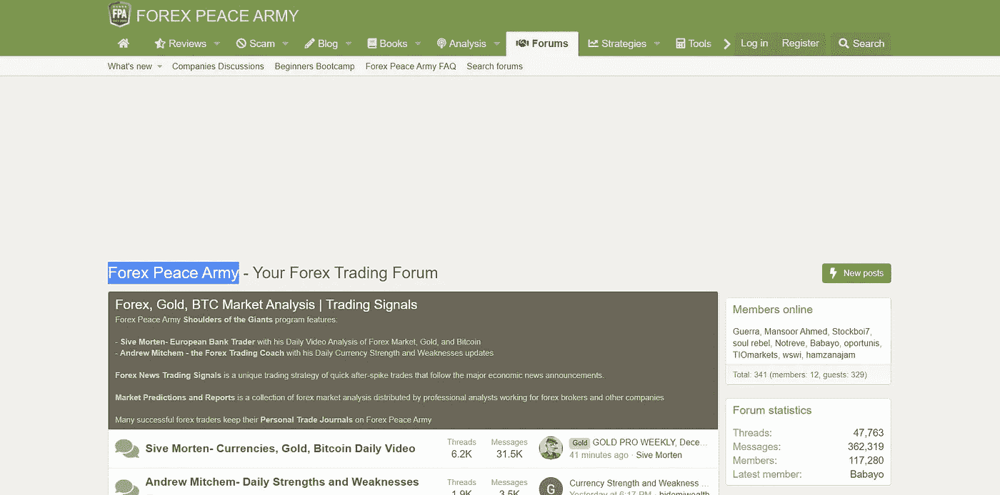

链接:[https://www.forexpeacearmy.com/community/](https://www.forexpeacearmy.com/community/)

## 4.外汇齿轮

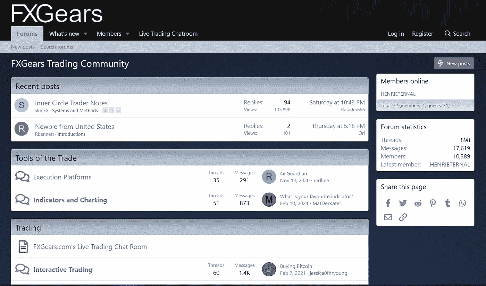

链接:[https://fxgears.com/index.php](https://fxgears.com/index.php)

# 商品交易

## 1.金属矿

兄弟论坛与我上面提到的外汇工厂。没和它有过什么互动，但我信任“品牌”。这个论坛，顾名思义，都是关于贵金属的。

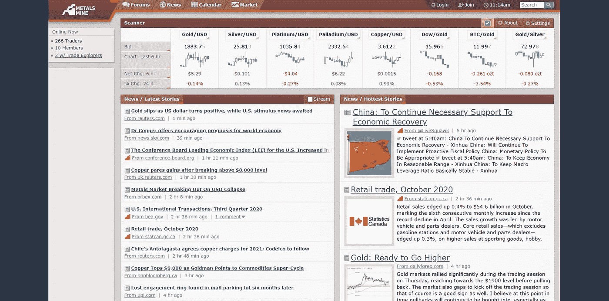

链接:[https://www.metalsmine.com/](https://www.metalsmine.com/)

## 2.能量交换

金属矿也是一样，但是这个论坛是关于能源交易的。

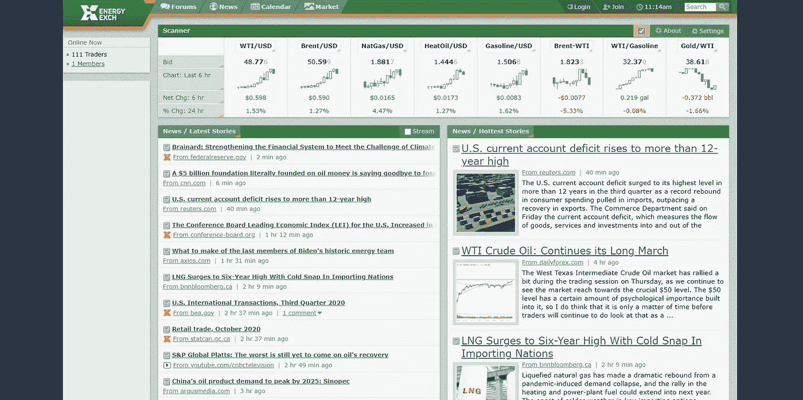

链接:【https://www.energyexch.com/ 

# 加密货币

## 1.秘密飞行器

关于加密货币交易的外汇兄弟。我一定会尝试这一个。

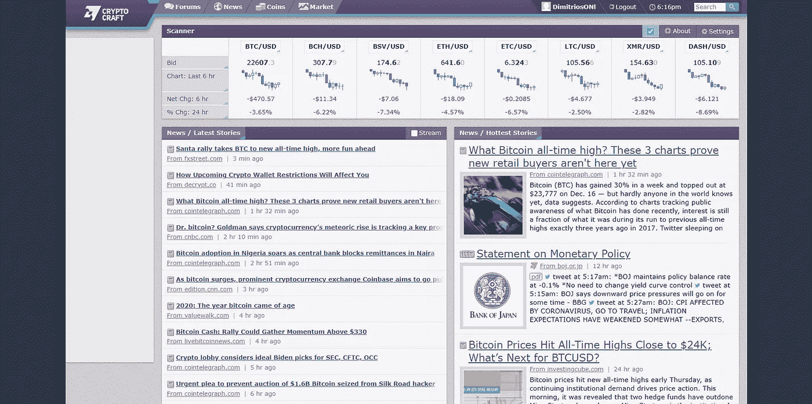

链接:【https://www.cryptocraft.com/ 

## 2.Altcoin 会谈

我和这个论坛没有任何互动，但它似乎组织得很好，有很多活动，有很多成员和帖子。这看起来很有希望。他们有许多不同的替代硬币的渠道，以及所有其他种类的交易主题。他们还谈论股票、外汇和其他资产类别。

链接:[https://www.altcoinstalks.com/](https://www.altcoinstalks.com/)

# 各种各样的

## 1.元交易者论坛

如果你对算法交易感兴趣，或者你对 MetaTrader 平台感兴趣，这个论坛是一个很好的去处。

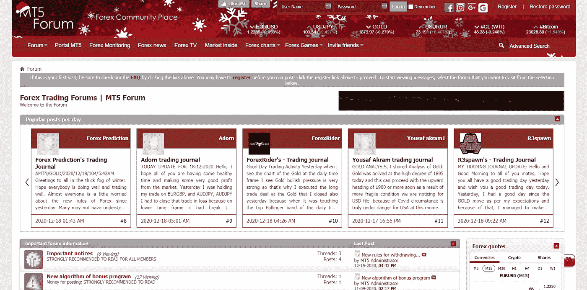

链接:[https://forum.mt5.com/](https://forum.mt5.com/)

# 特定于国家和语言

## 1.说德语的瑞士

来自瑞士的德语论坛。

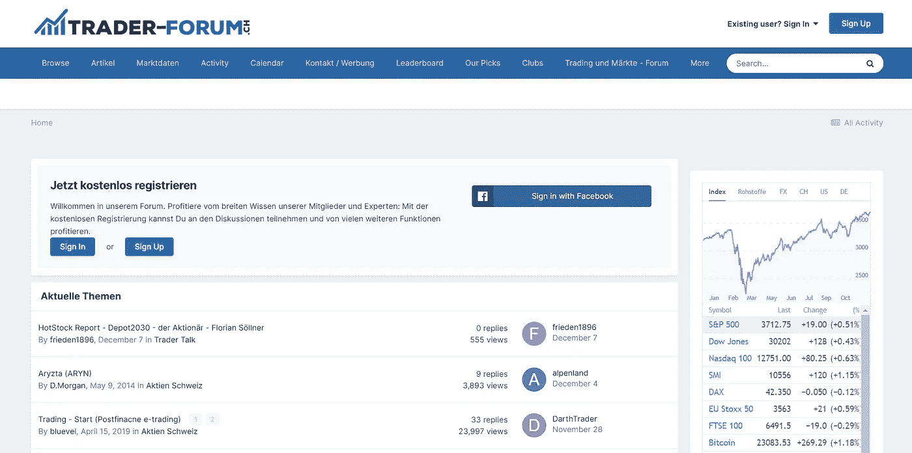

链接:[https://www.trader-forum.ch/](https://www.trader-forum.ch/)

## 2.德国

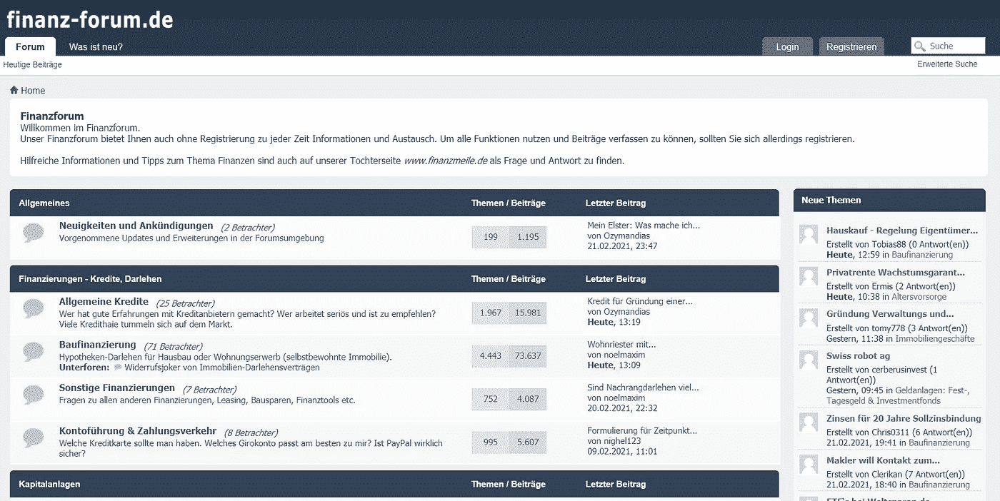

链接:[https://www.finanz-forum.de/](https://www.finanz-forum.de/)

## 3.德国

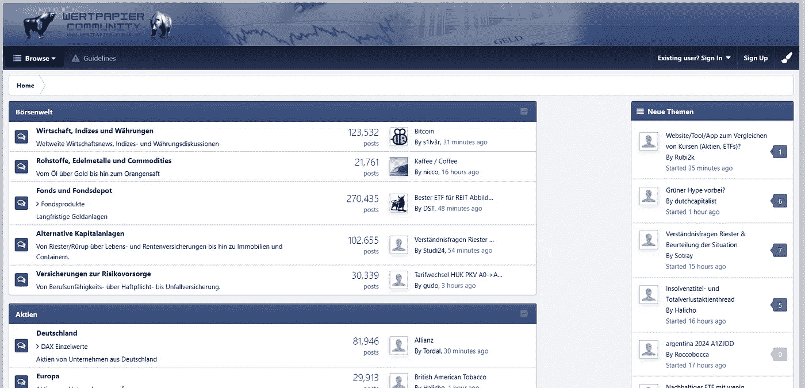

链接:[https://www.wertpapier-forum.de/](https://www.wertpapier-forum.de/)

## 4.说英语的印度

我来自印度，但这个论坛似乎很好。对于所有来自印度的交易者来说，这里是你的最佳选择。

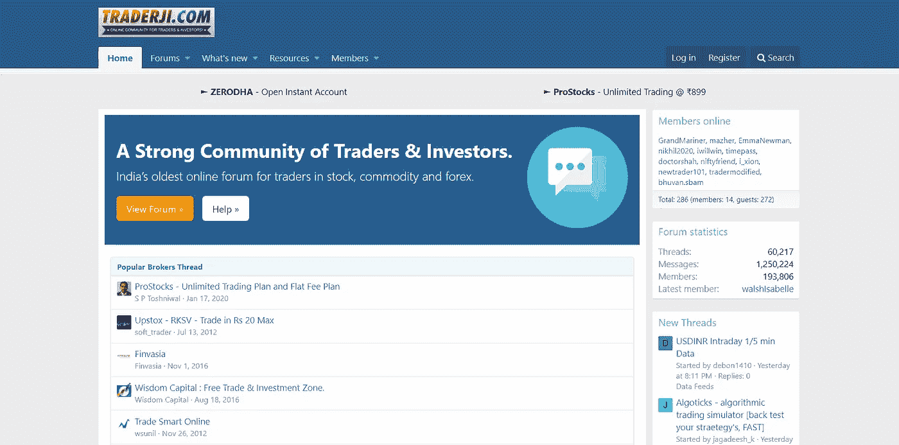

链接:[https://www.traderji.com/community/](https://www.traderji.com/community/)

免责声明:

为了投资这些市场，你必须意识到风险并愿意接受它们。不要用你输不起的钱去交易。本文包含的信息仅用于教育目的，不作为任何特定投资的建议。在任何市场交易都有很高的风险，可能不适合所有的投资者。

*更新*

2021 年 2 月 23 日–新增三个论坛。