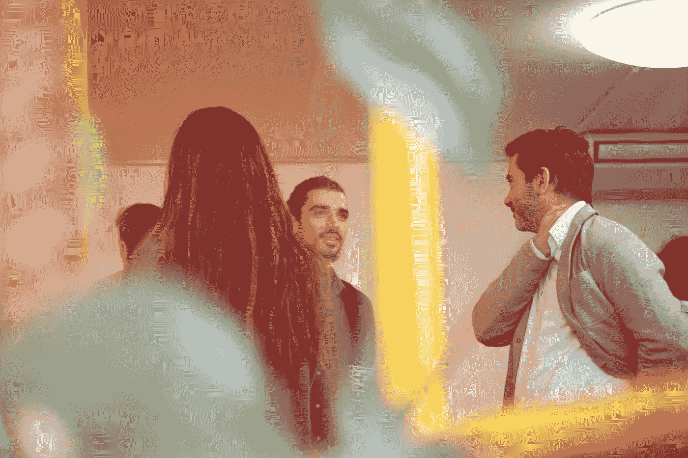
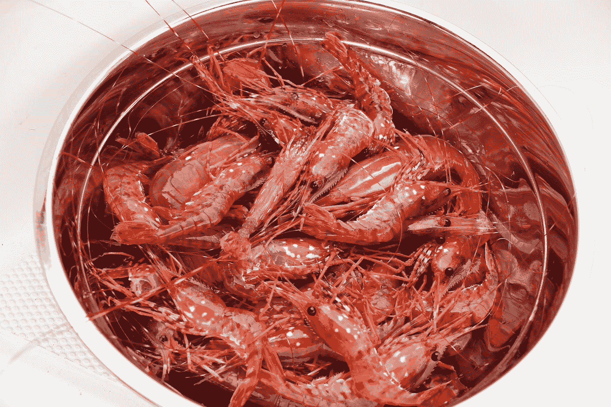

# 下一次社交活动成功的四个关键

> 原文：<https://medium.datadriveninvestor.com/four-keys-to-success-at-your-next-networking-event-29ab29de6e53?source=collection_archive---------9----------------------->

Photo by [HIVAN ARVIZU @soyhivan](https://unsplash.com/@soyhivan?utm_source=medium&utm_medium=referral) on [Unsplash](https://unsplash.com?utm_source=medium&utm_medium=referral)

## 关于如何展示、创造价值和让人难忘的快速入门

20 年前，我曾经教过大家，我们中大约有四分之三的人害怕社交，这种恐惧更甚于公开演讲。虽然这在当时可能是真的，但我的猜测是，今天，这个数字已经上升。

事实上，很多。

因为我们中的很多人都远离社交，更喜欢发短信而不是聊天，我们甚至建立眼神交流的能力(对于那些被认为是礼貌的文化来说)都下降了。有太多的焦点在我们身上，我们看起来像什么，我们是否能给任何人留下深刻印象，以及我们将得到什么。

所有的问题都是错的。因为，伙计们，大多数情况下，没人在乎。

你要去的大多数人都太关注他们自己，他们看起来像什么，他们是否能给任何人留下深刻印象，以及他们会得到什么。

Photo by [Christine Ellsay](https://unsplash.com/@westcoastrain?utm_source=medium&utm_medium=referral) on [Unsplash](https://unsplash.com?utm_source=medium&utm_medium=referral)

包括尽早吃到冷虾。

我们花了这么多时间担心自己，以至于我们很少想到其他人也花了这么多时间担心自己。我觉得这很有趣。

 [## 在创业之旅中，拥抱学习|数据驱动的投资者

### 好像建立一个数百万美元的公司还不够困难，企业家必须额外照顾他们的…

www.datadriveninvestor.com](https://www.datadriveninvestor.com/2018/10/16/on-the-entrepreneurial-trek-embrace-the-learning/) 

如果你重新仔细阅读，你会看到内在的机会。我们这些专注于他人，对他人感兴趣，让他人感到舒适和受欢迎，并尽力增加价值的人是令人难忘的。他们也是我们希望在我们的圈子里成为朋友、同事、客户和顾客的人。

这些人令人难忘，因为他们关注他人。它们增加了价值，而不是吸走房间的能量。

# 自我提醒:不要做别人做的事。

从大公司的首席执行官到很少离开地下室的 SEO 专家，再到秘书，我们所有人都有一定的羞怯感。这是必然的。天生魅力非凡的人很少是天生的。但是你可以通过在出现之前仔细计划事情来给人留下这样的印象。

在你去参加下一个社交活动之前，有四个问题要问:

我为什么要去？(免费虾。我破产了。伙计，如果我再吃一包拉面，我就要吐了。)负收益先不说，现实一点:你的目的是什么？你能复印一份与会者名单吗？你能调查一下这些人吗？你为什么想见他们？你希望在活动结束时带走什么？你知不知道当你走近一个人，对他说，“我读了你的研究论文，”(天哪，你读了？除了我妈没人看我的研究论文)。然后你列出几个要点，说:“你知道，这部分让我感兴趣。你说……"是什么意思？"

你刚刚成为了超级英雄。

在这次活动中，我应该为我可能会遇到(并希望遇到)的人提供什么？你的快速电梯演讲是什么？你增加了什么价值？你是业内专家吗？你是在找工作还是在找客户，因此，你能解决哪些你知道(并能证明)你能解决的问题？
你能自由地提供能帮助他人的想法、建议或推荐吗？人们会被没有受到诱惑的慷慨所吸引。

**在这次活动中，我需要从人们那里得到什么？**自我提醒:*你不会带着工作机会、合同或中奖彩票离开。你正在迈出建立关系的第一步。所以让我们管理我们的期望。你希望能够采取下一步行动，不管是去他们的办公室、打电话还是开会。拿一张卡片，澄清:“所以让我明白。你想让我给你打个电话，定个日期。一天中的什么时间最适合我联系您，或者您希望我给您的助理打电话？”这澄清了利益。*

请多读几遍，然后把它作为一个迷因贴在你的电脑上:

# 潜在利益也不过如此。潜在利益。这不是工作机会或合同。只是潜在的兴趣。

事实上，把它贴在你的冰箱、咖啡杯、浴室镜子上。太多的人已经破产，因为他们把温和的利息误解为有保证的合同。

最后，**我对这件事的理想结果是什么？有时仅仅与关键人物建立初步联系就足够了。得到一张名片。允许以后联系他们。**

设定非常合理的结果可以减轻你的压力，让你放松，专注于他人。

因为我们都只顾自己，担心自己会给人留下什么印象，所以这是一个打开真正联系之门的好方法。

有活动吗？做计划。出去玩吧。看看简单地帮助他人获得乐趣会给你的生意带来多大的回报。

Photo by [Doran Erickson](https://unsplash.com/@doran_erickson?utm_source=medium&utm_medium=referral) on [Unsplash](https://unsplash.com?utm_source=medium&utm_medium=referral)