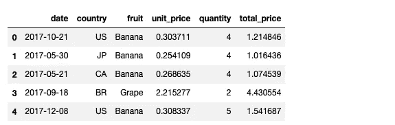
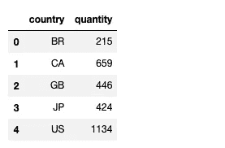
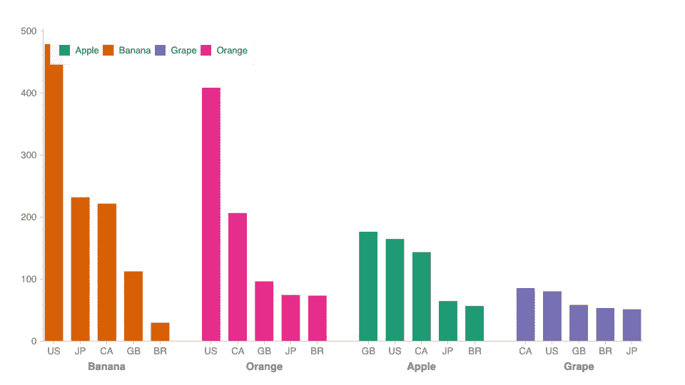
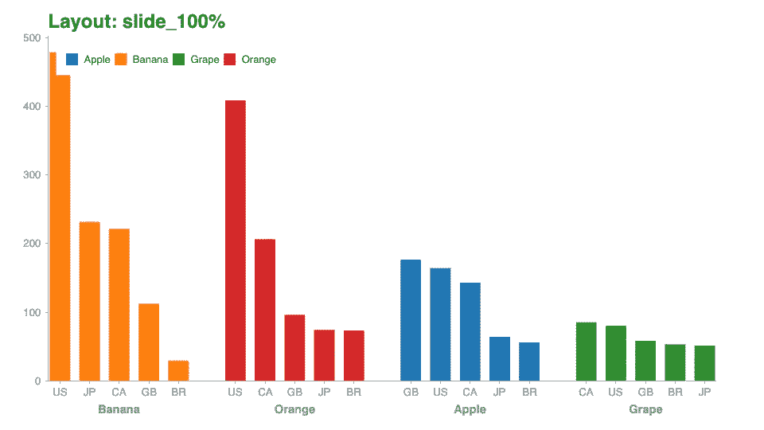
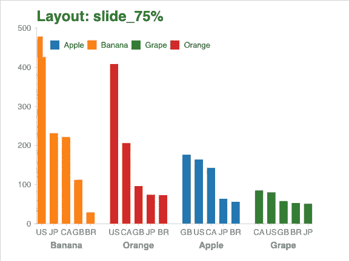
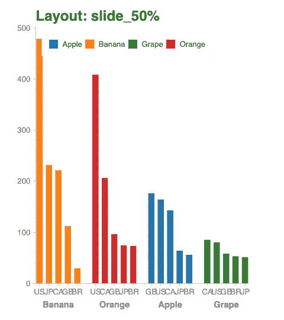
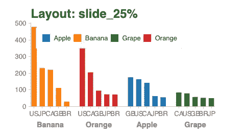
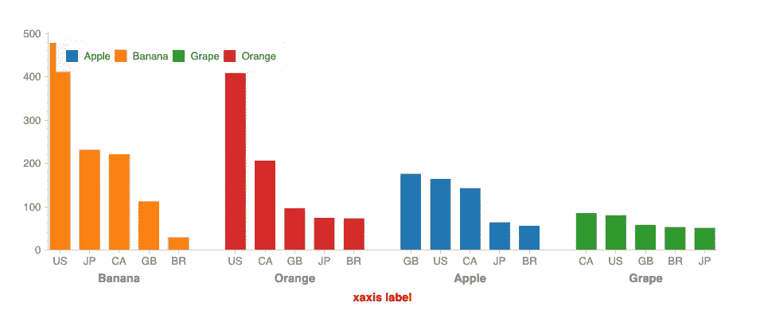
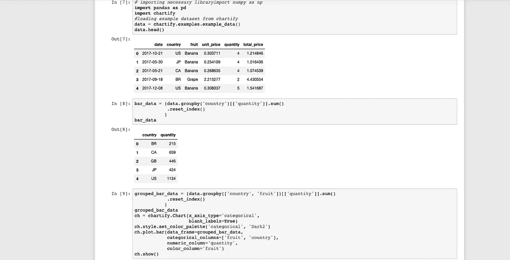
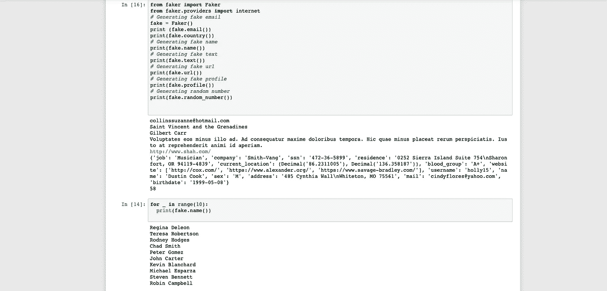

# 四个“鲜为人知”的数据科学 Python 库

> 原文：<https://medium.datadriveninvestor.com/four-lesser-known-python-libraries-for-data-science-d917f5cd2a42?source=collection_archive---------5----------------------->

## 这些图书馆太酷了


Gif (Source and Credits: Analytics India Magazine)

# 1.数字计算器

一个 Python 库，用于将自然语言字符串转换成整数和浮点数。对于 NLP 项目来说，这是一个非常有用的库。

**安装**

```
pip install numerizer
```

**导入编号库**

```
from numerizer import numerize
```

**代号**

```
print (numerize("one two three"))
print (numerize('twelve hundred'))
print (numerize('twenty one thousand four hundred and seventy three'))
print (numerize('one million two hundred and fifty thousand and seven'))
```

**输出**

```
1 2 3
1200
21473
1250007
```

**实现截图**


Numerizer example implementation

# 其他一些最好的系列—

> [**30 天的机器学习 Ops**](https://medium.com/coders-mojo/day-1-of-30-days-of-machine-learning-ops-7c299e4b09be?sk=4ab48350a5c359fc157109e48b1d738f)
> 
> [**30 天自然语言处理(NLP)系列**](https://medium.com/coders-mojo/quick-recap-30-days-of-natural-language-processing-nlp-with-projects-series-ceb674e3c09b?sk=ca09b27b3d5867f23ab4dc367b6c0c32)
> 
> [**30 天数据工程与项目系列**](https://medium.com/coders-mojo/day-1-of-30-days-of-data-engineering-894822fcb128?sk=76ba558bfe2d9f85cbe741e505295531)
> 
> [**数据科学与机器学习研究(论文)简体**](https://medium.com/coders-mojo/day-1-data-science-and-ml-research-papers-simplified-a68b00a3b1c4?sk=56136229ff738bd734f19d2b6953f78c) ******
> 
> [**60 天数据科学与 ML 系列带项目**](https://medium.com/coders-mojo/day-1-day-60-quick-recap-of-60-days-of-data-science-and-ml-6fc021643d1?sk=4e75e043b7630a9f963562ebac94e129)
> 
> [**100 天:你的数据科学与机器学习学位系列与项目**](https://medium.com/coders-mojo/100-days-your-data-science-and-ml-degree-part-3-c621ecfdf711?sk=1a8c7b0c204d73432d56b7d1a3a26474)
> 
> [**你应该知道的 23 种数据科学技术**](https://ai.plainenglish.io/23-data-science-techniques-you-should-know-61bc2c9d1b3a?sk=1680c36193eb22198974c9008d62a33c)
> 
> [**科技面试系列—编码问题精选清单**](https://medium.com/coders-mojo/mega-post-tech-interview-the-only-list-of-questions-you-need-to-practice-ee349ea197bb?sk=fac3614684daff4b50a70c0a71e4d528)
> 
> [**完成系统设计与最热门问题系列**](https://medium.com/coders-mojo/system-design-made-easy-quick-recap-of-complete-system-design-34af7e3aedfb?sk=bdd6a19edc1f3ce4a5064923f5b68721)
> 
> [**完成数据可视化及预处理系列与项目**](https://medium.com/coders-mojo/complete-data-preprocessing-and-data-visualization-with-projects-mega-compilation-part-2-41584ef0920e?sk=842390da51689b8d43148c3980570db0)
> 
> [**完成 Python 系列与项目**](https://medium.com/coders-mojo/complete-python-and-projects-mega-compilation-7ec8f7adfe71?sk=ee0ecf43f23c6dd44dd35d984b3e5df4)
> 
> [**完成高级 Python 系列与项目**](https://medium.com/coders-mojo/complete-advanced-python-with-projects-mega-compilation-part-6-729c1826032b?sk=7faffe20f8039fa57099f7a372b6d665)
> 
> [**Kaggle 最会教你的笔记本**](https://medium.com/coders-mojo/my-list-of-kaggle-best-notebooks-topic-wise-data-science-and-machine-learning-part-2-84772863e9ae?sk=5ed02e419854a6c11add3ddc1e52947f)
> 
> [**Git 开发人员完整指南**](/the-complete-developers-guide-to-git-6a23125996e1?sk=e30479bbe713930ea93018e1a46d9185)
> 
> [**打赏 Github Repos**](https://medium.com/coders-mojo/6-exceptional-github-repos-for-all-developers-part-1-21e8fa04e150?sk=9140b249af6fe73d45717185fad48962)**—Part 1**
> 
> [**打赏 Github Repos**](https://medium.com/coders-mojo/6-exceptional-github-repos-for-all-developers-part-2-3eec9a68c31c?sk=8e31d0eb7eb1d2d0bbbcecaa66bd4e7e) **—第二部**
> 
> [**所有数据科学和机器学习资源**](/best-resources-for-data-science-and-machine-learning-full-list-5ceb9a2791bf?sk=cf85b2cef95560c58509877a794577ff)
> 
> [**210 机器学习项目**](/210-machine-learning-projects-with-source-code-that-you-can-build-today-721b035649e0?sk=da5f593572a0261a6314afad99a0356c)

## 科技时事通讯—

> 如果你感兴趣，你可以加入我的时事通讯，通过它我向超过 30，000 名读者发送技术面试技巧，技术，模式，黑客——软件开发，ML，数据科学，创业公司和技术项目。可以订阅 **Tech Brew :**

[](https://naina0405.substack.com/) [## 点火器

### 数据科学，人工智能，人工智能和更多…点击阅读由 Naina Chaturvedi 撰写的 Ignito，子堆栈出版物。推出 7 个月…

naina0405.substack.com](https://naina0405.substack.com/) 

## Github —

[](https://github.com/Coder-World04) [## 编码器-world 04-概述

### 此时您不能执行该操作。您已使用另一个标签页或窗口登录。您已在另一个选项卡中注销，或者…

github.com](https://github.com/Coder-World04) 

# 2.情感

Emot 是一个 python 库，用于从文本(字符串)中提取表情符号和表情符号。

**安装**

```
pip install emot
```

**代号**

```
import re
from emot.emo_unicode import UNICODE_EMO, EMOTICONS# Function for converting emojis into word
def convert_emojis_towords(text):
    for emot in UNICODE_EMO:
        text = text.replace(emot, "_".join(UNICODE_EMO[emot].replace(",","").replace(":","").split()))
    return text
t1 = "The feeling of success 😎, The feeling of achievement 😍"
convert_emojis_towords(t1)
```

**输出**

```
'The feeling of success smiling_face_with_sunglasses, The feeling of achievement smiling_face_with_heart-eyes'
```

**实现截图**


EMOT example implementation

# 3.图表化

Chartify 是基于 Bokeh 构建的 Python 可视化库，旨在让数据科学家尽可能轻松地创建图表。有了这些数据，科学家花在转换数据以使图表工作上的时间就少了。所有绘图功能都使用一致整洁的输入数据格式。您可以创建漂亮的图表，只需要很少的定制。

[](https://www.datadriveninvestor.com/2020/07/07/introduction-to-time-series-forecasting-of-stock-prices-with-python/) [## 用 Python |数据驱动投资者进行股票价格时间序列预测简介

### 在这个简单的教程中，我们将看看如何将时间序列模型应用于股票价格。更具体地说，一个…

www.datadriveninvestor.com](https://www.datadriveninvestor.com/2020/07/07/introduction-to-time-series-forecasting-of-stock-prices-with-python/) 

**安装**

```
pip install chartify
```

**代码**

```
#Import necessary library
import numpy as np
import pandas as pd
import chartify
#Load example dataset from chartify
data = chartify.examples.example_data()
data.head()
```

**输出**



**代码**

```
bar_data = (data.groupby('country')[['quantity']].sum()
            .reset_index()
           )
bar_data
```

**输出**



**代码**

```
grouped_bar_data = (data.groupby(['country', 'fruit'])[['quantity']].sum().reset_index()
           )
grouped_bar_data
ch = chartify.Chart(x_axis_type='categorical',
                    blank_labels=True)
ch.style.set_color_palette('categorical', 'Dark2')
ch.plot.bar(data_frame=grouped_bar_data,
            categorical_columns=['fruit', 'country'],
            numeric_column='quantity',
            color_column='fruit')
ch.show()
```

**输出**



**代码**

```
layout_options = ['slide_100%', 'slide_75%', 'slide_50%', 'slide_25%']
for option in layout_options:
    ch = chartify.Chart(layout=option, blank_labels=True, x_axis_type='categorical')
    ch.set_title('Layout: {}'.format(option))
    ch.plot.bar(data_frame=grouped_bar_data,
            categorical_columns=['fruit', 'country'],
            numeric_column='quantity',
            color_column='fruit')ch.show()
```

**输出**



**代码**

```
ch.figure.xaxis.axis_label_text_color = 'red'
ch.figure.height = 500
ch.axes.set_xaxis_label('X-axis label')
ch.show()
```

**输出**



**实现截图**



Chartify Example implementation


Chartify Example implementation

# 4.骗子

Faker 是一个为你生成假数据的 Python 库。无论您需要引导您的数据库，创建好看的 XML 文档，还是匿名化来自生产服务的数据，Faker 都是您的完美选择。

**安装**

```
pip install Faker
```

**代码**

```
#Import faker library
from faker import Faker# Generating fake email
fake = Faker()
print (fake.email()) 
print(fake.country()) 
# Generating fake name
print(fake.name()) 
# Generating fake text
print(fake.text()) 
# Generating fake url
print(fake.url()) 
# Generating fake profile
print(fake.profile())
# Generating random number
print(fake.random_number())
```

**输出**

```
collinssuzanne@hotmail.com
Saint Vincent and the Grenadines
Gilbert Carr
Voluptates eos minus illo ad. Ad consequatur maxime doloribus tempora. Hic quae minus placeat rerum perspiciatis. Iusto at reprehenderit animi id aperiam.
[http://www.shah.com/](http://www.shah.com/)
{'job': 'Musician', 'company': 'Smith-Vang', 'ssn': '472-36-5899', 'residence': '0252 Sierra Island Suite 754\nSharonfort, OR 94119-4839', 'current_location': (Decimal('86.2311005'), Decimal('136.358187')), 'blood_group': 'A+', 'website': ['http://cox.com/', 'https://www.alexander.org/', 'https://www.savage-bradley.com/'], 'username': 'holly15', 'name': 'Dustin Cook', 'sex': 'M', 'address': '485 Cynthia Wall\nWhiteton, MO 75561', 'mail': 'cindyflores@yahoo.com', 'birthdate': '1999-05-08'}
58
```

**代码**

```
for _ in range(10):
    print(fake.name())
```

**输出**

```
Regina Deleon
Teresa Robertson
Rodney Hodges
Chad Smith
Peter Gomez
John Carter
Kevin Blanchard
Michael Esparza
Steven Bennett
Robin Campbell
```

**实现截图**



Faker example Implementation

**参考文献**

[](https://pypi.org/) [## Python 包索引

### Python 包索引(PyPI)是 Python 编程语言的软件仓库。PyPI 帮助您找到…

pypi.org](https://pypi.org/) 

# 感谢阅读。继续学习:)

# 想看程序员幽默？

[](https://medium.com/datadriveninvestor/programming-humor-part-2-f92cf5a26f2b) [## 编程幽默第 2 部分

### 继续笑，因为太搞笑了…

medium.com](https://medium.com/datadriveninvestor/programming-humor-part-2-f92cf5a26f2b) [](https://medium.com/datadriveninvestor/the-most-hilarious-code-comments-ever-bae3cb1030b5) [## 史上最搞笑的代码注释

### 程序员幽默:是的，实际上是程序员写的！

medium.com](https://medium.com/datadriveninvestor/the-most-hilarious-code-comments-ever-bae3cb1030b5) [](https://medium.com/datadriveninvestor/coding-sins-hilarious-developer-confessions-f55eb342454e) [## 编码原罪:令人捧腹的开发者自白

### “白板”是如何被嘲笑的

medium.com](https://medium.com/datadriveninvestor/coding-sins-hilarious-developer-confessions-f55eb342454e) [](https://medium.com/datadriveninvestor/10-witty-programming-jokes-that-will-make-you-go-rofl-a53fbfb91943) [## 10 个让你着迷的诙谐编程笑话

### 这些太搞笑了…

medium.com](https://medium.com/datadriveninvestor/10-witty-programming-jokes-that-will-make-you-go-rofl-a53fbfb91943) 

# 推荐文章-

[](https://medium.com/python-in-plain-english/python-iterators-generators-and-decorators-made-easy-659cae26054f) [## Python 迭代器、生成器和装饰器变得简单

### 快速实施指南

medium.com](https://medium.com/python-in-plain-english/python-iterators-generators-and-decorators-made-easy-659cae26054f) [](https://medium.com/ai-in-plain-english/23-data-science-techniques-you-should-know-61bc2c9d1b3a) [## 你应该知道的 23 种数据科学技术！

### 使用这些技巧来节省你的宝贵时间

medium.com](https://medium.com/ai-in-plain-english/23-data-science-techniques-you-should-know-61bc2c9d1b3a) [](https://medium.com/datadriveninvestor/coding-sins-hilarious-developer-confessions-f55eb342454e) [## 编码原罪:令人捧腹的开发者自白

### “白板”是如何被嘲笑的

medium.com](https://medium.com/datadriveninvestor/coding-sins-hilarious-developer-confessions-f55eb342454e) [](https://medium.com/datadriveninvestor/5-cool-advanced-pandas-techniques-for-data-scientists-c5a59ae0625d) [## 面向数据科学家的 5 项酷炫先进熊猫技术

### 使用这些技巧…

medium.com](https://medium.com/datadriveninvestor/5-cool-advanced-pandas-techniques-for-data-scientists-c5a59ae0625d) [](https://medium.com/datadriveninvestor/stack-overflow-analyzed-data-from-60-000-software-developers-hours-they-work-languages-they-476ac6ca0197) [## Stack Overflow 分析了来自 60，000 多名软件开发人员的数据，包括他们的工作时间、语言…

### 以下是他们的发现…

medium.com](https://medium.com/datadriveninvestor/stack-overflow-analyzed-data-from-60-000-software-developers-hours-they-work-languages-they-476ac6ca0197) [](https://medium.com/datadriveninvestor/advanced-python-made-easy-part-4-a4996ba9fe19) [## 高级 Python 变得简单—第 4 部分

### 使用这些技巧和技术…

medium.com](https://medium.com/datadriveninvestor/advanced-python-made-easy-part-4-a4996ba9fe19) [](https://medium.com/datadriveninvestor/advanced-python-made-easy-part-1-ce1e2f17431e) [## 高级 Python 变得简单—第 1 部分

### 使用这些技巧和技术…

medium.com](https://medium.com/datadriveninvestor/advanced-python-made-easy-part-1-ce1e2f17431e)