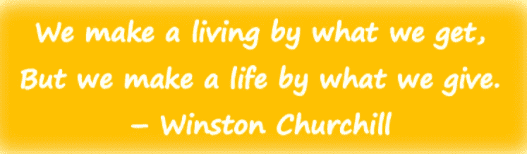

# 四种强有力的回馈方式，不要付出超过你应该付出的

> 原文：<https://medium.datadriveninvestor.com/four-powerful-ways-to-give-back-without-giving-more-than-you-have-to-give-20c8c54b665f?source=collection_archive---------46----------------------->

## 永远不会太晚，也不会太少。(而且不仅仅是钱。)

Image-K.Barrett, Author

一月是全国导师月。也许你错过了。好的一面是…永远不会太晚，也永远不会太少。你的“回馈”不一定是金钱，也不一定是一种无所不包的指导。

你永远不知道你的五分钟时间对其他人来说意味着什么——我们都至少有五分钟时间可以奉献。

许多人避免迈出回报的第一步，因为他们不知道在哪里给予或给予什么。当我们想到回馈时，它可以以多种形式出现…并不总是金钱。

> 我们知道志愿服务有三种形式。作为人类，我们可以贡献我们的时间、财富和才能来帮助我们认为有价值的事业。
> 卡洛斯·阿庞特，[我们爱费城](https://welovephilly.org/pages/about)

我们当前世界强加给我们的虚拟可能性可能是让更多人参与回馈的好方法。你是别人好奇的事情的专家。给他们五分钟时间，即使是虚拟的。鼓励他们，支持他们的旅程。

这里有四个简单的切入点。

1.  找一个支持学生在你的领域学习的组织。
    我喜欢与之合作的是[创业教学网络](https://www.nfte.com/about-us/) (NFTE)他们是一个全国性的组织，他们以一种非常实际的方式教学生探索他们的创业激情，做得非常出色。他们有许多机会参与许多不同层次的承诺。还有其他组织支持你所有不同的职业领域/爱好。找到他们。帮助他们。
2.  小学、初中、高中甚至大学的大学和职业事件。这些活动通常是为期一天的机会，但它们可能非常有影响力。你永远不知道什么时候你的话语或你的存在会激发某人的伟大。分享你的专业知识和你如何走到今天的故事。成功和失败…他们需要知道一切！
3.  找一个组织赞助一个学生。利国学院有一个资助学生的项目。您可以决定提供何种程度的支持。你可以参与许多其他类型的赞助，从音乐或体育课到学费，这些都将与你的热情相一致，因为你可以将它传递给其他人。
4.  找一所实施基于项目的学习或其他需要采访专业研究人员、客座评委或客座演讲人的学校。[我们爱费城](https://welovephilly.org/pages/about)就是这样一个伟大的项目。他们也有企业家的自旋，但他们涵盖了所有的基础。他们在非营利组织做志愿者，并创建播客来支持他们的努力。他们目前正致力于将一个集装箱变成一个航空 BnB。联系学校或向你的家人和朋友打听机会。当学生互动并从校外的人那里获得反馈时，这是非常有影响力的。把自己想象成一个孩子，在现实生活中的律师帮助你建立自己的案件或评判你的表现的情况下，进行模拟审判。或者参加一个科学展，从现实生活中的科学家那里获得一个奖项(而不是你那无聊的老校长或老师)。

> 给予不仅仅是捐赠。这是为了有所作为。
> 凯利·卡尔文，首席执行官&联合国基金会主席。

这是一个非常简单的想法和资源列表，可以帮助你找到回馈的机会。更重要的部分是决定做某事的推动力。成功的人通常时间不多，但回馈的行为可能只是你灵魂需要的重新注入活力！

感谢阅读！我希望我能在给予的领域看到你！

 [## K.巴雷特培养基

### 阅读 k .巴雷特在媒介上的作品。我是一名教育家，妈妈，妻子，女儿，姐妹，朋友，读者，作家…

vantagepointsforawe.medium.com](https://vantagepointsforawe.medium.com/)