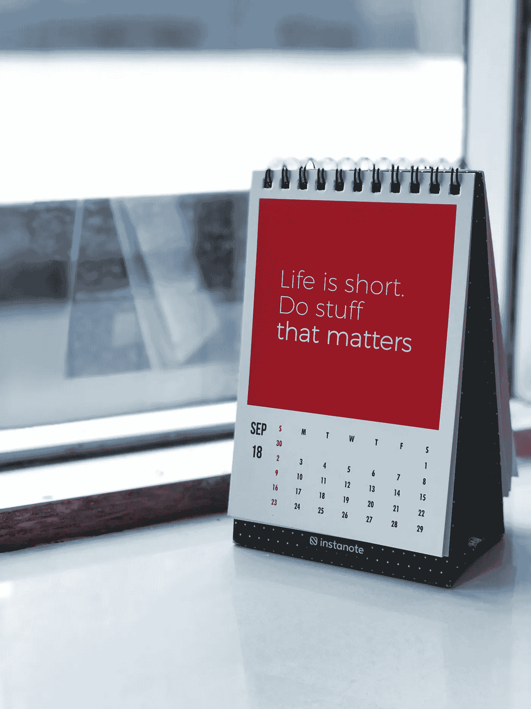

# 让我感到恐惧的四句名言

> 原文：<https://medium.datadriveninvestor.com/four-quotes-that-pulled-me-out-a-funk-c76b77354df5?source=collection_archive---------20----------------------->

正确的话语可以改变你的观点(二手灵感项目)

Image by [Free-Photos](https://pixabay.com/photos/?utm_source=link-attribution&utm_medium=referral&utm_campaign=image&utm_content=1031628) from [Pixabay](https://pixabay.com/?utm_source=link-attribution&utm_medium=referral&utm_campaign=image&utm_content=1031628)

二手灵感项目从一句激励性的引语开始，在创造性道路蜿蜒的任何地方冒险。

这里有一个坦白:我喜欢制造理由来重新开始。

抹去过去的机会让我兴奋。新年，一个季节的开始，一个新项目，一个支付期的开始——这些事情让我重新振作起来，渴望彻底检查我的流程。它们促使我在进展停滞的领域取得进展。

进入这场灾难。

毫无疑问，我们正在经历一场给每个社会和经济系统都带来压力的危机。从这个疫情开始，很多事情都停止了——包括我在实现职业和个人目标的过程中。

 [## 良好的生活是习惯的形成|数据驱动的投资者

### 过度思考是过度紧张。仅仅几个简单的习惯就会在一天中产生巨大的影响。那是…

www.datadriveninvestor.com](https://www.datadriveninvestor.com/2020/01/17/a-good-life-is-habit-forming/) 

几天的时间，我从超聚焦到傻眼。新冠肺炎是最终的重置按钮，在我即将升级的时候毫无征兆地被按下了。

有时，当我感到困惑，不明白是什么扰乱了我的心流时，我会求助于引语来寻求洞察力。这可能看起来很老套，但是如果它提供了必要的火花，那么它是否老套并不重要。

这里有四个引语，它们最近把我的视角从困惑转移到了专注。他们帮助我将这段不确定的时间转化为一个重新开始的机会——对此我很感激。

> “你花越多的时间思考你应该做什么……你就失去了规划你能做什么和将要做什么的宝贵时间。”—李尔·韦恩

抓住遗憾不放就像带着哑铃走路——当你背负着额外的重量时，需要更多的努力和能量才能前进。

没有精神或情感支柱的束缚，很难取得进步。不要回头看。是时候向前看了。

> “大多数人关注的是错误的事情；他们关注的是结果，而不是过程。过程就是牺牲；都是些艰难的部分——汗水、痛苦、泪水、损失。无论如何你都要做出牺牲。你学会享受它们，或者至少拥抱它们。最终，是牺牲必须成全你。”—隆达·罗西

如果你每天朝着你的目标前进一小步，复利的力量(基于人力资本，而不是金钱)将会随着时间的推移创造一个完全不同的生活。

专注于必要的活动，即使它们看起来很乏味。把它们变成习惯，长期坚持下去。通过奉献，你会发现一条通往成功和满足的独特道路。

Photo by [Manasvita S](https://unsplash.com/@manasvita?utm_source=unsplash&utm_medium=referral&utm_content=creditCopyText) on [Unsplash](https://unsplash.com/s/photos/motivation?utm_source=unsplash&utm_medium=referral&utm_content=creditCopyText)

> "恐惧是被灌输给我们的，如果我们愿意，它是可以被教育出来的."—卡尔·奥古斯都·门宁格

像大多数人一样，恐惧是我面临的最大障碍。但我是那个用我的方式放置它的人。

为什么？因为社会教会了我这样做。

当我不顾任何恐惧，接受那些把我推离舒适区的挑战时，我为适应、创造和快乐重新连接了我的大脑。这拓展了我所相信的可能性的界限，迫使我去进化而不是谨慎行事。

这个世界花了很多时间让人们恐惧。因此，我们必须花更多的时间来分析哪些恐惧是合理的，哪些恐惧抑制了我们的潜力。

> “如果你真的想做点什么，你会找到办法的。如果你不这样做，你会找到一个借口。”吉米·罗恩

到处都是借口。如果你寻找，我保证你总能找到它们。

停止编造理由来避免做那些有助于你实现目标的事情。如果你非常想要你的梦想，就承诺去实现它们。

不要盯着过去；展望未来。

牺牲带来成就和满足。

尽管有社会的教义，恐惧不应该支配我的行为。

停止寻找借口；相反，寻找获胜的方法。

对我来说，李尔·韦恩、隆达·罗西、卡尔·奥古斯都·门宁格和吉米·罗恩给出的建议是无价的。仅仅阅读这些引语并没有让我摆脱恐惧。但是内化他们的信息起到了一定的作用。

下一次这个世界感觉不可靠的时候，找一句能引起你共鸣的激励性的话。当你需要鼓励时，用一句有力的话来增强你的积极性，然后实践这句话。

我支持你。

阿德里安·s·波特是一名作家、工程师、顾问和演说家。他写诗歌、短篇小说和各种主题的文章，包括创造力和个人成长。他是诗集[和散文集](https://www.amazon.com/Everything-Wrong-Feels-Adrian-Potter/dp/109519061X/ref=sr_1_4?qid=1560264651&refinements=p_27%3AAdrian+S.+Potter&s=books&sr=1-4&text=Adrian+S.+Potter)[的作者。在](https://e2857002-6118-41be-9746-64261e36cacb.filesusr.com/ugd/21d2c2_03522f10c7c84340a05a8d03a97e1642.pdf)[http://adrianspotter.com/](http://adrianspotter.com/)在线拜访他。

# 附加文字

[三句名言开启你的雄心](https://medium.com/datadriveninvestor/three-quotes-to-jump-start-your-ambition-e59dc4424e60?source=friends_link&sk=1aa2ece82ddde2e40bcafedf3a7e3bc0)

[你在不知不觉中破坏成功的九种方式](https://medium.com/datadriveninvestor/nine-ways-youre-sabotaging-your-success-without-realizing-it-b77463353559?source=friends_link&sk=a6d6bbafec7fe3007fdf044e6653ac22)

[成为别人的学生](https://medium.com/@adrianpotter/become-a-student-of-others-df547f728b7e?source=friends_link&sk=87f55476227ba9edf6a6ab3205ceabfa)