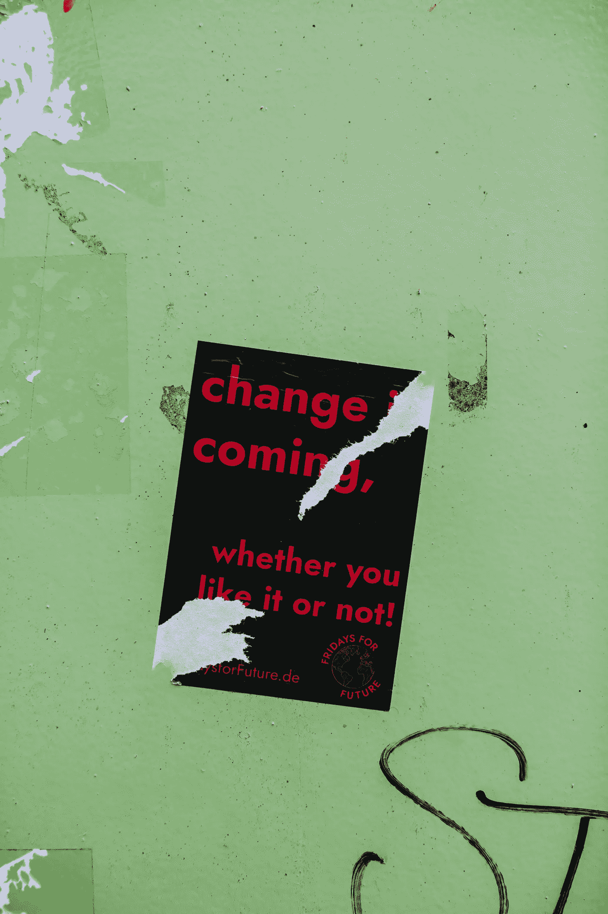

# 提示你接受改变的四个引号

> 原文：<https://medium.datadriveninvestor.com/four-quotes-to-prompt-you-to-accept-change-9da93a86b213?source=collection_archive---------23----------------------->

反抗是徒劳的(二手灵感项目)

Photo by [Olenka Sergienko](https://www.pexels.com/@olenkasergienko?utm_content=attributionCopyText&utm_medium=referral&utm_source=pexels) from [Pexels](https://www.pexels.com/photo/close-up-photo-of-black-ceramic-mug-3806690/?utm_content=attributionCopyText&utm_medium=referral&utm_source=pexels)

二手灵感项目从一句激励性的引语开始，在创造性道路蜿蜒的任何地方冒险。

这里有一些引语可以激励你利用你独特的能量。无论是在理想还是不利的条件下，你都有能力适应并茁壮成长。你已经拥有了内在的力量——它只是在等待被放大，这样你就可以发光。

# "如果你不喜欢你正在走的路，开始铺另一条路."—多莉·帕顿

这句话是你经常听到的“因为我们一直是这样做的”这句话的颂歌。

在你的职业和个人生活中看到显著改善的唯一方法是偶尔改变策略，尤其是如果你没有得到你想要的结果。大胆地做出可衡量的、必要的战略调整。

不要盲目地跟随别人走过的路，因为其他人都这样做。有时你需要描绘出你自己的轨迹来发现你应得的成功。

# “我们都住在同一栋房子里，我们都必须为保住我们的小房子出一份力。当你看到一些不正确的，不公平的，不仅仅是…做点什么。说点什么。要有勇气。有骨气。碍事。随风而行。一切都会好起来的。”约翰·刘易斯

领导者质疑现状，尤其是当它在道德或伦理上感觉不好的时候。

如果你的企业文化有毒且不包容，不要只是听下一个在会议中嘀咕的性别歧视笑话，假装这没什么大不了的。如果你的配偶经常侮辱你的孩子，为你的孩子挺身而出，作为一个家庭来解决这个问题。如果一个队友作弊，相应地解决它——即使这意味着你的团队可能会输掉一场比赛或者你可能会失去一些声望。

 [## 如何重新获得更大的成功|数据驱动型投资者

### 梅丽莎·拉姆森，拉姆森咨询公司的首席执行官，和梅根·m·比罗，分析师，品牌战略家…

www.datadriveninvestor.com](https://www.datadriveninvestor.com/2020/07/15/how-to-bounce-back-to-even-greater-success/) 

让莫邪为正义挺身而出很不方便也不容易。但是，有足够的勇气将问题摆在最前面，显示了这个世界所缺乏的胆识和领导力。

Photo by [Markus Spiske](https://unsplash.com/@markusspiske?utm_source=unsplash&utm_medium=referral&utm_content=creditCopyText) on [Unsplash](https://unsplash.com/s/photos/change?utm_source=unsplash&utm_medium=referral&utm_content=creditCopyText)

# “从痛苦的经历中走出来就像穿越单杠:为了前进，你必须在某个时候放手。”刘易斯

为什么人们很难忘记发生在自己身上的事情？有时候，它来自于试图“回到原来的样子”或者“回到你过去的样子”

但是你不能回到那个状态。

如果你试图做回坏事发生前的自己，你就不会完全康复。那个人已经不存在了——你注定会因为伤害或创伤你的事件而进化。

接受你正在成为的先进的人。这是一种升级。那个人一定会比旧版本的你更有韧性和情感意识。这是件好事。

# “放开你认为你应该是谁。拥抱真实的自己。”布琳·布朗

在我职业生涯的早期，一位前同事开玩笑地称我为“Zippo”我获得这个绰号是因为我总是通过挑战公司内部的现状来“放火和拉屎”(他的话，不是我的话)。

因为我是一个年轻的专业人士，每个人都希望我遵守规则，盲目地遵循既定的协议，没有怨言或问题。

但我不是那样的人。当有意义的时候我会遵守规则。但是我天生就喜欢评估过程，寻找更好的方法。我愿意尝试，失败，以进步的名义学习。我对消极没有耐心，尽管我有尖刻的评论，但我永远是个乐观主义者。

如果没有这种倾向，我的职业生涯将会功亏一篑。这种观点促使我将笨重过时的程序重新编写成易于使用的 Excel 宏，熟练地编写我办公室里没人想做的报告，并学习各种技能来确保我保持体面的工作量——即使在不景气的时候。如果我的同事劝我不要做 Zippo，我就只是公司里的一个普通人。我可能还是，但至少我在用自己的方式做事。

别人没有权利定义你。作为一个领导者，要了解自己，了解自己的价值观，承认自己的内心。倾听那些尊重和了解你的人。不要理会那些不愿意和你并肩作战的反对者；拥抱真实的自己。

变化的潮流流经你的生活，有时像温和的潮水，有时像海啸。是的，你会有休息的时间，在那里你可以安全地漂移，并找到时间来调整，获得平衡，或品味回报。但是改变是不可避免的，也是必不可少的。

有时候，当变革的浪潮来临，你不会确定它会变得更好。你可以把它贴上“压力”或“暂时情况”的标签有时候，你甚至会抗拒改变的吸引力。

但是如果需要的话，变化会一直贯穿你的生活。你可以相信这是必要的。水流会带你去你想去的地方，即使有时会颠簸或危险。

不要推迟你知道需要发生的改变。相信自己，接受挑战，因为你很棒。

我支持你。

阿德里安·s·波特是一名作家、工程师、顾问和演说家。他写诗歌、短篇小说和各种主题的文章，包括创造力和个人成长。他是诗集[和散文集](https://www.amazon.com/Everything-Wrong-Feels-Adrian-Potter/dp/109519061X/ref=sr_1_4?qid=1560264651&refinements=p_27%3AAdrian+S.+Potter&s=books&sr=1-4&text=Adrian+S.+Potter)[的作者。最近，阿德里安被提名为 2020 年 Lightscatter Press Prize](https://e2857002-6118-41be-9746-64261e36cacb.filesusr.com/ugd/21d2c2_03522f10c7c84340a05a8d03a97e1642.pdf) 的决赛选手。在[http://adrianspotter.com/](http://adrianspotter.com/)在线拜访他。

# 附加文字

[三句名言开启你的雄心](https://medium.com/datadriveninvestor/three-quotes-to-jump-start-your-ambition-e59dc4424e60?source=friends_link&sk=1aa2ece82ddde2e40bcafedf3a7e3bc0)

[你真了不起](https://medium.com/datadriveninvestor/you-are-amazing-274651127432?source=friends_link&sk=34312c5fa72f2109d6031c2a4b7c2e4c)

[选择乐观(即使没人乐观)](https://medium.com/datadriveninvestor/choose-optimism-even-when-nobody-else-is-6e41c467c7b9?source=friends_link&sk=e5d927fb83b6298c8f82f2fe28840729)

**访问专家视图—** [**订阅 DDI 英特尔**](https://datadriveninvestor.com/ddi-intel)