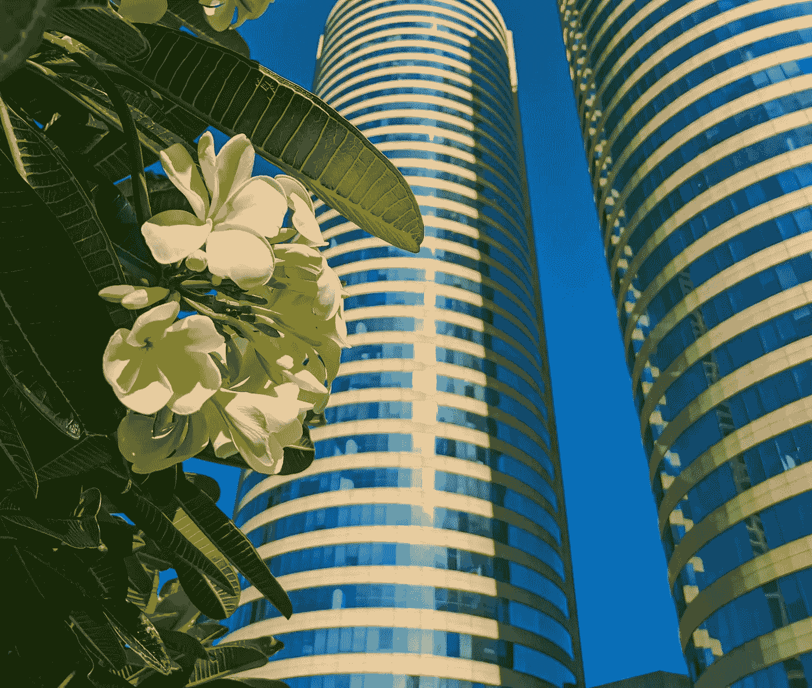

# 投资科伦坡证券交易所的四个理由

> 原文：<https://medium.datadriveninvestor.com/four-reasons-to-invest-in-the-colombo-stock-exchange-3dd2afdfac7f?source=collection_archive---------2----------------------->

## 现在是投资斯里兰卡的最佳时机

Photo credits: [Chamindu Perera](https://unsplash.com/@lifecapturealbum) on Unsplash.

由于种种原因，在斯里兰卡投资从来不是岛上大多数居民想都不敢想的事情。当我问他是否有兴趣投资时，一位朋友说:“*反正都是被操纵的。还有人跟我说，波动太大，不适合投资。*

说实话，没有人能够向**解释它是如何以及为什么被操纵的。他们告诉我，只有狡猾的经纪人和超级富豪最终会获得真正的回报。**

让我们仔细看看，这对于试图通过频繁买卖股票来赚钱的人来说是有意义的。但是，对于真正的*投资者*来说，这些微小的短期损益在长期盈利能力的内容中是无关紧要的。

另一方面，关于波动性，很容易理解为什么潜在投资者非常气馁。这个国家经历了许多动荡时期。

> 在遥远的过去，我们经历了一场战争。在最近的过去，我们在 2018 年经历了宪法危机，在 2019 年经历了恐怖袭击，在 2020 年经历了 COVID now。难怪主要指数 ASPI 从 2016 年到 2020 年下降了约 11%，这甚至发生在 COVID 之前。

然而，当你展望未来时，有几个原因可以让我们自信地说过去已经过去了。

## 1.政治稳定和国家安全

随着斯里兰卡总统的 SLPP 政党赢得立法机构三分之二的席位，经过五年多的等待，我们终于有了一个强大、稳定、一党执政的政府。总统 Gotabaya Rajapaksha 的兄弟和前总统 Mahinda Rajapaksha 现在是总理。

对于那些反对裙带关系和独裁主义的人来说，回归拉贾帕克萨主义可能会令人不快，但对斯里兰卡股市来说肯定是好事。与前总统西里塞纳政府的彻底混乱相比，他们是平稳的操作者，前总统西里塞纳曾声称他必须观察当地媒体，以了解他自己的政府在做什么。

 [## 社交证券交易所(SSE)是影响力投资的未来吗？数据驱动的投资者

### 令人振奋的是，全球私营部门的关注点正缓慢但肯定地转向…

www.datadriveninvestor.com](https://www.datadriveninvestor.com/2019/04/10/are-social-stock-exchanges-sse-future-of-impact-investing/) 

众所周知，尽管从斯里兰卡精英情报和安全基础设施获得了先进的情报，但西里塞纳在防止 2019 年恐怖袭击方面失败了。他就是不行动。他试图通过走后门让马欣达·拉贾帕克萨(Mahinda Rajapaksha)成为总理，这也引发了宪法危机。

前任政府**是由两个观点对立的政党拼凑而成的联盟**也有一起重大的债券内幕交易/利益冲突丑闻，加剧了股市的负面逆风。

> 现在，随着独裁的 Gotabaya Rajapaksha 执掌斯里兰卡，同时担任总统和国防部，无能的政客犯下的国家安全失误可以被排除在外——**斯里兰卡不会很快再次发生恐怖袭击。**

## 2.诱人的估值

截至 2020 年 8 月，斯里兰卡股市**比主要指数的历史高点**低 33.09%。仅今年一年就下跌了 14.16%，反映出市场的估值远低于其过去的价值。

这让你能够以有吸引力的估值购买股票，许多公司的股价都低于账面价值。对于长期投资者来说，这是一座*金矿*。这是一语双关，尤其是因为金价正处于创纪录高位。

尽管股价很低，但在 COVID，许多行业都表现出了弹性，一些物流和电信公司公布了可观的利润，所有这些都是可以争取的。

> 担心 COVID 的影响是很自然的。然而，我对斯里兰卡积极、持续的检疫和隔离做法有信心，随着世界缓慢跟随欧洲进入复苏，我们很有可能在未来几个月内幸存下来并留在原地。

当 COVID 袭击斯里兰卡时，股市仍在从 2019 年恐怖袭击的冲击中复苏，因此预计复苏将超过今年年初以来面临的 15%的贬值。

## 3.外国投资的回报

科伦坡证券交易所今年见证了大量的外资抛售。外资净流出量接近 100 亿卢比。250 亿。许多外国投资者正在撤离这个国家，但是有迹象表明这种情况将很快逆转。

我们已经看到，国际资产管理公司转而着眼于长期，向中国大举投资。资产管理公司国际金融公司最近对商业银行(锡兰商业银行)进行了 5000 万美元的股权投资。他们还投资了 175 美元给约翰·基尔斯集团，一家领先的斯里兰卡企业集团。

随着疫情逐渐消失，在政治稳定和国家安全的背景下，许多迹象表明，撤离的外国投资者可能会回来，获得有吸引力的估值，提振斯里兰卡股市。

## 4.充满活力的旅游中心

斯里兰卡的旅游业刚刚开始蓬勃发展。在复活节恐怖袭击和 COVID 之前，我们已经看到年度游客从 2011 年的 85.5 万增加到 2018 年的 233.3 万。**增长了 272%！**而且没有放缓的迹象。*难道人们不喜欢游览异国岛屿吗？*

当 lonely planned 将斯里兰卡命名为 2019 年的年度目的地时，2018 年也是正确的。

> 在顺风袭击我们之前，我们还没有看到旅游业的高峰。显然，当 COVID 结束时，旅游业将进入轨道！

旅游业对 CSE 上市的酒店和旅游公司有直接影响，但对所有其他行业来说，它仍有乘数效应。旅游业导致了几乎所有其他行业消费的普遍增长，向 200 多万人出售产品和服务。当游客蜂拥而至时，经济会繁荣起来。

总的来说，斯里兰卡目前可能处于低谷，但从现在起它只能向上走。对于长期投资者来说，看过去的小起伏，这是一个伟大的投资时间，当 COVID 结束，没有什么是斯里兰卡的限制。

通过投资于各种行业，包括电信、物流、金融服务、建筑、房地产、酒店和快速消费品，你可以接触到斯里兰卡经济的整个广度，同时可能限制风险。这也是一个很好的想法，看看长期，特别是如果你还年轻，再投资红利大约 15 年，所以可以建立一个被动的红利收入流。

> ASPI 今天是 5，261.99，几年后回来告诉我进展如何。

*注意:本文本质上是投机性的，并非专业投资建议。过去的业绩并不能保证未来的回报。股票投资，尤其是新兴市场的股票投资，包含风险，有涨有跌。你可能无法收回你最初投资的金额。投资前请咨询你的顾问或金融专业人士。作者可能不对您的投资决策的任何后果负责。*

**访问专家视图—** [**订阅 DDI 英特尔**](https://datadriveninvestor.com/ddi-intel)