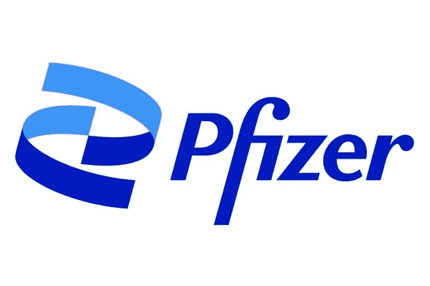
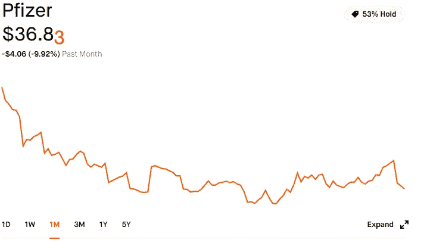

# 辉瑞股票值得买入的四个原因

> 原文：<https://medium.datadriveninvestor.com/four-reasons-why-pfizer-stock-is-a-great-buy-cb04ae3a4811?source=collection_archive---------18----------------------->

## 这种股息收入股票为增长提供了充足的上升空间和诱人的股息。

Pfizer Logo. Image Source: Pfizer

辉瑞公司的股票本周是一个很好的购买，随着本月股票的额外购买，它将代表我的股息产生股票投资组合的更大一部分。有四个主要原因让我对购买更多辉瑞股票感到兴奋。

Pfizer Performance over 30-days — Down almost 10% from a ~$41 price point.

## 2021 年增长潜力巨大

尽管对 2021 年的盈利前景持乐观态度，但辉瑞的股票在过去一个月仍大幅下跌。有人对辉瑞在全球提供新冠肺炎疫苗的速度表示担忧。人们担心，在全世界建立起针对疫情的群体免疫之前，其他公司将开发出功能性(或许更好)疫苗，这导致了一些短期抛售。

尽管在新冠肺炎时代之外，辉瑞的商业前景和药品目录仍然是该公司收入和增长潜力的巨大来源。

Covid-19 Vaccination. Image Source: Canva Pro

在摩根大通医疗保健会议上，辉瑞高管 Albert Bourla 预计该公司调整后的每股收益将从目前的 2.96 美元增长到 3.00 美元至 3.10 美元。辉瑞公司基于许多商业考虑和因素制定了这一更新指南，包括该公司希望在未来一年与 BioNTech 合作生产的新冠肺炎疫苗获得的额外合同。

如果辉瑞将 2021 年的 [13.4%的增长目标](https://www.wsj.com/market-data/quotes/PFE/research-ratings)设定为每股 41.77 美元，并且你将 4.2%的股息计算在内，那么以今天的价格计算，你在 2021 年对辉瑞的投资将增长 17.6%。

就预期增长而言，19 位不同分析师的总体评级为“增持”，即使不考虑辉瑞令人印象深刻的股息收益率，辉瑞也是一个不错的选择。

## 高额股息

大多数消息来源认为标准普尔 500 的平均年股息在 1.8%到 2%之间。辉瑞目前的收益率约为 4.1%，其股息(以及支持股息的自由现金流)对股东来说是一笔诱人的红利。随着 2020 年 12 月 11 日宣布的最新季度分配，股东将获得每股 0.39 美元，比上一季度增长 2.6%，收益率为 4.2%。

随着[分析师对辉瑞的平均定价目标](https://www.wsj.com/market-data/quotes/PFE/research-ratings)为 41.77 美元，这意味着 13.4%的上涨空间。在 4.2%的收益率下，如果你以撰写本文时的价格购买辉瑞股票，2021 年的有效成本收益率将为 4.76%。

 [## 我在 2021 年 1 月买入的股息收入最好的股票

### 这只股票不能抓住机会开始新的一年，但这意味着从长远来看，更多的增长和收入潜力。

medium.com](https://medium.com/datadriveninvestor/the-best-dividend-income-stock-im-buying-in-january-2021-86bfa83e14b9) 

## 股息增长

自 2010 年以来，辉瑞一直在增加每年支付给股东的股息，使其成为股息竞争者。作为一个制药巨头，辉瑞有现金流来支持这些股东分配。随着目前预期的每股收益指引从 2.96 美元变为 3.10 美元，对公司而言，更多的价值和更高的股息收益率意味着投资者口袋里有更多的钱。

 [## 通过分红积累财富的最佳方式

### 如何建立一个能产生股息的证券引擎，在未来的几年里创造财富。

medium.com](https://medium.com/datadriveninvestor/the-best-way-to-build-your-wealth-through-dividends-40f65c7617f5) 

像辉瑞公司所展示的那样，增加股息的趋势显示了对企业的信心，并成为奖励股东长期持有公司股份的强大动力。

## 对 Covid 疫苗的强烈需求

在整个 2021 年，辉瑞和 BioNTech 预计将为全球合同额外生产[20 亿剂疫苗](https://www.forbes.com/sites/katiejennings/2021/01/12/pfizer-biontech-boost-vaccine-production-goal-to-2-billion-doses-in-2021/?sh=66663dd548a5)。对疫苗的需求远远超过了目前的供应量。一些投资者和分析师预测，拜登政府在新的联邦指导下，将有助于促进疫苗在美国更有效的分发时间表。

今天，加拿大总理贾斯廷·特鲁多宣布一笔[交易达成](https://www.reuters.com/article/health-coronavirus-canada/canada-strikes-deal-for-extra-20-million-doses-of-pfizers-covid-19-vaccine-pm-idUST5N2HE01O)，加拿大将从辉瑞公司额外购买 2000 万剂新冠肺炎疫苗。根据这份额外的合同，加拿大预计将在 2021 年从辉瑞/BioNTech 购买 8000 万剂药物。

随着本周辉瑞公司的额外购买，这只股票占我非退休投资账户中产生股息的股票的 5.05%。

## 在哪里购买辉瑞的股票

Image Source: Canva Pro.

[今天开始交易，当你用这个链接](https://join.robinhood.com/drewc1172)注册一个 Robinhood 账户时，就可以获得一只免费的神秘股票。*(披露:这是我的关联公司* [*链接*](https://join.robinhood.com/drewc1172) *当你注册时，我也会得到一份免费的股票。)*

*以上内容仅代表一种观点，仅供参考。是* ***而不是*** *的投资建议。找一个有正式执照的专业人士寻求投资建议。*

*声明:我在上述股票中做多，并且无意在文章发表后的 72 小时内出售任何相关股票。*