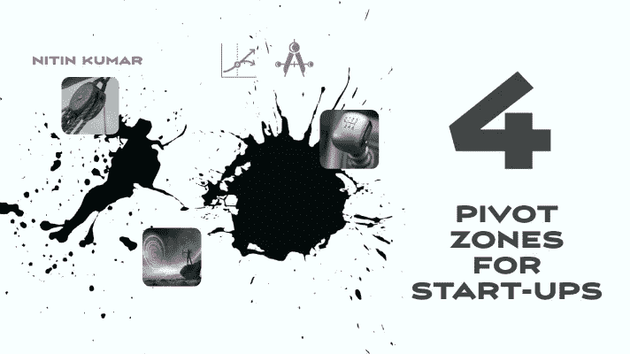
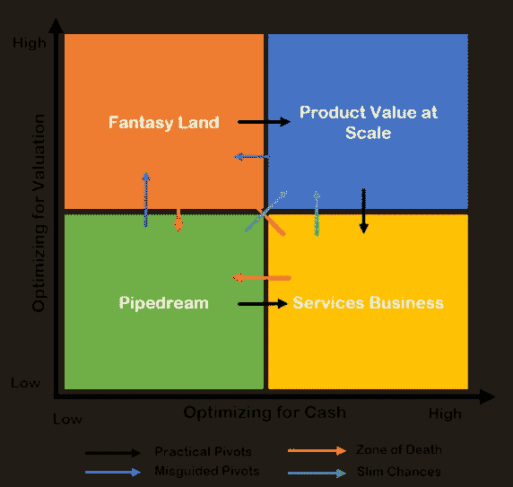

# 初创企业的四个枢纽区

> 原文：<https://medium.datadriveninvestor.com/four-start-up-pivot-zones-d2562e6750d8?source=collection_archive---------9----------------------->

Image created by author using Spark

估值优化与现金流优化的意外后果

# 介绍

Pivots 不仅仅是一个时髦的词，许多初创公司只是为了它而使用这个术语，很少理解它的解剖学、力学以及他们自己执行一个好的 pivots 的能力。虽然有许多不同的理由来进行转换，以及全面实现转换的方法，但本文将研究由两种选择创建的转换区，即优化现金流与优化估值。许多初创企业在其发展的早期就陷入了这些陷阱。这些决定产生了有意和无意的后果，将企业带到了一个需要支点的地方。这些支点中有些是实用的，有些是困难的，有几条路通向不了任何地方。在本文中，我将阐明几个不同的区域，并详细研究它们。

我在 TMT(技术、媒体和电信)领域工作了 20 多年，担任过各种角色，包括高管、管理咨询合伙人、董事会成员和风险投资人——评估公司如何进入这些领域对我来说非常有趣。我正在分享我在职业生涯中担任的角色中从不同角度观察到的一些情况。有关执行整体转换的更详细视图，请点击此处。

许多创始人和首席执行官在最初几年在优化估值和优化现金流之间左右为难。这是有后果的，在光谱的任何一端过度指数化是一种故意的策略，并使公司偏离原来的道路，这是他们的心态、失误、行动以及纠正或适应能力的副产品。

# 路径和姿势

公司，由于他们的领导和文化，可以有意或无意地采取四种典型姿态中的一种，这些姿态也可以在他们可以启动支点的点上稳定，生存，增长，甚至死亡。这些姿态的演变是由于四种不同的心态、风格和价值创造观念在起作用——它们为公司创造了不同的结果和支点。让我们更详细地探讨它们。下面的图 1 提供了一个框架，用于实践中的关键点、艰难的战斗以及可能出现的某些失败。

Postures and Pivot Zones (Image by author)

# 白日梦

这些公司由自恋的创始人领导，他们专注于自己的技术，同时建立了一种非常以工程为中心的组织文化。有一点傲慢，过度自信于他们对市场需求的理解，吸引客户，或承认市场现实。他们只能与技术含量高的客户打交道，并可能通过制造技术不对称来挤垮弱势买家。有时，他们设法使用深奥的技术词汇来打动错误的客户角色，并将其误认为是市场牵引和扩大规模的机会。

这些公司中的大多数既没有创造最佳现金流，也没有估值，它们挣扎了一段时间，从来没有增加那么多客户。他们最实际的支点将是增加专业服务团队，进行大量定制以简化产品部署，生存并最终成为具有项目化商业模式的服务公司。有了正确的领导、心态的转变、大量的努力和资本，转向能够创造规模价值的产品的可能性很小。将包袱甩向后一个支点并不简单，而且会带来重大的执行风险。试图转向幻想世界的白日梦公司通常会在软件墓地着陆。

# 幻想世界

炒作的创造者和炒作的骑手，经常抓住镇上的新时尚，创造与现实或市场需求完全脱节的大炒作。他们的唯一目标是通过与新趋势的关联创造一个被夸大的估值。他们通常由营销主管或非常精通营销的首席执行官领导，他们利用公共关系、分析师，甚至创造一些小客户。他们被认为是远见卓识者，至少在最初，他们的愿景更多地与媒体、投资者和思想领袖产生共鸣，而不是有能力创造实际的客户价值。它们的价格也很高，一旦客户痴迷结束，就会造成客户流失，在可预见的未来实现有限的投资回报。

早期采用被误认为是找到了产品市场的契合点，更多的资本很容易被吸引。通常情况下，这些产品很少完全成熟或解决实际问题，早期采用者主要是行业开拓者或局外人，没有快速追随的客户。一些从幻想世界起步的公司最终发现了狭窄的用例，适应了市场，雇佣了合适的团队，并在新领导的带领下通过有组织的中枢转移到了规模化的产品价值。随着时间的推移，他们中的许多人在估值上受到侵蚀，最终成为梦工厂，只有原始知识产权和工程人才是他们真正的价值驱动资产——大多数人最终成为被收购者，即不再作为真正的企业存在，被出售给人才或添加到数字垃圾堆的软件碎片中。关于每个公司原型的姿态和支点的框架，请参考图 1。

 [## 旋转你的创业？4 种正确的方法|数据驱动的投资者

### 1)储备现金——在早期阶段，尤其是种子期，你有可能会一直转到找到…

www.datadriveninvestor.com](https://www.datadriveninvestor.com/2020/12/13/pivoting-your-startup-4-ways-to-do-it-right/) 

# 副产品服务业务

这些企业痴迷于创造现金流，许多被误导的创始人和首席执行官认为增加收入会以某种方式创造生存跑道，最终会提高估值。没有什么比这种想法更误导人了，估值关乎收入的质量和大规模交付产品价值的能力——数量有时不那么重要。这种项目化和面向服务的性质很大程度上归因于非常重的销售导向文化、服务思维和取悦每一位客户的令人信服的理由。

观察到的另一个普遍现象是，创始人以前没有产品经验，或者在较大的 IT 服务业务中开发过产品。他们缺乏产品管理纪律，来自以关系为导向的销售文化，不能在把每一个客户要求变成产品要求的同时说“不”。一旦一家公司走上项目化和服务化的业务之路，过度承诺和大量定制行为，就会扼杀扩大规模的能力，尽管会继续产生一些现金流。

这种方法在一家公司非常早期或正在交付启动资金时有效，但如果不及时纠正，可能会成为不可逆转和不可扩展的陷阱。针对现金流进行优化会产生多种产品变体、沉重的产品支持成本、不断增长的专业服务组织、消防文化、产品路线图上不断变化的优先级、不可预测的销售周期以及回旋余地有限的定价压力。它可以被认为是一个产品业务衰退成一个低效运行的服务业务模式。

唯一合理的支点是产品价值象限。但是，如果不对产品、人员、文化、心态和领导力进行彻底改革，实现这一目标将是一项艰巨的任务——许多公司最终会关闭，成为现金流企业，或者被估值潜力有限的大型服务公司收购。

# 规模化产品价值

这些公司专注于创造价值，而不是过度关注创造估值炒作或追逐每一个客户的现金流。更高的估值、客户吸引力、投资者信心、资本化和现金流是卓越的战略、执行和正确的首席执行官领导的副产品。

价值主张是通过“向后看市场”而不是“向前看代码”来产生的，他们专注于通过配置和融合正确的团队和正确的角色来真正解决市场中的问题。愿景本身首先是引人注目的，它也可能是逆向的，扰乱现有的在位者，但很快找到令人信服的产品市场匹配。

大规模实现产品价值和破解初始代码也不会让一家公司永远立于不败之地——失败的支点已经终结了许多公司在幻想世界的象限。优秀的公司已经执行了支点，并发展了新的收入流，如服务，作为创造额外价值或推出新产品的深思熟虑(而不是衰退)的战略。通常，这些公司中的许多会上市，以高估值被收购，或者通过成倍增加价值来扩大规模。

# 分析透视路径

发现人们开始或认为他们在一个象限，但生活或意外地在另一个象限，这并不奇怪。有时存在可控和不可控的因素，例如，迫使公司生存的资本问题使他们追逐短期现金流，来自投资者、顾问、董事会成员等不同方向的冲突力量。、或创始人背景和个性等。

一家公司在错误象限运营的时间越长，这个支点就变得越困难、风险越大、资本越密集。很多时候，这些问题可以归因于这些公司领导的素质和经验。我见过有远见的技术专家多年来都无法制造出可行的产品，非常平庸和平凡的产品因为解决了一个真正的问题而规模扩大，还有经验丰富的领导者在没有真正理解整体和良好枢轴的机制的情况下错误地启动枢轴。

# 结论

重型工程文化让你停留在白日梦象限，而市场导向型公司则停留在幻想世界。一个没有产品纪律的销售导向型文化将会衰退成一个低效的项目化经济的服务企业——每一个决策都必须考虑权衡并评估意想不到的后果。

在销售、营销、工程或产品等方向上的倾斜会对最终的商业模式产生意想不到的后果。带有单向职能文化的高估值或高现金流思维模式可能会让公司陷入一个难以实现转型的境地。如果一家公司有自知之明，进行有意识的权衡，并理解所承担的风险，他们就能在太多包袱堆积之前转向。

# 其他相关条款

[枢轴的解剖](https://medium.com/datadriveninvestor/the-anatomy-of-a-pivot-b9acda5915ca)

[软件墓地](https://medium.com/the-innovation/anatomy-of-the-software-graveyard-c506d1c6bb9f)

[产品价值泄露:IT 服务心态问题](https://www2.slideshare.net/nitkumar2/product-value-leakage-the-it-services-mindset-problem)

# 关于作者

尼廷·库马尔在高科技行业有 20 年的经验。他的职业生涯跨越了许多企业软件和管理咨询领域的高管职位。他的热情是通过强大的关系和差异化的产品推动组织取得更大的成功。他被认为是企业建设者、思想领袖和许多创新方法的先驱。在他担任运营和咨询职位期间，他成功地扭转、转变和调整了许多软件业务和规模业务。

## 访问专家视图— [订阅 DDI 英特尔](https://datadriveninvestor.com/ddi-intel)