# 从零开始用 Python 实现图像处理的傅立叶变换。

> 原文：<https://medium.datadriveninvestor.com/fourier-transform-for-image-processing-in-python-from-scratch-b96f68a6c30d?source=collection_archive---------0----------------------->

> 在这个博客中，我们也从零开始实现 DFT，FFT 和 IFFT。

> 此博客先前发表于
> 
> [https://www . datadriveninvestor . com/2020/10/23/Fourier-transform-for-image-processing-in-python-from-scratch/](https://www.datadriveninvestor.com/2020/10/23/fourier-transform-for-image-processing-in-python-from-scratch/)

首先，处理数学问题真的很有趣。对吗？我知道答案可以是也可以不是。仍然将数学应用于现实世界的优化问题，建模将会非常好。我最近开始这样做，看看事情是如何为我工作的。因此，这篇博客是我学习的一部分，旨在了解如何利用傅里叶变换技术降低卷积的计算复杂度。我会尽量说得详细一点。

> 查看此报告，使用 Python 从头开始构建离散傅立叶变换、傅立叶变换、快速傅立叶逆变换和快速傅立叶变换。

 [## raoofnaushad/傅里叶变换用于图像处理

### 此时您不能执行该操作。您已使用另一个标签页或窗口登录。您已在另一个选项卡中注销，或者…

github.com](https://github.com/raoofnaushad/Fourier-Transformation-for-Image-Processing) 

我们来看看维基百科对傅立叶变换有什么说法。

> 来源- [维基百科](https://en.wikipedia.org/wiki/Fourier_transform)
> 
> 在[数学](https://en.wikipedia.org/wiki/Mathematics)中，**傅立叶变换** ( **FT** )是一种[数学变换](https://en.wikipedia.org/wiki/Integral_transform)，它将[函数](https://en.wikipedia.org/wiki/Function_(mathematics))(通常是时间的[函数，或者是](https://en.wikipedia.org/wiki/Time-variant_system)[信号](https://en.wikipedia.org/wiki/Signal))分解成其组成[频率](https://en.wikipedia.org/wiki/Frequency)，例如音乐[和弦](https://en.wikipedia.org/wiki/Chord_(music))在其组成音符的音量和频率方面的表达。术语*傅立叶变换*指的是[频域](https://en.wikipedia.org/wiki/Frequency_domain)表示和[数学运算](https://en.wikipedia.org/wiki/Operation_(mathematics))，后者将频域表示与时间函数相关联。

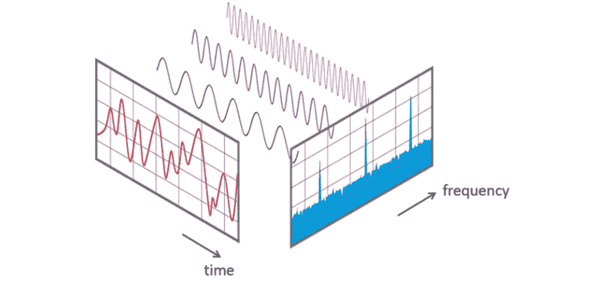

Fourier Transform — [Source](https://betterexplained.com/articles/an-interactive-guide-to-the-fourier-transform/)

是不是很混乱？如果是，让我们看看它如何帮助我们。

该算法有助于我们将在时间上分散的输入信号(如上图所示)分成长度、幅度和相位等多个频率，这样所有这些频率就可以重组原始信号。

因此，它实际上将数据信息从时域转换到频域，也可以反向转换。

让我们打个比方。我们通常沏好茶。茶的成分是牛奶、茶粉、糖和水。这里傅立叶变换帮助我们将原料分成 4 个不同的瓶子，每个瓶子里有一种原料。这就是 FT 所做的——它将整个输入分解成它的成分。

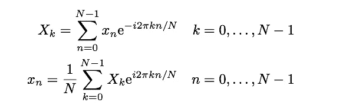

Fourier Transform equation — [Source](https://betterexplained.com/articles/an-interactive-guide-to-the-fourier-transform/)

## 让我们开始努力吧。

我们的主要目的是使用傅立叶变换来降低卷积的计算复杂度。在计算、物理、混音等领域有很多应用..

你知道卷积是如何工作的，我们用一个过滤器(内核),我们将有一个图像，所以我们将过滤器悬停在图像像素上，然后将它们相乘并相加。在这之后，过滤器移动到下一组像素，乘以然后求和。

哇哦。将会有大量的乘法和计算复杂性。

Convolving through an image — [Source](https://www.youtube.com/watch?v=8rrHTtUzyZA&feature=emb_logo)

我们如何用傅立叶变换来解决这个问题？

与卷积相关的傅立叶变换有一个非常好的特性。这提到两个信号的卷积等于它们的傅立叶变换的乘法。耶！因此，我们可以对整个图像进行傅立叶变换，而不是乘以内核，只需要进行一点点乘法。这甚至可以应用于卷积神经网络。在卷积层之前，将输入和内核转换到频域，然后相乘，再转换回来。尽管它处理变换和逆变换，但它的计算开销仍然较小。

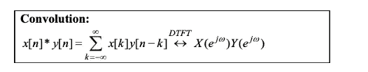

Property — [Source](https://towardsdatascience.com/fast-fourier-transform-937926e591cb)

在开始实施和应用之前，让我们先看看并理解**傅里叶变换**和**快速傅里叶变换**的区别，以及我们为什么更喜欢快速傅里叶变换？。

这是傅立叶变换的方程式。

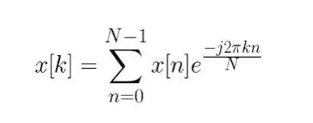

DFT Equation — [Source](https://towardsdatascience.com/fast-fourier-transform-937926e591cb)

在`Fourier` `Transform`中，我们将每个信号值`[n]`乘以`e`的某个函数`n`。所以这里是 N(乘法)x N(加法)，因此 Big-O 符号中的`computational complexity`是`O(N²)`

`Fast Fourier transform`是一种寻找傅立叶变换的方法，其中`minimise this complexity`通过一种称为`divide and conquer`的策略，因此计算复杂度将降低到`O(NlogN).`查看下表，它如何帮助我们找到傅立叶变换。

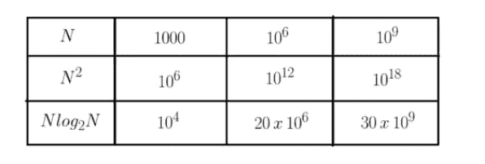

Computation Complexity of FFT & FT — [Source](https://towardsdatascience.com/fast-fourier-transform-937926e591cb)

所以让我们考虑一个需要`1 nano second for a operation`的例子。需要`Fast Fourier Transform`在`30s.`中完成，但是常规算法需要的不仅仅是`10¹⁸ => 31.2 years.`

 [## 用 Python |数据驱动投资者进行股票价格时间序列预测简介

### 在这个简单的教程中，我们将看看如何将时间序列模型应用于股票价格。更具体地说，一个…

www.datadriveninvestor.com](https://www.datadriveninvestor.com/2020/07/07/introduction-to-time-series-forecasting-of-stock-prices-with-python/) 

如果你想了解更多关于快速傅立叶变换计算复杂性和简单实现的内容，请点击下面的链接。

 [## 快速傅里叶变换

### 如何从零开始用 Python 实现快速傅立叶变换算法？

towardsdatascience.com](https://towardsdatascience.com/fast-fourier-transform-937926e591cb) 

# 傅立叶变换在图像处理中的应用。

我们将遵循这些步骤。
1)快速傅立叶变换，将图像变换到频域。
2)将原点移到中心，以便更好地观察和理解。
3)应用过滤器过滤掉频率。
4)反转步骤 2 中的操作
5)使用快速傅立叶逆变换进行逆变换，以从频域获得图像。

## 一些分析

*   数字图像不是连续的，所以我们用 DFT 代替傅立叶变换。

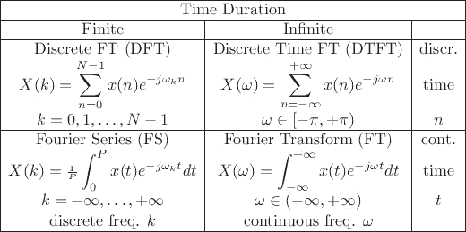

Discrete and Continuous Fourier Transformation — [Source](https://ccrma.stanford.edu/~jos/mdft/Fourier_Transforms_Continuous_Discrete_Time_Frequency.html)

*   普通的 DFT 比较慢，所以我们选择了 FFT。(原因如上所述)

> 让我们尝试将图像转换到频域，并将其恢复到原始形式。

1.  首先我们必须阅读图像。这里我们使用 CV 包来读取图像。现在图像以灰度格式加载。

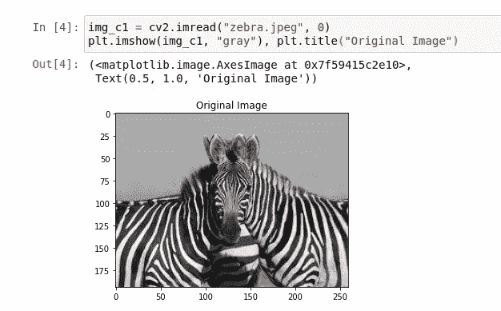

Generated By Author

2.现在我们将应用 numpy 包中的 FFT。这意味着我们获取离散的图像像素值，并将其转换到频域并可视化。整个信息被保留，但是被转换到另一个域。

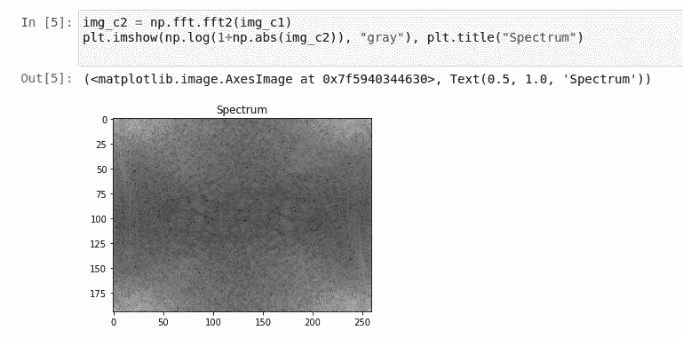

Generated By Author.

这里可以看到，角上有白点，代表低频成分。

3.在这一步中，我们从角落到中心取原点。这导致中心部分包含低频分量，而其他部分包含高频分量。

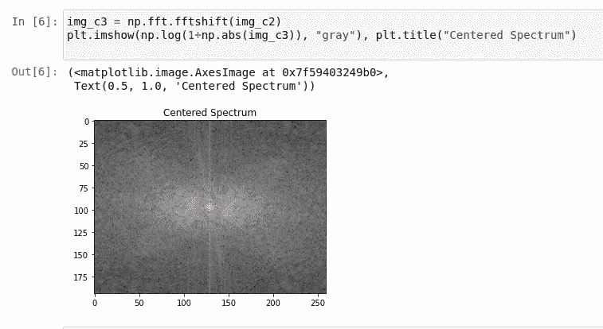

Generated By Author.

4.下一步，我们将把原点分散到它应该在的地方，这样我们就可以把频域中的图像转换回原来的样子。

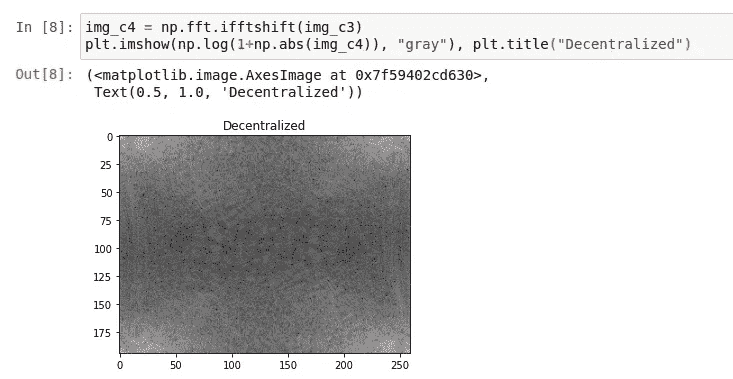

Generated By Author.

5.最后一步，这里我们使用逆傅立叶变换从频域反转图像。

Generated By Author.

## 图像处理。

图像中的低频是缓慢变化的像素值，这意味着颜色略有变化的平滑区域。类似地，高频是其值快速变化的像素。这包括像素值快速变化的边缘。因此，当我们需要用各种方法处理图像时，我们需要在边缘检测、平滑、去除噪声等应用中应用各种过滤器、遮罩等..我们常用的滤波器有高通滤波器、低通滤波器、理想滤波器、巴特沃斯滤波器等..

让我们尝试一些处理..

我们现在要研究高斯滤波器。

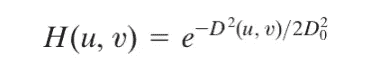

Gaussian Low Pass Filter — [Source](https://medium.com/@hicraigchen/digital-image-processing-using-fourier-transform-in-python-bcb49424fd82)

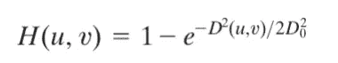

Gaussian High Pass Filter -[Source](https://medium.com/@hicraigchen/digital-image-processing-using-fourier-transform-in-python-bcb49424fd82)

在这种情况下，高斯低通滤波器的公式中，D₀为正常数，D(u，v)为频域中点(u，v)与频率矩形中心之间的距离。高斯高通滤波器公式，其中 D₀为正常数，D(u，v)为频域中点(u，v)与频率矩形中心之间的距离。这些等式如上所示。

这些过滤器是如何工作的？

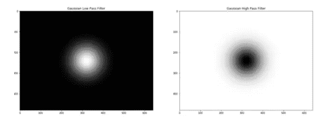

Gaussian High and Low pass filter — [Source](https://medium.com/@hicraigchen/digital-image-processing-using-fourier-transform-in-python-bcb49424fd82)

因此，在低通滤波器中，只有中心部分具有高值，超出中心部分会减小。正如我们已经看到的，中心包含低频成分。因此，当我们相乘并保持低频时，它去除了高频分量。另一种情况正好相反。

现在使用这个滤波器，我们的过程是将这些滤波器与图像相乘，而不是将滤波器卷积到整个矩阵。(这就是傅立叶变换在计算中帮助我们的方式)

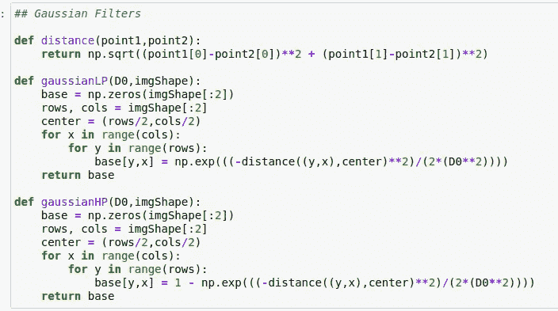

Function for Gaussian Filter

现在让我们再次做这个过程。

1.  将图像转换为离散傅立叶变换这里我们使用快速傅立叶变换。
2.  将原点移至中心。
3.  通过将滤波器与图像的傅立叶表示相乘来应用滤波器。
4.  逆转转变。
5.  图像的逆傅立叶变换。

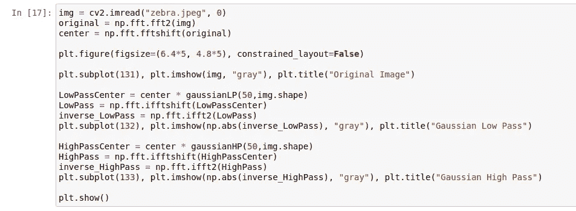

Generated By Author

在上面的代码片段中，我们执行了上面的步骤，并得到了观察到的结果。

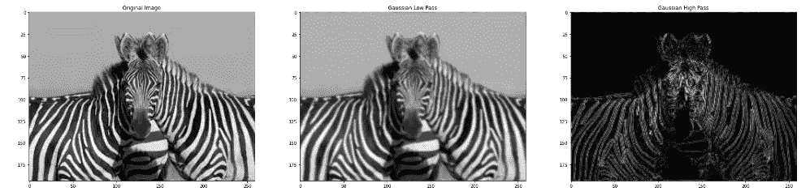

Genearated By Author

查看下面的 Github repo。

 [## raoofnaushad/傅里叶变换用于图像处理

### 此时您不能执行该操作。您已使用另一个标签页或窗口登录。您已在另一个选项卡中注销，或者…

github.com](https://github.com/raoofnaushad/Fourier-Transformation-for-Image-Processing) 

> 帮我用梦想教育印度农村的孩子。让我们从他们当中培养出一些世界领袖。
> [https://www.buymeacoffee.com/raoofnaushA](https://www.buymeacoffee.com/raoofnaushA)

感谢您的阅读和宝贵时间。

## 获得专家视图— [订阅 DDI 英特尔](https://datadriveninvestor.com/ddi-intel)