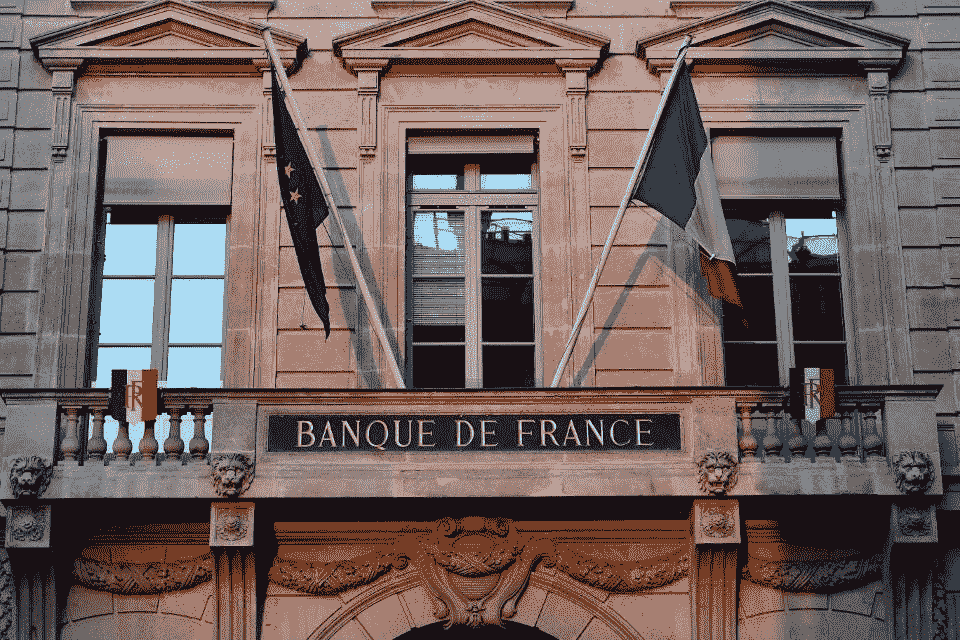

# 法国副行长勾勒出稳定的货币支付系统之路

> 原文：<https://medium.datadriveninvestor.com/frances-deputy-governor-outlines-a-path-for-stablecoin-payment-systems-771aec256a47?source=collection_archive---------13----------------------->

法国央行第一副行长丹尼斯·博(Denis Beau)在“欧洲的雄心”Stablecoin 会议上发表了讲话。巴黎欧洲广场和 ConsenSys 在今年一月组织了这次活动。博先生谈到了好的和坏的方面。他概述了监管机构在稳定硬币采用政策方面的三项任务。

Getty Images

Beau 先生说，“很明显，它们提供了改善我们支付系统的机会，但也带来了必须解决的重大风险。在这种情况下，私营部门实体的首要责任是设计不会给我们的支付系统带来不当风险的安排。”最近在 2020 年世界经济论坛上，其他决策者也有同样的想法。

在演讲中，他认为法国和欧洲经济体的监管者应该做出回应，保护稳定币创新可能带来的积极潜在影响。第二，它们需要在国际一级协调监管框架。第三，政策制定者应该努力——包括现场实验——解决当前支付和结算格局的弱点。

 [## 2019 年十大区块链课程|数据驱动的投资者

### 渴望在区块链发展吗？你想知道区块链是如何工作的，但不知道在哪里？或者就是太多了…

www.datadriveninvestor.com](https://www.datadriveninvestor.com/2019/03/08/top-10-blockchain-courses/) 

他承认，抵押代币可以为现代金融体系带来两个好处:更快、更便宜的零售消费者支付服务，以及批发支付清算和结算系统。

不仔细考虑，稳定硬币的采用可能会带来经济和稳定风险。Beau 先生指出，“作为交易所的中介，稳定硬币远不如具有法定货币地位的结算资产有效，因为(一)它们并不完全稳定，因为它们的价格稳定性取决于一篮子资产的价值，以及(二)它们不保证在欺诈情况下退款。”

在总结发言中，他说，“我们应该保持开放的态度，深入了解当前金融领域的创新，包括通过实验。”

区块链话题对央行行长和政策制定者产生了影响。似乎很明显，2020 年将会有更多来自监管机构的讨论。stablecoin 采用的未来是未知的，但支付技术的改进应该是创新的优先事项。

关注我，看看我的其他作品 [Twitter](https://www.twitter.com/@robertanzalon15) 或[这里](https://medium.com/@ranzalonejr)。[领英](https://www.linkedin.com/in/robertanzalonejr/)。

我报告了银行和企业公开采用加密货币、抵押代币和稳定硬币的情况。我的报道包括区块链和分布式分类帐。

*原载于*[*https://www.forbes.com*](https://www.forbes.com/sites/robertanzalone/2020/02/01/frances-deputy-governor-outlines-a-path-for-stablecoin-payment-systems/)*。*