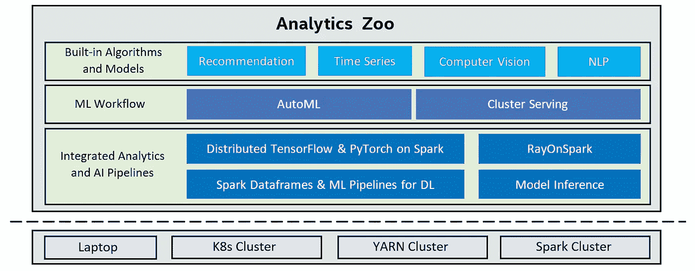

# 面向数据科学家的免费开源 Keras Tensorflow 在线资源

> 原文：<https://medium.datadriveninvestor.com/free-and-open-source-keras-tensorflow-resources-available-online-for-data-scientists-7f98f4c139cd?source=collection_archive---------17----------------------->

## **Keras** 是用 Python 编写的深度学习 API，运行在机器学习平台 **TensorFlow** 之上。它的开发重点是支持快速实验。能够尽快从想法到结果是做好研究的关键。

> k**era**是一个高级接口，使用 Theano 或 **Tensorflow** 作为其后端。在 CPU 和 GPU 上都运行流畅。Keras 支持神经网络的几乎所有模型——全连接、卷积、池化、递归、嵌入等。此外，这些模型可以组合起来构建更复杂的模型。

> 在本帖中，你将发现我们可用的最好的 和 ***开源 Keras Tensorflow 资源*** 中的 ***5 个。我们将在 Github*上为感兴趣的人回顾五个最好的开源资源***Keras tensor flow***。****

> *如果你喜欢读这篇文章，我相信我们有着相似的兴趣，并且现在/将来会从事相似的行业。那么我们就通过 [LinkedIn](https://www.linkedin.com/in/mrinal-walia-b0981b158/) 和 [Github](https://github.com/abhiwalia15) 来连线吧。请不要犹豫发送联系请求！*

**

> *学习不仅仅是为了更好地胜任工作，而且远不止于此。[***【data camp】***](https://datacamp.pxf.io/x9nmvv)*让我学无止境。**
> 
> *[***data camp***](https://datacamp.pxf.io/x9nmvv)*为您提供所需的灵活性，让您可以利用自己的时间参加课程，学习向成功职业过渡所需的基本技能。**
> 
> *[***【data camp】***](https://datacamp.pxf.io/x9nmvv)*教会了我快速获取新想法，并将其应用于现实世界的问题。当我还在学习阶段的时候，*[***data camp***](https://datacamp.pxf.io/x9nmvv)*让我对课程中发生的一切都着了迷，从课程内容和 TA 反馈到 meetups 活动和教授的 Twitter feeds。**
> 
> *这里有一些我最喜欢的课程，我强烈推荐你学习，只要它符合你的时间表和心情。你可以将从这些课程中学到的概念和技能直接应用到工作或大学中令人兴奋的新项目中。*

1.  *[使用 python 的数据科学家](https://datacamp.pxf.io/LPDqQZ)*
2.  *[数据科学家与 r](https://datacamp.pxf.io/MXQxrJ)*
3.  *[机器学习科学家与机器人](https://datacamp.pxf.io/DVLg4j)*
4.  *[使用 python 的机器学习科学家](https://datacamp.pxf.io/9WePXW)*
5.  *[面向所有人的机器学习](https://datacamp.pxf.io/kjR3mN)*
6.  *[人人共享的数据科学](https://datacamp.pxf.io/15bLmd)*
7.  *[使用 python 的数据工程师](https://datacamp.pxf.io/jW13ve)*
8.  *[使用 python 的数据分析师](https://datacamp.pxf.io/kjR3mz)*
9.  *[基于 pyspark 的大数据基础](https://datacamp.pxf.io/e4RM6r)*

****回到正题-****

# *1.细分 _ 模型*

## *[Github 链接](https://github.com/qubvel/segmentation_models)*

## *[星星:2.8K |叉子:668](https://github.com/qubvel/segmentation_models)*

**

*S [***分割模型***](https://github.com/qubvel/segmentation_models) 是 ***带神经网络的 Python 库*** 用于*图像分割基于**[**Keras**](https://www.keras.io/)和 [**TensorFlow**](https://www.tensorflow.org/) 。本报告包含 ***带有预训练主干的分段模型。喀拉斯和张量流喀拉斯。*******

## ****该库的主要特点是:****

*   *****高级 API(只需两行代码来创建一个用于分段的模型)*****
*   *****二值和多值图像分割的四种模型架构(包括传奇单元)*****
*   *****每个架构 25 个可用主干*****
*   *****所有脊椎都有预训练的重量，以便更快更好地收敛*****
*   *****有用的细分损失(Jaccard、Dice、Focal)和指标(IoU、F-score)*****

# ****2.深度学习 Keras Tensorflow****

## ****[Github 链接](https://awesomeopensource.com/project/leriomaggio/deep-learning-keras-tensorflow)****

## ****[星星:2.8K |叉子:1.3K](https://github.com/leriomaggio/deep-learning-keras-tensorflow)****

********

****D [***eep 学习 Keras Tensorflow***](https://github.com/leriomaggio/deep-learning-keras-tensorflow)*是一个带有 ***的知识库，介绍带有 Keras 和 tensor flow 的深度神经网络。********

## *****该存储库的内容如下:*****

## *******第一部分:导言:*******

*   ******人工神经网络简介******
*   ******深度学习框架介绍******

## *****第二部分:监督学习*****

*   ******全连接网络和嵌入******
*   ******卷积神经网络******
*   ******转移学习和微调******
*   ******超参数优化******

## *****第三部分:无监督学习*****

*   ******自动编码器和嵌入******
*   ******自动编码器和 MNIST******

## *****第四部分:递归神经网络*****

*   ******Keras 中的递归神经网络******
*   ******LSTM 为句子生成******

## *****第五部分:附加材料:*****

*   ******Keras 中的自定义图层******
*   ******具有 Keras 的多模态网络拓扑******

# *****3.分析动物园*****

## *****[Github 链接](https://github.com/intel-analytics/analytics-zoo)*****

## *****[星星:2.2K |叉子:628](https://github.com/intel-analytics/analytics-zoo)*****

## *****[官方文件](https://analytics-zoo.github.io/master/)*****

**********

*****一个[***analytics ZOO***](https://github.com/intel-analytics/analytics-zoo)*是一个分布式 ***Tensorflow，Keras 和 PyTorch*** 库上的***Apache Spark/Flink**Ray*****。它是*一个* ***统一的数据分析和 AI 平台，用于 Apache Spark/Flink & Ray 上的分布式 TensorFlow、Keras 和 PyTorch。*********

********Analytics Zoo*** 无缝扩展 ***TensorFlow、Keras 和 PyTorch*** 到分布式*大数据*(使用 ***Spark、Flink & Ray*** )。*****

**********

## *****使用 Analytics ZOO 的功能:*****

*   ******应用 AI 模型的端到端管道(TensorFlow、PyTorch、OpenVINO 等。)到分布式大数据******
*   ******用于自动化机器学习任务的高级 ML 工作流******
*   ******用于推荐、时间序列、计算机视觉和 NLP 应用的内置模型。******
*   ******你想轻松应用 AI 模型(例如 TensorFlow、Keras、PyTorch、BigDL、OpenVINO 等。)到分布式大数据。******
*   *****你想要透明地将你的人工智能应用从一台笔记本电脑扩展到大型集群，并且代码“零”改变。*****
*   ******您想要将您的 AI 管道部署到现有的 YARN 或 K8S 组，而不对这些组进行任何修改。******
*   ******你想自动化应用机器学习的过程(比如特征工程、超参数调优、模型选择、分布式推理等。).******

*****[](https://www.datadriveninvestor.com/2020/12/07/name-matching-techniques-with-python/) [## 使用 Python |数据驱动投资者的名称匹配技术

### 我们确实面临很多情况，我们必须匹配一个有很多变体的单词。这可能是因为错别字…

www.datadriveninvestor.com](https://www.datadriveninvestor.com/2020/12/07/name-matching-techniques-with-python/) 

# 4.塔罗斯

## [Github 链接](https://github.com/autonomio/talos)

## [星星:1.3K |叉子:224](https://github.com/autonomio/talos)

## [官方文件](https://autonom.io/)


T[***alos***](https://github.com/autonomio/talos)*是一款针对 TensorFlow、Keras 和 PyTorch 的 ***超参数优化工具。Talos*** 通过完全 ***自动化超参数调整*** 和 ***模型评估*** 彻底改变了正常的 *Keras* 工作流程。 ***Talos*** 完全公开 ***Keras*** 功能，没有新的语法或模板需要学习。*

****Talos*** 从根本上 ***改造*** 普通 **Keras** 工作流，而不取走任何 **Keras** 。*

*   **适用于任何 Keras 型号**
*   **实现*需要几分钟*
*   **没有新的语法要学**
*   **不会给你的工作流程增加任何新的开销**

## *重要特性:*

*   **单线优化预测流水线* `*talos.Scan(x, y, model, params).predict(x_test, y_test)*`*
*   **自动化超参数优化**
*   **模型泛化评估器**
*   **实验分析**
*   **伪、准和量子随机搜索选项**
*   **网格搜索**
*   **概率优化器**
*   **单文件定制优化策略**
*   **在实验过程中动态改变优化策略**
*   **支持人机协同优化策略**
*   **模型候选通用性评价**
*   **现场训练监控**
*   **实验分析**

# *5.Pytorch2keras*

## *[Github 链接](https://contacts.google.com/u/1/)*

## *[星星:647 |叉子:111](https://contacts.google.com/u/1/)*

## *[官方文件](https://autonom.io/)*

**

*P[***ytorch 2 keras***](https://contacts.google.com/u/1/)是 ***PyTorch 到 Keras 型号的转换器。*** 您可以使用以下方式安装它:*

```
****pip install pytorch2keras****
```

> *为了正确使用转换器，请在您的`***~/.keras/keras.json***`中进行更改:*

```
****...
"backend": "tensorflow",
"image_data_format": "channels_first",
...****
```

*这是一个 ***PyTorch 图*** 到一个***Keras******(tensor flow 后端)*** ***模型*** 的转换器。首先，我们需要加载(或创建)一个有效的 ***PyTorch 模型*** ，然后创建一个具有正确形状的*虚拟变量。*接下来，我们使用虚拟变量*来追踪模型(用 jit。迹)。* **注:**你也可以设置 *H 和 W* *尺寸*到 ***无*** 使你的 ***模型与形状无关(如全卷积网络):****

## *用 pytorch2keras 改装的模型。*

*   **ResNet***
*   **VGG***
*   **代表***
*   **DenseNet***
*   **AlexNet**
*   **Mobilenet v2******* 

> *****如果你喜欢读这篇文章，我相信我们有着相似的兴趣，并且现在/将来会从事相似的行业。所以让我们通过 [LinkedIn](https://www.linkedin.com/in/mrinal-walia-b0981b158/) 和 [Github](https://github.com/abhiwalia15) 联系一下。请不要犹豫发送联系请求！*****

*******访问专家视图—** [**订阅 DDI 英特尔**](https://datadriveninvestor.com/ddi-intel)*****