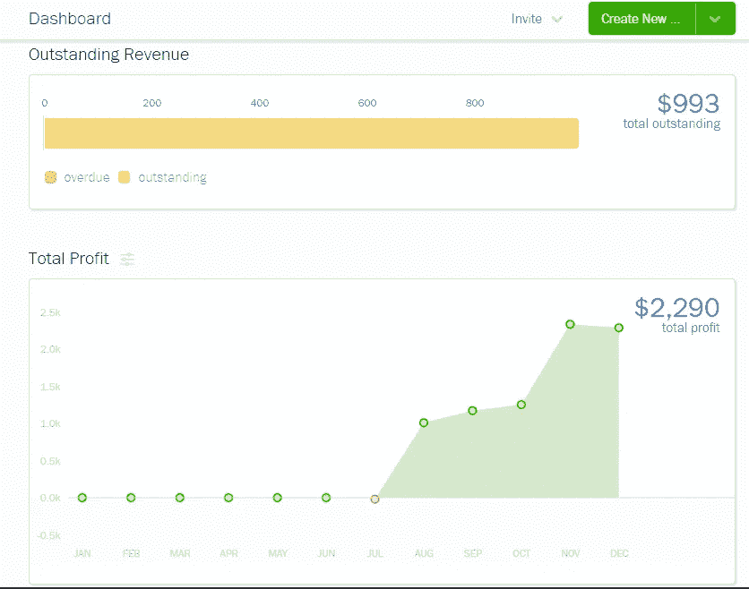

# 自由写作行业:如何获得早期成功

> 原文：<https://medium.datadriveninvestor.com/freelance-writing-business-how-to-have-early-success-f97410cb262f?source=collection_archive---------6----------------------->

## 自由记者

## 从一开始，你就可以用一些技巧和策略来发展你的自由职业事业。

Image by [Nattanan Kanchanaprat](https://pixabay.com/users/nattanan23-6312362/?utm_source=link-attribution&utm_medium=referral&utm_campaign=image&utm_content=2696234) from [Pixabay](https://pixabay.com/?utm_source=link-attribution&utm_medium=referral&utm_campaign=image&utm_content=2696234)

古老的格言“时间就是金钱”当然适用于自由职业者。这在业务发展的每个阶段都是至关重要的，尤其是在你制定业务战略、实施新软件、组织到位以及为成功做准备的初期。随着在线服务的兴起，现在是时候把这份兼职变成可靠的收入了。今天满足业余爱好的东西可能是将来全职写作生涯(或其他创业机会)成长和繁荣的土壤。

## 早期的自由职业成功是可能的

2020 年 7 月，由于一些健康问题，我已经超过 5 年没有从事过“真正的工作”,于是我开始了全职写作。七月，我觉得时机成熟了。时间是*现在是*。虽然我的期望很低，但我看到的 Floss 写作服务的早期成功已经超过了我的期望。无论你梦想从事什么样的自由职业，你都可以做一些事情来让你的事业早日获得成功*。我将在这里讲述这些，以及一些在你的自由职业者或个体创业者生意中找到早期成功的技巧和策略。*

在创业公司的上一篇文章中，[从零开始建立自由职业者业务](https://medium.com/swlh/building-a-freelance-business-from-scratch-24e4088bfc9b)，我讨论了开始你自己的自由职业者业务的组成部分。像商业建立、有效的沟通、组织和使用好的工具来经营你的生意。这些都是我在成为新企业主的“速成班”中学到的。

我没有深入分享的是，我之前曾是另一家企业的企业家。我做了 16 年的个体理发师，在那个领域相当成功。我经营一家全职公司，也为几家大公司工作，在东海岸旅行，教授小型研讨会。使我的生意比别人更赚钱的是我对经营它的奉献精神。但是我在美容行业花了大约 2 年时间才看到的利润，我在不到 3 个月的时间里就完成了写作生涯。

> 今天满足业余爱好的东西可能是将来全职写作生涯(或其他创业机会)成长和繁荣的土壤。

## 下面是我如何发现早期自由职业者的成功(你也可以！)

首先，让我说清楚。成功是一个主观的术语。你认为的成功可能与我认为的成功大相径庭。出于我们在此讨论的目的，我将其定义为:

*   早期可测量的**利润**
*   **增加金融增长的模式**
*   **销售/工作/客户订单的规律性**

最终，所有这些东西都安全到位，成功将更多地以*利润与自我满足和生活质量*来衡量。

## 播种土壤

开始任何自由职业者或小企业，时间就是一切。你必须拥有智慧、自我意识和对你所进入的行业的批判性眼光，才能知道什么时候是开展业务的最佳时机。在发射日期之前，你需要播种土壤；也就是说，为你的事业创造肥沃的土壤，让它茁壮成长。

*   扩大你的影响范围。[扩大你的社交媒体支持](https://fnfwriter.medium.com/growmyfollowing-7-day-free-course-1e5e9d4ace36)并开始你的电子邮件列表。开始发展你需要的关系来支持你的业务。这包括导师和商业专家，你可以从他们那里更多地了解你的业务、潜在客户和那些知道你不知道的事情的人，比如 IT 或法律术语。
*   开始与你的潜在客户建立融洽的关系。
*   接受一些工作，即使它们的价格很低——你需要推荐信。
*   为你将要提供的每一种服务制作一个作品集和一些参考资料。
*   在你开始创业之前，先给你的土地播种、播种和浇水。

## 明确定义的服务和品牌

开展任何一种业务，你都需要*方向*。这并不是说你不能尝试新事物或一旦建立就在新的方向上扩展，但是开始时，你的潜在客户需要确切地知道你是谁以及你能提供给他们什么。

独立完成你所有的头脑风暴和试验，让你的客户对你有一种稳定的感觉。他们需要知道他们可以信任你和你一起工作。你的声誉就是一切，对每一个客户都是如此。每一份工作，不管多小，都是建立或毁掉你的事业的机会，应该如此对待。

## 设定现实的目标并监控你的进展

我一开始有一个简单的目标；每月收入翻倍。这正是正在发生的事情。为了这个目标，我调整了自己的时间表。我的定价和我的时间安排——都是为了这个目标。我预计在 12 月的第三周，比计划提前整整一周，让你看到的翻倍。然后，我打算再翻倍。

Current profit analysis and outstanding revenue, on set to more than double for December. Author screenshot.

当你为你的事业设定一个目标时，它让你对那些“我以后再做”的时刻负责，这些时刻在你自我管理时是如此诱人。

为了让你的事业起飞，你必须致力于它的成功。设定目标并让自己承担责任将迫使你以一种逻辑的、有目的的方式分析风险与回报、花费的时间与收益、支出与必要性以及你业务的所有其他重要方面。

 [## 自由职业者拯救陷入困境的公司|数据驱动的投资者

### 在家工作对失业的上班族来说可能是新鲜事，但这通常是自由职业者的首选场所…

www.datadriveninvestor.com](https://www.datadriveninvestor.com/2020/08/10/freelancers-ride-to-the-rescue-of-struggling-companies/) 

## 多样化的收入来源

对于大多数小企业来说，你会有一个主要的收入来源，尽管是销售、服务或两者的结合。要想获得真正的成功，你需要尽可能地多元化你的收入来源，创造被动收入来帮助你增加利润，并考虑如何在你的业务的各个层面上赚钱。

下面你可以看到我的一些不同的收入来源，都在 Fiddleheads & Floss 写作服务的保护伞下。有来自 Fiverr 的工作，有来自私人写作客户的工作，有来自付费内容网站的收入，还有图书销售。

无论收入流有多小，它都会累积起来。

Various revenue streams make for a more successful start. Author’s screenshot.

## 自律是关键

我需要详述这一点吗？这是你的事；照此处理。自律和时间管理将是你每天计划的基础。没有人会告诉你早上起床，忙碌起来，或者检查你的电子邮件，或者与客户保持联系。只有你。

在我的孩子们成长的过程中，我经常告诉他们，世界上有两种人:一种是找借口的人，另一种是让事情发生的人。你可以决定你想成为的每一天。

> 你的声誉代表一切，对 T2 的每一个客户都是如此。

## 抑制不必要的支出——但是一定要投资你的事业

作为一个全新的企业主，你可以打赌，对我来说，支付 139.50 美元购买新书、19.99 美元购买海明威、129.00 美元购买 Dragon Naturally Speaking、50.00 美元购买耳机以及我的企业使用的其他订阅服务*并不容易*，但是这些程序让我的企业平稳而专业地运行。

*作者注:本文截图来自我的* [*Freshbooks 账号*](https://www.freshbooks.com/) *，我用它来监控我的业务的方方面面。我强烈推荐这个软件给有创意的专业企业主。该计划是非常友好的用户和客户服务是恒星。*

想象一下，给客户你的 PayPal 账户，让他们给你付款，和给他们一张商业发票，详细说明他们从你这里订购了什么，费用明细，并提供几种简单的付款方式，这两者之间的区别。当你认真对待客户时，当你是一个合法的、有组织的、有信誉的企业时，客户会喜欢的。

突然间，人们更愿意为我的时间付钱了。值得一提的是:声誉和客户对你企业的看法就是一切。

关于控制你的开支，虽然是的，你必须投资你的生意，你必须明智地做。你需要的是功能性，而不是花哨的功能。就这么简单。

## 对自己的优点和缺点完全诚实

最后，有些事情你知道自己做得不好。制定策略来管理这些弱点。例如，我的工作越少，效率越高。我知道这一点，所以我保持我的价格较高，目标是更少，更大的客户。有些人喜欢有很多客户，更快地推出他们的订单，但大客户会希望你慢慢来做他们的工作。他们可能还需要公司的培训，你完成培训可能会得到报酬，也可能没有报酬。把它当作对你技能的投资，只是用你的时间而不是你的借记卡。这种培训对你的工作非常有价值，会让你做得更好。

对自己诚实，知道自己真正擅长什么样的工作，并围绕自己的优势发展业务。从你擅长的领域开始，并愿意在你缺乏的领域发展你的技能。现在不是自负的时候。诚实地分析你自己的工作方法、你的优势和你的技能水平对于发展你的业务和建立适合你的客户群是非常重要的。投资于课程以提升你的技能。Open Learn 有很多免费的在线课程。

## 外卖

没有方向，没有最终结果，努力工作毫无意义。如果你清楚你想从你的事业中得到什么，并准备好接受它，你*就能在你的自由职业事业中找到早期的成功。祝你事业有成。*

*感谢您的阅读。*

[◦•●✿·克里斯蒂娜·m·沃德·✿●•◦](https://medium.com/u/87a63af50103?source=post_page-----f97410cb262f--------------------------------)
所有者@ Fiddleheads &牙线写作服务
作者[:](https://smile.amazon.com/organic-Fiddleheads-Floss-vol-1-ebook/dp/B081LSX29K/ref=tmm_kin_swatch_0?_encoding=UTF8&qid=1607474574&sr=8-2)

## 访问专家视图— [订阅 DDI 英特尔](https://datadriveninvestor.com/ddi-intel)