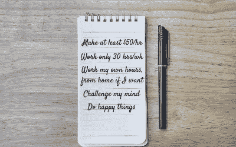
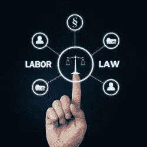

# 自由职业是一个选择，一个好的选择

> 原文：<https://medium.datadriveninvestor.com/freelancing-is-a-choice-a-good-one-f30795a64a2e?source=collection_archive---------8----------------------->

## 但是政治家们无意中试图让它变得更难

这是圣巴巴拉美好的一天——阳光、柔和的海风、让人想起欧洲小镇的全景山景。我溜出办公室去吃午饭，避开市中心优雅餐厅的法律人群，退到我最喜欢的海滩附近的住处。在朴实无华的酒吧氛围中供应的精美食物。看不到其他律师。

“有这些环境，我怎么会这么惨？”我一边等我的食物一边想。我逃离了中西部刺骨的风雪，在当地一家著名的律师事务所找到了一个助理职位，周围都是无与伦比的美景。我应该很激动。“天堂”怎么会像“地狱”一样？

简单。我讨厌我的工作，我讨厌我选择的职业，我讨厌我的职业。没有任何东西让我想在早上起床去工作。我非常讨厌我做的每一件事，我是如何做的，我花了多少时间做这件事，甚至在我搬到加州中部之前，我的职业生涯中就充斥着睡眠不足和工作与生活缺乏平衡的问题。更糟糕的是，我觉得自己完全被困住了，没有选择。

我不禁想知道，这是否是其他律师(或任何其他专业人士)在跳出窗户或用枪指着自己脑袋之前的感觉。这对我来说不是一个选项，我反而从钱包里拿出一张白纸和一支笔。我写了一张我想做的事情的清单:

adapted from canva.com

我低头盯着我的清单，想知道作为一名律师，我怎么可能获得这些东西。最明显的交易杀手是“做开心的事”我是一名出庭律师和诉讼律师；根据定义，我们的工作就是让人们不开心(通常甚至是我们自己的客户)。假设每周工作 40 小时，每小时的工资大约是我目前工资的两倍。(尽管律师经常向客户开出每小时数百美元的账单，但当一个人实际上按小时收费时，这并没有你想象的那么多。)

20 年后的今天，我几乎一直在为自己工作。有几次我真的变得宽容了，成为了一名员工(除了为自己工作)，我后悔了。我拥护和支持自由职业者的生活方式，因为我看到它成功地运作，我也看到随着时间的推移，自由职业者的观念变得越来越积极。

因此，当加州通过一项法律，试图剥夺数百万自由职业者多年来继续工作的能力时，我大吃一惊。

## 比起自由职业者，加州法律更青睐“雇员”

听到加州女议员 Lorena Gonzalez 谈论最近通过的 AB5 法案，该法案使该州几乎每个工人都成为“雇员”而不是“独立承包人”(自由职业者的法律术语)，加州工人应该感到兴奋。据她说，他们的情况立即得到了改善，他们应该感谢她带领他们找到了新的工作幸福。相反，她被许多她声称打算帮助的人挂在模拟像上。

from canva.com

冈萨雷斯、她的工会支持者和其他投票支持这项法律的加州立法者遭到强烈反对的一个原因是，他们根本没有考虑到这项法律对成千上万不想成为雇员的加州工人的影响。这些工人有意选择独立，不受传统就业的限制，不受其不灵活的工作时间和工作条件的限制，不受其对多种形式的歧视的有效保护，并且最终没有真正的工作保障。

这些员工并非对法律认可的“涓滴经济学”的影响视而不见。在这种经济学中，企业底层的勤奋员工被视为一次性工具，稍有失误(或根本没有失误)就会被解雇，而他们生产的产品和服务为企业管理层日益奢侈的生活方式提供了资金，甚至为最不称职的高管提供了黄金降落伞。

成为“雇员”不是某种涅槃状态，也不是解决工资不平等的灵丹妙药。与独立承包商相比，雇员数量的减少并不是中产阶级侵蚀的*原因*(正如加州立法机关在 AB5 中声称的那样)，而是中产阶级侵蚀的*症状*。简而言之，就业并不像人们所说的那样，数百万美国工人都知道这一点。

## 大多数独立工作者都选择了自由职业者，并因此更加快乐

由自由职业者联盟、Upwork、劳工部和麦肯锡全球研究所发起的众多调查都发现了同样的事情——自由职业者比传统员工更快乐。他们看到了作为传统员工从未体验过的自由和工作满足感，他们也无意放弃。

劳工部报告了 2005 年[和 2017 年](https://www.bls.gov/opub/ted/2005/jul/wk4/art05.htm?view_full)的调查结果显示，独立承包商“压倒性地倾向于他们的工作安排。”

> “与传统工作相比，独立承包人更喜欢他们的工作安排(79%)。不到十分之一的独立承包商更喜欢传统的工作安排。”

“随叫随到的工人”或“临时帮助机构的工人”的情况则不同，这种工作安排既没有正式就业的好处，也没有独立承包商的自由。

自由职业者联盟/Upwork 调查报告称，超过 2/3 的自由职业者说他们从事自由职业是因为这让他们可以有灵活的时间表，自己当老板，选择自己的项目。研究发现，自由职业者更有可能说，自由职业给他们提供了向上的流动性和适当的薪酬，更有可能让他们感到有成就感，兴奋地开始每一天，并获得授权。

2016 年，麦肯锡全球研究所对美国和欧洲的独立工作者做了一项[有趣的研究](https://www.mckinsey.com/~/media/McKinsey/Featured%20Insights/Employment%20and%20Growth/Independent%20work%20Choice%20necessity%20and%20the%20gig%20economy/Independent-Work-Choice-necessity-and-the-gig-economy-Executive-Summary.ashx)。麦肯锡发现，独立劳动力比之前认为的要多，约占美国工作年龄人口的 20%到 30%。他们还比其他报告挖掘得更深，将独立员工分为几个部分。那些有优先选择和主要收入来源的“自由职业者”和在传统工作之外从事自由职业的“临时工”，合起来占独立劳动力的 70%。剩下的 30%是出于需要的独立工作者，“不情愿的”和“经济拮据的”工作者几乎各占一半。

大多数独立工作者，无论是补充收入者还是主要收入者，都是出于偏好而非必要追求这条道路——他们对自己的工作生活非常满意。

最近，【T4 公司】杂志报道全美有 5400 万自由职业者，占美国劳动力的 34%，这一数字预计到 2020 年将跃升至 43%。这种增长无疑表明人们对自由职业的偏好有所增加。

这些趋势肯定会继续。千禧一代对在工作场所获得满足和快乐有着压倒性的偏好，如果一家公司不能满足他们的需求，他们不会羞于离开。( [*千禧一代在职场想要什么*](https://medium.com/the-innovation/what-millennials-want-in-the-workplace-df9c176eefee) *)。*

from canva.com

## 加州刚刚让自由职业变得更加困难，但是为什么呢？

如果现在有三分之一的美国工人是自由职业者，而且至少 70%的人是经过深思熟虑选择的，并且更快乐、更满意，那么加利福尼亚州为什么要通过一项法律让自由职业变得如此困难呢？

加利福尼亚州最近通过并遭到强烈反对的 AB5 法律坚持认为，每个为钱工作的人都是某人的雇员，除非能够满足一系列几乎不可逾越的测试和检查清单。据我所知，AB5 试图以牺牲 70%的自由职业者为代价来保护 30%不情愿/经济拮据的自由职业者。优步& Lyft 的司机似乎是一个主要目标，尽管我怀疑是否有人对司机进行调查，以了解有多少人属于 30%，有多少人属于 70%。(更多关于优步/Lyft 诉讼的信息，见我之前的文章

AB5 由工会起草并推动成为法律。女议员 Lorena Gonzalez 是 AFL-CIO 起草的法案背后的主要力量，她从工会获得了绝大多数的竞选捐款。无论在更传统的工作场所有什么好的工会，他们都没有兴趣承认或保护他们认为是流氓、自由代理人的人，这些人不交工会会费，也不构成工会政治影响力的一部分。

我明白了。工会的本能是代表大量员工集体工作，集体与管理层讨价还价，以获得更好的薪酬、福利和工作条件，而单个员工没有足够的影响力。这是一种重要的平衡力量。我并不是建议我们摆脱工会。然而，我建议，我们需要扩大我们对人们能够和应该如何工作的集体思考。

## **我们需要三(3)类工人，而不是两(2)**

虽然加州的 AB5 立法是我目前的重点，但对美国自由职业者具有破坏性的类似立法已经在州和联邦立法程序中进行，包括联邦行动。关于保护自由职业者的有意义的讨论需要现在就开始，在进一步的善意但目光短浅的法律通过之前。

需要承认存在数百万自愿的、有意识的、自由的工作者。这些和小企业主、企业家不一样。这些工人希望拥有自己的工作，而不是建立一个传统的结构化企业。他们想为自己的账户、按照自己的条件、按照自己的时间表赚钱，不想被伴随小企业而来的常规文书工作和监管过度拖累。

现在，根据州和联邦法律，只有两种类型的工人被承认:雇员和独立承包人。

雇员在雇主公司工作，雇主公司受到过多的劳动法律和法规的约束，有时还受到管理他们之间关系的工会合同的约束。你会在休息室和员工休息室的墙上看到一些大型海报，这些海报没有人愿意阅读，对于越来越依赖远程员工的公司来说，这些海报似乎有点愚蠢。这些法律是过去一个世纪以来无休止的工作的总和，这些法律规定了最低工资、工作场所保护、反歧视政策等等。

作为这些雇主责任的交换，雇主还对其雇员保持高度控制，决定工作时间和条件，但只有有限的义务尊重工作父母或照顾老年家庭成员的人的独特需求，只有有限的义务尊重宗教信仰、身体或精神残疾，没有义务保持工作与生活的平衡。雇主可以(也确实)决定员工是否可以拥有他们想要的健康保险，美国最高法院甚至允许雇主将自己的宗教信仰强加给员工的健康保险选择。(还记得*爱好游说*案吗？)他们也没有义务，通常也没有动机去考虑工作满意度。

最后一个侮辱是，雇主可以以任何不被禁止的理由随意解雇员工，并且最终有义务将股东利益置于员工整体福利之上。例如，考虑一下本世纪的一些独角兽企业，它们为投资者和股东收获了数百万、有时数十亿美元，但它们的员工不过是事后诸葛亮。那么，越来越多的工人重新掌控自己的工作生活就不足为奇了吗？

事实是，许多在第一线的工人知道他们无法修复“涓滴经济学”的企业文化——金字塔顶端的人总是比他们的员工获得更多的财务收益——因此选择退出该系统。是的，他们将不得不在薪酬谈判方面自谋生路，是的，他们将不得不解决如何为自己的医疗保险和退休福利提供资金，但这是他们愿意做出的权衡。

我们需要第三类工人——自由工作者——根据定义，他们在工作时间、工作地点或工作条件方面不受任何雇主的控制，但他们不需要创建小型或初创企业会做的所有基础设施。我们应该确保这些自由代理人获得教育和资源，以帮助他们安排自己的福利和安全网。

from canva.com

## 有更好的选择来保护自由职业者

除了宣称自由职业者必须是某人的雇员、某人的财产、某人的奴隶之外，还有许许多多其他保护自由职业者的方法。一个例子是纽约市 2017 年的“自由职业不是自由法案”，该法案建立并加强了对自由职业者的保护，而没有将他们归类为员工。当你得知这项法案得到了受其影响的人们的支持时，你应该不会感到惊讶，这些自由职业者是由一个支持他们的组织自由职业者联盟领导的。

全国大选即将到来，许多与美国人如何工作有关的问题将在选举期间和选举后进行辩论。现在已经不是 1950 年了。是时候开始重新想象新的美国工作场所将会是什么样子，并建立支持新现实的法律结构了。

**Melody A. Kramer** 是一名律师、自由撰稿人和梦想家。她出版的第一本书《为什么律师很烂》,幽默但坦率地揭露了我们法律体系中的一些根本缺陷。她目前正在撰写新书《AB5 实用指南:驾驭加州零工经济》。【www.melodyannkramer.com 