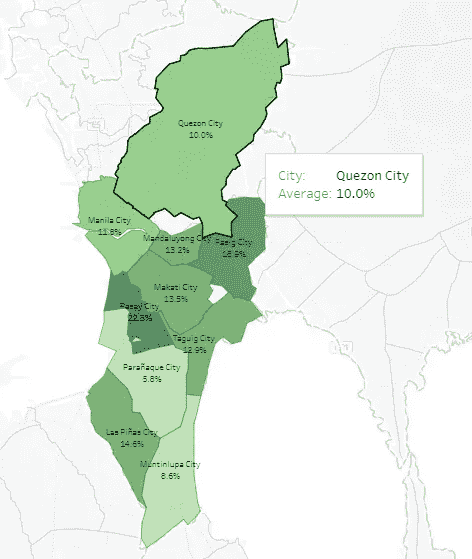

# 从数据到投资:数据在房地产投资中的应用

> 原文：<https://medium.datadriveninvestor.com/from-data-to-investment-the-use-of-data-in-real-estate-investing-da3659355289?source=collection_archive---------9----------------------->

问问你认识的任何人，很有可能，房地产占据了他们支出或投资的很大一部分。不管是租的、买的还是抵押的，房地产都是我们预算的一大块。

因为相关的成本，我们花了很多时间研究我们的选择。

# **房地产作为一种资产类别**

房地产属于被称为“另类投资”的投资类别。另类投资的一些特征如下:*低流动性*、*低透明度*，并且通常涉及*高现金支出*。

Some of the characteristics of alternative investments compared to traditional ones (stocks, bonds, etc.)

让我们讨论一下这些特征在房地产环境中意味着什么。*房地产的低流动性*意味着要花很长时间才能卖出去。一个原因是，它需要大量的现金支出，没有多少人可能会有这笔钱。

此外，因为每个属性都是唯一的，所以处理属性需要更长的时间。例如，当你想卖掉你的房子时，你发现要花几个月甚至几年的时间才能找到买家。

因为房地产需要大量的现金支出，而且需要较长的时间来出售，一个错误的购买决定**很难逆转**。这就是为什么做适当的研究和分析是重要的。

> 但也许在房地产中使用分析的最令人信服的原因是它的低透明度。**这意味着，与股票不同的是，在股票市场，投资者可以公开查阅文件，因此，决定房地产交易成败的信息通常很难找到、收集，有时甚至难以核实**。

这就是分析发挥其魔力并改善整个投资者/买家体验的地方。

> **分析(或生成分析的过程)不仅可以从传统来源，甚至可以从非结构化来源中发现洞见**。当我们谈论结构化来源时，我们通常看新闻中通常报道的干净、经常过滤的数据(想想公布的政府数据*)。*非结构化数据源没有清晰的格式，也没有经过过滤，但提供了更多可供投资者或开发者使用的原始见解。

**在这一点上，我们必须强调，在做出房地产决策之前，分析主要有助于缩小问题和考虑范围。买家仍然需要通过实地考察或与交易各方交谈来进行尽职调查。**

# **投资者房地产分析**

对于房地产来说，投资者可能意味着很多事情。就我们的目的而言，让我们把它限制在那些寻找**房地产来购买或出租以获得资本收益**或租金收入的人。

房地产投资者的常见问题如下，(*排名不分先后*):

1.  购买什么类型的房产
2.  是为了*租金收益*出租还是为了*资本增值*持有房产
3.  在哪里购买房产

对我们大多数人来说，我们只对购买住宅或公寓感兴趣，这样就能解决第一个问题。

然而，第二个问题的答案取决于我们的个人偏好，包括我们计划持有投资多长时间。对于第三个问题，接下来的部分将讨论哪些数据可能会给我们指出正确的问题。

# **现金流投资者分析**

对于现金流投资者，也就是那些打算购买房产以获取租金收入的人，你需要关注一个被称为(毛)租金收益率的投资指标。

> (总)租金收益是每年从房产中获得的租金收入超过该房产的市场价值。

The formula for Rental Yield

要回答这个问题，在没有发布数据的情况下，请执行以下操作:

1.  从列表网站收集最近发布的公寓样本，包括租金和售价。租金和销售价格的信息不一定能在同一个网站上找到。重要的是，您要将公寓的租金信息与相同类型和楼层大小的同一公寓的销售价格进行匹配。

例如，您应该将公寓 A 的租金信息(一套 34 平方米的 1 层单元)与同一公寓 A 的销售信息(一套 34 平方米的 1 层单元)进行匹配。应用上面的公式并获得其租金收益。对该地区的几栋共管公寓/房屋进行此操作。信息越多越好，因为我们希望产生一个偏差较小的指标。

理想情况下，我们将使用一个抓取算法来获取所有的列表。对于房地产，就像任何分析问题一样，数据越多越好。

2.如果您的数据没有异常值，请使用中位数或平均租金收益率来汇总城市信息。

2019 Rental Yield per City in Metro Manila.

3.将你选择的城市列入候选名单后，要注意那些租金收益高的房产的特点。有家具吗？什么户型最好( *Studio，1-BR，2-BR 等*)？

我们可以用来回答最后一个问题的一个工具是确定有问题的地产的周边发展。利用 OpenStreetMap (OSM)数据的算法可用于检查商场、快餐、办公室和其他与较高租金收益相关的开发项目的数量。

# **价值投资者分析**

价值投资者购买具有升值潜力的房产。换句话说，他们的相关指标是每年的资本增值。

Capital Appreciation computed in 2019 from 2018 base prices, the average per city.

当我们问与现金流投资者相同的问题时，用*资本增值收益*代替*租金收益率*指标，重要的是要问是否有任何有助于升值的趋势可能会继续。

投资者和开发商需要关注宏观经济趋势，以确定基本面是否支持升值，以及升值是否可持续。

一个久经考验的、可持续的土地增值原因是基础设施的存在(*或未来存在*)，特别是与交通相关的基础设施，如火车站和机场，或者附近购物中心的存在(*或未来存在*)。

因此，除了现金流投资者采用的分析方法之外，寻求资本增值的投资者还可以锁定地图、即将到来的基础设施和购物中心，并确定步行距离内或特定半径(例如，2 公里半径)内的物业

最后，一旦你有了入围的物业，一个简单的净现值(NPV)将作出最终决定，选择最高的 NPV(*如果你只选择一个。如果选择多个属性，比如两个或三个，选择* ***正-NPV*** *属性*的前 2 个或前 3 个。

请在评论区告诉我你还想让我写什么。我们将在另一篇文章中编写一些代码。