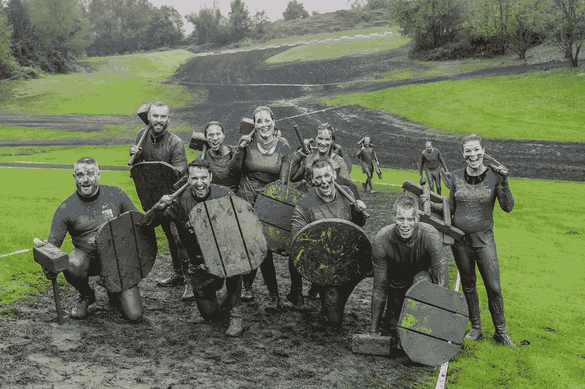

# 健身:从骨瘦如柴到斯巴达战士

> 原文：<https://medium.datadriveninvestor.com/from-skinny-to-spartan-warrior-3c8d63737062?source=collection_archive---------12----------------------->

Viking Obstacle Run; the first row, second from the left, is a newborn warrior.

## 这一切是从哪里开始的？我的故事是什么？是的，这一切是从哪里开始的？我没有希腊神的体格。我不是斯巴达人，但我想成为一名斯巴达人！我又弱又瘦，还饱受折磨。我想成为一名战士，耐久，受人尊敬。

我在农场长大，在很小的时候，我就在牛群周围工作。这是一种艰难但美好的生活。其中一个好处是我们自己种了一些粮食，可以卖一些牛奶鸡蛋给邻居。我们有产蜂蜜的蜜蜂，牛，驴，马，鸡，猪，任何你能想象的动物。

虽然我生活在一个健康的东欧体系中，但我从未真正意识到健康生活、照顾好自己的身体、思想、性格以及过有意义的生活是多么重要。

当你克服了一个障碍，获得了你想要的非凡的结果，或者甚至当你可能完全错过了目标，总会有更多。

*我们不断渴望更多，这是生活的本质。这是我们不断创造的生命的本质，不管我们是否有意识地这样做。”――Mozella Ademiluyi*

我的世界发生了很多变化。我非常感谢早期的青少年课程。艰难的童年让我有了今天的地位和今天的我。保持清醒、健康，并努力帮助他人。

# 你好，瘦小子

当你看着我或者在镜子里看到我的时候，你可能会震惊，因为我很瘦。不是因为我想成为，也不是因为缺少食物，而是我生来如此。一套长长的手臂挂在身体旁边，骨瘦如柴的腿和窄窄的肩膀，这是最初的印象。

很多校友都欺负我，我也因为长相被欺负过很多次。我讨厌这样，当我阿姨拉着我的胳膊时，我更讨厌这样。我多次听到她说:你胖一点怎么样？你太瘦了。

 [## 健康品牌源于定位|数据驱动的投资者

### 品牌定位是 Phemelo Segoe 的激情之一。她是一名企业家、健康教练和米尔部落的创始人…

www.datadriveninvestor.com](https://www.datadriveninvestor.com/2019/01/11/healthy-brands-grow-from-positioning/) 

**我旅程的开始:**我想所有的情况和我当时做出的决定促使我开始寻找训练家庭、健美，后来又寻找营养和健康的生活方式。这花了几年时间，但最终，我开始在家和课后训练。

毕业时，我决定搬到荷兰，因为我觉得，我必须站出来。可能会有很多骄傲和愤怒，但这个决定是值得的。

# 郁金香和自行车的国度

所有东西都打包好了。我准备好征服世界，搬到一个西欧国家。目的地是荷兰。郁金香之地，平坦的道路，一望无际的海边。

我仍然很瘦，但是因为过去几年的锻炼，我变胖了。我知道这是一件更伟大的事情的开始，一件会让我变得超乎寻常的事情。我那时大约 19 岁，我知道我必须努力工作。我仍然不知道我的健康；这是关于变得更大，看起来更笨重，这就是我向他们展示的全部。

当我第一次搬到荷兰时，我很兴奋，但随着日子、星期和月份的过去，我变得不那么热情了，因为我必须工作、晚上学习、学习一门新语言等等。是的，另一边有一个巨大的机会在等待着我，当我决定移居国外时，我抓住了它。因此，有艰苦的工作来回答。

# 那么，现在怎么办？

所以，在荷兰，我不像以前那么瘦了，但仍然是一个充满希望和灵感的长男孩，因为我吃了很多荷兰高达奶酪。

我开始每周去几次健身房。感觉很好，周围都是举起重物的大块健美运动员。我还开始参加 M.M.A .俱乐部，以获得一些力量，敏捷性，并建立我的自信心。

**恐惧是你的朋友:**是的，我害怕战斗，惊恐万分，但我想，我可以做到这一点。对我来说幸运的是，这家俱乐部是荷兰最好的俱乐部之一，教练马丁培养了世界冠军。我经常挨打；我甚至在一次柔术课上打断了一个人的肋骨。总的来说，我了解了很多关于我的性格，恐惧，并决心保护自己。

由于我的目标是增加体重，我开始遵循典型的健美饮食，每天吃大约 5 到 6 次，每餐都有蛋白质或蛋白质奶昔，在家做饭，或去哪里都吃富含蛋白质的大酸奶。我确实注意了我吃的东西；我感觉如何并不重要。在某种意义上没有注意我的身体信号；我只是想增加体重，最终变得更大。

我留在了健身房和 M.M.A .，但两年后，我筋疲力尽了，因为每周两次的 M.M.A .和柔术一起训练对我在健身房的 4 到 5 次训练和表现产生了影响。因此，我决定砍掉 M.M.A。这是一个艰难的选择，因为我觉得它真的增加了我的心态，性格和心理弹性。

# 最后的改变

在我健美生涯的下一阶段，我开始和我的一个哥们和一个朋友一起训练。我们一起训练，互相激励。

> “我们崇拜高大的健美运动员，梦想着有一天我们也能像他们一样高大。当地有一个名叫罗恩的健美运动员，他大约 2 米高，肌肉发达。这太神奇了，就像一个真正的希腊神。”—菲特巴德

现在想起来真是好笑，只是想看起来像另一个人。我相信这也是我开始做更多的研究，参加课程，并确保我开始了解营养的整个世界，建立一个坚实的身体，但还不太了解心态。

# 新世界，新观点，新结果

哦，是的，那是早上 5 点，我的闹钟响了。帕夫，我想这又是疯狂的一天。我下床，洗了把脸。很快检查了我的健身房回来，并准备了蛋白质奶昔。我从自行车上取下钥匙，去接我的朋友德克斯。

当我按门铃时，刚好是 5 点 45 分。德克斯非常困倦地走出来说:‘伙计，我们还要再来一次吗？’？没时间考虑这些了，所以我们就去了体育馆。我们遵循的这种程序是我做过的最难的程序之一。充满了下降设置，紧张的时间，闭塞，和所有的科学健美术语，你可以想象。

到目前为止，我已经学会了一些技巧。我讨厌在锻炼时不知道发生了什么，所以我潜心研究市场上最好的产品。

参加职业 IBFF 比赛的人，奥林匹亚先生喜欢本·帕库尔斯基，那不仅仅是无声地举重，而是在实验室里用电缆测试他们的假设和理论。是阿诺德·施瓦辛格的训练 2.0 放大版。

**大汗淋漓:**当你看到我们躺在地板上的时候，那简直是地狱。在那些时候，我用锻炼前的奶昔来度过这一系列，完全含咖啡因的饮料。因为在艰苦训练时，肌肉通常会像地狱一样燃烧，我想确保度过这种感觉，因为我知道当我忍受时，我可以获得更多的肌肉。

**n . o . s .组:**我们称之为神经超负荷组，直到你的肌肉抽筋。哑铃从最重到最轻一字排开。是的，这些是空投物资。你举起哑铃 10 次，然后放下，举起 8 公斤，再举 8 次左右，然后放下，举起 6 公斤，如此类推。

几乎没有任何喘息和放松的时间。你的手臂大面积肿胀，布满青筋，尖叫着求饶。这是地球上的火炬。

吃完后，我们很快拿起一杯蛋白奶昔，猛灌下去。在德克斯家，我们用至少 10 或 12 个鸡蛋做了一些真正的煎蛋卷。这是很大一部分。哦，伙计，那些时光…

# 进步但停滞不前:

几年过去了，我的体重增加了不少。那时候，刚开始的时候，我的体重大约是 65 公斤。我记得在 2009 年，我们全家去克罗地亚度假。看着照片，我是如此的瘦。几年后，从这里开始，我的体重在 85 到 90 公斤之间。

几乎每天，我都吃很少的燕麦食物，500 克酸奶和香蕉，10 或 20 种不同的补充剂，大量的鸡肉和碳水化合物，每天都是这样。我有一个健壮的体格，并取得了一些巨大的进步。然而，我的身体出了点问题。我感到懒散，不开心；我的消化能力很弱；我觉得超级臃肿。

**败局:**但是我一直无视。目标是变得更大更笨重。我错过了什么？然后我的身体开始崩溃，我进入了一个危险地带。我开始越来越频繁地生病，每次生病都更严重，更持久，通常与肠胃问题有关。但是我还没说完。

> ***快速教训:*** *永远听从你的身体，永远！再读一遍声明！*

# 这一切是怎么回事？

这是一个漫长的旅程，我花了相当长的时间来消化学到的经验教训，更重要的是，与世界分享。目标是激励你深入内心寻找埋藏的答案。

这将是一个复杂的过程，倾听你的身体，并为自己留出必要的时间。对你们中的一些人来说，这可能是人生中第一次决定改变自己的身体。

我们都知道；一个[人物](https://anchor.fm/thefitfunpodcast/episodes/What-are-the-key-characteristics-of-a-strong-character-eaku0h)是通过坚持和努力培养出来的。

> “你生活中的许多挣扎都与你的健康、幸福和心态有关，而不是建立一个坚实的性格和按照更高的召唤生活。是的，你可能会想，当然，那是扯淡。”—菲特巴德

是的，对，举例来说，我的人际关系怎么会受到我健康水平的影响呢？答案是可以，而且是。如果你睡眠不足，没有有目的地生活，滋养你的肠胃，你就没有发挥出你的能力。

**你投入什么，你就会得到什么:**你可以为我们的余生、你的友谊、结果和整体成功带来连锁反应。让我们投入进去，确保你能重获身体、健康和心态，这是你与生俱来的权利。

有两个原因导致我们达不到我们想要的健康。

a)我们没有正确的知识

b)我们没有始终如一地坚持下去

让我们探索故事的其余部分

# 从骨瘦如柴到斯巴达战士——旅程仍在继续

*那是 2017 年初，我知道我必须这样做，我痴迷于拥有希腊人的身材，轮廓分明的胸部，美丽的手臂，肌肉发达的腿。我必须竞争；我不得不将自己与他人比较，并攀登后者的完美。撤退是没有机会的；我直接选了 IBFF 职业健美。*

旅程仍在继续；我的身体现在被打败了，虽然我在吃大量的食物上慢了一点，但我并不满足。我需要帮助。我需要一个经历过这个过程的人。

我认为我的知识相当不错，但要竞争，那是另一回事。我知道我需要增加一些体重，从现在的 85 公斤增加到 95 公斤。因此，我不知道会发生什么。

# 苦差事

我离比赛还有八个月的时间。按照我的教练约翰尼的说法，头六个月，我应该增肥。我们每周早上推 2 到 3 次。我又开始一天吃 6 到 8 次。

我觉得这不完全是我会做的，因为我是重量级的，我更相信科学，更轻的重量和更紧张的方法。一天吃 8 次有点极端，但我还是坚持了下来。

**补偿:**意识到我的身体疼痛和健康开始变得很自然。几个月来，我的体重增加了不少，大约有 98 公斤。远远超过我的想象，我们仍然有至少三个月的膨胀。举重若轻是有代价的；我开始一点一点地拉伸。

**桑拿极好:**我也开始去桑拿了；我读了很多关于康复和桑拿的好处。感觉很放松。至少我开始感觉更干净了，更觉得身体能够排除毒素了。

> *“身体遵循自然的节奏和周期。食物通过嘴进入，被加工，然后通过肠道进入血液。当你吃了大量食物时，你的消化系统必须更加努力。吃得多并不是大问题，问题在于你吃得太多了。”— Fit-budd*

# 教育角

身体没有足够的时间来处理并最终消除。每次进食后，应立即排便。当这种情况没有发生时，身体会继续储存食物，食物会暴动并释放出对身体有害的毒素。最好是它有时间及时处理掉食物。

这很大程度上取决于你的肠道工作效率。西方世界面临的最大挑战是，人们经常吃不寻常的高碳水化合物摄入量会导致大量挥霍，这意味着胰岛素每次都会激增，这导致身体节律失调。胰岛素负责调节血糖。

**—你—是—什么—你—消化—不是—什么—你—吃—**

**小心胰岛素:**第一阶段是人们不遵守简单的规则，比如在剧烈运动之前或之后吃碳水化合物。当我们在一天中的任何时候向身体投掷碳水化合物时，身体会变得对胰岛素有抵抗力，这可能会慢慢导致糖尿病。

不要容忍它，解决它:这个过程很容易设定，在锻炼后吃我们的意大利面、比萨饼，而不是在一天中随意地吃。你帮了你自己和医生一个大忙。许多人都有胰岛素抵抗，并且很容易在几周内治愈。对你的习惯做一个简单的调整就能产生魅力。

# 像冠军一样训练

有趣的是，有时我们会信任他人。甚至我们也感觉到了；这不是我们会选择的道路。我从一开始就认为；没有教练，我也可以自己做。但为什么我会尝试重新发明轮子，我只是需要一个犯罪伙伴来激励我锻炼。

竞争本身是一项易受影响的运动。你真的必须专心致志。它需要你在*承诺*、日常表现、休息以及遵循一个精心设计的计划方面的全部注意力。我不会说这项运动适合所有人；充满了自负和想要出现的人。但是当你站在舞台上的时候(关于那件事以后再说)，你是很谦卑的，人们对彼此都有尊重，不管结果如何。

**基础就是一切:**所以，你需要这个基础，你需要 100%的知道你要做这件事，为什么要做这件事。如果你，你会很快被打败。即使不是，那也不是目的。目的是和自己竞争，而不是和别人竞争。目标是通过这一切成为一个更好的人。

从这里开始，你必须深入训练的机制，理解不同的练习。要参加比赛，你需要合适的身体比例和少量的体脂。最后几周是最关键的。

但是我想得太多了。总的来说，有很多方法。我接下来的是推拉日、腿部日和大量的有氧运动。如果你决定参加比赛，请告诉我。

谁能竞争？任何人，我不认为你需要成为一个健美运动员才能参加比赛。你需要的是意志、欲望、渴望和勇气。

**意志力还是毅力？**意志力*和毅力*差别很大。意志力是一种有限的资源，可以通过使用耗尽，比如决策；砂砾是一个无限的源泉，必须不断积累。

毅力是一种精神因素，它推动你完成一项锻炼，并在你不喜欢的时候让你坚持下去。

> *“勇气是当世界认为你的艺术已经足够好的时候，你选择继续努力。”—罗伯·博德雷奥*

# 男孩的卷发

*加油，挤。举起这些婴儿，抓住顶部，一，二，三。天哪，我的脸涨红了，胳膊也肿了。现在，低下来四秒钟说，约翰尼。我以为我的胳膊会爆炸。你能行的约翰尼尖叫着。想想你将要对抗的人；他们会有大炮。*

两更，挤那些枪，我的身体在颤抖。我清楚地记得和德克斯特一起训练时那种疯狂的感觉。

肌肉泵:我们称之为“神经系统超负荷”你用力击打你的肌肉，使它们开始燃烧。肌肉需要葡萄糖和氧气，通过在紧张、缓慢的节奏、完美的技术下长时间击打一个肌肉群，血液必须运行以带来更多的葡萄糖和氧气，因此肌肉肿胀或肌肉泵。

你消耗肌肉的速度比它提供能量的速度快，这导致身体在压力下超载，因此*神经系统超载*。听起来很健康，对吧？嗯，锻炼肌肉很好，但是你比肌肉压力更大，你需要更多的时间在恢复区。

# 一个更好的我

我看着镜子，我看起来很大。天哪，我开始看起来很匀称了。内心深处的这种感觉，哦，伙计。我知道为了拥有这个身体我要付出多少努力。

*“瞬间，我看到左边的这个男孩正看着我。他长得像我很多年了。他很瘦，不自信。他的声音越来越大，不敢抬头看。他瞥了几眼，表明他希望自己看起来像这样。— Fit-budd*

在右边，有一个家伙，被撕成了 f*ck。原谅我的语言。他看起来完美，轮廓分明的手臂，良好的胸部分裂，那些腿可以再大一点，但他看起来像一个希腊神。

当你需要竞争时，所有的因素都很重要。等一下，左边的那个人看起来很面熟，右边的那个人也是。这两个可能都是我吗？

嘿，再来几个，约翰尼喊道。在场。不要摇晃重物。要专注；我们需要你上来。这一切都在我的脑海里，只花了几秒钟，这些字符，当我接近疲惫。我差点问约翰尼他是否也看到了，但我只是咽了口空。

> *“这是如此真实，但这种感觉足以让我坚持到最后。”——菲特-巴德*

**第一次胜利:**即使看着镜子，我也不觉得自己高人一等。我感到很幸运，能够到达如此远的地方，比我想象的要远得多。这不是炫耀；我战胜了脆弱的自己。虽然约翰尼笑着说，又是一次很好的锻炼，孩子，我们都知道最艰难的训练部分就在我们面前。

训练完全摄入碳水化合物很容易；你的肌肉迅速由葡萄糖提供能量。但当你进入“削减阶段”时，一切都是以同样的强度训练，但消耗更少的燃料。这个阶段就在我们面前。是的，就像真正的职业选手会说的。我们要出去三个月。

# 从优秀到卓越

你认为神话般的体格的基础是什么？我以前给过你提示。是的，是恢复。如果你恢复得不好，你的肌肉就不能以预期的速度生长。恢复至关重要，不仅仅是 8 小时的睡眠。这也是你的压力水平。

**休息、放松、呼吸:**科学表明，无论你做什么运动，在完成后，你应该致力于进入身体的副系统休息状态，降低你的压力水平。最快的方法是平静的呼吸，专注的拉伸，或者只是躺在地上放松。

**切换:**这是你必须在我们脑海中有意做出的切换，“现在我们要休息了。”当你向你的身体发出这样的信号时，它会寻找放松的方法。这是至关重要的一点，因为长期过度兴奋的神经系统对健康没有好处。

> *“这就是压力大的人经常生病的原因。他们并不是有意在需要的时候关闭这种压力系统。”— Fit-budd*

# 教育角

在一天的工作或任何地方，在活动间隙做几次深呼吸。

告诉自己放松，对你的身体重复几次，对自己放松。它会激活放松状态。你会以更多的精力更快地度过一天。