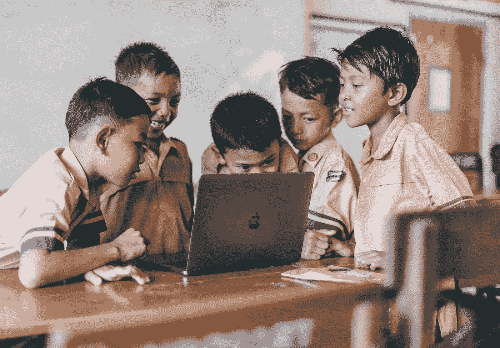
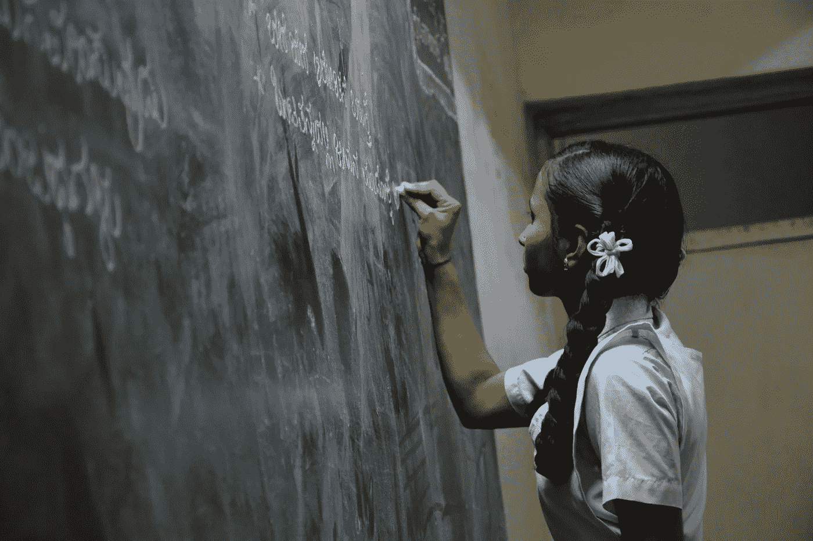
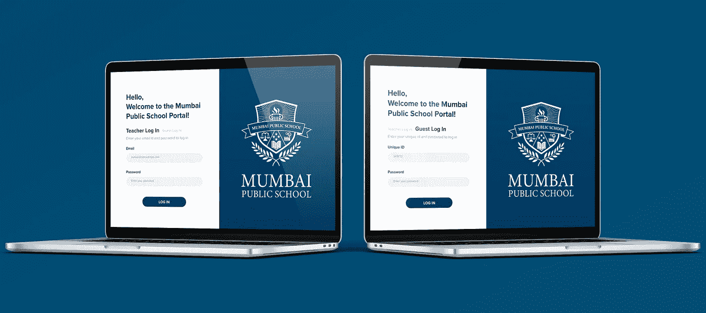
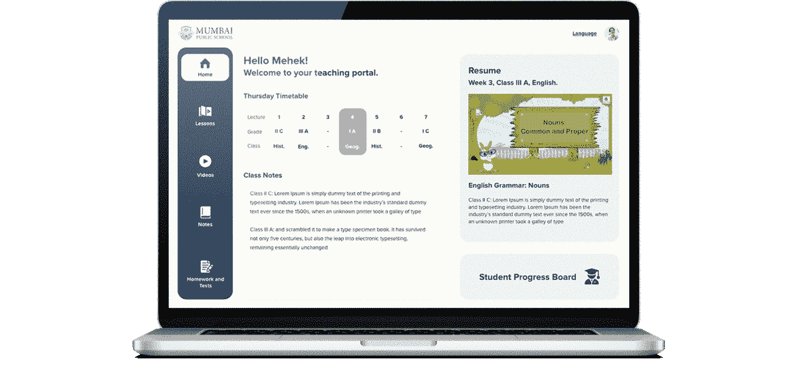

# 来自吠陀之地

> 原文：<https://medium.datadriveninvestor.com/from-the-land-of-vedas-3ccec3f9ac4c?source=collection_archive---------27----------------------->

人工智能在印度开创了一个新的知识领域



Pic credit: pexels-agung-pandit-wiguna-3401403

由于疫情，世界经历了许多似乎是新的世界秩序的快速变化。许多变化是受欢迎的，就像一股清新的空气，许多变化还没有到位。2020 年 7 月 29 日在印度教育生态系统中具有历史意义，因为近三十年后，[国家教育政策](https://indianexpress.com/article/education/new-education-policy-2020-live-updates-cabinet-approves-nep-ramesh-pokhriyal-prakash-javadekar-6529139/)在万众期待中出台。

[为了加速数字化学习，国家教育技术论坛(NETF)将会成立。电子课程最初将使用八种地区语言开发。拥有虚拟实验室](https://indianexpress.com/article/education/new-education-policy-2020-live-updates-cabinet-approves-nep-ramesh-pokhriyal-prakash-javadekar-6529139/)。

新的教育政策特别强调发展每个人的创造潜力。它基于这样一个原则，即教育不仅必须培养认知能力——包括读写和计算的“基础能力”和“高阶”认知能力，如批判性思维和解决问题的能力——还必须培养社会、道德和情感能力及倾向。

*沟通设计师***Sanyukta math ure***-*[*ISDI 帕森斯*](https://www.isdi.in/communication-design/)****(AIML |一个全新的世界)*** *确定了当前情况中的差距，其中缺乏在线教育的课后帮助，缺乏各方面的个性化反馈和帮助，以及缺乏基于行为问题的数据收集。**

> ***案例研究:创新学校联盟***

***ISU** 为他们所有的学校 **(ISDI、ISME、ISDI、WPP)** 使用 *ISU App* 。它用于标记出勤，安排课程，教师审查和费用管理。在疫情期间，他们已经过渡到一个完全虚拟的教育系统。他们希望这种转变对他们的学生来说是平稳的，没有麻烦的，同时克服缺乏身体互动带来的挑战。*

*在线教育的成功甚至会鼓励教育机构在疫情结束后继续混合教学模式。这将使他们能够在全球范围内接受教育，而不受身体限制的困扰。*

*然而，教师和学生之间的人际互动一直是教育的重要组成部分。虚拟互动不再像疫情时代之前那样具有同样的个人接触。在这个充满挑战的时代，了解学生的问题、心理健康以及他们在各方面可能面临的任何问题对教师来说都是一个挑战。*

> *提议的解决方案:一个数字平台，深入学生的心灵，了解他们旷课背后的原因，并在收集相关数据后提供自动帮助。*

**

***Sanyukta Mathure —** Communication Design*-*[*ISDI Parsons*](https://www.isdi.in/communication-design/)***(AIML |A Whole New World)****

> ***研究行为模式——收集背景数据——提供自动化帮助——创建协作小组——监控和调节***

**

***Sanyukta Mathure —** Communication Design*-*[*ISDI Parsons*](https://www.isdi.in/communication-design/)***(AIML |A Whole New World)****

**一旦学生错过了一节课，他们就会收到通知，指引他们使用应用程序，根据几个月来收集的数据，了解他们旷课的原因，学生会收到通知，以便进行每月分析。**

> ***[新的教育政策必须为所有学生提供优质的教育体系，无论他们的居住地在哪里，并特别关注历史上被边缘化、处于不利地位和代表性不足的群体。教育是一个巨大的平衡器，是实现经济和社会流动性、包容性和平等的最佳工具。必须采取措施，确保来自这些群体的所有学生，尽管存在固有的障碍，都有机会进入教育系统并在其中脱颖而出。](https://ncert.nic.in/pdf/nep//NEP_2020.pdf)***

*****公共教育中的人工智能:**随着印度将成为新的全球知识超级大国，新经济政策将推动印度成为新的全球学习目的地。***

******

> *****案例研究:孟买公立学校:教师短缺和负担过重*****

***这个国家现在缺少超过 10 万名教师，一名教师同时管理多达 100 名不同班级的学生。教师工作负担过重，教育质量下降。没有固定或规范的教学方法。要求的部分有时不教。这导致了混乱和低性能。***

******

*****Mehek Khanna** *-*Communication Design*—* [*ISDI Parsons*](https://www.isdi.in/communication-design/)***(AIML |A Whole New World)******

> ****传播设计师* **梅赫克·卡纳***-*[*ISDI·帕森斯*](https://www.isdi.in/communication-design/)****(AIML |一个全新的世界)*** *找出现状的差距并提出解决方案。* **身临其境的轻松教学:**预先录制的课程和工具，并提供额外的解释**进度跟踪:**教师可以提前评估计划、计划时间并与其他教师讨论的设备。管理任务:创建试卷、测试、作业****

********

******Mehek Khanna***-* Enhancing digital experience for achieving full human potential****

****教师必须处于教育系统根本改革的中心。新的教育政策必须帮助重新确立各级教师作为我们社会中最受尊重和最重要的成员的地位，因为他们真正塑造了我们的下一代公民。它必须尽一切努力赋予教师权力，帮助他们尽可能有效地完成工作。新的教育政策必须通过确保生计、尊重、尊严和自主权，同时在系统中灌输质量控制和问责制的基本方法，帮助招募最优秀和最聪明的人进入各级教师队伍。****

> ****基于人工智能的解决方案渗透到我们生活和做生意的方式中，关于道德、隐私和安全的问题也将出现。学生们进行了各种猜测和预测。 ***免责声明:*** *所有创意均为假设课堂项目。* ***保留所有权利— I S D I 2 0 2 0*******

*****创作导师:* [***乌特卡沙·马尔卡尔***](https://www.linkedin.com/in/utkarsha20/)****

*******ISDI 校区*** *印度设计学院&创新
ISDI 大厦，One Indiabulls Centre，
Senapati Bapat Marg，Lower Parel，
孟买 400013。一般查询:* [*查询@isdi.in*](mailto:enquiries@isdi.in) *投放&行业连接:* [*投放@isdi.in*](mailto:placements@isdi.in)****

```
******UTKARSHA M. |** Author | Design Thinker | Creator  - A desire to understand the world and to improve it always remains at the core. Design is a managed process and my quest for knowledge is subject to an inquiry of the apparent, the imagined and the recalled. As I speculate and design, my liberty of self-expression is in direct correlation to my existence and knowledge.****
```