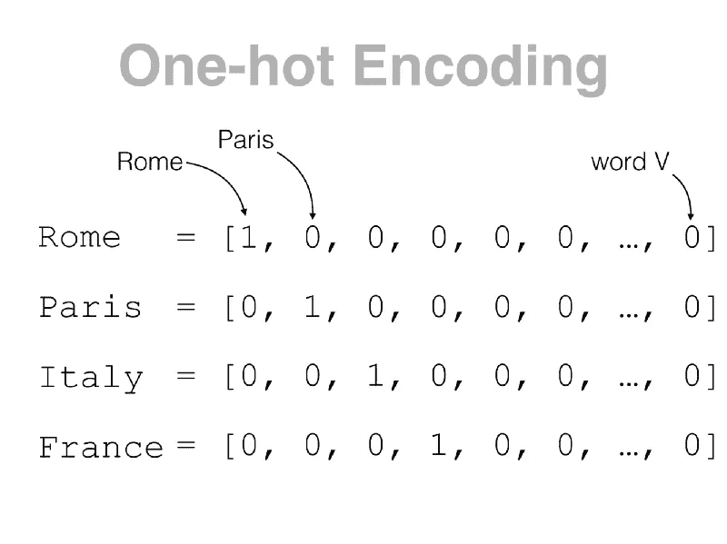
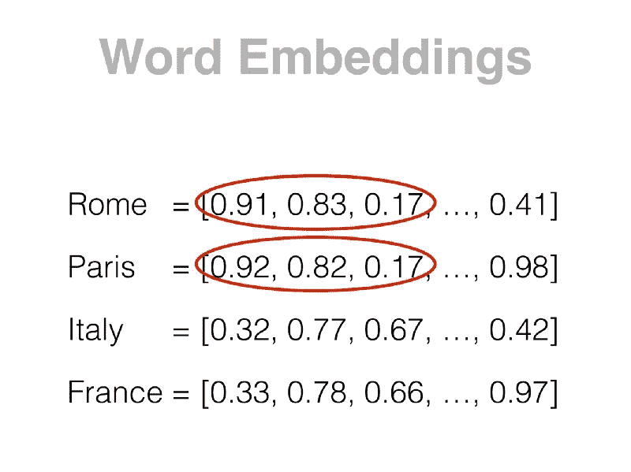
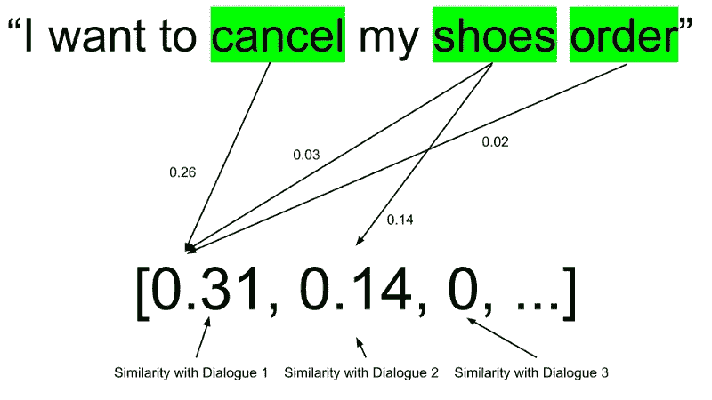

# 从单词嵌入到句子嵌入——1/3

> 原文：<https://medium.datadriveninvestor.com/from-word-embeddings-to-sentence-embeddings-part-1-3-7ba9a715e917?source=collection_archive---------3----------------------->

Designed by [Freepik](https://br.freepik.com/fotos-gratis/letras-diferentes_1330225.htm)

[关于这篇和更多的帖子，请查看我的[网站](https://diogodanielsoaresferreira.github.io/)

最近，我在工程 Talkdesk 博客上写了两篇文章，关于[单词嵌入](https://engineering.talkdesk.com/what-are-word-embeddings-and-why-are-they-useful-a45f49edf7ab)和[句子嵌入](https://engineering.talkdesk.com/what-are-sentence-embeddings-and-why-are-they-useful-53ed370b3f35)。在这一系列的三篇博文中，我将详细解释一些获得句子表示的方法。

 [## 编码器解码器序列:多长是太长？数据驱动的投资者

### 在机器学习中，很多时候我们处理的输入是序列，输出也是序列。我们称这样的一个…

www.datadriveninvestor.com](https://www.datadriveninvestor.com/2020/03/24/encoder-decoder-sequences-how-long-is-too-long/) 

在第一部分中，我将解释如何用数字表示一个单词，以及如何用 TF-IDF 算法用数字表示一个句子。

# 获得单词表示

我们如何表示一个单词？

最简单的表示单词的方式是用一个**独热编码向量**。假设我们有一个词汇表大小的向量，其中每个条目对应一个单词(图 1)。这样，每个单词的表示就是一个零向量，单词的位置为“1”。然而，这种表示有一些缺点。

Figure 1 — One-hot encoded representation of the words “Rome,” “Paris,” “Italy” and “France” (Source: [Marco Bonzanini, Word Embeddings for Natural Language Processing in Python @ London Python meetup](https://speakerdeck.com/marcobonzanini/word-embeddings-for-natural-language-processing-in-python-at-london-python-meetup?slide=14))

每个单词的表示都是**非常高维度的**(一个具有词汇大小的向量)但是稀疏的(只有一个条目的值为‘1’)。

这并没有提供太多关于词义的信息，也没有揭示单词之间的任何现有关系。单词“Rome”的表示与语料库中任何其他单词“Paris”的表示一样接近，因为它们的表示总是以相同的方式不同。除了单词“罗马”的位置和另一个单词的位置之外，所有其他位置都是相同的。

目前使用的另一种表示方法是**单词嵌入**(图 2)。嵌入是一个低维空间，可以用压缩向量表示高维向量(比如单词的一键编码)。

Figure 2- Word embeddings of the words “Rome,” “Paris,” “Italy,” and “France.” We can see that the words “Rome” and “Paris” have similar embeddings, probably because they are both capital cities. (Source: [Marco Bonzanini, Word Embeddings for Natural Language Processing in Python @ London Python meetup](https://speakerdeck.com/marcobonzanini/word-embeddings-for-natural-language-processing-in-python-at-london-python-meetup?slide=22))

除了那些向量的更高密度之外，嵌入的**优势是相似单词之间的接近度**。这意味着像“罗马”或“巴黎”这样的词可能会有类似的嵌入，例如，不同于“互联网”的嵌入。这对许多其他自然语言处理(NLP)任务非常有用，如单词聚类或主题分析。

# 使用 TF-IDF 获取句子表示

为了表示句子，不可能创建一个独一无二的编码模式:句子的数量是无限的。我们必须使用其他种类的句子表达。

在这个博客系列中，我们将解释四种不同的句子表示算法。对于这个帖子，让我们了解更多关于 TF-IDF 的信息！

[**TF-IDF**](https://en.wikipedia.org/wiki/Tf%E2%80%93idf) (词频-逆文档频)是一种经典的信息检索方法，常用于搜索引擎，其目标是在大型语料库中快速搜索文档。这些文档可以是句子、对话，甚至是长文本。

TF-IDF 创建了一个术语-文档矩阵(图 3)，其中每个术语都与它出现的所有文档相关联，并且每个术语-文档条目都有一个权重。文档中术语的权重随着该术语在特定文档中出现的次数而增加，并且随着该术语在所有文档中出现的频率而减少。这样，英语语料库中诸如“a”或“the”的术语将具有较低的权重，因为它们出现在许多文档中。

图 3—TF-IDF 创建的矩阵示例，其中的文档是对话。

必须使用训练语料库(一组文档)来创建 TF-IDF 矩阵。矩阵的维数将是语料库中不同术语的数量乘以语料库中文档的数量。

通过与训练语料库中的文档进行比较来计算文档的表示。

文档表示将是具有语料库中文档数量大小的行向量，其中每个条目 *i* 将具有表示输入文档与语料库中文档 *i* 的相似性的值(图 4)。

相似性是基于输入文档和语料库中每个文档中提到的术语来计算的。文档表示的条目 *i* 中的较高权重意味着与语料库中的文档 *i* 具有较高的相似性。

Figure 4 — Calculation of the representation of a document. Using the TF-IDF matrix of Figure 3, is calculated a representation of a document based on the similarity with the dialogues.

基于 TF-IDF 的文档表示有一些优点:

*   通过查找 TF-IDF 矩阵和一些简单的计算，可以非常快速地计算出它们。
*   与其他算法相比，它们在概念上很简单。
*   它们的实现是透明的，表示也容易理解。

它们的缺点如下:

*   文档之间的相似性没有考虑每个单词在文档中的位置(也称为单词袋模型)。
*   它没有捕获文档的语义，这意味着它没有考虑相似的单词。
*   它会创建稀疏向量，这意味着它会浪费大量零值内存。

第一篇帖子到此为止！阅读[第二部分](https://medium.com/@diogoferreira_2387/from-word-embeddings-to-sentence-embeddings-part-2-3-21a5b03592a1)以了解更多创建句子嵌入的高级方法，并查看我的[网站](https://diogodanielsoaresferreira.github.io/)上类似的帖子。

感谢你的坚持！