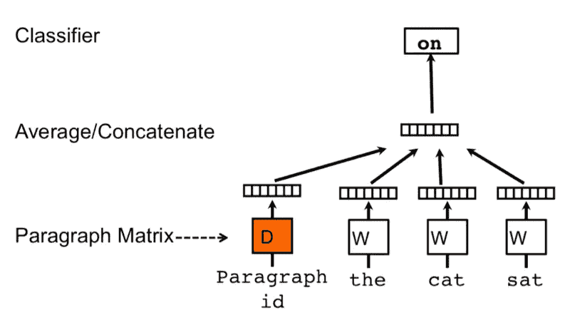
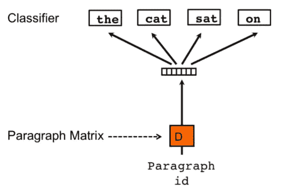
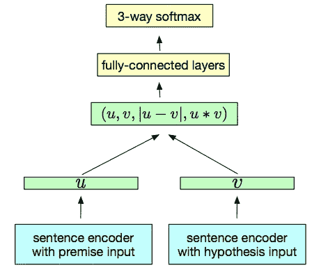
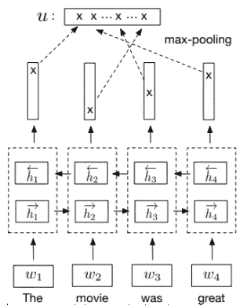

# 从单词嵌入到句子嵌入——第 2/3 部分

> 原文：<https://medium.datadriveninvestor.com/from-word-embeddings-to-sentence-embeddings-part-2-3-21a5b03592a1?source=collection_archive---------1----------------------->

Designed by [Freepik](https://br.freepik.com/fotos-gratis/letras-formando-a-palavra-pratica_1330193.htm)

[关于这篇和更多的帖子，请查看我的[网站](https://diogodanielsoaresferreira.github.io/)

你好。这篇文章是关于**句子嵌入**的三部分系列文章的第二部分。如果你没有读过第一部分，你可以在这里找到它。

在这篇文章中，我将解释两种创建句子嵌入的方法:Doc2vec 和 InferSent。

为了从 [TF-IDF 表示](https://medium.com/@diogoferreira_2387/from-word-embeddings-to-sentence-embeddings-part-1-3-7ba9a715e917)改进句子表示，我们必须考虑每个单词的语义和词序。句子嵌入试图对所有这些进行编码。

句子嵌入类似于单词嵌入。每个嵌入都是一个低维向量，以密集的格式表示一个句子。有不同的算法来创建句子嵌入，相同的目标是为相似的句子创建相似的嵌入。

# Doc2vec

**Doc2vec** 算法(或段落向量)是由当时谷歌的两位研究科学家 Quoc Le 和 Tomas Mikolov [1]在 2014 年提出的。它基于 Word2vec 算法，该算法创建单词的嵌入。该算法遵循一个假设，即一个单词的含义是由出现在附近的单词给出的。

> 从一个人交的朋友身上，你就可以知道他说了什么

作者提出了该算法的两种变体:分布式内存模型(DM)和分布式单词包(DBOW)。

## 分布式存储模型

Figure 1 — Neural Network architecture of the DM model. (Source: [1])

在图 1 中，描述了 DM 模型的神经网络体系结构。让我们从分析训练阶段开始，然后我们将看到模型如何为一个句子创建嵌入。

训练语料库中的每个句子和每个单词都被转换成独一无二的表示。两者都有嵌入，分别存储在矩阵 *D* 和 *W* 中。训练是通过在句子上传递一个滑动窗口来完成的，试图根据上下文中的前一个单词和句子向量(或图 1 中的段落矩阵)来预测下一个单词。下一个单词的分类是通过将句子和单词向量的连接传递到 softmax 层来完成的。对于不同的句子，词向量是相同的，而句子向量是不同的。两者都在培训阶段的每一步进行更新。

 [## 编码器解码器序列:多长是太长？数据驱动的投资者

### 在机器学习中，很多时候我们处理的输入是序列，输出也是序列。我们称这样的一个…

www.datadriveninvestor.com](https://www.datadriveninvestor.com/2020/03/24/encoder-decoder-sequences-how-long-is-too-long/) 

预测阶段也是通过在句子上传递一个滑动窗口来完成的，试图在给定前一个单词的情况下预测下一个单词。除了句子向量的权重之外，模型的所有权重都是固定的，句子向量的权重在每一步都被更新。在为一个句子计算了下一个单词的所有预测之后，句子嵌入是结果句子向量。

## 分布式词袋模型

Figure 2 — Neural Network architecture of the DBOW model. (Source: [1])

图 2 显示了 DBOW 模型的神经网络架构。该模型忽略了词序，具有更简单的架构，需要学习的权重更少。

训练语料库中的每个句子也被转换成独热表示。在每次迭代中，通过从语料库中选择随机的句子，并从该句子中选择随机数量的单词来完成训练。该模型将尝试仅基于句子 ID 来预测那些单词，并且句子向量将被更新(在图 2 中，分别是段落 ID 和段落矩阵)。

在预测阶段，使用来自句子的随机单词样本训练新的句子 ID，但是 softmax 层的权重是固定的。句子向量在每一步都被更新，得到的句子向量是该句子的嵌入。

## 比较

比较这两种方法， **DM 模型比 DBOW 模型**有一些技术优势:

*   DM 模型考虑了词序，而 DBOW 模型没有。
*   DBOW 模型不使用单词向量，这意味着单词的语义没有被保留，并且更难检测单词之间的相似性。
*   由于 DBOW 模型的架构更简单，因此需要更多的步骤来训练以获得精确的向量。

DM 模型的主要缺点是生成嵌入所需的时间和资源，这高于 DBOW 模型。

什么方法能产生更好的句子嵌入？在最初的论文中，作者说 DM“持续优于”DBOW。然而，**最近的研究报告称，DBOW 方法更适合大多数任务** [2]。Doc2Vec [3]在 Gensim 中的实现将 DBOW 方法作为默认算法，因为发现它比 DM 方法具有更好的结果。

# InferSent

InferSent 是另一种句子嵌入方法，由脸书 AI Research 在 2018 年提出[4]，Github 中提供了实现和训练好的模型[5]。

它在训练过程中与之前的算法有一些不同:它不是无监督学习来训练一个语言模型(LM)(一个预测下一个单词的模型)，而是**使用监督学习来执行自然语言推理(NLI)** (一个预测假设与前提相比是真(蕴涵)、假(矛盾)还是未确定(中性)的模型)。

Figure 3 — Generic architecture for training embeddings using NLI. (Source: [4])

图 3 展示了这种方法的通用培训架构。 *u* 和 *v* 具有共享的权重，是我们最终会得到的句子嵌入。

在训练阶段，前提和假设的句子嵌入连同其元素方面的乘积和元素方面的差异被连接。生成的矢量被输入到多个完全连接的层中，最终得到一个 3 级 softmax(这些级是蕴涵、矛盾或中性)。

创建句子嵌入的架构应该是什么？作者尝试了不同的架构，但在这里我将只描述一个具有最好结果的架构，即在 INF sent:a**BiLSTM 中实现的具有最大池**的架构。

Figure 4 — Bi-LSTM with max pooling architecture used in InferSent to generate embeddings. (Source: [4])

图 4 描述了具有最大池的双 LSTM 的架构。在这篇文章中，我不会详细解释什么是 LSTM(长短期网络)。

简而言之，LSTM 是一种神经网络，能够记住以前的输入，并在计算下一个输出时使用它们(递归神经网络)。这是通过一个隐藏向量来完成的(图 8 中的 *h* ，它表示输入的当前状态的记忆。这种架构包含一个双向 LSTM 网络，这意味着应用了两个 LSTM 网络:一个负责前面的输入以预测下一步的输出(向前 LSTM)，另一个 LSTM 则相反:它从头到尾查看输入，并尝试按此顺序进行预测(向后 LSTM)。

然后连接两个 LSTM 网络的输出向量，最后的嵌入是隐藏单元维度上的最大值，如图 4 所示。

以使用监督数据进行训练和复杂的递归神经网络(RNN)架构为代价，这种方法创建了很好的句子嵌入。

随着变形金刚和伯特的出现，另一个建筑成为了 2019 年的 SOTA——**句子——伯特**。阅读 [part 3](https://medium.com/@diogoferreira_2387/from-word-embeddings-to-sentence-embeddings-part-3-3-e67cc4c217d7) 了解更多，查看我的[网站](https://diogodanielsoaresferreira.github.io/)类似帖子。

感谢你的坚持！

# 参考

*   [1]: Quoc Le 和 Tomas Mikolov:《句子和文档的分布式表示》，2014； [arXiv:1405.4053](https://arxiv.org/abs/1405.4053) 。
*   [2]: Jey Han Lau 和 Timothy Baldwin:《对 doc2vec 的实证评估与对文档嵌入生成的实践洞察》，2016 年，第一届 NLP 表征学习研讨会论文集，德国柏林，第 78–86 页； [arXiv:1607.05368](https://arxiv.org/abs/1607.05368) 。
*   [3]: Gensim — [Doc2vec 段落嵌入](https://radimrehurek.com/gensim/models/doc2vec.html)。
*   [4]: Alexis Conneau，Douwe Kiela，Holger Schwenk，Loic Barrault:《从自然语言推理数据中监督学习通用句子表征》，2017； [arXiv:1705.02364](https://arxiv.org/abs/1705.02364) 。
*   [5]: [推断实现](https://github.com/facebookresearch/InferSent)。
*   [6]:克里斯多夫·奥拉赫，[了解 LSTM 网络](https://colah.github.io/posts/2015-08-Understanding-LSTMs/)。