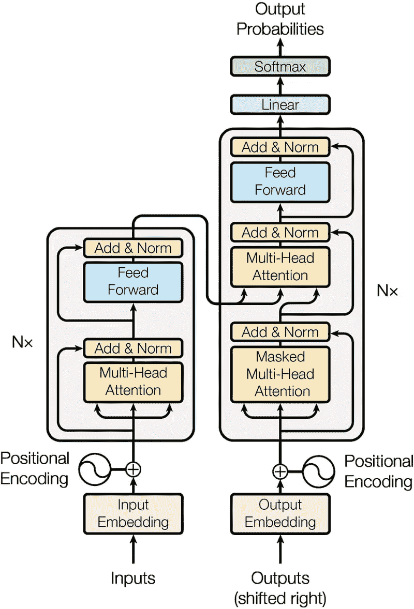
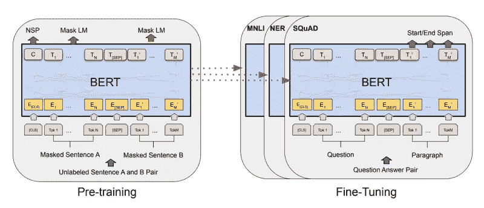
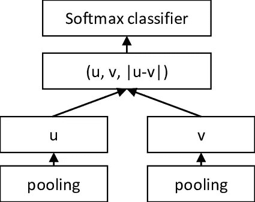

# 从单词嵌入到句子嵌入——第三部分

> 原文：<https://medium.datadriveninvestor.com/from-word-embeddings-to-sentence-embeddings-part-3-3-e67cc4c217d7?source=collection_archive---------4----------------------->

Designed by [Freepik](https://br.freepik.com/fotos-gratis/letras-formando-as-palavras-progresso-crescimento-e-sucesso_1330222.htm)

[关于这篇和更多的帖子，请查看我的[网站](https://diogodanielsoaresferreira.github.io/)

你好。这篇文章是关于**句子嵌入**的三部分系列文章的最后一篇。如果你没有读过第一部分或第二部分，你可以在这里找到它们[和](https://medium.com/@diogoferreira_2387/from-word-embeddings-to-sentence-embeddings-part-1-3-7ba9a715e917)。

在这篇文章中，我将解释创造句子嵌入的最先进的(SOTA)方法。

 [## 软件开发过程:如何选择正确的过程？数据驱动的投资者

### 软件是任何企业组织成功的生命线。没有软件的帮助，一个…

www.datadriveninvestor.com](https://www.datadriveninvestor.com/2020/01/16/software-development-process-how-to-pick-the-right-process/) 

# 句子-伯特

句子-Bert 目前(2020 年 4 月)是用于创建句子嵌入的 **SOTA 算法**。它是由 Nils Reimers 和 Iryna Gurevych [1]在 2019 年提出的，它利用 BERT 模型创建了更好的句子嵌入，考虑了文本和许多以前时间步长的上下文中的长期依赖关系。

为了理解句子-BERT 体系结构，必须解释几个概念。

## 注意机制

如[第 2 部分](https://dev.to/diogodanielsoaresferreira/from-word-embeddings-to-sentence-embeddings-part-2-3-1db9)所述，LSTMs 有一个隐藏向量，代表输入当前状态的内存。然而，对于长输入，例如长句，向量不能给出正确预测下一个状态所需的所有信息。 **LSTM 可能会出错，因为在实践中，由于表示状态的隐藏向量的大小的瓶颈，它只具有有限数量的后退的信息**。

为了解决这个问题，2014 年引入了注意力机制([3]、[4])。代替单个向量，**该模型在决定预测什么之前可以访问所有先前的隐藏状态**(在【4】中可以找到更好的解释)。注意力有助于解决长期依赖问题。

## 变压器

LSTMs 的另一个问题是**训练的时间**。因为输出总是依赖于之前的输入，所以训练是按顺序进行的，花费的时间太多。谷歌大脑和多伦多大学在 2017 年提出的 Transformer 架构[5]，**展示了如何在一个可以并行化的神经架构中使用注意力机制，在机器翻译任务中花费更少的时间进行训练并获得更好的结果**。

Figure 1 — Transformer architecture. (Source: [5])

图 1 显示了变压器的完整架构。详细的解释可以在[6]中找到。该架构由两部分组成:编码器和解码器。**编码器对输入的表示进行编码，而解码器试图根据编码器的表示和先前的输出输出一个概率**。编码器和解码器的基本构造块是前馈层和自关注层。自我关注层着眼于整个输入，并试图关注最重要的部分，而不是依赖于单一的隐藏状态表征。

transformer 体系结构应用于句子翻译的结果是对以前最先进模型的巨大改进。transformer 彻底改变了 NLP 领域，因为现在可以在合理的时间内训练大型数据集，而模型不太容易出现长期依赖问题。然而，我们为什么要坚持只使用一个变压器呢？**如果我们堆叠许多变压器，并对它们进行稍微不同的训练以获得更好的性能，会发生什么？**

## 伯特

BERT 于 2019 年年中由谷歌人工智能语言团队[7]提出，并兑现了使用变形金刚创建一个比所有前辈都好得多的通用语言理解模型的承诺，在 NLP 发展中向前迈出了一大步。当它被提出时，它在诸如问题回答或语言推理的任务中实现了 SOTA 结果，只是对其架构进行了微小的修改。

Figure 2 — BERT Architecture for pre-training and fine-tuning. (Source: [7])

图 2 显示了 BERT 架构。它主要由一个**多层双向变换器编码器**组成(大模型由 24 层变换器块组成)，其中输入是每个令牌在输入中的嵌入。

这个架构的一个重要方面是**双向性，这使得 BERT 能够学习前向和后向依赖性**。这是通过用两个不同的目标任务预先训练 BERT 来实现的:

*   **掩蔽语言模型**，也称为完形填空任务，使 BERT 能够学习双向依存关系。它不是预测句子中的下一个单词，而是随机屏蔽一定比例的输入标记，并预测那些被屏蔽的标记。这迫使模型不仅要学习向前，还要学习标记之间的向后依赖性。
*   **下一句预测**给模型输入两句话，预测这两句话是否相邻。该任务迫使模型学习两个句子之间的关系，这不是语言建模直接捕获的。

在获得无监督数据的预训练模型后，微调部分可以适应不同的 NLP 任务，只需改变模型的输入和输出即可。论文中一个有趣的结论是**变压器层数越多，下游任务**的结果越好。

## 句子-伯特法

最后，我们得出了句子-伯特法。

为了使用 BERT 计算两个句子之间的相似度，需要将两个句子输入到网络中。由于 BERT 的复杂性，计算 10000 个句子的相似性需要大约 65 个小时的计算。

**句子-BERT 是一种创建语义有意义的句子嵌入的方法，可以与余弦相似度进行比较，保持 BERT 的准确性，但将寻找最相似对的工作从 65 小时减少到 5 秒**。

Figure 3 — Sentence-BERT training architecture. (Source:[1])

图 3 描述了句子-BERT 体系结构。训练目标(同样用于推断)是根据句子的相似性对句子进行分类:蕴涵(句子相关)、矛盾(句子矛盾)或中性(句子不相关)。一对句子被馈送给 BERT，接着是一个池层(它可以是最大池、均值池或使用 BERT 输出中的 CLS 令牌)，它将为每个句子生成一个嵌入。这两种嵌入与它们的差异连接在一起，并被馈送到 3 路 softmax 层。这种训练模式通常被称为暹罗网络[8]。

通过用这种架构微调 Bert 权重，生成的**嵌入适合句子相似度**，通过 BERT 发送句子并应用池操作。

# 比较算法

现在我们已经看到了创建句子表示的四种算法(查看前面的算法[这里](https://medium.com/@diogoferreira_2387/from-word-embeddings-to-sentence-embeddings-part-1-3-7ba9a715e917)和[这里](https://medium.com/@diogoferreira_2387/from-word-embeddings-to-sentence-embeddings-part-2-3-21a5b03592a1)，让我们测试它们，看看结果。这个 [Jupyter 笔记本](https://github.com/diogodanielsoaresferreira/document_representations_tests/blob/master/Sentence%20Similarity.ipynb)包含了四种方法的测试。

给定一个新闻数据集，用四种方法创建新闻描述的表示。给定用户插入的查询，它将生成该查询的表示，并将它与所有新闻表示进行比较。该比较是使用余弦相似性来完成的。前五个最相似的新闻描述被打印到笔记本上。我们来分析一些结果。

问题是“民主党在选举中赢了共和党。”所有的方法都产生了好的结果，但是似乎**inferent 和 sentent-Bert 有更好的匹配**。再来看另一个结果。

对于前三种方法，这个查询特别困难。**只有一句话——伯特似乎产生了正确的结果**。

你可以在笔记本[这里](https://github.com/diogodanielsoaresferreira/document_representations_tests/blob/master/Sentence%20Similarity.ipynb)看到更多有趣的结果。

我们还测试了其他产生句子表达的算法，但在这篇文章中没有探讨。如果你想知道更多，我建议你看看**通用句子编码器【9】，Skip-thought【10】或者 fast sent【11】**。

总之，有各种算法来创建句子表示。除了性能，考虑它们的速度和内存需求也很重要。

句子嵌入是一个开放的研究领域，在过去的几年里取得了很大的进展，行业应用程序，如聊天机器人和搜索引擎，对它们的需求越来越大。跟上研究领域的最新发展是很重要的。

感谢您坚持阅读本系列关于句子嵌入的最后一部分！查看我的[网站](https://diogodanielsoaresferreira.github.io/)类似帖子。

# 参考

*   [1]: Nils Reimers 和 Iryna Gurevych:《句子-BERT:使用暹罗 BERT-Networks 的句子嵌入》，2019； [arXiv:1908.10084](https://arxiv.org/abs/1908.10084) 。
*   [2]: Dzmitry Bahdanau，Kyunghyun Cho 和 Yoshua Bengio:《通过共同学习对齐和翻译进行神经机器翻译》，2014 年； [arXiv:1409.0473](https://arxiv.org/abs/1409.0473) 。
*   [3]: Minh-Thang Luong，Hieu Pham 和 Christopher D. Manning:“基于注意力的神经机器翻译的有效方法”，2015； [arXiv:1508.04025](https://arxiv.org/abs/1508.04025) 。
*   [4] — Jay Alammar，[可视化一个神经机器翻译模型(Seq2seq 模型的力学注意)](https://jalammar.github.io/visualizing-neural-machine-translation-mechanics-of-seq2seq-models-with-attention/)。
*   [5] —阿希什·瓦斯瓦尼、诺姆·沙泽尔、尼基·帕尔马、雅各布·乌兹科雷特、利永·琼斯、艾丹·戈麦斯和卢卡斯·凯泽:《注意力是你所需要的一切》，2017； [arXiv:1706.03762](https://arxiv.org/abs/1706.03762) 。
*   [6] —杰·阿拉玛，[《图解变压器》](http://jalammar.github.io/illustrated-transformer/)。
*   [7] — Jacob Devlin，Ming-Wei Chang，Kenton Lee 和 Kristina Toutanova:《BERT:用于语言理解的深度双向转换器的预训练》，2018； [arXiv:1810.04805](https://arxiv.org/abs/1810.04805) 。
*   [8] — Jane Bromley、Isabelle Guyon、Yann LeCun、Eduard Sackinger 和 Roopak Shah:“[使用暹罗时间交易神经网络](https://papers.nips.cc/paper/769-signature-verification-using-a-siamese-time-delay-neural-network.pdf)进行签名验证”，1994 年。
*   [9] — Daniel Cer、Yang、Sheng-yi Kong、Nan Hua、Nicole Limtiaco、Rhomni St. John、Noah Constant、Mario Guajardo-Cespedes、Steve Yuan、Chris Tar、Yun-Hsuan Sung、Brian Strope 和 Rey Kurzweil:《通用句子编码器》，2018； [arXiv:1803.11175](https://arxiv.org/abs/1803.11175) 。
*   [10] — Ryan Kiros、Yukun Zhu、Ruslan Salakhutdinov、Richard S. Zemel、Antonio Torralba、Raquel Urtasun 和 Sanja Fidler:“跳过思维向量”，2015 年； [arXiv:1506.06726](https://arxiv.org/abs/1506.06726) 。
*   [11] — Felix Hill，Kyunghyun Cho 和 Anna Korhonen:“从未标记数据中学习句子的分布式表示”，2016 年； [arXiv:1602.03483](https://arxiv.org/abs/1602.03483) 。