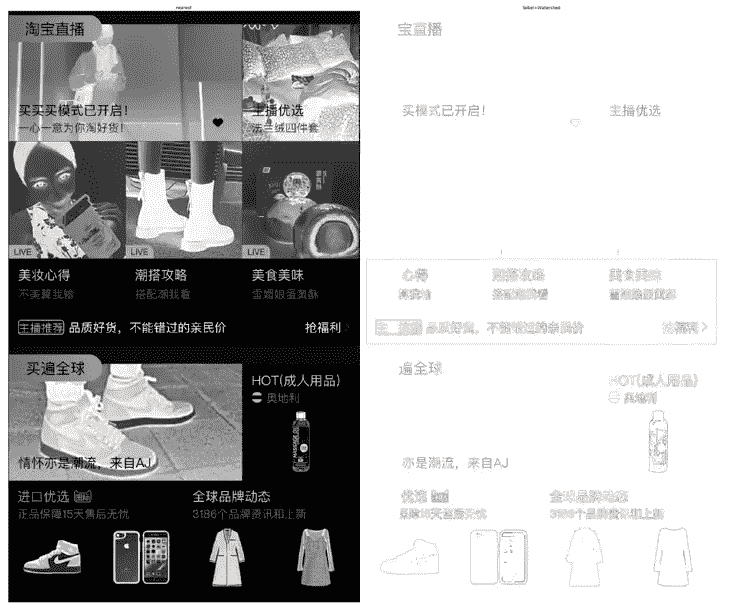
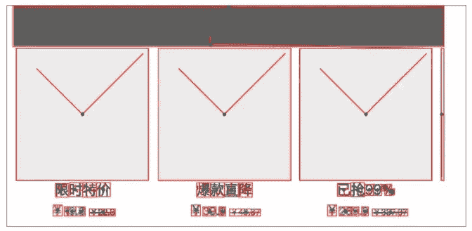
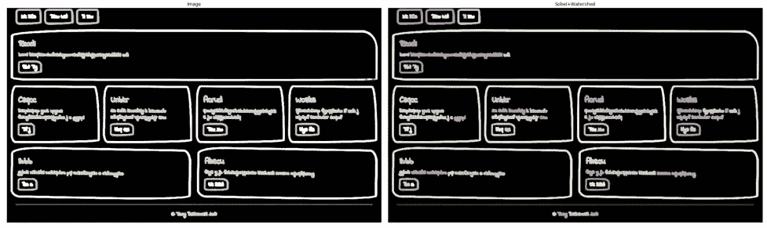
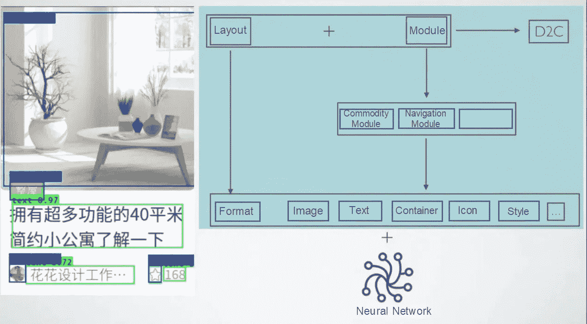
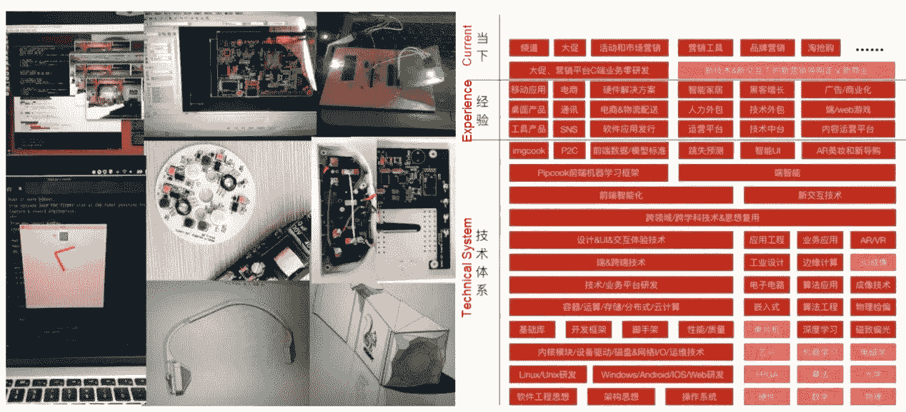
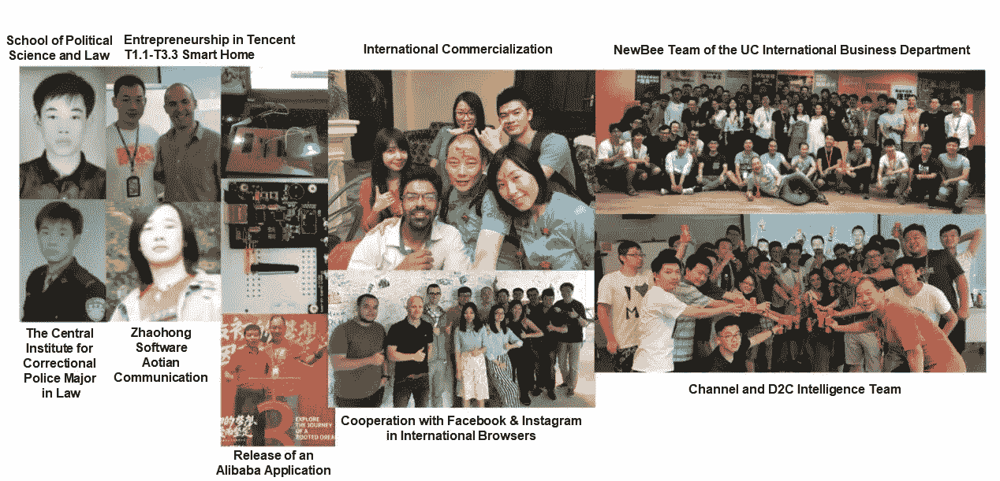

# 前沿智能——一种新的思维方式

> 原文：<https://medium.datadriveninvestor.com/frontend-intelligence-a-new-way-of-thinking-1e4d4097ac9c?source=collection_archive---------34----------------------->


*由贞子*

谁应该阅读这篇文章？如果您有兴趣通过机器学习来升级您的编程，您一定不想错过这篇文章。我将从这篇文章中学到什么？你可以打破旧的思维方式，理解机器学习的价值。

经过多次调查、交谈和思考，我发现主要原因是大多数前端人员没有改变他们的思维，仍然从传统的角度考虑智能能力。今天，我想描述我们如何以一种新的方式来构想前端智能。


# 1.智能思维的关键问题

## 关键问题是什么？

*关键问题是:*你或者机器学习模型会这么做吗？如果你要做某事，你必须考虑清楚这个问题。如果模型将执行任务，您必须清楚地定义问题。*清楚地考虑*一个问题和*清楚地定义*一个问题有什么区别？这让很多人很困惑。简单来说，明确定义一个问题，就是明确你要解决的问题，以及问题发生的领域。想清楚一个问题就是要明确你要解决的问题，问题发生的领域，如何解决问题。在这种情况下，你可能会有两个问题:问题能解决吗，如果能，我该如何解决问题？

## 问题能解决吗？

这个问题不是一个科学问题，因为不知道具体的问题和可以解决的程度。这就引出了很多衍生问题。首先，让我们从宏观的角度来探讨它们。我对智能的理解来自于我对前端和编程领域痛点的分析和考虑。2018 年 9 月我到杭的时候，imgcook.com 的前身达芬奇已经发展了两年。为了补充达芬奇从设计生成代码的能力，我们在底层建立了数据标准和统一的交付系统，并在上层建立了业务平台，如 Ark 和 Mingyunshi。然而，达芬奇不能解决所有的问题。它只能通过严格遵循标准设计文件来解决简单的问题。

此外，达芬奇使用 OpenCV 技术识别设计文档，这需要大量的阈值和约束来实现更好的结果。



无论我们如何调整 OpenCV 中的阈值，我们都无法摆脱糟糕的情况。如上图所示，即使不断努力，我们也无法管理设计文档的无限组合和无限可能，以及设计师多样的个人习惯。

我们能做什么？我们可以使用机器视觉模型和算法。我研究过很多这样的模型和算法。



这些调查逐渐启发了我。经过不断的摸索，终于在模型 MaskRCNN 和 Yolo V3 上取得了不错的成绩。



机器学习和深度神经网络可以结合起来，准确识别图像、文本和控制器。

总之，通过机器学习增强的智能方法可以解决传统编程无法用阈值解决的问题。接下来，我将解释如何使用智能方法来解决传统编程无法解决的问题。

## 很难吗？

*俗话说，“态度决定一切”*现在，我将讨论我和我的团队如何获得正确的态度。第一个问题:机器学习是一个很难的工具吗？你应该能猜到答案:不会！今天，在机器学习中很容易使用许多成熟的[框架](http://github.com/alibaba/pipcook)和[模型](https://www.tensorflow.org/hub)。你可以点击下面的网址找到这样的工具。

**安装管理**[**pip cook**](https://github.com/alibaba/pipcook)**项目的命令行工具:**

`$ npm install -g @pipcook/pipcook-cli`

**初始化项目:**

```
$ mkdir pipcook-example && cd pipcook-example
$ pipcook init
```

**游乐场:**

**如果你想知道在**[**pip cook**](https://github.com/alibaba/pipcook)**中你可以做什么，以及在哪里可以查看你的训练日志和模型，你可以从 Pipboard 开始:**

`$ pipcook board`

您将在浏览器中看到网页提示。主页上有一个 MNIST 展示区，你可以在那里进行实验。如果你想训练一个模型自己识别 MNIST 手写数字，你可以试试下面的例子:

*   [pipeline-Mnist-image-class ification](https://github.com/alibaba/pipcook/blob/master/README.md):Mnist 图像分类问题的流水线
*   [流水线-数据绑定-图像分类](https://github.com/alibaba/pipcook/blob/master/README.md):训练图像分类任务的流水线示例，即将[img book](https://www.imgcook.com/)数据绑定图片进行分类
*   [pipeline-object-detection](https://github.com/alibaba/pipcook/blob/master/README.md):训练对象检测任务的流水线示例，用于 imgcook 使用的组件识别
*   [python-keras](https://github.com/alibaba/pipcook/blob/master/README.md) :使用 Python Keras 库在 js 语法和运行时训练深度学习网络的例子

您可以[查看本页](https://github.com/alibaba/pipcook/blob/master/example)查看完整列表。运行这些示例既快速又简单。例如，要进行 MNIST 图像分类，请运行以下提示来启动管道:

`$ node examples/pipeline/pipeline-mnist-image-classification.js`

[](https://www.datadriveninvestor.com/2020/11/19/how-machine-learning-and-artificial-intelligence-changing-the-face-of-ecommerce/) [## 机器学习和人工智能如何改变电子商务的面貌？|数据驱动…

### 电子商务开发公司，现在，整合先进的客户体验到一个新的水平…

www.datadriveninvestor.com](https://www.datadriveninvestor.com/2020/11/19/how-machine-learning-and-artificial-intelligence-changing-the-face-of-ecommerce/) 

## 它是如何工作的

上传者:关于前端智能就说这么多了。

按时间顺序走，首先我们回顾一下传统的研发流程，分析一下为什么达芬奇用 OpenCV 解决不了的问题，机器学习和智能可以解决。

回到关键问题:*明确定义*一个问题和*明确考虑*一个问题有什么区别？使用 OpenCV 时，定义问题意味着指定如何使用 OpenCV 算法提取图像、文本和控制器。首先，我们必须了解什么是图像，什么是文本，什么是控制器。

然而，当我们应用智能方法时，我们只需要告诉一个模型:这是图像，这是文本，这是控制器，这是标签数据；正如我告诉我的大儿子一样，“向你的小弟弟扔积木是错误的。”第二次，当他确定那是一个橡皮球时，他扔向了他的兄弟。(#-_-).我承认我没能解释清楚。我应该告诉我的大儿子，朝别人扔东西是不对的。使用 OpenCV 提取图像、文本和控制器时也是如此。很难在基于标准规则的设计文档中使用这些元素。达芬奇团队考虑这个问题两年多了。

如何利用机器学习和智能来解决这个问题？这很简单。我们只需要提供正确和不正确的答案作为样本，以便模型可以使用蛮力算法找到解决方案。这是机器学习的一个例子。因此，最本质的区别是，我们不需要考虑如何解决问题，而是需要为给定的领域选择正确的模型。更多信息可以查看相关[框架](http://github.com/alibaba/pipcook)和[模型](https://www.tensorflow.org/hub)的文档。然后，我们可以使用正确的答案来训练模型。

怎样才能找到正确答案？我们开发了一个 SimpleCook 平台来收集、组织和标记数据集。为了收集数据，我们必须找到原始数据。为了识别 imgcook 项目中的控制器，我们使用前端技术在 SimpleCook 平台上生成控制器。[木偶师](https://github.com/puppeteer/puppeteer)是用于此目的的关键技术。使用无头浏览器来呈现页面，然后根据编程规则或手动标记来标记对应于 imgcook、文本和控制器的图像区域。然后，我们生成一个正确答案的数据集。

我们如何训练一个模特？还记得前面提到的 Pipcook 前端机器学习框架吗？只需要一个命令行:

你可以点击[查看完整列表。运行这些示例既快速又简单。例如，要进行 MNIST 图像分类，请运行以下提示来启动管道:](https://github.com/alibaba/pipcook/blob/master/example)

`$ node examples/pipeline/pipeline-mnist-image-classification.js`

您只需要用您的数据集替换 Pipcook 教程中的样本数据。整个过程很简单。综上所述，智能方法的关键是组织正确答案，选择模型，训练模型。然后，你就大功告成了！

# 2.通过智能思维解决问题的价值

## 确实的事情

通过智能思维解决问题的过程很简单，因为总会有答案。这类似于我们自己生活中的艰难抉择。每个人都有他或她的答案。即使我们告诉一个模型一个“所谓的”正确答案，经过训练的模型可能会对一个未知的问题提供一个意想不到的答案，但模型永远会提供一个答案。

根据我们的经验，在行业中已经解决的问题也可以在我们的领域中解决。例如，只要图像中存在猫或狗，图像分类模型就可以准确地识别猫或狗。这一点已经被其他人在严格的实验中证实了。如果我给我拍摄的猫和狗的照片贴上标签，然后把它们放进一个模型里。经过训练的模型可以用来识别其他人拍摄的猫和狗的图像。这是我们所说的*确定性的另一部分。*

最后，我们来看一个来自现实生活的例子。当你加入一个新团队时，你不可能一开始就记住每个人的面孔和名字。认识每个人的名字并把它和正确的面孔联系起来是需要时间的。对于一个模特来说也是如此。这个模型不能在一开始就记住不同人的脸。然后，我们在不同的角度和不同的光线条件下标记不同人的面部图片。模型经过训练后，可以回忆起每个人的名字。这是必然的。

## 稳健性

用智能思维解决问题很容易。在我们为模型提供正确答案后，模型会根据此样本数据训练其参数和权重，以获得定义解决方案的算法。这是稳健的。让我们回到达芬奇在使用 OpenCV 时遇到的问题:不正确的阈值。很难总结和提取图像、文本和控制器的特征。但是，如果一个模型提供了足够多的正确答案作为样本数据，它就可以提取出健壮的答案。

有兴趣的话可以在谷歌搜索一下遗传算法和蚁群算法。你会发现，任何鲁棒性高的算法，表现都会比我们预期的更好。很难总结提炼出这些算法背后的模型和思想。但是，我们仍然可以编写遗传算法和蚁群算法，在模拟或真实环境中训练这些健壮的模型和算法。这种编程方法本身是健壮的。过去，我们总是在有了清晰的想法后才开始写代码。今天，如果我们使用智能思维，即使我们没有清晰的想法，我们也可以开始编写代码。这种软件开发方法也很健壮。

## 演变

今天，我们面临着服务器高可用性的问题。大约十年前，我和我的大学谈论系统的“自我修复”。很少有公司接近这一目标，但是通过聪明的思考这是可能的。现在，我想从智能思维的进化开始，分享一下我对系统自愈的想法。

智能思维的进化可以在我们解决问题的方式中表现出来。过去，我们在开发之前确定一个解决方案，并在开发过程中实现该解决方案。这被称为硬编码。当我们遇到需要灵活性的设计问题时，我们必须编写新代码，并不断安装补丁来解决新问题。

当我们用智能思维解决问题时，我们并没有提供解决方案。模型会自动从正确答案中提取答案。当我们遇到新的条件时，我们可以将这些条件作为新的答案反馈给模型。然后，模型可以自动进化，自行解决类似问题。为了实现这一点，我们需要形成一个闭环进化过程，包括评估答案，基于新答案生成正负样本，以及构建在线训练的路径。

因此，用智能思维解决问题是有价值的，因为它具有确定性、健壮性和进化性。有没有什么编程语言、技术、框架、脚手架或者工具可以给我们这种能力？

# 3.智能思维训练

## 知识:思维决定行动

不管我说多少，如果你不接受，那都是没用的。你必须做什么才能真正倾听和理解？我认为你必须打破旧的思维方式。首先我承认，作为一个程序员，我很骄傲，也很自以为是。自从 1990 年我在 Dos 6.22 上用 Basic 编写了第一个函数，并在屏幕上打印出菱形、圆形、星号组成的正方形，我就一直确信我能给世界编程。

那年晚些时候，父亲买了一台 486 DX-100 电脑。从此，我开始走上了编程全世界的道路。从那以后，我在生活中的每一个决定都是自己做的。我上了中专，只上了一个学期就退学了，在一个会议大厅做服务员，开店卖录像带和光盘，关店参加成人高考，大专升大学，法律专业，毕业后在 ERP 软件做业务员。一路上，我没有听取任何意见。毕竟我是那个可以给全世界编程的人。


*The image above shows my relationship with programming.*

虽然我很固执己见，但还是能保持开放的心态。这是我从自学编程到学习电子电路设计，什么都能很快学会的一个重要原因。我在办公司的时候自学了嵌入式开发和工业设计。



今天，随着机器学习的到来，前端领域需要新的智能思维来分析、定义和解决问题。我可以在任何时候重塑自己，以一种不寻常的方式考虑所有的新事物和新技术。这让我找到了新的机会。

## 行动:行动决定习惯

我的字典里没有“不可能”这个词。如果我训练自己，我能学会任何事情。我该如何训练自己？首先，我必须学会如何控制自己。我知道我可以利用模型解决更复杂、更有价值的问题。一旦我通过发展一个模型完全解决了一个问题，我就可以向我的下一个目标前进。真的很难克制自己的控制欲和表达欲。我已经训练自己快十年了，但我仍然是在最开始。

像我这样的程序员，通过写代码来解决一个问题是很自然的事情。我们找一个模型，训练这个模型来辅助解决一个问题，这并不直观。我能怎么做呢？我知道生命在运动中被发现。不过回到家还是习惯躺着用平板看视频。

我能怎么做呢？我给自己定了三条规则:

1.  不要从零开始自己解决任何问题。而是从成熟的模型中寻找解决方案。
2.  在写代码之前强迫自己慢下来，想想自己是否能充分考虑和解决问题。如果答案是肯定的，我就开始写代码。如果答案是否定的，我会尝试另一种智能解决方案。
3.  不断想象前端领域的问题，并尝试用智能思维解决，以养成使用智能思维的习惯。

## 知行合一

既然我已经东拉西扯了这么多，你可能想回应一下。我邀请你加入淘宝技术部前端 D2C 情报团队。我们在阿里巴巴前端技术委员会负责智能开发。无论你在培养智能思维习惯的过程中遇到什么问题，我们都有解决方案。

# 原始来源:

[](https://www.alibabacloud.com/blog/frontend-intelligence---a-new-way-of-thinking_596980) [## 前沿智能——一种新的思维方式

### 阿里巴巴 F(x)团队 2020 年 12 月 8 日 118 谁应该看这篇文章？如果您有兴趣升级您的…

www.alibabacloud.com](https://www.alibabacloud.com/blog/frontend-intelligence---a-new-way-of-thinking_596980) 

## 访问专家视图— [订阅 DDI 英特尔](https://datadriveninvestor.com/ddi-intel)