# 《2020 年节俭生活》(外加 50 种每月节省数千英镑而不会感到廉价的方法)

> 原文：<https://medium.datadriveninvestor.com/frugal-living-2020-and-50-ways-to-save-thousands-per-month-without-feeling-cheap-5b43f30fbf6d?source=collection_archive---------2----------------------->

让我们现实一点。

不管你喜欢你的工作还是讨厌你的工作，你都不想永远工作下去。

总有一天，你会踢掉你的闹钟，然后粉碎维他命混合物中的残留物。为了实现这个梦想，你可以尝试过节俭的生活，让你的储蓄翻倍。

然后你突然想到… *“储蓄？什么储蓄？”*

每个月都盯着你的信用卡账单，贷款，租金或抵押贷款，电话账单，还有无尽的订阅，它们的触角像寄生虫一样抓住你的支票账户。

*“现代生活什么时候变得这么贵了？”*

不一定是这样的。如果你愿意做出改变，达到你的财务目标比你想象的更容易实现。但是对于如此重要的事情，你需要一个计划。

 [## 外汇投资如何帮助偿还债务|数据驱动的投资者

### 外汇是对外汇市场的投资，不同国家的货币在外汇市场上进行兑换

www.datadriveninvestor.com](https://www.datadriveninvestor.com/2019/02/13/how-forex-investment-helps-to-repay-your-debts/) 

在本指南中，你会读到经过研究证明和时间考验的开始节俭生活的策略。你将学会让你保持动力的目标，关注哪里，忽略什么，以及如何跟踪进展，这样你的动力就不会动摇。

接下来，细读 50 种既省钱又不会感到廉价的方法。从几十个顶级节俭生活博客中挑选，你会很容易地找到六到八个从本周开始。

做微积分。现在投资一点时间，在你意识到之前，你会改变你的生活*和*你的银行账户。

准备好开始了吗？

# 什么是简单节俭的生活？(提示:不是你想的那样)

超过 1000 万千禧一代认为自己很节俭。对这些人和其他人来说，节俭不是剥夺或交易，而是过着奢侈和聪明的生活。把钱花在你认为有价值的目标和事情上，然后把其他事情排在次要位置。

这就像在一个只有沙拉盘的无休止的自助餐上用餐。只选择你最喜欢的菜，即使这样，有些菜还是不合适，需要等待。

一旦你培养了对浪费性支出的敏锐感觉，你就会征服那些曾经看似无法实现的目标。像这样的目标:

●偿还债务

●提前退休，自己创业

●有钱有时间去旅行

●存钱买房或购买其他资产

●当你在银行有存款时，建立财务弹性

所以，你需要有目标。具体来说，反映你的价值观和你想过的生活的目标，因为这些是你要坚持的目标。

*渴望旅行？早点退休，多放松？自己创业？*

只有你自己才能决定什么对你来说是重要的，所以花点时间来解决这个问题。然后用节俭的生活来实现它。

后来，我分享了一个经过研究证明的方法来跟踪进展和提高动力。但是首先，这里有一些许多新手犯的错误:

# 新手可以(也应该)忽略的节俭生活小贴士

对大多数人来说，他们的大部分储蓄来自最大预算领域的一些重大变化，如住房、交通和食品。在其他地方精打细算收益递减，因为你的预算本来就太小了…数学是行不通的。

## 不要试图切断一切。

相反，了解你的钱都花到哪里去了，然后首先关注大额支出类别。这些变化影响更大。你会更快地存下更多的钱，并拥有一些小奢侈品。

> 这里有一个秘密——当你拥有小奢侈品时，你不会感到被剥夺。

**根据劳工统计局的数据，美国家庭的平均支出细分如下:**

让我们不要粉饰它…大变是*难。*

*搬去更小的家？骑车上班？把车库租出去？*

你在想，*“有* ***没办法*** *我做不到。”*

但是有，你可以。试试看。看着你的储蓄和投资账户越来越多，你就不会回头了。

## 想知道如何变得真正节俭吗？

紧要关头快速省钱？使用以下三个步骤:

每月一次，回顾和剖析家庭开支。(使用 Mint.com 之类的数字预算应用程序，或者用传统方法获取纸质报表。)

接下来，圈出你可以不要的东西，并制定一个计划和时间表来消除它们。最后；坚持到底。

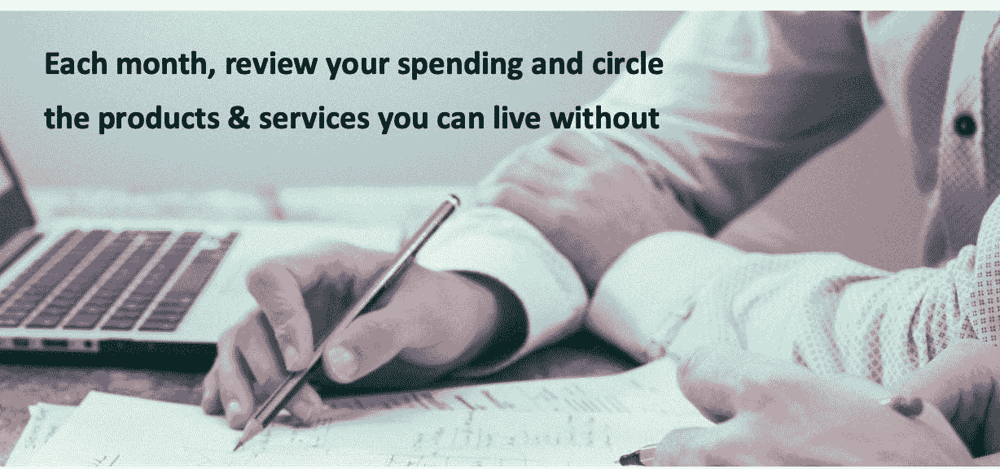

这项练习让你发现未使用的订阅和会员资格，区分“想要”和“需要”，并识别无意识的消费。

WiseBread 的 Emily Guy Birken 在这篇文章中写道，

> “认识到你必须优先考虑你的需求，这是基本预算的基石…”
> 艾米丽·盖伊·伯肯——明智的面包

# **生活廉价；不惨**

除非你一贫如洗，否则你不可能消除所有支出，指望兴旺发达(至少不会长久)。

但是，如果你能加倍激励自己，随时知道自己的放纵限度，并坚持不懈地实现目标，那会怎么样呢？

如果你知道怎么做，这并不复杂

弗吉尼亚大学的托马斯·贝特曼教授的研究提出了一个策略。

贝特曼研究了像行星科学家这样的专业人士，他们经常等待数年(或数十年)的结果。这些人有意识地制定时间表，包括短期的满足感，或者频繁的小胜利。

这些成功作为短期目标*提供进度反馈。定期达到里程碑，科学家保持动力 e *即使回报是几十年后。**

**以下是你如何将它应用到你的财务目标中的方法:**

*把你那些庞大、棘手、难以实现的财务目标结合起来。然后，把它们分解成一个单一的每月储蓄目标。*

*   *如果你定期储蓄的金额等于或大于你的目标，你会知道你在正轨上。*
*   *如果你经常入不敷出，这是一个做出更多生活改变的信号，这样你就可以增加你的储蓄。*

***看这个例子:***

*假设你的两大财务目标是:*

*1.在 12 个月内还清 10，000 美元的学生债务，以及*

*2.五年后，为房子的首付存 35，000 美元。*

*从现在开始，你可以达到每月 400 美元的储蓄目标，然后每年每月增加 50 美元。*

***你的储蓄计划会是这样的:***

*第一年:每月多存 400 美元
第二年:每月存 450 美元
第三年:每月存 500 美元
第四年:每月存 550 美元
以此类推。*

*以 6%的平均年回报率投资，你将在六年内实现这两个目标——完全按计划进行。*

*使用下表来计算你的每月储蓄目标。记住，从小处着手是可以的。节俭生活是一种技巧，有些改变不能操之过急。*

*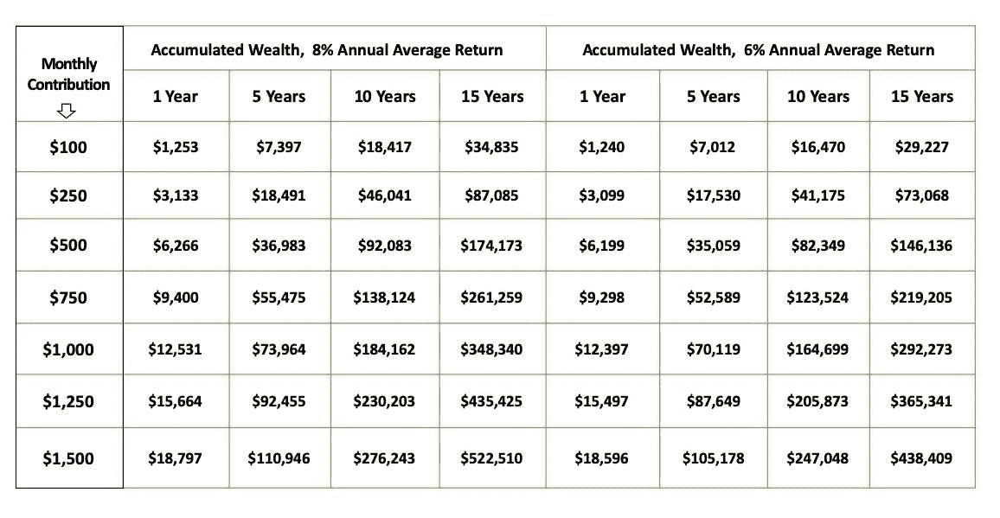*

***Accumulated Wealth vs. Monthly Contribution and Average Return***

## *想要更简单的方法？*

*如果达到财务目标没有期限，试试这个更简单的方法:*承诺每月将收入的一定比例存起来。**

*随着你薪水的增加，你的存款也会增加。*

# *来自顶级节俭生活博客的 50 条建议，任何人都可以做到(是的，甚至是你)*

*有了这些基本的东西，是时候找到既能省钱又不会觉得自己很廉价的方法了。*

*节俭生活博客提供了源源不断的新想法，但是有这么多高质量的博客，很难知道从哪里开始！*

*但我会掩护你的。*

*我阅读、提炼和筛选了几十个节俭生活的博客，从中选出回报最高的可行想法。那些显而易见的、不节俭的、存得太少的或者最好留给特定生活方式(比如在家务农)的建议已经一去不复返了。*

*以下列表仅具有高影响力。找到 6 到 10 个从现在开始，你每个月会额外节省 700 到 1000 美元。然后，坚持下去。*

*试试来自《T21》杂志的 j .罗斯的建议:*

> *“每周只做一件和你的钱有关的事情…”。JRoth，预算是性感的*

*把它付诸行动，你会立刻粉碎你的财务目标。让我们开始吧。*

# ***来自顶级节俭生活博客的 50 条建议，任何人都可以做到(是的，甚至是你)***

*有了这些基础知识，是时候找到既省钱又不觉得廉价的方法了。*

*节俭生活博客提供了源源不断的新想法，但是有这么多高质量的博客，很难知道从哪里开始！*

*但我会掩护你的。*

*我阅读、提炼和筛选了几十个节俭生活的博客，从中选出回报最高的可行想法。那些显而易见的、不节俭的、存得太少的或者最好留给特定生活方式(比如在家务农)的建议已经一去不复返了。*

*以下列表仅具有高影响力。找到 6 到 10 个从现在开始，你每个月会额外节省 700 到 1000 美元。然后，坚持下去。*

*试试来自《T2》杂志的 J. Roth 的建议，预算是性感的:*

*“每周只做一件和你的钱有关的事情…”。
J .罗斯，预算是性感的*

*把它付诸行动，你会立刻粉碎你的财务目标。让我们开始吧。*

***你的家——削减住房成本的九个节俭生活小贴士***

*无论你是租房还是买房，住房都可能是你的第一或第二项支出。试试以下九个建议，让你在银行存更多的钱:*

***1。住小一点你的家——削减住房成本的九个节俭生活小贴士***

*无论你是租房还是买房，住房都可能是你的第一或第二项支出。试试以下九个建议，让你在银行存更多的钱:*

## *1.生活得更小*

*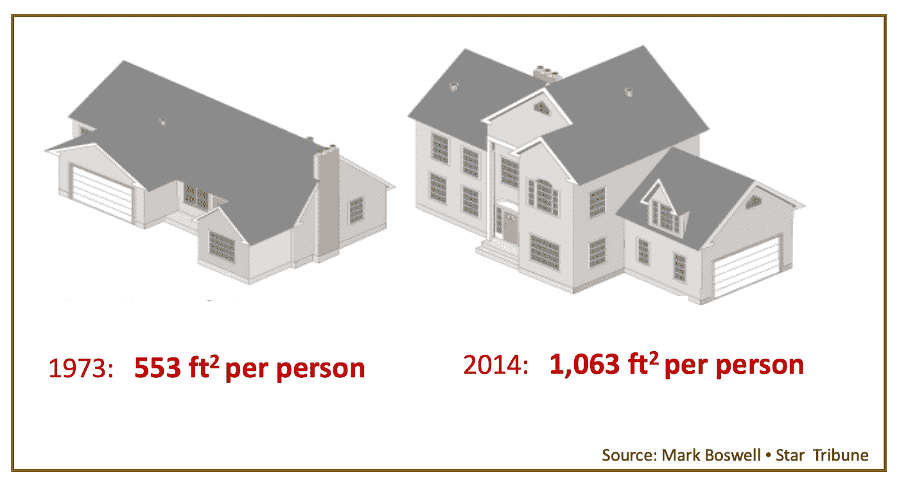*

*你真的需要这么大的空间吗？除了澳大利亚人，美国人是这个星球上最开放的民族。自 1973 年以来，新房子的平均面积增加了一倍多，而家庭越来越小。面对空荡荡的贫瘠荒野，我们去商店买更多的东西。*

*不要这样做。相反，试试这种节俭的生活方式:先整理，然后缩减。*

*较小的房子通常意味着较低的抵押贷款和纳税义务。公共设施、家具、环境美化和维护成本都更低，你花在清洁上的时间也更少。*

## *2.将多余的房间货币化*

*如果你不能缩小规模，可以通过将多余的卧室出租给短期或长期租户来赚钱。(在 Airbnb 上做广告之前，先查一下你所在地区的住房限制。)*

## *3.出租或改造你的车库*

*是的，你可以在你的院子或车库里出租额外的空间给邻居的房车、船或其他存储需求。*

*或者，[把你的车库](https://www.thespruce.com/garage-conversion-1398125)改造成适销对路的生活区。(同样，在开始之前，检查你所在地区的住房限制。)车库改造通常在 10-12 个月内实现收支平衡；如果你自己做一些工作会少一些。*

## *4.旅游挣钱*

*你不一定要住在旅游胜地才能参与到短期租房的热潮中。外出旅游时，大多数人都可以出租他们的房子。*

*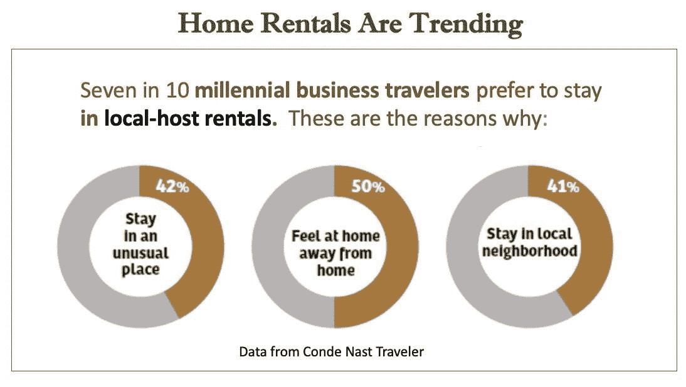*

*在 Airbnb.com和[这个网站](https://blog.tortugabackpacks.com/airbnb-competitors/)上获得关于如何展示你的家以及在哪里做广告的提示。*

## *5.再融资*

*如果你能降低你的抵押贷款利率至少 0.5%，或消除私人抵押贷款保险，它是值得的调查再融资。与代理交谈或使用这个[免费计算器](https://www.lowermybills.com/)来估算节省。*

## *6.支付更少的保险费*

*不要克扣房主或租房者的保险，但每年都要购买最优惠的价格。不同的运营商有不同的折扣和除外条款，所以要有几个报价。你的雇主、校友或商业协会提供团体计划吗？问问也无妨。*

## *7.学习简单修理*

*在打电话给修理工之前，从[家庭杂工](https://www.familyhandyman.com/)或者 YouTube 等网站查看 DIY 修理教程。如果看完教程后工作看起来太复杂，那就找专业人士。*

*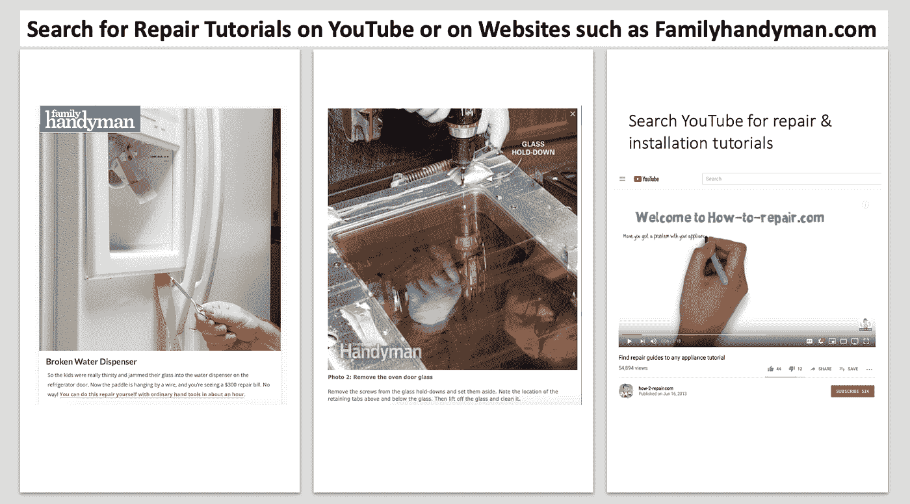*

## *8.根据预算提供*

*有了一些工具和一个空闲的周末，你可以[打造比商店里买的更结实的家具](https://www.bobvila.com/slideshow/20-insanely-easy-ways-to-build-your-own-furniture-49790#use-a-bench-top-as-a-tabletop)(书架和桌子是新手的理想选择)。或者，在宜家或[平价网上商店购物时，在家组装，节省一半或更多的零售成本。](https://www.buzzfeed.com/katyherman/best-cheap-furniture-online-2018)*

## *9.增加户外生活空间*

*当你缩小规模时，你的小房子会感觉更大，有一个可用的户外生活空间，如一个完工的露台或甲板。此外，这些项目增加了你家的转售价值。使用这些小贴士建造一个便宜的豪华户外度假村。*

# *公用事业-简单节俭的生活技巧，削减能源成本*

*提高你家的能源效率增加了你家的价值，但大多数升级都很昂贵，所以要谨慎选择。这里有六个开始行动的建议。*

## *10.请向您的提供商咨询折扣*

*公用事业公司不会宣传促销或折扣付款计划，所以打电话给他们。最好每年检查一次。*

*低收入家庭可以通过低收入家庭能源援助计划来帮助支付能源账单。LiHEAP 还为某些节能住宅升级提供折扣。*

## *11.选择合适的节能家居升级*

*在投资绿色升级之前，进行一次[能源审计](https://www.energysage.com/energy-efficiency/buyers-guide/home-energy-audit/)，或者自己进行一次。然后，关注早期回报最高的项目。如果你是租房者，至少要安装隔热保温窗帘。*

## *12.租赁屋顶太阳能*

*如果你的电费账单导致心脏骤停，看看屋顶太阳能购买协议(也称为 PPA)。晒晒太阳，你每个月可以省下几百英镑。寻找一个前期成本低或为零，并保证节省的计划。在这里找到租赁公司[。](https://www.energysage.com/solar/financing/leasing-companies/)*

## *13.降低热水器的温度*

*你家 13%的能源用于加热水，所以把你家的热水器温度调到 120 度。*

## *14.安装可编程恒温器*

*当你睡着或者不在家的时候，调低空调和暖气的温度来省钱。寻找价格低于 50 美元的[低价款](https://thermostatguide.com/tag/cheap-and-low-cost-programmable-thermostat-reviews/)。*

# *交通——节俭的生活理念，减少出行成本*

*普通家庭将预算的 16%用于交通，而不考虑收入。不要让成本攀升，试试下面的一些建议:*

## *15.成为只有一辆车的家庭*

*考虑将踏板车或电动自行车作为你的第二辆车。你将节省前期成本，汽油和许可费。另外，你永远不会想要一个停车位。*

## *16.避免第一年汽车折旧*

*新车在拥有的第一个月内平均贬值 10%，然后在第一年结束前至少贬值 10%。*

*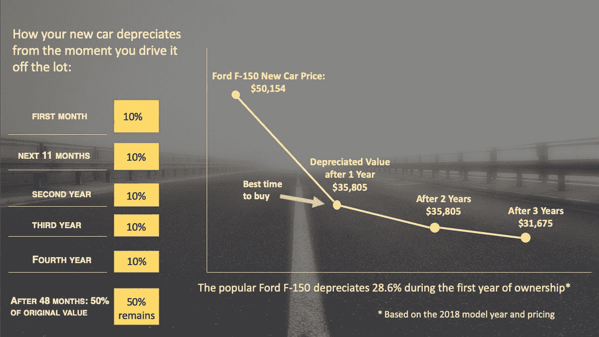*

*不要为无用的折旧买单！根据 [Edmunds](https://www.edmunds.com/car-buying/drive-a-nearly-new-car-for-almost-free.html) 的说法，你最喜欢的是一辆一年前的车，原厂保修已经全部或大部分到位。这节省了数千美元，而不影响您的车辆的使用寿命。*

## *17.不要被车辆维修费吓到*

*价格较高的汽车往往需要更多的维护费用。在你选择下一辆车之前，考虑一下新轮胎和非保修车辆维护的费用。如果你每年行驶 10，000 英里，每加仑汽油行驶 5 英里的差异就相当于 100 加仑汽油。*

## *18.找到保险交易*

*汽车保险费率使拥有一辆汽车的成本每月增加令人眼红的 100 至 150 美元。想降低这些成本？费率和覆盖范围差异很大，所以有必要[了解基础知识](https://www.iii.org/article/what-auto-insurance)，然后从多家运营商处获取报价(你是现役军人还是退伍军人？检查 USAA。)如果你的车比较老，就不要买碰撞险。*

## *19.获得道路救援*

*这种保险在你第一次使用它的时候就偿还你。[AAA 级道路救援是一个受欢迎的选择，但请咨询您当前的保险公司。你可能会得到更好的价格。](http://automotive.aaa.com/roadside-assistance.htm)*

## *20.偶尔拼车*

*偶尔一起搭车去上班。通过下载移动应用 [eRideshare](https://www.erideshare.com/) 或 [SoMo](https://somo.com/#home) 让它变得简单。然后，和与你同路的人联系。*

*如果你有孩子，认识其他父母，分担驾驶责任。*

# *餐饮和娱乐——如何既省钱又不失乐趣*

*除非你真的破产了，否则你不必取消所有外出就餐和娱乐活动。相反，按照下面的建议过节俭的生活。你不会错过与朋友和同事在一起的时间，但是你会省下一大笔钱。*

## *21.买一本娱乐折扣书*

*如果你喜欢尝试新的场地，买一本[折扣书](https://shop.entertainment.com/)。每本书的价格从 10 美元到 40 美元不等，但是当你使用“买一送一”的优惠和折扣时，你会节省数千美元。*

## *23.寻找打折票*

*在参观博物馆、主题公园、滑雪场或其他受欢迎的(也是昂贵的)场所之前，先查看一下打折票。这些通常可以通过员工组织或会员俱乐部获得，如 AAA、AARP 或你的校友会。如果您必须通过邮件订购，请尽早查看。*

## *22.熟悉 Groupon*

*在您所在的城市或与[Groupon.com](https://www.groupon.com/)一起度假时，在食品、服务、娱乐和购物方面节省高达 70%或更多。(甚至还有手机 app。)*

*查看这些真实的交易:*

*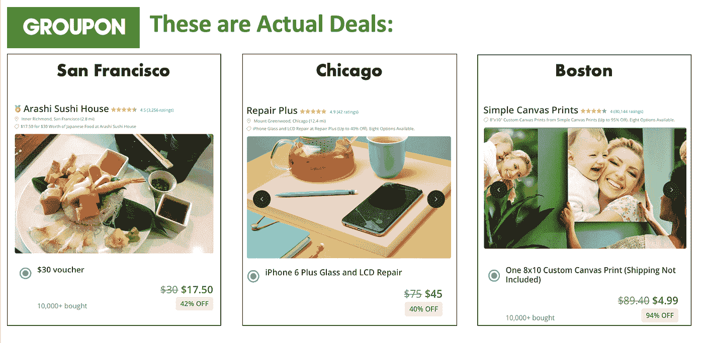*

## *24.减少 40%到 50%的餐馆账单*

*如果你外出就餐的次数减少一半，你就不会错过办公室八卦或与朋友外出的时间。或者，坚持吃最便宜的开胃菜(不含饮料)或分享一餐。*

# *购物——适合任何预算的简单节俭的生活小贴士*

*有这么多的策略来比较价格商店，寻找销售项目，并赚取现金回扣，你很少会再次支付全价。这里有八个建议可以帮助你从购物中获得最大收益:*

## *25.在购物时注册赚取现金*

*花 30 分钟注册几个数字应用程序，这些程序会在你购物时返还你现金。这些应用程序在你的信用卡积分上工作。所有这些都可以免费注册，所以你可以毫无风险地试用它们。*

*   *[Dash.cash](https://www.dosh.cash/)*
*   *[乐天](https://www.rakuten.com/)*
*   *[伊博塔](https://home.ibotta.com/)*
*   *[蜂蜜](https://www.joinhoney.com/)(仅限网购)*

*如果你只用一个优惠券 app，那就做成这个: [RetailMeNot](https://www.retailmenot.com/)
(如果你在这里找不到优惠券，很可能是不存在的。)*

## *26.商店很少使用或翻新*

*Craigs list 、[易贝](https://www.ebay.com/)、 [Offerup](https://offerup.com/) 和 [Mercari](https://www.mercari.com/) 都提供新的、二手的和翻新的廉价商品。养成在其他地方购物前先查看这些网站的习惯。当你出售你的闲置物品时，使用相同的网站来赚取现金。*

## *27.打折购买商店礼品卡*

*如果你在大型连锁店购物，用 [Cardpool](https://www.cardpool.com/buy-gift-cards) 的折扣购物卡付款，可以节省 3%到 20%的费用。*

*听起来很奇怪，对吧？*

*不是的。礼品卡几乎没有限制，Cardpool 网站可以让您轻松找到适合自己的礼品卡。许多“卡片”会立即通过电子邮件发送到你的智能手机上。*

***查看这些实际的卡池优惠:***

**

## *28.不要跳过大折扣商店*

*像 Dollar General 和 Five Below 这样的商店以全零售价格的零头出售数千种家用产品。在你的常规购物路线上增加一条。*

## *29.借，不买*

*开始一项新的运动或爱好？借齿轮或购买二手设备，直到你获得经验，知道你想要什么。当你准备购买时，试着在淡季销售或从二手网站购买“几乎新的”。*

## *30.点击暂停计划外购买*

*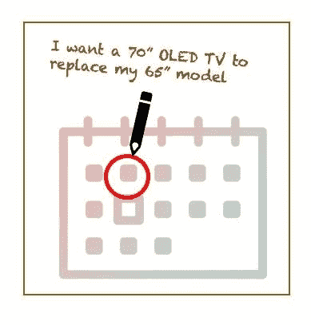*

***Pause one to two days and save up to $200 per month***

*如果不加以控制，冲动购物是致命的预算杀手。与其屈服，不如停止。在你的日历上写下这个项目，然后等 7 到 10 天(或者更久)。这给了你时间去寻找一个用过的版本，借用它，修改你有的东西，或者决定你不需要它。*

*根据研究，强迫暂停哪怕一两天，平均每个月也能为家庭节省 200 美元。*

## *31.回顾你的消费历史*

*这个建议太重要了，不能只提一次:
每月回顾一下你的消费历史，标出你可以不需要的项目和服务。然后，制定一个计划和时间表来消除它们。*

*冷酷无情。你可以随时购买或重新订阅后，如果你发现你不能住它。*

# *食品和杂货——以下是如何用一份收入过节俭生活的方法:*

*食品杂货占平均预算的 13%。但是用这里列出的计划和预算方法，你会在本周把钱放进口袋，而你的味蕾几乎不会注意到。*

*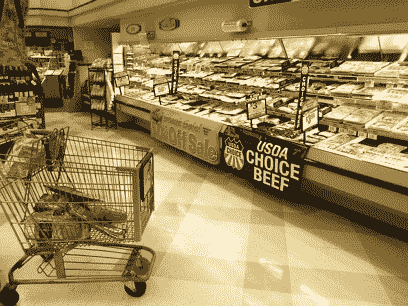*

## *陷入快速省钱的困境？*

*结合 31 号和 32 号提示。我已经这样做了，结果，十多年来，我能够把 40%的工资存起来。*

## *32.提前计划膳食*

*尝试用这种方法来削减杂货账单，节省几个小时(也许几天)的时间:*

*1.在周末，为整个星期准备[节俭的膳食计划](https://www.gracefullittlehoneybee.com/35-frugal-recipes-to-make-when-youre-broke/)*

*2.创建一份购物清单，并一直随身携带*

*3.在每个商店购买一次，并购买整个星期*

*4.在周末，清点收据*

*为了削减成本，取消额外的东西，如汽水、果汁和方便用品。尝试不同的饮食计划。偶尔吃素食。找销售。批量购买，淘汰包装好的零食。*

*你已经掌握了控制权，所以好好利用它，不要超出你能承受的预算。*

## *33.在投资省钱的电器之前要等待*

*如果你使用冰箱或食品密封器，它们会是一项明智的投资。在你购买之前，确保你的新电器符合你的生活方式和口味偏好。否则，它们就不会被使用。*

## *34.使用数字优惠券*

*不要夹。而是下载应用程序。
这份食品杂货应用清单是从顶级节俭生活博客和我自己的反复试验中挑选出来的。注册是免费的，所以尝试几个。*

*【Coupons.com】
[SavingStar](https://savingstar.com/) [获取奖励](https://www.fetchrewards.com/) [智能源](http://www.smartsource.com/) [红梅](http://www.redplum.com/)*

# *电视和数字服务——每月节省数百英镑的四个节俭生活小贴士*

*数字媒体领域的公司争相增加客户，给你——精明的买家——多种省钱的机会。以下是最常见数字服务的省钱妙招:*

## *35.放弃你昂贵的电视服务*

*你的电视供应商不想失去你这个客户，所以定期打电话询问最新的促销价格。如果你住在离电视发射塔 35 英里的范围内，停止你的服务，尝试用数字天线来看实时电视。然后，补充这些流行的互联网服务。*

*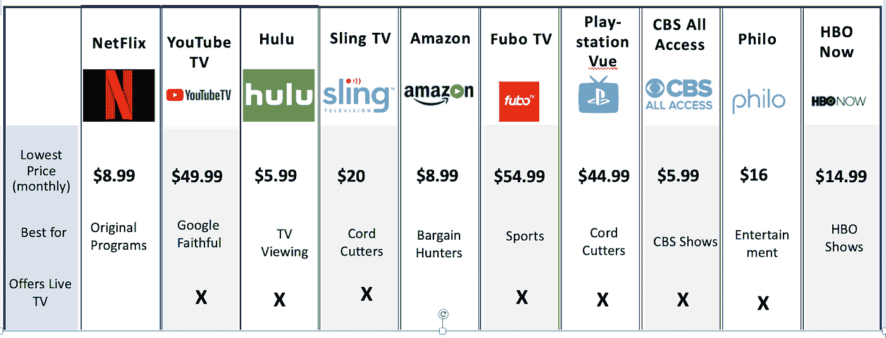*

*如果您不经常使用，请与朋友分享订阅。*

## *36.支付< $5 per month for a home phone*

*Enjoy internet based [魔术杰克](https://www.magicjack.com/useHome.html)每月 3 美元。然后，[下载 iPhone 或 Android 版的应用程序](https://www.magicjack.com/magicApp.html)，免费拨打手机。*

## *37.获得学生折扣*

*你家里有学生吗？学生在软件、报纸、杂志、电视服务、流媒体音乐等方面享受 50%至 75%的折扣。*

*要查找可用折扣，请在浏览器中输入产品名称，后跟“学生订阅”字样。(例如:*《纽约时报》，学生订阅*)*

## *38.跳过家庭互联网*

*跳过家庭互联网，使用可用的公共 WIFI。在家里，用手机作为上网热点。这对于流媒体电视服务非常有用(对于直播体育，来自 Reddit.com 的流)。*

*或者，选择您家中成本最低的 WIFI 选项。(最近的[研究](https://www.wsj.com/graphics/faster-internet-not-worth-it/)显示最低的服务计划已经足够了)*

# *你的手机——减少账单的节俭生活理念，而不是服务*

*手机可能是必需品，但多付钱不是。这些建议可以帮助几乎所有人降低电话费。*

## *39.寻找朋友*

*所有主要的运营商都提供四条线路，每条线路 40 美元的月套餐，这比单条线路节省了一大笔费用。所以，找三个朋友。你不必住在同一个地区来分摊费用。*

## *40.切换到预付费移动电话或 MVNO*

*拥有自己的手机？使用[折扣预付费服务](https://www.nerdwallet.com/blog/utilities/prepaid-cell-phone-plans/)，如 Virgin、Straight Talk 或 Boost Mobile。计划起价为每月 3 澳元。*

*或者，换个移动虚拟网络运营商(简称 [MVNO](https://bestmvno.com/mvnos/) )。这些公司与主要网络有租赁协议，因此管理费用较低。*

*用[这个网站](https://bestmvno.com/mvnos/)对比 MVNOs。(你是 iPhone 用户吗？请务必检查功能兼容性。)*

## *41.要求您的运营商降低费率*

*你的运营商不想失去你这个客户，所以打电话给客户服务热线，要求降价到最近的促销价格。即使你仍在支付当前手机的费用，你的运营商也可能会与你达成协议，留住你。但首先，做一些跑腿工作，了解可比计划的成本。这给了你讨价还价的能力。*

# *医疗保健——节俭生活理念帮助你过上廉价的生活并保持健康*

*医疗费用并不像你想象的那样难以控制。看看这些便宜的生活方式，在不影响护理的情况下，节省医疗保险、服务和处方药。*

***使用第 42 条至第 45 条建议，与传统的保险计划相比，我为我的三口之家(我和两个孩子)每月节省了近 1200 美元的医疗保险费。这增加了我的文书工作，但节省是值得的。**

## *42.考虑健康共享计划，而不是传统的保险*

*比较当前保险计划和健康共享计划的成本。最便宜的是 CHM 的“青铜”选项，起价为每月 45 美元..转换到类似的健康共享保险，大多数家庭每月至少节省 50%的费用，加上每年数千美元的低免赔额。*

*四个最大的健康共享计划是: [Liberty HealthShare](https://www.libertyhealthshare.org/) (我的选择) [Medi-Share](https://www.medishare.org/ppc/?mkwid=slImvevAr_dc&pcrid=326938609582&pmt=b&pkw=%2Bmedi-share&pmid=&utm_source=google&utm_medium=cpc&utm_term=%2Bmedi-share&utm_campaign=Google+-+Brand+-+MediShare&leadsource=Internet-Search%20Engine&custentity_urlreferralid=Google+-+Brand+-+MediShare&custentity_urlreferralid=%2Bmedi-share&_vsrefdom=Brand-G-SQ&intent=&gclid=EAIaIQobChMIqOu74M6I4gIVjuNkCh2WFQw1EAAYAiAAEgJ6OPD_BwE) 、 [Samaritan](https://samaritanministries.org/) 和 [CHM。](https://www.chministries.org/)*

*可能会涵盖一些预先存在的情况，请致电询问详情。*

*无论你选择哪种计划，都要了解细节和除外责任。如果您必须保持“在网络内”，请在每次就诊前咨询您的提供商。*

## *43.使用折扣处方储蓄计划或国际药房*

*来自 [RxAssist](https://www.rxassist.org/patients/discountcards) 、 [WellRX](https://www.wellrx.com/discount-pharmacy-prices/) 和 [GoodRx](https://www.goodrx.com/) 的免费药物节省计划可节省高达 70%的零售价格(包括一些仿制药)。最重要的是，你可以通过智能手机直接注册。*

*如果您的品牌药物仍然太贵，CanaRx 可能会有所帮助。该计划帮助个人合法地从获得许可的海外药房购买品牌药物。*

## *45.协商现金折扣*

*当你必须自掏腰包时，要求现金折扣。*

# *你的财务——简单节俭的生活小贴士，让你的钱更多*

*佣金、利息、罚款和费用会破坏你积累财富的努力，因为它们都是从最上面来的。这里有六种方法可以让你的钱保值。*

## *45.自动化您的资金管理*

*自动执行经常性的资金管理任务，这样你的账单就能按时支付，重要的优先事项也能得到资金支持。*

*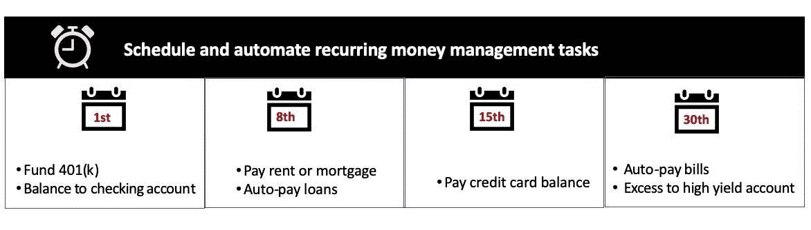*

*考虑到现金缓冲，你的支票账户在月底的余额可以自动转入高收益储蓄或投资账户。*

*在这里了解更多。实际上，该系统看起来像这样:*

*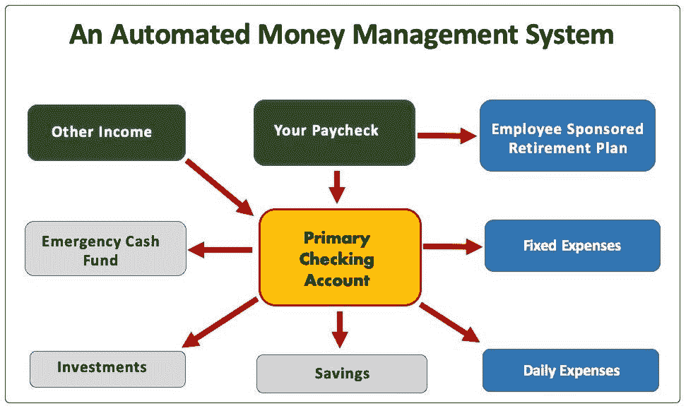*

## *46.在你的储蓄和应急基金中赚取更高的现金收益*

*当您将多余的现金从支票账户转移到高收益储蓄或货币市场账户时，您将获得高达 30 倍的收益。Hifiona.com 可以帮你找到最优惠的价格。*

## *47.还清大部分债务*

*建立紧急现金基金后，用多余的钱偿还贷款，首先从利率最高的贷款开始。(注意:首先阅读你的贷款合同上的细则，因为一些贷款人对提前还款收取费用。)*

*如果你的贷款利率高于储蓄和安全投资的回报，在建立其他投资之前还清贷款通常是有意义的。但是，如果您的公司有 401(k)匹配，您可以考虑提高匹配级别。*

*一旦你的旧债还清，恢复你的 15% 401(k)缴款和其他税收优惠缴款。*

## *48.控制投资费用*

*投资服务的范围从门房到便宜货区，但投资业绩并不在乎你是否受到了红地毯待遇。不要多付钱。一个好的经验法则是将所有基金的平均费用控制在 0.5%或更低。查看[先锋](https://advisors.vanguard.com/VGApp/iip/site/advisor/investments/aggregateviews?productType=product_all&assetClass=assetClass_all#vt=performanceQuarterNav&pt=product_all&ac=assetClass_all&ssc=false&sbm=false&acv=true&merge=functionarray2mergeStrtoAddstartIndvararraynewarraytoreturnskipfalseuseforaddingnewrowind20indexforarray2emptyNotSkiptruethisforEachfunctionitemindexifemptyNotSkipitemskipskipifskiparrayindexitemmergeStrarray2ind2ind2elsearrayindexitemiftoAddindexstartIndskipskipreturnarray&benchmarkMgmtCategorySelectedCat=none&moneyMktSubAssetClassCategorySelectedCat=none&balancedSubAssetClassCategorySelectedCat=none&usBondSubAssetClassCategorySelectedCat=none&intlStockSubAssetClassCategorySelectedCat=none&usStockSubAssetClassCategorySelectedCat=none&assetClassCategorySelectedCat=assetClass_all&productCategorySelectedCat=product_all)、[富达](https://www.fidelity.com/why-fidelity/pricing-fees)、[查尔斯·施瓦布提供的价值投资产品。](https://www.schwab.com/public/schwab/investing/accounts_products/investment)*

## *49.节省人寿保险*

*如果你的家庭依赖于你的收入，谨慎的做法是考虑定期寿险。但是哪种呢？
定期寿险为您的家人提供最高的死亡理赔金。*

*保持警惕，不要买超过自己需要的东西；保险是华尔街销售的佣金最高的产品之一。*

**

*如果可能的话，通过你的雇主购买。如果没有，获取多个报价。*

## *50.选择你想要和将要使用的带有奖励的信用卡*

*你想要现金回来用于外出就餐吗？你是否渴望使用信用卡积分来支付机票或酒店费用？我们每个人都不一样，所以不要接受你的卡公司给你的任何东西。使用[Hifiona.com](https://hifiona.com/)或[Creditcards.com](https://www.creditcards.com/)等服务来选择您将实际使用的带有奖励积分的返现卡。*

# *额外收获:两个胜过所有其他人的节俭生活理念*

*从百万富翁的剧本中吸取这两个建议:*

## *51.拥有部分经济*

*自 2000 年以来，股市已经上涨了 10 倍以上，但几乎一半的美国人没有股票。不要错过。*

*拥有包括股票在内的多元化投资组合，你的账户会随着经济增长而增长。*

**

## *52.将你的爱好货币化*

*把你的爱好或激情变成赚钱的投资，你会忙得没时间花！(让你的事业成为你真正热爱的事情。否则，就开始感觉像是第二份工作。)*

*几乎任何事情都可以变成生意，但是如果你需要想法，点击这里查看。*

*接下来，将收入用于你的储蓄和投资目标，你会更快地实现你的目标，并在这个过程中获得更多乐趣。*

# *开始节俭生活，你兴奋吗？*

*你找到一打主意了吗？*

*这篇文章的许多读者会微笑，承诺尝试一些节俭的生活改变，然后什么也不做。他们确信节俭的生活永远不会奏效。*

**但那不是你。**

*你已经准备好了。你已经决定了你想要的生活，你会用节俭的生活来实现它。*

*你将建立目标和优先权。你不会害怕做出大的改变。你会做预算，你会有目的地花钱。*

**然后看着……随着你存款的增加，意想不到的事情会发生:* 一旦达到你的目标成为可能，你的生活会变得广阔而充满潜力。尽管生活节俭，大多数人发现他们变得更快乐、更满足，而不是相反。*

*听起来像是夸张吗？不是的。称之为苏格拉底式的真理。*

*通过掌控你的未来，你不再让日常问题影响你。相反，你更有可能保持专注，所以这一次，你将最终实现你的梦想。*

*这难道不值得吗？*

*在你新的节俭生活中，你不会感到贫困，你的朋友也不会认为你吝啬或小气。相反，你会觉得自己是房间里最聪明的人。*

*把这些建议放在手边，今天就开始吧！*