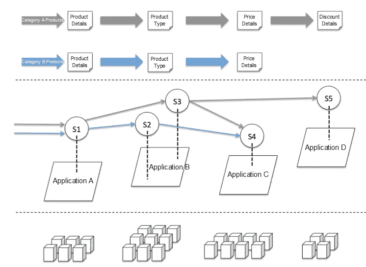
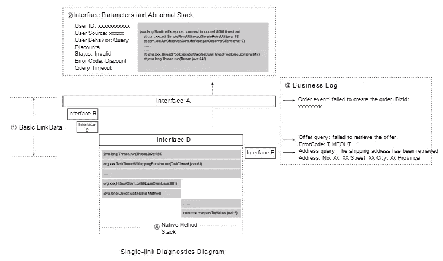

# 全生命周期可观察性及其如何支持双 11

> 原文：<https://medium.datadriveninvestor.com/full-lifecycle-observability-and-how-it-supports-double-11-564086d8aaf9?source=collection_archive---------10----------------------->

*本文由阿里云中间件技术部的周、、和撰写。*

# 云原生和可观察性

在 2019 年[双 11](https://www.alibabacloud.com/customers/double-11?spm=a2c41.13928762.0.0) 购物活动期间，我们再次见证了一个令人震惊的技术壮举，因为为了今年的双 11，在阿里巴巴我们准备了整整一年，将阿里巴巴的核心电商业务部门迁移到阿里云。并且，由于所有这些准备，在大促销期间，阿里巴巴的技术基础设施经受住了每秒 54 万笔交易的峰值。这一成功标志着我们的研发和运营模式正式进入云原生时代。

作为一个在追踪技术和应用性能管理(APM)领域深耕多年的团队，[阿里巴巴鹰眼团队](https://www.alibabacloud.com/blog/alibaba-eagleeye-ensuring-business-continuity-through-link-monitoring_594157?spm=a2c41.13928762.0.0)的工程师见证了阿里巴巴基础设施的多次升级，每一次升级都为系统的可观测性带来了新的挑战。那么，你可能会说，这种“云原生”升级到底带来了哪些新挑战？

cloud native 提出的新模式对阿里巴巴现有的 R&D 和 O&M 模式产生了巨大影响，微服务和 DevOps 等概念和系统提高了我们 R&D 模式的整体效率。然而，与此同时，这些新概念和系统也导致了故障排除方面的更多困难，尤其是定位故障，尤其是当我们考虑到阿里巴巴部署的大量微服务时。

不管怎样，容器编排技术的日益成熟，如容器化和 Kubernetes 使大规模软件的交付更加容易。然而，与此同时，这也为准确评估我们的容量和调度资源以确保成本和系统稳定性之间的最佳平衡带来了挑战。也就是阿里巴巴今年探索的新技术，比如无服务器和服务网格，未来将从用户手中完全接管 O & M 中间件和 IaaS 层的工作。这种基础设施的自动化程度是我们需要克服的另一个重大挑战。

 [## 幸福的算法？数据驱动的投资者

### 从一开始，我们就认为技术正在使我们的生活变得更好、更快、更容易和更实用。社交媒体…

www.datadriveninvestor.com](https://www.datadriveninvestor.com/2019/03/08/an-algorithm-for-happiness/) 

然而，这也很重要。基础架构自动化是充分发挥云原生优势的先决条件，同时可观察性是自动化决策的基石。因此，在本文中，我们将讨论自动化和可观察性的概念。

如果每个接口的执行效率、成功和失败可以被精确地统计跟踪，那么每个用户请求的顺序可以被完整地跟踪，并且应用程序之间以及应用程序和它们的底层资源之间的依赖关系可以以自动的方式被分类。

有了这些信息，我们就可以自动找到服务异常的根本原因。因此，我们还可以解决诸如我是否需要迁移、横向扩展或删除影响我的业务的底层资源等问题。我们可以利用双 11 高峰期的数值，自动计算每个应用需要的资源是否充足，没有浪费。

# 可观察性如何不是监控

在我们深入本文的主题之前，有一件事需要澄清，那就是可观察性和监控之间的区别。我经常遇到这样的人，他们认为“可观察性”只是“监控”的另一种说法。他们会问我，你说的不是“监控”吗？答案是否定的。现实情况是，至少在行业内，这些概念的定义有点不同。

可观察性不是监控，因为监控更侧重于“问题发现”和“警告”。然而，与此相反，可观测性的最终目标是为发生在复杂分布式系统中的事情提供合理的解释。从另一个角度来考虑，监控更关注软件交付和交付后的过程。相比之下，可观察性负责 R&D 和 O&M 程序的整个生命周期。

可观察性本身仍然由普通的跟踪、度量和日志过程组成，这些都是在它们自己的方面非常成熟的技术领域。然而，这三样东西是如何与云基础设施集成的呢？它们如何更好地联系和整合？在云时代，他们如何更好地与在线业务相结合？在过去的两年里，我们的团队一直在寻找这些问题的答案。

# 我们今年的重点

在今年的双 11 期间，EagleEye 团队的工程师在四个不同的技术研究领域进行探索，希望为阿里巴巴集团的全面云迁移和双 11 所需的自动化准备，以及系统的全局稳定性提供有力的支持。

# 面向场景的业务可观察性

随着阿里巴巴的电子商务运营变得越来越复杂和多样化，像双 11 和 6.18 这样的大型促销活动的准备工作正在变得越来越精细化和基于场景。

在过去，每个微服务系统的所有者根据系统本身以及根据其上游和下游情况工作。虽然这种分割方法是有效的，但不可避免地存在遗漏。根本原因是中端应用程序和实际业务场景之间的不匹配。

以交易系统为例。一个交易系统承载多种类型的业务，如[天猫](https://www.alibabacloud.com/customers/tmall?spm=a2c41.13928762.0.0)、[河马](https://www.zdnet.com/article/alibabas-hema-stores-changing-the-supermarket-experience/?spm=a2c41.13928762.0.0)、 [Fliggy](https://www.alizila.com/when-pigs-fly-alibabas-fliggy-reshapes-travel-industry-podcast/?spm=a2c41.13928762.0.0) 等，同时完成所有业务。每个业务的预期呼叫量和下游依赖路径都不一样。对于这个交易系统的拥有者来说，很难梳理出每个业务的上下游逻辑细节对这个交易系统本身的影响。

今年，阿里巴巴的鹰眼团队推出了基于场景的链接功能。结合业务元数据字典，通过非侵入式自动标记的方式对流量进行自动着色。实际的流量是业务，业务和下游中间件的数据是互联的，从以前的以应用为中心的视图转移到以业务场景为中心的视图。这使得它更接近大促销的真实模型。

如上图所示，这是一个查询商品的案例。四个系统 A、B、C 和 D 分别提供了“产品详细信息”、“产品类型”、“价格详细信息”和“折扣详细信息”的查询功能。应用程序 A 提供产品查询接口 S1。通过 EagleEye，我们可以很快发现，B、C 和 D 应用程序是应用程序 A 的依赖，也是接口 S1 的下游。在这种情况下，链路数据足以进行稳定的系统治理。

然而，这个视图没有提供业务的可观察性，因为这个依赖结构包含两个业务场景。两种场景对应的链接也完全不同。A 类产品对应的链接是 A → B → C — D，而 B 类产品对应的链接是 A → B → C，现在假设这两个产品类别在非促销日的比例是 1:1，而在大促销时这个比例是 1:9，我们仅仅从系统或者业务的角度来梳理链接，是不可能得到合理的流量估算模型的。

因此，如果我们可以在系统层对这两种类型的流量进行着色，我们就可以很容易地找出对应于这两种业务场景的链接。这种更精细的视角对于确保业务稳定性、更合理的依赖排序以及节流和降级策略的配置尤为重要。

这种基于商业场景的能力在今年双 11 的准备中发挥了很大的作用。许多业务系统已经通过使用该功能整理出了它们的核心业务链接。它使迎接挑战的准备更加容易，不会有遗漏。同时，在 EagleEye 的支持下，一系列服务治理工具在基于场景的流量记录和回放、基于场景的故障演练工具、基于场景的精度测试和回归等场景中得到全面升级。配合这些更适合业务场景的服务治理工具，支撑整个双 11 的可观测性粒度进入了“高清时代”。

# 基于可观测性数据的智能根本原因定位

在云原生时代，随着微服务等技术的引入，以及业务规模的不断扩大和应用实例的不断增加，核心业务依赖变得日益复杂。虽然开发效率成倍增长，但定位故障的成本也极高。例如，当业务问题发生时，很难快速定位并缓解问题。作为阿里巴巴集团应用性能的“守护者”，EagleEye 团队今年面临的挑战是如何帮助用户快速定位故障。

要定位断层，首先要回答这个问题，什么是断层？这要求 O&M 人员对业务有深刻的理解。为了“安全感”，许多 O&M 工程师更喜欢使用带有所有可观察指标和各种警报的过度杀伤方法使用这种方法，故障的发生会触发异常指示器，并在其计算机屏幕上显示越来越多的警告消息。这种类型的“可观察性”看似强大，实际结果却适得其反。

该团队仔细整理了这些年来该集团内部发生的事件。该组中的核心应用程序通常有四类故障，即非业务逻辑故障，即资源、流量、延迟和错误类别的故障。下面的列表详细描述了这些类别。

1.  资源类别:这类故障与资源指示器有关，例如 CPU、负载、内存、线程数量和连接池。
2.  流量类别:这类故障指的是与以下情况类似的情况。业务流量减少到零或以异常方式显著增加，或者中间件流量(例如消息服务的流量)减少到零。
3.  延迟类别:这类故障是指某些情况。例如，对于系统提供的服务或系统依赖的服务，等待时间显著增加。这些情况基本上是系统问题的前兆。
4.  错误类别:这类错误与错误指示器有关，如服务返回的错误总数，以及系统提供的服务或系统相关服务的成功率。

以这些故障类别为重点，接下来我们需要做的就是“顺着线索的轨迹走”不幸的是，当业务运营变得越来越复杂时，这条“小道”也变得越来越长。以延迟突然增大的故障为例。这种情况背后有很多可能的根本原因，可能是上游业务推广导致的请求量剧增，也可能是相应应用本身频繁的垃圾收集导致应用整体变慢。这也可能是由于下游数据库负载过重而导致响应缓慢造成的。除此之外，还有很多其他可能的原因。鹰眼过去只提供指标信息。在此期间，O&M 人员将查看单个跟踪的数据，并将光标移动几次，然后才能看到完整的跟踪数据。不用说，当出于故障排除的目的在多个系统之间切换时，很难保持高效。

但是，归根结底，定位故障的本质只是一系列的故障排除。你尝试，你尝试，再尝试。这是关于消除它不是什么，找出它是什么的剩余可能性。仔细想想，排除故障只不过是列出各种可能性，然后多次执行相同的过程。你不认为这是电脑最擅长的吗？当然是了。这就是开发智能故障定位的原因。

当谈到变得聪明这个话题时，很多人的第一印象是一定涉及到某种算法，而算法可能会令人生畏。但是，现实是，了解机器学习的人知道数据质量是最重要的，模型是次要的，算法是最不重要的。数据收集的可靠性和完整性以及领域模型的建模至关重要。只有当基于数据的方法准确时，才能实现智能。

智能故障定位的发展源于以下思维过程:首先，我们必须确保数据的质量。由于 EagleEye 团队多年来参与大数据处理，高数据可靠性在很大程度上已经得到了保证。如果没有这样的可靠性，如果出现故障，您必须首先检查故障是否是由您自己的指标引起的。下一步是数据完整性检查和诊断建模，这是智能诊断和确定故障定位粒度的基础。这两部分也是相辅相成的。通过创建诊断模型，您可以识别漏洞并填补可观察性度量中的空白。而且，通过完成指标，您可以增加诊断模型的深度。

这两部分都可以通过三个方面的结合来不断改进。第一个方面是历史失败推导，相当于一场你已经有了答题卡的考试。初始诊断模型是基于一些历史故障和人工经验建立的，剩余的历史故障是在多次试错后推导出来的。然而，这个步骤中的模型容易过度拟合。第二个方面是利用混沌工程模拟常见异常，不断打磨模型。第三个方面是使用在线人工标记方法来继续完成可观察性指标和完善诊断模型。

经过这三个阶段后，智能故障定位的基础或多或少就建立起来了。接下来就是解决效率问题了。从前面步骤迭代的模型远不是最有效的模型。我们必须记住，人类的经验和思维是线性的。然而，计算机不是。该团队为现有模型执行了两项任务:边缘诊断和智能修剪。定位过程的一部分被传送到每个代理节点。对于一些可能影响系统的情况，事件现场的关键信息会自动保存并上报。诊断系统根据事件权重自动调整路径。

自智能根本原因定位功能推出以来，它已经帮助数千种应用定位了故障的根本原因，并获得了很高的客户满意度。根据从根本原因定位得出的结论，基础设施自动化已经得到了很大的提高，可观察性成为基础。在今年双 11 备战期间，快速故障定位功能为应用稳定性的拥有者提供了更自动化的措施。我们还认为，在云原生时代，企业应用的运营质量、成本和效率之间的动态平衡不再遥不可及，并且在未来将会实现。

# 定位故障的最后一英里

什么是定位故障的“最后一英里”?分布式问题诊断领域的最后一公里是什么，它有什么特点？

*   在诊断过程中，您处于离根本原因不太远的位置。已找到特定的应用程序、服务或节点，但无法确定导致异常的特定代码段。
*   许多类型的数据可用于定位根本原因。例如，您可以通过分析内存使用情况、CPU 使用情况，甚至相关的特性来做到这一点。

经过前面的分析，你现在可能知道最后一英里是什么了。接下来，我们将详细描述如何在最后一公里定位问题。

首先，我们需要一种方法来准确到达最后一公里的起点。也就是说，我们需要到达问题根源所在的应用程序、服务或机器节点。这可以防止无效的根本原因分析。那么，我们如何在一系列复杂的环节中准确定义根本原因范围呢？这里，我们需要使用 APM 领域中常用的跟踪功能。链路跟踪可以准确地识别和分析异常的应用程序、服务或机器，为最后一英里的定位指明正确的方向。

然后，我们将更多详细信息与链接数据相关联，例如本地方法堆栈、业务日志、机器状态和 SQL 参数，以执行最后一英里问题定位，如下图所示:

核心接口跟踪是指跟踪和记录基本链路信息，包括 TraceId 和 RpcId (SpanId)、时间、状态、IP 地址和接口名称。这些信息反映了最基本的链接形式。自动数据关联是指在调用生命周期中自动记录相关信息，包括 SQL 语句、输入和输出请求参数以及异常堆栈。这种类型的信息不影响链路形式，但在某些情况下是精确故障定位的必要条件。主动数据关联是指在呼叫生命周期中主动关联需要手动记录的数据。数据通常是业务数据，例如业务日志和业务标识符。业务数据是个性化的，不能统一配置。然而，与链接数据的主动关联可以极大地提高业务问题诊断的效率。

本机方法堆栈很有用，因为由于性能和成本限制，链接跟踪不能添加到所有方法中。在这种情况下，我们可以使用方法采样或在线检测等方法来实现精确的本机慢速方法故障排除。

通过最后一英里故障定位，我们可以彻底调查系统风险并快速定位根本原因，为日常运营和重大促销做准备。这里有两个实际的使用案例:

当整体流量达到峰值时，应用程序可能会偶尔遇到 RPC 超时。通过分析自动记录的原生方法栈的快照，我们可以发现实际消耗的时间都消耗在了 log output 语句上。原因是早于 1.2.x 的回退版本在高并发同步调用场景中容易出现热锁定。通过升级 LogBack 或将 LogBack 调整为异步日志输出，可以完全解决这个问题。

当用户报告订单异常时，业务人员首先使用该用户的 UserId 来检索相应订单条目的业务日志。然后，基于与日志相关联的跟踪 ID，下游依赖的所有业务流程、状态和事件被排列在实际的调用顺序中，以便可以快速定位订单异常的原因。UID 不能自动透明地传输到所有下游链接，但 TraceId 可以。

监控和警报只能反映问题的表象。真正问题的根源还是要在源代码中找。今年，EagleEye 在诊断数据的“精细化采样”方面取得了重大突破。这极大地提高了最后一英里定位所需数据的精度和价值，而不增加控制成本。在漫长的双 11 准备过程中，系统风险源被一个个过滤掉，保证了促销当天的顺利进行。

# 完全集成云原生技术

在过去的一年里，EagleEye 团队通过采用开源技术整合了行业主流的可观测性框架。追踪服务 Tracing Analysis 已经在阿里云上发布。兼容 Jaeger (OpenTracing)、Zipkin、SkyWalking 等主流开源追踪框架。对于已经在使用这些框架的应用程序，您不需要修改任何代码，只需用数据报告地址修改配置文件即可。这为您提供了比开源跟踪产品更强大的跟踪功能，同时降低了构建成本。

EagleEye 团队还发布了完全托管的 Prometheus 服务，解决了开源版本部署带来的大量监控节点、资源占用过多等写性能问题。查询速度慢的问题也针对大范围、多维度的查询进行了优化。优化后的托管 Prometheus 集群完全支持对服务 mesh 和几个重要阿里云客户的监控。我们还为社区贡献了许多优化点。同样，托管 Prometheus 版本兼容开源版本，可以在阿里云容器服务中一键迁移到托管版本。

可观性和稳定性是不可分的。今年，EagleEye 工程师整理了一系列近年来与可观测性和稳定性构建相关的文章和工具，并添加到 GitHub 上。我们也欢迎你加入我们的努力。

# 原始来源:

 [## 全生命周期可观察性及其如何支持双 11

### 阿里巴巴开发者 2020 年 1 月 13 日 225 本文由周、、、和

www.alibabacloud.com](https://www.alibabacloud.com/blog/full-lifecycle-observability-and-how-it-supports-double-11_595739?spm=a2c41.13928762.0.0)