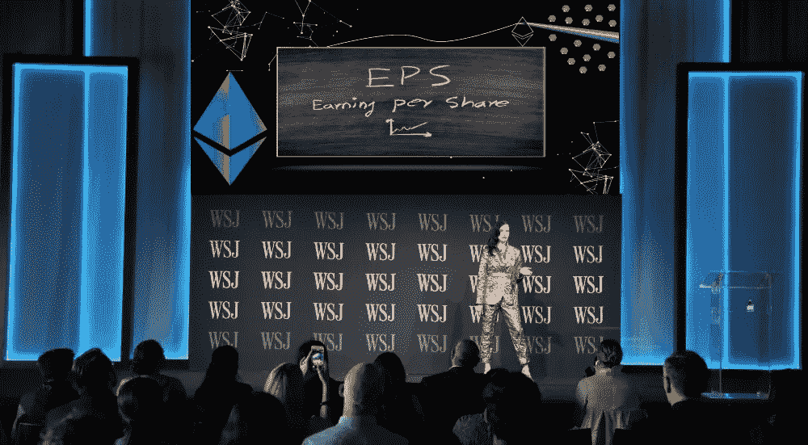
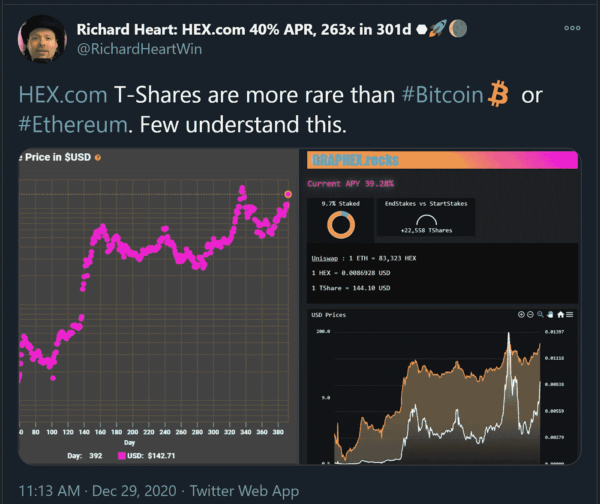
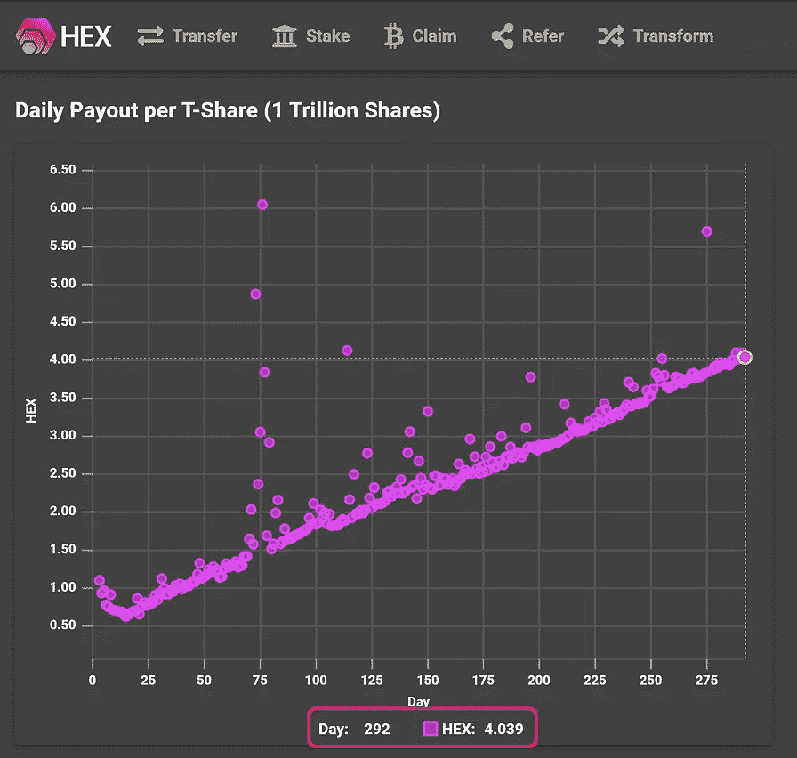
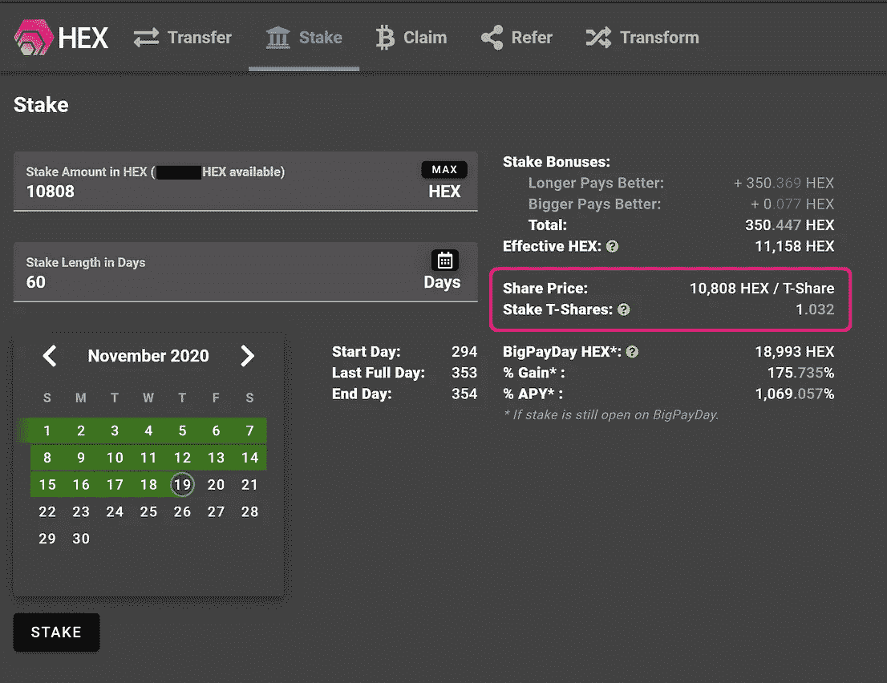
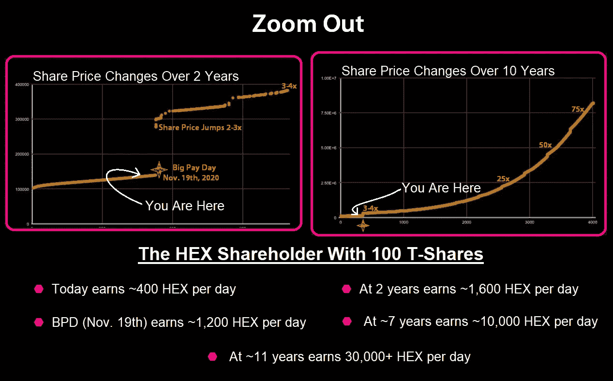
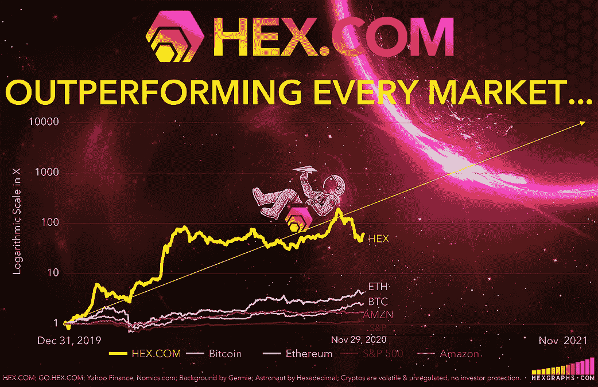
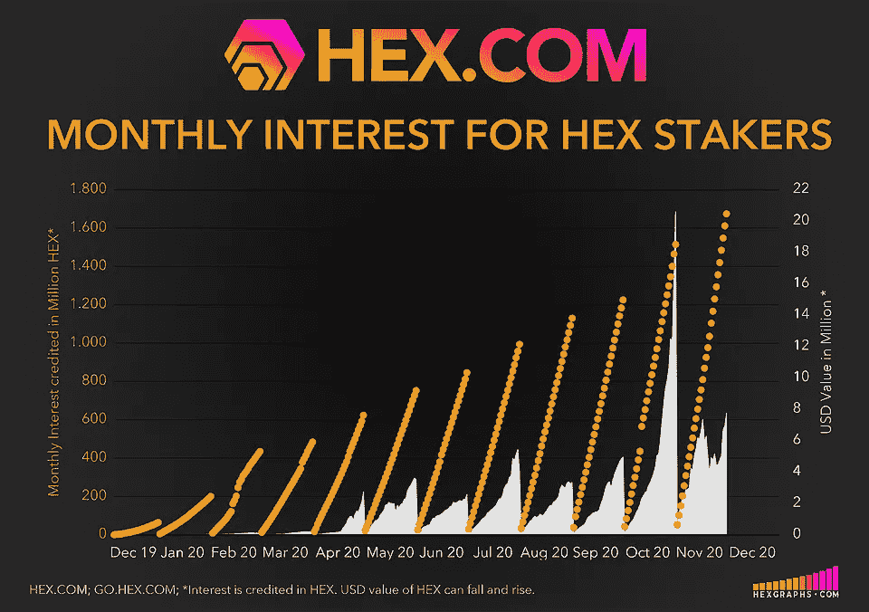
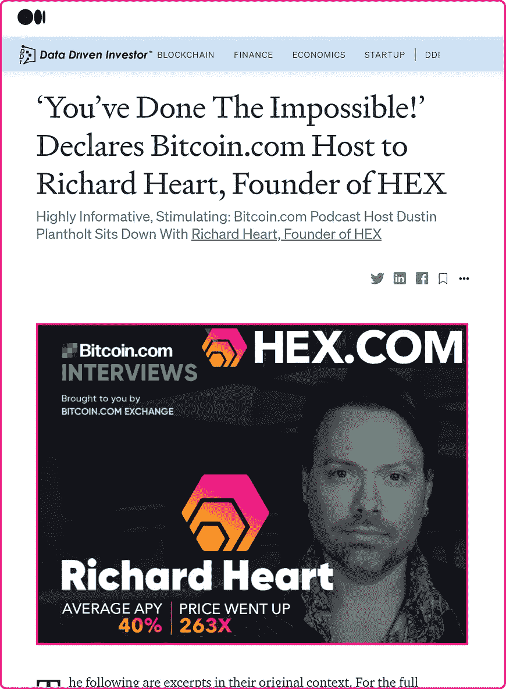
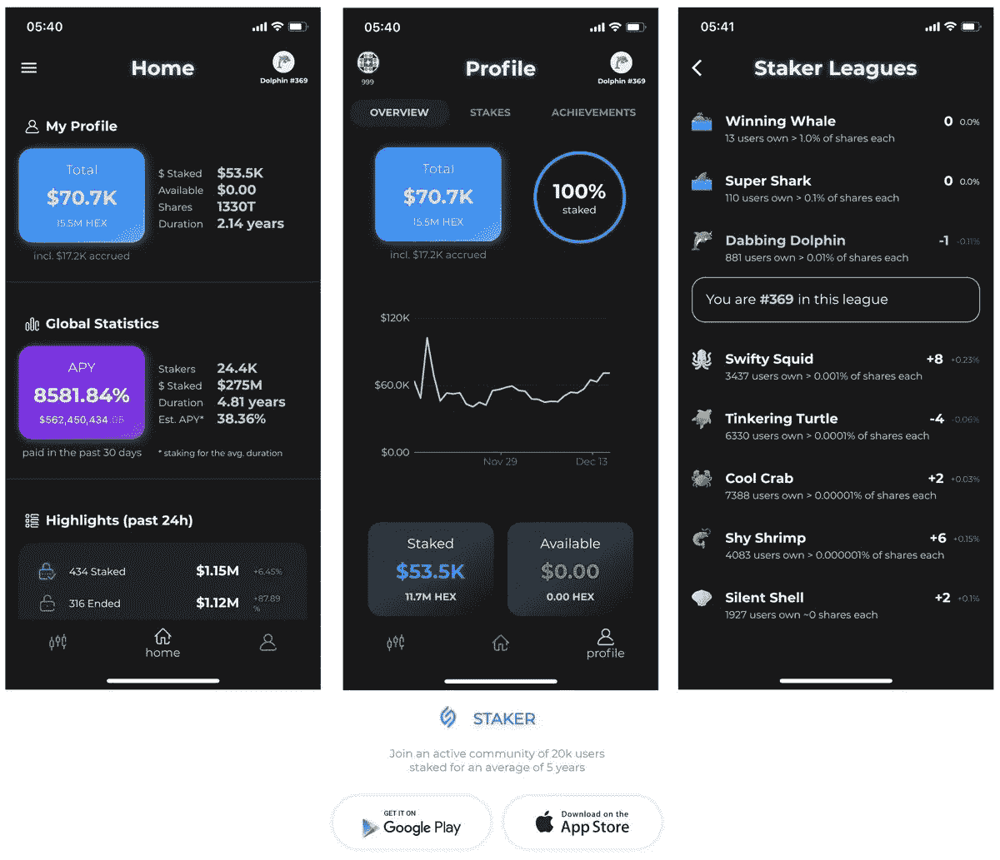

# 📊在赌注的甜蜜点十六进制全面审计的每股收益意味着对股东的大支付

> 原文：<https://medium.datadriveninvestor.com/fully-audited-earnings-per-share-in-stakings-sweetspot-hex-means-big-payouts-for-shareholders-10972b1f5a3c?source=collection_archive---------1----------------------->

## [HEX](http://www.HEX.com) 随着[全面审计每股收益](https://medium.com/datadriveninvestor/defis-cream-of-the-crop-blazes-ahead-with-2-000-tps-at-0-01-tx-privacy-100-uptime-audits-e3a0708b498a#9764)加密货币进入赌注的甜蜜点

**构建于以太坊之上，** [**HEX**](http://www.hex.com) **的远见产品设计，利用真实—可量化—** [**全审计每股收益**](https://medium.com/datadriveninvestor/defis-cream-of-the-crop-blazes-ahead-with-2-000-tps-at-0-01-tx-privacy-100-uptime-audits-e3a0708b498a#9764) **(EPS)交付真实*遗留金融*成品:首笔高息区块链定期存款。**

> [世界顶级合同审计师中的两个——Chainsecurity.com 和 Coinfabrik.com——进行了三次独立的审计](https://medium.com/datadriveninvestor/defis-cream-of-the-crop-blazes-ahead-with-2-000-tps-at-0-01-tx-privacy-100-uptime-audits-e3a0708b498a#9764), HEX 的不变合同通过其每股收益设计保证了股东的收益(见参考文献 1)。

传统的华尔街经纪公司向你展示累积的股票价值；十六进制股票是动态估值，使赌注购买股票的通货膨胀，和久而久之的“工作”是由股票来完成，以产生新的价值。

[通俗地说就是十六进制合同](https://docs.google.com/document/d/1P0ZDaBQx4ghkdX5IUwZb1n8ThvYf7i22MSt9Gm00JRU/edit)

[十六进制可视源代码](https://etherscan.io/address/0x2b591e99afe9f32eaa6214f7b7629768c40eeb39#code)

当你的股份完成股份担保后，你就可以提取储存的作品——非常类似于出售不支付股息的股票。

.

在提取存储的工作之后，这些股份被有效地烧掉，这意味着每一天股份都变得更加稀缺和更有价值。

> 在 HEX 中拥有更多股份就像在不拥有矿工或支付电费的情况下，堆积更多的比特币矿工以获得更多的 hashrate。你的 T 股越多，你的造币能力就越强。

 [## 自由主义者不反对大公司|数据驱动的投资者

### 公司的历史可以追溯到中世纪，那时一群人或一家公司会被授权…

www.datadriveninvestor.com](https://www.datadriveninvestor.com/2020/09/14/liberals-are-not-against-big-corporations/) 

## 为了简化大数，T 股(1 万亿股)是 HEX 股东中的常用术语。

## 见下图:如今 1 T 股约需 10,808 HEX 目前每股 T 型股票每天大约支付 4 便士。每股 T 型股每日派息的明显正变化是早期/紧急结束赌注和晚期结束赌注的结果:传统银行因不遵守定期存款条款而保留的罚款——HEX 直接向股东支付。

Staking tools available at [Go.HEX.com](http://go.hex.com)

> **传统银行因不履行定期存款条款而受到的惩罚——HEX 直接向股东支付。**

下图:所有未来的股价(黄线)都是预测，但由于 HEX 的良好设计和经过全面审计的代码，实际股价(紫色)一直与模型保持一致:

*Share price is indicative of how much HEX your shares receive; share price is not connected to HEX’s price.* Source: [https://www.hexinfo.io/](https://www.hexinfo.io/)

# 什么是 HEX 的 11 月 19 日大发薪日；为什么股价会暴涨？

## 2020 年 11 月 19 日(60 天后), HEX 启动阶段以“大支付日(BPD)”活动结束，届时所有无人认领的 HEX(超过 1800 亿 HEX)将记入股东账户。

## 大发薪日是 HEX 早期采用者获得赌注并从 15 亿美元的 HEX 发行中分得一杯羹的最后机会。通过这一事件，HEX 将高效地完成比特币花了 10 年才完成的过程:比特币的硬币发行通胀模型在 10 年内从 0 个硬币到 1800 万个硬币，并多次减半，以达到其低通胀阶段；HEX 将在发薪日完成其全部高通胀分配。紧随其后，HEX 进入低通胀阶段，最大通胀率为 3.69%。

## 那时，股价会垂直上升，因为人们的投资回报率是他们下注的 2 到 3 倍，因此股价暴涨。[点击](https://docs.google.com/document/d/1P0ZDaBQx4ghkdX5IUwZb1n8ThvYf7i22MSt9Gm00JRU/edit)了解更多股价函数。

# 强烈猜测 HEX 可能会在大发薪日后表现更好。

## 使用上面的比特币例子给出了为什么的线索。想象一下，如果比特币向其持有人支付更多比特币，让他们承诺在自己选择的时间段内不出售:定期存款或股份。现在想象一下，如果承诺更长的时间会得到更好的回报；就像银行定期存款一样，除非其他人违背了他们的承诺——提前提款并支付相应的罚款——这些罚款支付给诚实的利益相关者，而不是支付给银行。这会给赌注者带来多大的回报？整体净买卖活动会是什么样的？HEX 为 Staker 类做了所有这些工作，还有更多。这正是投资者关注的问题，他们猜测的正是这些动态中涉及的博弈理论。

## 如果更多的人在 BPD 持有 HEX 的股份，那么个人股东的派息就会降低*但是*市场供应也会减少；相反，如果持有 HEX 股份的人越少，那么 BPD 的每股派息就越高。

## BPD 对股东的分配——以今天的价格计算，价值超过 5 亿美元的 HEX 将像正常的每日利息一样支付给股东，但数额要大得多。

For more current graphs visit HEXGRAPHS.com

# 结论:

**在 HEX 中实现最高投资回报率的关键是通过利用两个设计特性“时间越长回报越好”和“越大回报越好”来获得更多的股份:越早下注和越早下注可以购买更多的股份。BPD 事件后，随着股价持续上涨，积累 T 股将变得越来越困难。**

## 100%正常运行时间。100%在链上。零位关闭开关。最纯粹形式的[分权财政](https://cointelegraph.com/explained/decentralized-finance-explained)。

> “如果 HEX.COM 离线，理查德心脏死亡，妖术继续工作。许多项目声称是去中心化的，但实际上依赖于管理员不改变代码。十六进制代码不能更改。~HEX.com

# 赌注十六进制&看它倍增

[打桩工。App](https://staker.app/invite/PQn8) 让您安全可靠地在链上积累 100%的财富，并实时观察其增长:

更多信息:[HEX.COM](https://hex.com/)

⬣ **新闻和更新:** [关注 Twitter @HEXcrypto](https://twitter.com/hexcrypto)

https://t.me/HEXcrypto

**📺每周一、三、五(*周五晚间聚会)*晚上 7 点(太平洋标准时间)在 Twitch 上观看直播话语联盟:** [话语联盟](https://www.twitch.tv/discourse__syndicate) ( **话语联盟仅面向成熟观众)**

# 相关文章:

## 看看你每天赚多少钱。适用于 iOS 和 Android 的应用

## 最好的十六进制移动应用程序，具有实时反馈，联盟，多地址监控和更多功能: [Staker。应用程序](https://staker.app/)

**访问专家视图—** [**订阅 DDI 英特尔**](https://datadriveninvestor.com/ddi-intel)