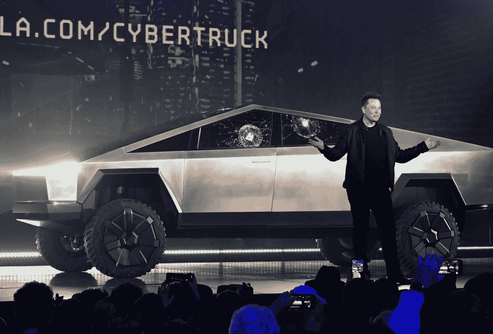

# 有趣的事实证明埃隆·马斯克是 21 世纪最大的谜

> 原文：<https://medium.datadriveninvestor.com/fun-facts-that-prove-elon-musk-is-the-biggest-enigma-of-the-21st-century-edabb8726ab5?source=collection_archive---------5----------------------->

## 从性感的汽车名字到奇特的大学选择，马斯克的个性完全出乎意料，标新立异，异常怪异

Musk after Cybertruck publicity stunt | [Robert Hanashiro](https://www.cnbc.com/2019/11/22/james-bond-lotus-sports-car-elon-musk-bought-inspired-tesla-cybertruck.html)

埃隆·马斯克已经成为家喻户晓的名字。

作为特斯拉、SpaceX 和 PayPal 三家数十亿美元公司的创始人，马斯克的商业冒险不言自明。更不用说，他们在他 50 岁之前就给他带来了超过 700 亿的净资产。

然而，让马斯克从其他成功的科技公司创始人中脱颖而出的不一定是他的业务，而是他神秘的个性。

# 性感模特的名字

特斯拉有四款标志性汽车——S 型、3 型、X 型和 y 型。从表面上看，这些名字并不奇怪。然而，当你仔细观察时，你可能会注意到一个有趣的趋势:

> 埃隆·马斯克将他的商标车命名为性感

当马斯克第一次宣布他的第二款(也是更经济的)电动汽车时，它被命名为 Model E。然而，在一场关于 Model E 名称的福特商标的诉讼之后，马斯克不得不做出调整。

因此，特斯拉最经济的汽车被称为 Model 3，所有的模型，按照发布的顺序，拼出 S3XY(如果你问我，仍然很好。)

所以，是的，目前最有价值的汽车公司以一个隐藏的笑话命名了它的商标车辆。

# 非常规命名约定

2020 年 5 月 4 日，埃隆席卷了推特世界。不是因为越来越高的特斯拉股价，也不是因为即将到来的猎鹰发射。相反，马斯克和格莱姆斯的最新孩子成了流行趋势。

名人给自己的孩子取非传统的名字并不是一种新趋势。然而，马斯克将这一点提升到了一个新的高度，将他最新的孩子命名为 xa-12。这导致了狂热的书呆子式的猜测，直到 Grimes 在推特上发布了真实的含义(这和猜测一样离奇)才结束。

事实上，奇怪的是，根据加州法律，这是非法的。因此，马斯克的第七个孩子的名字现在正式为 X AE A-Xii。

# 重大的(学生)人生选择

对于每一个被告知他们选择学院/大学的原因是错误的学生，告诉他们好好看看有史以来最成功的企业家之一。

当马斯克选择他的大学时，他的标准不是声望或项目。马斯克移民加拿大是为了上大学，他没有选择就读加拿大最著名的合作工程项目滑铁卢大学，而是选择了就读皇后大学。

为什么？因为滑铁卢工程没有足够的女生。

> “我本来打算在滑铁卢学工程……但是那里好像没有女生！所以，我去了皇后学院，那里有*和*女孩。我不想和一群花花公子一起度过我的大学时光。”——埃隆·马斯克

 [## 分析 DeFi 协议中借款的高利率|数据驱动的投资者

### 我们最近看到，Aave 协议中 BAT 的借款利率从 100%提高了。这个…

www.datadriveninvestor.com](https://www.datadriveninvestor.com/2020/07/21/analyzing-high-interest-rates-on-borrows-in-defi-protocol/) 

# Twitter 状态

Twitter 是名副其实的名人推广社交媒体平台。事实上，在科技行业，它是首选的平台。

然而，埃隆·马斯克的推特因其特别是你所期待的 21 世纪最大的谜团而臭名昭著。

是的，没错。多家高科技公司的亿万富翁首席执行官合理地相信外星人的阴谋故事，并卖掉了他的房子。

旁注:你知道马斯克现在必须获得公司批准的特斯拉相关推文，因为他在推文中说特斯拉股票太高了吗？这

# 为疯狂的人干杯…

> 敬那些疯狂的人，不合群的人，反叛者，麻烦制造者，方孔中的圆钉…那些看待事物不同的人——他们不喜欢规则…你可以引用他们，不同意他们，赞美或诋毁他们，但你唯一不能做的是忽视他们，因为他们改变了事情…他们推动人类前进，虽然有些人可能认为他们是疯狂的，但我们看到了天才，因为那些疯狂到认为他们可以改变世界的人，才是真正改变世界的人。
> 
> 史蒂夫·乔布斯，1997 年

正如乔布斯在著名的苹果广告中所说，“那些疯狂到认为自己可以改变世界的人，才是真正改变世界的人。”但是，所有让埃隆·马斯克成为一个巨大谜团的个性特征，也是让他取得今天成功的特征。

**进入专家视角—** [**订阅 DDI 英特尔**](https://datadriveninvestor.com/ddi-intel)